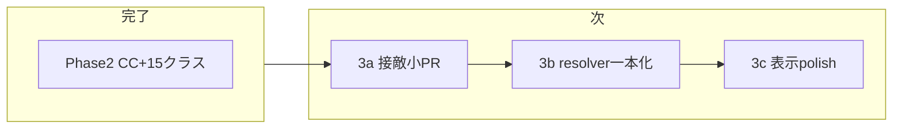

# マスター作業順プラン（パッシブ → 接敵ビジュアル）

最終更新: 2026-06。現在地と作業順の正本。

## このプランの使い方

別チャットで作業を始めるとき:

```
@docs/plans/master-work-order.md
（必要なら）@.cursor/plans/passive_skill_slim-down_9061e534.plan.md
（接敵小PR時）@.cursor/plans/接敵定数整理_9843f9d9.plan.md
```

## 現在地（2026-06）

| Phase | 状態 | 内容 |
|-------|------|------|
| 1 | 完了 | passiveIds 分離、ヘイト制、コアパッシブ |
| **2** | **完了** | stun/knockback、`epithetEn` データ、15 クラス、`traits.rangePx`、仕様書 |
| **3a** | **完了** | 接敵定数 4 項目化、弓士のみ生存距離修正 |
| **3b** | **完了** | `resolveEngagedLayout` 一本化 |
| **3c** | 部分完了 | `epithetEn` UI（バトル HUD・統計・スキルメニュー）。スプライト本番化は Phase 5 |

**原則:** Phase 2 と Phase 3 を同時に大規模変更しない（`BattleEngine` / `formationLayout` が共通）。

## battle-field cleanup 完了チェック（2026-06）

battle 系 cleanup を別チャットや Composer へ引き継ぐときの完了判定。ゲームルールの正本は [`docs/spec/battle-field.md`](../spec/battle-field.md)、Threat 境界の正本は [`docs/spec/combat.md`](../spec/combat.md)。

| 項目 | 現状メモ |
|------|----------|
| `battleX` 単一正本に反する旧 `visual/screen/camera` pipeline が runtime から消えている | **部分**。`visualX` の snapshot 互換ミラー、`battleCamera.ts`、`corpseScreenAnchorX` など互換残骸が残る |
| 接敵開始時 bake なし、自動接近主体の流れがテストで固定されている | **済み**。`battleFieldTransition.test.ts` の `T-engage-01`、`battleFieldArchitecture.test.ts` の `A-L1-01` を基準に維持 |
| `AttackTarget` / `ChaseTarget` / `MoveAnchor` / `DisplayAnchor` / `FrontlineContact` の責務境界が実装名またはテスト名で読める | **部分**。`AttackTarget` / `ChaseTarget` / `MoveAnchor` / `FrontlineContact` は読めるが、`DisplayAnchor` は主に spec 名で、実装は `engagedVisualTargetPlayerId` 残存 |
| Assassin の rear assault と Defender の frontline ownership が衝突しない | **済み**。`resolveApproachBattleX.enemy.test.ts` と `duelistAssassinFormation.test.ts` を維持 |
| 関連テストが通る | battle cleanup ごとに `battleFieldArchitecture` / `battleFieldTransition` / `resolveApproachBattleX.enemy` / `duelistAssassinFormation` を最低確認 |
| [`docs/spec/battle-field.md`](../spec/battle-field.md) と [`docs/spec/combat.md`](../spec/combat.md) に今回の境界が反映されている | **部分**。`battle-field.md` は概ね反映済み。`combat.md` は Threat 境界を持つが、座標節に移行中の旧表現が残る |

**完了条件:** 上表の「部分」をすべて解消し、関連テストを通した時点で battle-field cleanup の収束とみなす。

## 全体ロードマップ



## Phase 2（完了）

- `stun` / `knockback` 効果 + BattleEngine 行動スキップ
- `epithetEn` を `classes.json` に追加（UI は 3c）
- 15 クラス（`df_` / `at_` / `sp_`）+ `parties.json` 更新
- [`docs/spec/combat.md`](../spec/combat.md) ヘイト・CC 節
- [`docs/spec/classes-and-skills.md`](../spec/classes-and-skills.md) 15 クラスマスタ

## Phase 3a: 接敵小 PR

**目的:** 定数整理 + 弓士のみ生存の距離バグ修正。アーキテクチャは最小変更。

1. `ENGAGED_VISUAL_TUNING` を 4 項目に統合
2. コメント: `standoff` → 「敵味方最前列 gap」「接敵距離」
3. 弓士のみ生存時の敵配置基準修正
4. テスト追加

詳細: `.cursor/plans/接敵定数整理_9843f9d9.plan.md`

## Phase 3b: resolver 一本化

**目的:** `visualX` を `resolveEngagedLayout` で毎フレーム決定論的に導出。凍結パッチを削減。

- `BattleEngine` 接敵ループを「resolver 呼び出し + 補間」に薄化
- [`docs/spec/combat.md`](../spec/combat.md) 座標節を更新

## Phase 3c: 表示 polish（任意）

- `epithetEn` 2 段ルビ（クラス画面・バトル HUD）
- スプライトシート本番化（[sheets/README.md](../../src/assets/sprites/sheets/README.md)）
- CC HUD の見た目調整

## 参照

| 用途 | ファイル |
|------|----------|
| フェーズ一覧 | [phase-roadmap.md](./phase-roadmap.md) |
| 接敵小 PR 詳細 | `.cursor/plans/接敵定数整理_9843f9d9.plan.md` |
| パッシブ経緯 | `.cursor/plans/passive_skill_slim-down_9061e534.plan.md` |
