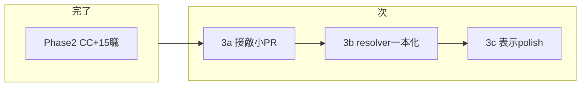

# マスター作業順プラン（パッシブ → 接敵ビジュアル）

最終更新: 2026-06。現在地と作業順の正本。

## このプランの使い方

別チャットで作業を始めるとき:

```
@docs/plans/master-work-order.md
（必要なら）@.cursor/plans/passive_skill_slim-down_9061e534.plan.md
（接敵小PR時）@.cursor/plans/接敵定数整理_9843f9d9.plan.md
```

## 現在地（2026-06）

| Phase | 状態 | 内容 |
|-------|------|------|
| 1 | 完了 | passiveIds 分離、ヘイト制、コアパッシブ |
| **2** | **完了** | stun/knockback、`epithetEn` データ、15 一次職、`traits.rangePx`、仕様書 |
| **3a** | **完了** | 接敵定数 4 項目化、弓士のみ生存距離修正 |
| **3b** | **完了** | `resolveEngagedLayout` 一本化 |
| **3c** | 部分完了 | `epithetEn` UI（バトル HUD・統計・スキルメニュー）。スプライト本番化は Phase 5 |

**原則:** Phase 2 と Phase 3 を同時に大規模変更しない（`BattleEngine` / `formationLayout` が共通）。

## 全体ロードマップ



## Phase 2（完了）

- `stun` / `knockback` 効果 + BattleEngine 行動スキップ
- `epithetEn` を `classes.json` に追加（UI は 3c）
- 15 一次職（`df_` / `at_` / `sp_`）+ `parties.json` 更新
- [`docs/spec/combat.md`](../spec/combat.md) ヘイト・CC 節
- [`docs/spec/classes-and-skills.md`](../spec/classes-and-skills.md) 15 職マスタ

## Phase 3a: 接敵小 PR

**目的:** 定数整理 + 弓士のみ生存の距離バグ修正。アーキテクチャは最小変更。

1. `ENGAGED_VISUAL_TUNING` を 4 項目に統合
2. コメント: `standoff` → 「敵味方最前列 gap」「接敵距離」
3. 弓士のみ生存時の敵配置基準修正
4. テスト追加

詳細: `.cursor/plans/接敵定数整理_9843f9d9.plan.md`

## Phase 3b: resolver 一本化

**目的:** `visualX` を `resolveEngagedLayout` で毎フレーム決定論的に導出。凍結パッチを削減。

- `BattleEngine` 接敵ループを「resolver 呼び出し + 補間」に薄化
- [`docs/spec/combat.md`](../spec/combat.md) 座標節を更新

## Phase 3c: 表示 polish（任意）

- `epithetEn` 2 段ルビ（クラス画面・バトル HUD）
- スプライトシート本番化（[sheets/README.md](../../src/assets/sprites/sheets/README.md)）
- CC HUD の見た目調整

## 参照

| 用途 | ファイル |
|------|----------|
| フェーズ一覧 | [phase-roadmap.md](./phase-roadmap.md) |
| 接敵小 PR 詳細 | `.cursor/plans/接敵定数整理_9843f9d9.plan.md` |
| パッシブ経緯 | `.cursor/plans/passive_skill_slim-down_9061e534.plan.md` |
