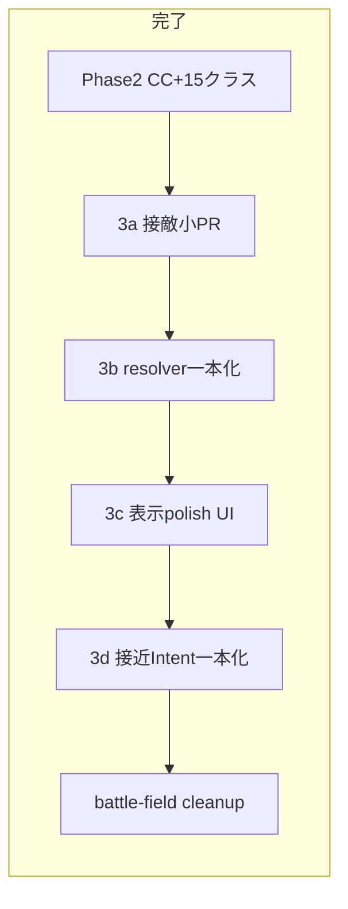

# マスター作業順プラン（パッシブ → 接敵ビジュアル）

**本プラン完了（2026-06）。** 以降の開発計画は [phase-roadmap.md](./phase-roadmap.md) / [phase-4-roadmap.md](./phase-4-roadmap.md) を正とする。

最終更新: 2026-06。Phase 1〜3 + battle-field cleanup の作業順アーカイブ。

## このプランの使い方

**新規作業では `@` しない。** 経緯参照のみ。

```
（経緯）@docs/plans/master-work-order.md
（パッシブ）@.cursor/plans/passive_skill_slim-down_9061e534.plan.md
（接敵小PR）@.cursor/plans/接敵定数整理_9843f9d9.plan.md
```

## 現在地（2026-06 — 完了）

| Phase  | 状態 | 内容                                                                                      |
| ------ | ---- | ----------------------------------------------------------------------------------------- |
| 1      | 完了 | passiveIds 分離、ヘイト制、コアパッシブ                                                   |
| **2**  | 完了 | stun/knockback、`epithetEn` データ、15 クラス、`traits.rangePx`、仕様書                     |
| **3a** | 完了 | 接敵定数 4 項目化、弓士のみ生存距離修正                                                   |
| **3b** | 完了 | `resolveEngagedLayout` 一本化                                                             |
| **3c** | 完了 | `epithetEn` UI（バトル HUD・統計・スキルメニュー）。**スプライト本番化は [Phase 5](phase-roadmap.md) へ移管** |
| **3d** | 完了 | 接近・接敵 Intent 一本化（defender 専用 contact 接近の廃止）                                |

**原則:** Phase 2 と Phase 3 を同時に大規模変更しない（`BattleEngine` / `formationLayout` が共通）。

## battle-field cleanup 完了チェック（2026-06 — 完了）

battle 系 cleanup の完了判定。ゲームルールの正本は [`docs/spec/battle-field.md`](../spec/battle-field.md)、Threat 境界の正本は [`docs/spec/combat.md`](../spec/combat.md)。

| 項目                                                                                                                              | 状態                                                                                                                                                                                                 |
| --------------------------------------------------------------------------------------------------------------------------------- | ---------------------------------------------------------------------------------------------------------------------------------------------------------------------------------------------------- |
| `battleX` 単一正本に反する旧 `visual/screen/camera` pipeline が runtime から消えている                                            | **完了**。`battleCamera.ts` 削除済み。`visualX` / `engagedVisualTarget*` deprecated alias 削除済み。skill move の `toVisualX` / `baseVisualX` 削除済み。死体固定は `corpseBattleAnchorX`（battleX アンカー） |
| 接敵開始時 bake なし、自動接近主体の流れがテストで固定されている                                                                  | **完了**。`battleFieldTransition.test.ts` の `T-engage-01`、`battleFieldArchitecture.test.ts` の `A-L1-01` を基準に維持                                                                             |
| `AttackTarget` / `ChaseTarget` / `MoveAnchor` / `DisplayAnchor` / `FrontlineContact` の責務境界が実装名またはテスト名で読める     | **完了**。`DisplayAnchor` は `engagedDisplayAnchorPlayerId` + `battleDisplay.getEngagedDisplayAnchorPlayerId`                                                                                        |
| Assassin の rear assault と Defender の frontline ownership が衝突しない                                                          | **完了**。`CombatantState.accessState` が正本。`resolveApproachBattleX.enemy.test.ts` / `duelistAssassinFormation.test.ts` / `behindTargetMove.test.ts` を維持                                        |
| 関連テストが通る                                                                                                                  | **完了**                                                                                                                                                                                             |
| [`docs/spec/battle-field.md`](../spec/battle-field.md) と [`docs/spec/combat.md`](../spec/combat.md) に境界が反映されている       | **完了**                                                                                                                                                                                             |

## 全体ロードマップ（完了）



## Phase 2（完了）

- `stun` / `knockback` 効果 + BattleEngine 行動スキップ
- `epithetEn` を `classes.json` に追加（UI は 3c）
- 15 クラス（`df_` / `at_` / `sp_`）+ `parties.json` 更新
- [`docs/spec/combat.md`](../spec/combat.md) ヘイト・CC 節
- [`docs/spec/classes-and-skills.md`](../spec/classes-and-skills.md) 15 クラスマスタ

## Phase 3a: 接敵小 PR（完了）

**目的:** 定数整理 + 弓士のみ生存の距離バグ修正。アーキテクチャは最小変更。

1. `ENGAGED_VISUAL_TUNING` を 4 項目に統合
2. コメント: `standoff` → 「敵味方最前列 gap」「接敵距離」
3. 弓士のみ生存時の敵配置基準修正
4. テスト追加

詳細: `.cursor/plans/接敵定数整理_9843f9d9.plan.md`

## Phase 3b: resolver 一本化（完了）

**目的:** layout を `resolveEngagedLayout` で決定論的に導出。凍結パッチを削減。

- `BattleEngine` 接敵ループを「resolver 呼び出し + 補間」に薄化
- [`docs/spec/combat.md`](../spec/combat.md) 座標節を更新

**境界:** 3b は layout / display 側の resolver 一本化であり、`ChaseTarget` / `AttackTarget` による自動接近 Intent の一本化は Phase 3d で扱う。

## Phase 3c: 表示 polish（完了 — スプライト除く）

- `epithetEn` 2 段ルビ（クラス画面・バトル HUD）— **完了**
- スプライトシート本番化 — **[Phase 5](phase-roadmap.md)**（作画待ち）
- CC HUD の見た目調整 — 任意。未着手なら Phase 4d / 5

## Phase 3d: 接近・接敵 Intent 一本化（完了）

**目的:** defender 専用の「敵全体の接触点へ前進」経路を廃止し、全ロール共通で `ChaseTarget → standoff battleX → AttackTarget` の停止判定へ揃える。

- `resolveDefenderApproachBattleX` を削除し、`resolveAllPlayerApproachBattleX` をロール共通の chase/standoff resolver + 共有 clamp / formation レイヤに整理
- `capFrontRowBeforeEnemyContact`、front-row supporter cap、formation spacing / march follow は接近本体ではなく共有 clamp / formation レイヤとして扱う
- Stage 1 Wave 2 の `test_to_ranged` 残存時に鉄衛士が不連続に接敵しないことを regression 化
- Engaged 中 overlap 補正は approach と合算した 1 tick の総移動量を自動接近 step 内に制限

## 参照

| 用途           | ファイル                                                 |
| -------------- | -------------------------------------------------------- |
| フェーズ一覧   | [phase-roadmap.md](./phase-roadmap.md)                   |
| 接敵小 PR 詳細 | `.cursor/plans/接敵定数整理_9843f9d9.plan.md`            |
| パッシブ経緯   | `.cursor/plans/passive_skill_slim-down_9061e534.plan.md` |
