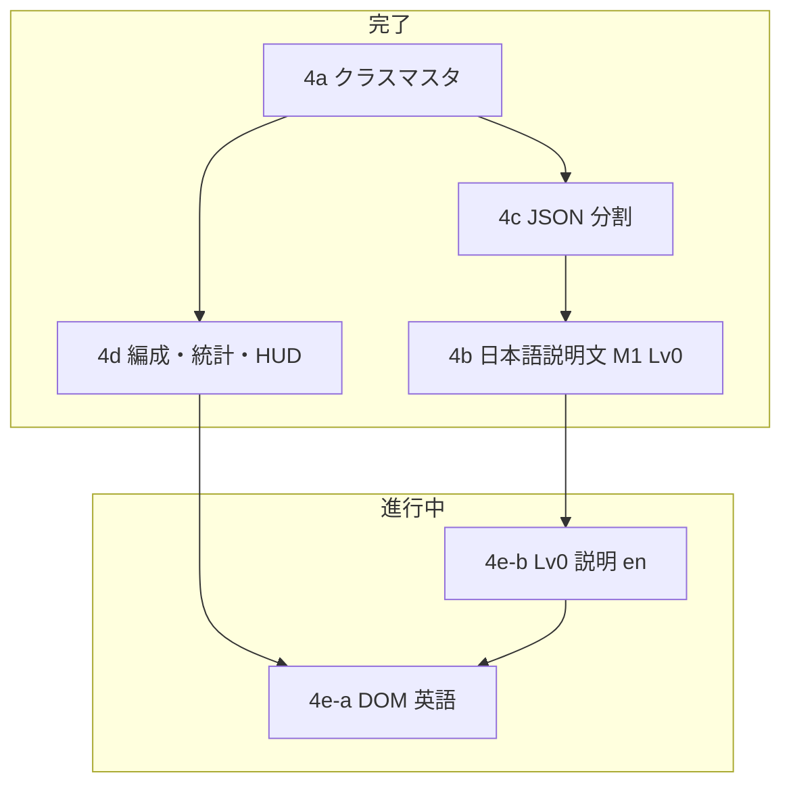

# Phase 4 ロードマップ — クラスマスタ + UI + 英語 i18n

Phase 4 専用の作業順・完了条件。**Release M1（体験版）** のスコープ正本は [phase-roadmap.md §M1 — 体験版](phase-roadmap.md#m1--体験版)。全体 Phase 1〜12 は [phase-roadmap.md](phase-roadmap.md)。ゲームルールは [spec](../spec/README.md)。

**最終更新:** 2026-06

---

## ゴール

Phase 3 の習得機構とキャラクターデータ GUI を土台に、**プレイヤーがクラス・スキルを読んで編成できる UI** と **Release M1 向け英語表示** まで届ける。

| 成果物 | サブフェーズ |
| ------ | ------------ |
| クラス・スキル JSON + 編集 GUI | **4a**（確定済） |
| `data/skills/` 分割 | **4c**（完了） |
| 日本語スキル説明の自動生成 | **4b**（**完了** — M1 8 クラス Lv0） |
| 編成 UI・統計 UI・HUD 刷新 | **4d**（ほぼ完了） |
| 英語 i18n（`en` のみ） | **4e**（**進行中**） |

**一次職 / 二次職の区別は廃止**（`jobTier` / `promotion` / `promotesFrom` は予約しない）。

---

## 現在地

| サブ | 内容 | 状態 |
| ---- | ---- | ---- |
| **4a** | クラス 15 種・スキル JSON・GUI・validate・`epithetEn` | **確定済**（combat 実装 13。印術師・法陣師は Phase 9 送り） |
| **4c** | 巨大 JSON のファイル分割 | **完了** |
| **4b** | `formatSkillText` によるスキル説明自動生成 | **完了**（M1 8 クラス Lv0 日本語確定。以降はデータ PR 同梱のみ） |
| **4d** | `SkillMenuPanel` + `BattleStatsDrawer` + 状態バッジ HUD | **完了**（§13 目視・§11 polish・800px 確認済み 2026-06） |
| **4e** | 英語 i18n（`ja` + `en`） | **進行中** — 4e-a 基盤・主要 DOM 着手済 / 4e-b M1 Lv0 説明文 **完了**（[§4e](#4e--英語-i18n-en-のみ)） |

**いまの焦点:** **4e-a** M1 プレイ経路 DOM の英語確認 + **Exit #4〜6**（手動スモーク）

---

## Release M1 サマリ（Phase 4 との関係）

[phase-roadmap.md §M1 — 体験版](phase-roadmap.md#m1--体験版) のうち、**Phase 4 が担う部分**のみ要約。プレイ範囲・解禁 8 / グレー 5 / 非表示 2・Phase 6 / 7 の詳細は phase-roadmap を正とする。

| 項目 | 内容 |
| ---- | ---- |
| **M1 状態** | **準備中** — 4b・4d 完了、**4e 進行中** → Exit #4〜6 充足後 Phase 6 / 7 |
| **4b（日本語 Lv0）** | M1 解禁 **8 クラス** — **完了**（[§4b](#4b--スキル説明自動生成日本語--完了2026-06)） |
| **4d（編成・統計・HUD）** | **完了**（[§4d](#4d--編成-ui--統計-ui--hud完了)） |
| **4e（英語 i18n）** | **進行中** — M1 **必須**（[§4e](#4e--英語-i18n-en-のみ)）。Lv0 説明文 en は完了、DOM・Exit 確認が残り |
| **クラス別 4b / 4e 進捗** | [§M1 対象クラス](#m1-対象クラス4b--4e-の第一優先) |
| **Phase 4 完了 = M1 への Exit #1〜3 充足 + #4〜6（4e）** | [Exit 条件](#phase-4-完了条件exit) |

---

## 依存関係



**原則**

- i18n は **Phase 4e のみ** 着手。対象は **`en` のみ**（3 言語目以降はスコープ外）。
- M1 8 クラス Lv0 **日本語文案は確定済み**（4b）。4e ではこれを翻訳正本とし locale 分岐（`formatSkillText`・用語辞書）。
- 数値バランスの最終版は Phase 4 外（**6c 体験版** / **8c 本編**）。

---

## 推奨作業順（2026-06 時点）

| 順 | タスク | サブ | 備考 |
| -- | ------ | ---- | ---- |
| ~~1~~ | ~~4d 受け入れ条件の目視確認~~ | 4d | **完了**（2026-06） |
| ~~2~~ | ~~DOM §11 polish 残確認~~ | 4d | **完了**（2026-06） |
| 1 | i18n 基盤 + DOM UI 英語（最短経路） | 4e-a | `t(key)` / locale 切替 — **着手済**、M1 経路の目視・スモークが残り |
| ~~2~~ | ~~M1 8 クラス Lv0 `formatSkillCardLines` en~~ | 4e-b | **完了**（`skillTextPhrases.ts` + `formatSkillText.test.ts` 8 職固定） |
| 2 | クラス表示名・用語パネル・スキル名の en 整合 + Exit 確認 | 4e-b | `epithetEn` / `gameTermGlossaryEn.ts`。Lv10+ 説明 polish は **M1 範囲外** |
| 3 | M2 前に残り 5 クラスへ英語拡張 | 4e | グレーアウト 5 は M1 でもロスター表示あり |

---

## 4a — クラスデータ + GUI（確定済）

**正本:** [classes-and-skills.md](../spec/classes-and-skills.md)、`data/classes.json`、`data/skills/`

- 15 クラス投入済み。effect 中心 13 クラスは passive / active 4 枠と整合
- `at_sigilist` / `at_conductor` は設計のみ（combat は Phase 9）
- `ClassEditorStep` + `validateGameData` で編集・検証可能
- `displayName`（漢字）+ `epithetEn`（英語肩書き）を `classes.json` に保持

**Phase 4 内で触らない:** スキル数値バランス、ステージ敵構成

---

## 4c — JSON 分割（完了）

```
data/skills/passives/{classPrefix}.json
data/skills/actives/{classPrefix}.json
data/classes.json
```

- ランタイム `GameData.skillRegistry` 形状は変更なし（`loadGameData` がマージ）
- エディタは論理 1 マスタ（保存時 upsert）

詳細は [phase-roadmap.md §4c](phase-roadmap.md#4c--巨大-json-の分割開発効率--完了)。

---

## 4b — スキル説明自動生成（日本語）— **完了（2026-06）**

**正本:** [classes-and-skills.md §スキル説明自動生成](../spec/classes-and-skills.md#スキル説明自動生成phase-4b)

**実装:** `src/ui/formatSkillText.ts`（`formatActiveDescription` / `formatPassiveDescription` / `formatSkillCardLines`）

**完了内容:** M1 8 クラス Lv0 文案確定 + `formatSkillText.test.ts` 固定。M1 完了後に `formatSkillText` 内の重複ヘルパ整理（`formatDispelTagsLabel`・防壁持続ラベル・アクティブ効果行の共有経路）を実施済み。

**継続方針（4e 以降も）**

- スキル JSON に `description` フィールドは **持たない**
- 新 effect / ターゲット形状の **データ PR ごと** に `formatSkillText` + テストを同梱
- 編成 UI は効果単位改行（`formatSkillCardLines`）。tooltip / エディタは 1 行互換を維持
- M1 8 クラス Lv0 日本語文案は **確定済み**（下表・チェックリスト参照）。4e はこれを翻訳正本とする
- **目視 polish（文案確定）の対象は Lv0 のみ** — passive 1–2 / active 1–2（各クラス習得時 2 枠×2）
- **`formatSkillText` のテンプレ変更は全習得段階に自動適用** — Lv10 / Lv20 スキルも同じ表記ルール（`再使用`・`周囲`・バリア表記等）が効く。本フェーズでは Lv10+ の個別目視 polish は行わない

### 4b スコープ外

- 手書き `description` の JSON 追加
- 戦闘ログ・Canvas HUD への説明文表示
- Canvas 演出プレビュー（Phase 5）

### M1 対象クラス（4b / 4e の第一優先）

Release M1 解禁 8 クラスの一覧・グレーアウト 5・非表示 2 は [phase-roadmap.md §M1 — 体験版](phase-roadmap.md#m1--体験版) を正とする。

| classId | 表示名 | 4b 日本語 | 4e 英語（Lv0 説明） |
| ------- | ------ | --------- | ------------------- |
| `df_guardian` | 鉄衛士 | **完了** | **完了** |
| `df_paladin` | 護法士 | **完了** | **完了** |
| `at_swordsman` | 剣術士 | **完了** | **完了** |
| `at_assassin` | 双刃士 | **完了** | **完了** |
| `at_ranger` | 弓術士 | **完了** | **完了** |
| `at_sorcerer` | 魔術師 | **完了** | **完了** |
| `sp_cleric` | 療養師 | **完了** | **完了** |
| `sp_wardweaver` | 結界師 | **完了** | **完了** |

**4e 英語の注記:** 上表は `formatSkillCardLines` **Lv0（active 1–2 / passive 1–2）** のみ。クラス表示名（`epithetEn`）・スキル JSON `name`・Lv10+ 固有 polish 文は別途（Exit #5 / 4e-b 残）。

### 4b チェックリスト（クラスごと）

**Lv0（目視 polish 対象）:** 編成 UI で passive 1–2 / active 1–2 を開き、次を確認する。

- [x] 全 active / passive が **破綻なく生成**される（未定義 effect がない）
- [x] **効果単位改行**が自然（1 段落に潰れていない）
- [x] 数値・単位・% 表記が [classes-and-skills.md](../spec/classes-and-skills.md) のテンプレ方針と一致
- [x] 頻出用語が `gameTermGlossary` にあり、クリックでパネルが開く
- [x] `formatSkillText.test.ts` に **Lv0 代表スキル**の assertion がある（`formatSkillCardLines` 優先）
- [x] エディタ `SkillEditorStep` プレビューと編成 UI の文言が一致

**Lv10 / Lv20（本フェーズ）:** 個別 polish はしない。上記テンプレ変更が **生成破綻なく適用**されていることのみ確認（テストまたは目視 1 回で可）。

**M1 Lv0 文案:** **完了**（2026-06）。残り 5 クラス（M2 解禁分）の Lv0 polish は **6c / 8c 前** でよい。

#### 鉄衛士（`df_guardian`）— 目視 polish メモ

- [x] 防御強化: `防御力+20%`
- [x] 防御専念: `硬直・移動停止5秒` / `防御力+25%`
- [x] 未解放枠: `{スキル名}　プレイヤー LvN で追加`
- [x] 立ちはだかる壁: `threatControl` を効果 2 行に分割
- [x] 城塞の構え: 硬直表記を防御専念と同ルール（`硬直・移動停止2+防壁スタック数秒`）で **一旦統一**
- [x] Lv10+（迎撃態勢 / 不撓の誓い / 鉄身 / 城塞の構え）— 共通テンプレのみ適用
- [ ] **Lv20 リリース前に再確認:** 城塞の構えの硬直表記（可変秒 `2+防壁スタック数` 付き）が読みやすいか。必要ならテンプレ例外を検討

#### 剣術士（`at_swordsman`）— 目視 polish メモ

- [x] 叩き付け: `通常攻撃5回` / `発動条件：対象のHPが50%以上` / `攻撃力の180%の物理ダメージを与える`
- [x] 薙ぎ払い: multiLock 2 行 + 不足時再命中注記
- [x] 重装狙い / 鎧砕き: 自然文 passive
- [x] Lv10+（穿甲の一撃 / 剛剣の冴え / 突き通し / 断鉄）— 共通テンプレのみ適用
- [x] multiLock 説明文: `敵N体をマルチロックして…`。不足時の再配分は用語 **マルチロック** の説明を正とする

#### 療養師（`sp_cleric`）— 目視 polish メモ

- [x] 癒しの光: `味方のHPを攻撃力の175%で回復`（最低HP味方ターゲット省略）
- [x] 慈悲の加護: `HPが50%以下の味方を回復時、HP回復効果+25%`（JSON scale 1.25）
- [x] 生気の循環: 余剰回復 → バリアの自然文
- [x] Active メタ行: `CD` → `再使用`（全クラス共通）
- [x] Lv10+（巡る生命 / 生命調律 / 広がる癒し / 命の奔流）— 共通テンプレのみ適用。広がる癒しは `味方全体のHPを攻撃力のN%で回復`

#### 弓術士（`at_ranger`）— 目視 polish メモ

- [x] 連ね矢: `通常攻撃が2回連続攻撃になる`
- [x] 射手優先: `遠隔攻撃の敵を優先して攻撃する`
- [x] 速射の技: `攻撃速度+25%`（常時 self buff の冗長表記省略）
- [x] 連射: `2回連続で攻撃力の125%の物理ダメージを与える`（single `hitCount`）
- [x] Lv10+（射手排除 / 二の矢 / 早射ち / 矢の雨）— 共通テンプレのみ適用

#### 双刃士（`at_assassin`）— 目視 polish メモ

- [x] 引き裂き: ダメージ + 条件特効 + 出血付与の 3 行
- [x] 影の刃: 回避 buff / 背後移動+攻撃 / 低 HP 特効の 3 行
- [x] 薄命狩り: `最もHPが低い敵を優先して攻撃する`（現在 HP 絶対値）
- [x] 影の歩み: `回避+20%`（常時 self evasion の冗長表記省略）
- [x] Lv10+（刈り取り / 無慈悲な刃 / 失血刻印 / 花咲く紅）— 共通テンプレのみ適用

#### 魔術師（`at_sorcerer`）— 目視 polish メモ

- [x] 猛火の術: `攻撃時、対象の魔法耐性を20%無視する`（剣術士 鎧砕きと同フォーマット）
- [x] 焼き尽くす熾火: 種火付与 + 種火 / 熾火のリスト説明（DoT・被魔法ダメ・最大スタック）
- [x] Lv0 active（炎術 / 双炎）— 共通テンプレで問題なし（目視確認済）
- [x] Lv10+ — 共通テンプレのみ適用

#### 結界師（`sp_wardweaver`）— 目視 polish メモ

- [x] 固結び: `HPが50%以下の味方にバリア付与時、バリア量+20%`（療養師 慈悲の加護と同フォーマット）
- [x] 傷塞ぎ: バリア消失回復 2 行 + 障壁非誘発注記
- [x] Lv0 active / Lv10+ — 共通テンプレで問題なし（目視確認済）

#### 護法士（`df_paladin`）— 目視 polish メモ

- [x] 光明剣: 効果 2 行 + `チャージ可能 1`
- [x] 障身法: `周囲に以下の効果を付与する` + バフ 3 行（selfOrigin AoE 複数 buff）
- [x] 護身加護: meta `常時` / `周囲のブロック率+10%`（`chance` を発動率と誤読しない）
- [x] 護法陣: `周囲のヘイト下限を自身の72%に引き上げ` / `周囲のヘイト減衰速度低下`
- [x] プレイヤー向け文言から `前列` を廃止（`周囲` に統一。戦闘内部の `formationRow: front` は別）
- [x] Lv10+（慈光 / 真言加護: `周囲のブロック率+5%、魔法ブロックを可能にする` / 不退転 / 降魔光明）— 共通テンプレのみ適用（本フェーズの目視 polish 対象外）

---

## 4d — 編成 UI + 統計 UI + HUD（完了）

**正本**

- 編成: [party-formation-ui.md](../spec/party-formation-ui.md)
- 統計: [battle-field.md §7](../spec/battle-field.md#7-戦闘中統計-ui)
- HUD バッジ: [combat.md §ステータス効果](../spec/combat.md#ステータス効果)

**主な実装**

| 領域 | モジュール |
| ---- | ---------- |
| 編成 | `SkillMenuPanel.ts`, `meta-menu-overlay.css`, `skill-menu-panel.css` |
| 用語 | `gameTermGlossary.ts`, `game-term-panel.css` |
| 統計 | `BattleStatsDrawer.ts`, `PartyMemberStatsDisplay.ts` |
| HUD | `statusBadgeRenderer.ts`, `PartyHudPanel`, `battle-view.css` |

### 4d 完了確認（2026-06）

- [x] 全 15 クラスの `summary.ja` を `classes.json` に設定（編成 UI 詳細・Picker 表示）
- [x] [party-formation-ui.md §13](../spec/party-formation-ui.md#13-受け入れ条件phase-4d-完了) 受け入れ条件 1〜14 の目視確認
- [x] §11 デザイン方針どおりの視覚 polish（角丸 2px・弱 shadow・控えめ backdrop）
- [x] 最小幅 ~800px でのレイアウト確認（Phase 4d 当時。Electron 向け再基準は [party-formation-ui.md §4.4](../spec/party-formation-ui.md#44-デスクトップレスポンシブレイアウト正本) — **1280×720 を設計基準 / 最小保証**）

### 4d フォロー（Electron 向けレイアウト）

- [ ] [party-formation-ui.md §4.4.7](../spec/party-formation-ui.md#447-受け入れ条件レイアウト) — **1280×720 / 1600×900 / 1920×1080** での目視。1366×768 は中間確認扱いで、開発用特殊アスペクト比だけに最適化しない

### 4d スコープ外（Phase 4 でやらない）

- ステージ敵構成との連動ヒント（Phase 6b / 8b）
- Kill / Flow / Survival レイヤーの編成 UI 表示
- Stage Records（Phase 12）

---

## 4e — 英語 i18n（`en` のみ）

**ゴール:** Release M1（体験版）の **必須条件**。`ja` + `en` の 2 言語。

**文案方針（正本）:** [i18n-en.md](../spec/i18n-en.md) — 日本語を翻訳正本とし、命令形・短句・用語表厳守。曖昧な箇所は `NEEDS_REVIEW`。エージェント向けは `.cursor/rules/i18n-en.mdc`。

**着手条件**

- 4d の DOM UI 骨格が安定（文言差し替え先が存在）— **充足済み**（§13 目視・§11 polish・800px 確認 2026-06）
- **4b** — M1 8 クラス Lv0 日本語文案 — **充足済み**（[§4b](#4b--スキル説明自動生成日本語--完了2026-06)）

### レイヤ別タスク

| レイヤ | 内容 | 状態 |
| ------ | ---- | ---- |
| **基盤** | locale 選択（`ja` / `en`）、`t(key)` または同等。体験版 zip は既定 `en` 推奨 | **着手済**（`src/i18n/locale.ts`, `t.ts`, `uiMessages.ts`） |
| **DOM UI** | `SkillMenuPanel`、`MetaMenuOverlay`、`BattleStatsDrawer`、HUD ラベル、体験版終了画面 | **着手済** — M1 最短経路の **目視・スモーク未記録** |
| **ゲームデータ** | `displayName` / `epithetEn` 整理、スキル名・説明の locale 分岐 | **一部** — Lv0 説明は `formatSkillText` en 完了。スキル `name` は JSON 日本語のまま |
| **用語** | `gameTermGlossary.ts` の `en` エントリ | **着手済**（`gameTermGlossaryEn.ts`）。説明文リンクとの目視整合は残り |
| **ストア** | itch.io ページ・キャッチコピー・Devlog（[itch-io-devlog.md](./itch-io-devlog.md)） | 未（Exit #1〜6 外） |

### 4e 進め方

1. **4e-a** — i18n 基盤 + プレイ最短経路の DOM 英語（**着手済** → Exit #4 目視）
2. **4e-b** — `formatSkillText` Lv0 en（M1 8 クラス）— **完了** / クラス名・用語・スキル名 — **残り**
3. M2 前 — 残り解禁クラス（計 13）へ拡張（**Phase 4 Exit 外**）

### 4e スコープ外

- 中国語・韓国語など 3 言語目以降
- 印術師・法陣師（未実装 2）の完全翻訳
- コミュニティ翻訳基盤、音声・ボイス

**並行可:** Phase 6 / 8（体験版ステージ名の英語は 6b と同時でもよい）

---

## Phase 4 完了条件（Exit）

次をすべて満たしたら Phase 4 を完了とみなし、Phase 6（体験版コンテンツ）へ主軸を移す。

| # | 条件 | 状態 |
| - | ---- | ---- |
| 1 | 4d 受け入れ条件を満たし、目視確認済み | **完了**（2026-06） |
| 2 | M1 8 クラスの `formatSkillText` 日本語が確定（テスト + 目視） | **完了**（4b） |
| 3 | M1 8 クラス分の用語辞書 `ja` が説明文と整合 | **完了**（4b） |
| 4 | `ja` / `en` 切替が動作し、M1 プレイ経路の DOM UI が英語表示可能 | **未確認**（基盤・主要 DOM は実装済） |
| 5 | M1 8 クラスのスキル説明・クラス表示名が `en` で破綻なく表示 | **一部** — Lv0 説明 en テスト固定済。表示名・スキル名の目視が残り |
| 6 | `npm test`（`formatSkillText` 含む）と手動スモーク（編成 → 戦闘 → 統計）が通る | **テスト可** / **スモーク未記録** |

---

## Phase 4 スコープ外（全体）

| 項目 | 移譲先 |
| ---- | ------ |
| 体験版・本編ステージ | Phase 6 / 8 |
| 演出 PNG・VFX 本番化 | Phase 5 |
| スキル数値バランス | Phase 6c / 8c |
| 印術師・法陣師 combat | Phase 9 |
| トップ / マップ / リザルト画面 | Phase 6d（4e 対象画面として後追い可） |

---

## 関連ドキュメント

| ドキュメント | 用途 |
| ------------ | ---- |
| [phase-roadmap.md §M1 — 体験版](phase-roadmap.md#m1--体験版) | Release M1 プレイ範囲・解禁クラス・Phase 6 / 7 |
| [phase-roadmap.md](phase-roadmap.md) | Phase 1〜12 全体・Release M1/M2 |
| [classes-and-skills.md](../spec/classes-and-skills.md) | クラス・スキル schema、用語辞書、4b テンプレ |
| [i18n-en.md](../spec/i18n-en.md) | 4e 英語文案方針・用語表・`NEEDS_REVIEW` |
| [party-formation-ui.md](../spec/party-formation-ui.md) | 4d 仕様・受け入れ条件 |
| [battle-field.md §7](../spec/battle-field.md#7-戦闘中統計-ui) | 統計 UI |
| [skill-finalization-table.md](skill-finalization-table.md) | スキル設計確定表（データ PR 時） |

## 実装タッチポイント（クイック参照）

| 領域 | パス |
| ---- | ---- |
| スキル説明 | `src/ui/formatSkillText.ts`, `src/ui/skillTextPhrases.ts`, `src/ui/skillTextLocale.ts`, `src/ui/formatSkillText.test.ts` |
| 用語辞書 | `src/ui/gameTermGlossary.ts`, `src/ui/gameTermGlossaryEn.ts` |
| i18n 基盤 | `src/i18n/locale.ts`, `src/i18n/t.ts`, `src/i18n/uiMessages.ts` |
| 編成 UI | `src/ui/SkillMenuPanel.ts`, `src/ui/MetaMenuOverlay.ts` |
| クラス表示名 | `src/ui/classDisplayName.ts` |
| スキルデータ | `data/skills/`, `data/classes.json` |
| データ編集 | `src/editor/SkillEditorStep.ts`, `src/editor/ClassEditorStep.ts` |
