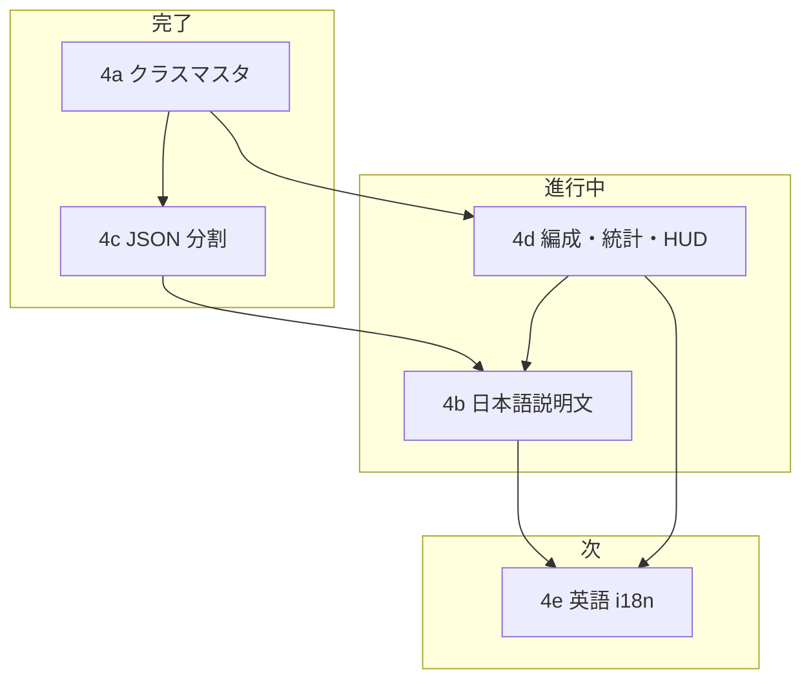

# Phase 4 ロードマップ — クラスマスタ + UI + 英語 i18n

Phase 4 専用の作業順・完了条件。**全体の Phase 1〜12 は [phase-roadmap.md](phase-roadmap.md)** を正とする。ゲームルールは [spec](../spec/README.md)。

**最終更新:** 2026-06

---

## ゴール

Phase 3 の習得機構とキャラクターデータ GUI を土台に、**プレイヤーがクラス・スキルを読んで編成できる UI** と **Release M1 向け英語表示** まで届ける。

| 成果物 | サブフェーズ |
| ------ | ------------ |
| クラス・スキル JSON + 編集 GUI | **4a**（確定済） |
| `data/skills/` 分割 | **4c**（完了） |
| 日本語スキル説明の自動生成 | **4b** |
| 編成 UI・統計 UI・HUD 刷新 | **4d** |
| 英語 i18n（`en` のみ） | **4e** |

**一次職 / 二次職の区別は廃止**（`jobTier` / `promotion` / `promotesFrom` は予約しない）。

---

## 現在地

| サブ | 内容 | 状態 |
| ---- | ---- | ---- |
| **4a** | クラス 15 種・スキル JSON・GUI・validate・`epithetEn` | **確定済**（combat 実装 13。印術師・法陣師は Phase 9 送り） |
| **4c** | 巨大 JSON のファイル分割 | **完了** |
| **4b** | `formatSkillText` によるスキル説明自動生成 | **随時**（コア済。日本語 polish 継続） |
| **4d** | `SkillMenuPanel` + `BattleStatsDrawer` + 状態バッジ HUD | **ほぼ完了**（§11 視覚 polish 残確認） |
| **4e** | 英語 i18n（`ja` + `en`） | **未着手**（4b 日本語確定後） |

**いまの焦点:** **4d 仕上げ → 4b 日本語確定（M1 8 クラス）→ 4e 英語**

---

## 依存関係



**原則**

- i18n は **Phase 4e のみ** 着手。対象は **`en` のみ**（3 言語目以降はスコープ外）。
- **日本語文案を先に確定** → 英語は翻訳・locale 分岐（特に `formatSkillText` と用語辞書）。
- 数値バランスの最終版は Phase 4 外（**6c 体験版** / **8c 本編**）。

---

## 推奨作業順（2026-06 時点）

| 順 | タスク | サブ | 備考 |
| -- | ------ | ---- | ---- |
| 1 | 4d 受け入れ条件の目視確認 | 4d | [party-formation-ui.md §13](../spec/party-formation-ui.md#13-受け入れ条件phase-4d-完了) |
| 2 | DOM §11 polish 残確認 | 4d | 編成・用語パネル・ヘッダーが統計 UI と同系か |
| 3 | M1 8 クラスの日本語説明文 polish | 4b | 下表「4b チェックリスト」 |
| 4 | 用語辞書 `ja` の頻出語追加 | 4b | `formatSkillText` 出力と同期 |
| 5 | i18n 基盤 + DOM UI 英語（最短経路） | 4e-a | `t(key)` / locale 切替 |
| 6 | M1 8 クラスの英語（説明・クラス名・用語） | 4e-b | 4b 確定文案を正本に |
| 7 | M2 前に残り 5 クラスへ英語拡張 | 4e | グレーアウト 5 は M1 でもロスター表示あり |

---

## 4a — クラスデータ + GUI（確定済）

**正本:** [classes-and-skills.md](../spec/classes-and-skills.md)、`data/classes.json`、`data/skills/`

- 15 クラス投入済み。effect 中心 13 クラスは passive / active 4 枠と整合
- `at_sigilist` / `at_conductor` は設計のみ（combat は Phase 9）
- `ClassEditorStep` + `validateGameData` で編集・検証可能
- `displayName`（漢字）+ `epithetEn`（英語肩書き）を `classes.json` に保持

**Phase 4 内で触らない:** スキル数値バランス、ステージ敵構成

---

## 4c — JSON 分割（完了）

```
data/skills/passives/{classPrefix}.json
data/skills/actives/{classPrefix}.json
data/classes.json
```

- ランタイム `GameData.skillRegistry` 形状は変更なし（`loadGameData` がマージ）
- エディタは論理 1 マスタ（保存時 upsert）

詳細は [phase-roadmap.md §4c](phase-roadmap.md#4c--巨大-json-の分割開発効率--完了)。

---

## 4b — スキル説明自動生成（日本語）

**正本:** [classes-and-skills.md §スキル説明自動生成](../spec/classes-and-skills.md#スキル説明自動生成phase-4b)

**実装:** `src/ui/formatSkillText.ts`（`formatActiveDescription` / `formatPassiveDescription` / `formatSkillCardLines`）

**方針**

- スキル JSON に `description` フィールドは **持たない**
- 新 effect / ターゲット形状の **データ PR ごと** に `formatSkillText` + テストを同梱
- 編成 UI は効果単位改行（`formatSkillCardLines`）。tooltip / エディタは 1 行互換を維持
- **4e 前に** M1 対象の日本語文案を確定する

### 4b スコープ外

- 手書き `description` の JSON 追加
- 戦闘ログ・Canvas HUD への説明文表示
- Canvas 演出プレビュー（Phase 5）

### M1 対象クラス（4b / 4e の第一優先）

| classId | 表示名 | 4b 日本語 | 4e 英語 |
| ------- | ------ | --------- | ------- |
| `df_guardian` | 鉄衛士 | テストあり。全スキル目視 | 未 |
| `df_paladin` | 護法士 | テストあり。全スキル目視 | 未 |
| `at_warrior` | 剣術士 | 未 | 未 |
| `at_assassin` | 双刃士 | 未 | 未 |
| `at_ranger` | 弓術士 | 部分テスト | 未 |
| `at_sorcerer` | 魔術師 | 未 | 未 |
| `sp_cleric` | 療養師 | 未 | 未 |
| `sp_wardweaver` | 結界師 | 未 | 未 |

### 4b チェックリスト（クラスごと）

各クラスについて、編成 UI で Lv0 / Lv10 / Lv20 の習得スキルを開き、次を確認する。

- [ ] 全 active / passive が **破綻なく生成**される（未定義 effect がない）
- [ ] **効果単位改行**が自然（1 段落に潰れていない）
- [ ] 数値・単位・% 表記が [classes-and-skills.md](../spec/classes-and-skills.md) のテンプレ方針と一致
- [ ] 頻出用語が `gameTermGlossary` にあり、クリックでパネルが開く
- [ ] `formatSkillText.test.ts` に代表スキルのスナップショット（または assertion）がある
- [ ] エディタ `SkillEditorStep` プレビューと編成 UI の文言が一致

**一括 polish の締切:** Phase **6c / 8c** 前でもよいが、**4e 着手前** に M1 8 クラス分は完了させる。

---

## 4d — 編成 UI + 統計 UI + HUD（ほぼ完了）

**正本**

- 編成: [party-formation-ui.md](../spec/party-formation-ui.md)
- 統計: [battle-field.md §7](../spec/battle-field.md#7-戦闘中統計-ui)
- HUD バッジ: [combat.md §ステータス効果](../spec/combat.md#ステータス効果)

**主な実装**

| 領域 | モジュール |
| ---- | ---------- |
| 編成 | `SkillMenuPanel.ts`, `meta-menu-overlay.css`, `skill-menu-panel.css` |
| 用語 | `gameTermGlossary.ts`, `game-term-panel.css` |
| 統計 | `BattleStatsDrawer.ts`, `PartyMemberStatsDisplay.ts` |
| HUD | `statusBadgeRenderer.ts`, `PartyHudPanel`, `battle-view.css` |

### 4d 残タスク

- [ ] [party-formation-ui.md §13](../spec/party-formation-ui.md#13-受け入れ条件phase-4d-完了) 受け入れ条件 1〜14 の目視確認
- [ ] §11 デザイン方針どおりの視覚 polish（角丸 2px・弱 shadow・控えめ backdrop）
- [ ] 最小幅 ~800px でのレイアウト確認

### 4d スコープ外（Phase 4 でやらない）

- ステージ敵構成との連動ヒント（Phase 6b / 8b）
- Kill / Flow / Survival レイヤーの編成 UI 表示
- Stage Records（Phase 12）

---

## 4e — 英語 i18n（`en` のみ）

**ゴール:** Release M1（体験版）の **必須条件**。`ja` + `en` の 2 言語。

**着手条件**

- 4d の DOM UI 骨格が安定（文言差し替え先が存在）
- 4b — M1 8 クラスの **日本語文案**（特に `formatSkillText`・辞書 `ja`）が確定

### レイヤ別タスク

| レイヤ | 内容 | 状態 |
| ------ | ---- | ---- |
| **基盤** | locale 選択（`ja` / `en`）、`t(key)` または同等。体験版 zip は既定 `en` 推奨 | 未 |
| **DOM UI** | `SkillMenuPanel`、`MetaMenuOverlay`、`BattleStatsDrawer`、HUD ラベル、体験版終了画面 | 未 |
| **ゲームデータ** | `displayName` / `epithetEn` 整理、スキル名・説明の locale 分岐 | 未 |
| **用語** | `gameTermGlossary.ts` の `en` エントリ | 未 |
| **ストア** | itch.io ページ・キャッチコピー（doc 外、M1 チェックリスト） | 未 |

### 4e 進め方

1. **4e-a** — i18n 基盤 + プレイ最短経路の DOM 英語
2. **4e-b** — `formatSkillText` / クラス名 / 用語辞書 `en`（M1 8 クラス）
3. M2 前 — 残り解禁クラス（計 13）へ拡張

### 4e スコープ外

- 中国語・韓国語など 3 言語目以降
- 印術師・法陣師（未実装 2）の完全翻訳
- コミュニティ翻訳基盤、音声・ボイス

**並行可:** Phase 6 / 8（体験版ステージ名の英語は 6b と同時でもよい）

---

## Phase 4 完了条件（Exit）

次をすべて満たしたら Phase 4 を完了とみなし、Phase 6（体験版コンテンツ）へ主軸を移す。

| # | 条件 |
| - | ---- |
| 1 | 4d 受け入れ条件を満たし、目視確認済み |
| 2 | M1 8 クラスの `formatSkillText` 日本語が確定（テスト + 目視） |
| 3 | M1 8 クラス分の用語辞書 `ja` が説明文と整合 |
| 4 | `ja` / `en` 切替が動作し、M1 プレイ経路の DOM UI が英語表示可能 |
| 5 | M1 8 クラスのスキル説明・クラス表示名が `en` で破綻なく表示 |
| 6 | `npm test`（`formatSkillText` 含む）と手動スモーク（編成 → 戦闘 → 統計）が通る |

---

## Phase 4 スコープ外（全体）

| 項目 | 移譲先 |
| ---- | ------ |
| 体験版・本編ステージ | Phase 6 / 8 |
| 演出 PNG・VFX 本番化 | Phase 5 |
| スキル数値バランス | Phase 6c / 8c |
| 印術師・法陣師 combat | Phase 9 |
| トップ / マップ / リザルト画面 | Phase 6d（4e 対象画面として後追い可） |

---

## 関連ドキュメント

| ドキュメント | 用途 |
| ------------ | ---- |
| [phase-roadmap.md](phase-roadmap.md) | Phase 1〜12 全体・Release M1/M2 |
| [classes-and-skills.md](../spec/classes-and-skills.md) | クラス・スキル schema、用語辞書、4b テンプレ |
| [party-formation-ui.md](../spec/party-formation-ui.md) | 4d 仕様・受け入れ条件 |
| [battle-field.md §7](../spec/battle-field.md#7-戦闘中統計-ui) | 統計 UI |
| [skill-finalization-table.md](skill-finalization-table.md) | スキル設計確定表（データ PR 時） |

## 実装タッチポイント（クイック参照）

| 領域 | パス |
| ---- | ---- |
| スキル説明 | `src/ui/formatSkillText.ts`, `src/ui/formatSkillText.test.ts` |
| 用語辞書 | `src/ui/gameTermGlossary.ts` |
| 編成 UI | `src/ui/SkillMenuPanel.ts` |
| クラス表示名 | `src/ui/classDisplayName.ts` |
| スキルデータ | `data/skills/`, `data/classes.json` |
| データ編集 | `src/editor/SkillEditorStep.ts`, `src/editor/ClassEditorStep.ts` |
