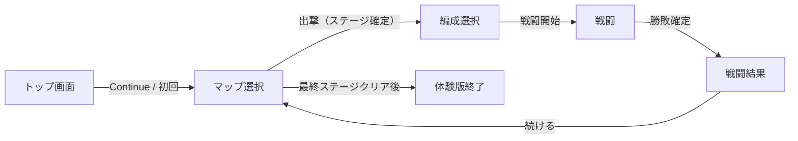

# フェーズロードマップ

Hensei Only の開発フェーズ一覧。**Phase 1〜12 は番号順**（概要表の並び = 依存のおおまかな順）。ゲームルールは [spec](../spec/README.md) を参照。

**旧番号からの変更（2026-06）:** 旧 Phase 8（Electron）→ **Phase 7**。旧 Phase 7a バランス → **Phase 6c / 8c** に分割。ステージ作成 → **Phase 6（体験版）** と **Phase 8（本編）** に分離。旧 Phase 7b/7c → **Phase 9**。旧 Phase 9 ローグ → **Phase 10**。旧 Phase 10 → **Phase 11**。旧 Phase 11 メタ → **Phase 12**。

## 概要

| Phase  | ゴール                                                                                        | 状態                            |
| ------ | --------------------------------------------------------------------------------------------- | ------------------------------- |
| **1**  | 戦闘コアデモ（自動戦闘 + Canvas 表示・プレースホルダー）                                      | **完了**                        |
| **2a** | 放置 MVP：セーブ・ステージ進行・個別 Lv（ステのみ）                                           | **完了**                        |
| **2b** | 戦闘計算（`combatMath` 等）                                                                   | **完了**                        |
| **2c** | JSON 駆動クラス、ビルドのハードコード排除                                                     | **完了**                        |
| **3**  | Lv アップ時スキル習得、習得済み passive / active 常時使用枠（各最大 4）+ クラス別スキル再設定 | **完了**                        |
| **4**  | クラスマスタ + スキル説明 + 編成 UI + **i18n（4e）**；4a **確定済** / 4c **完了** / 4b 説明 / **4d ほぼ完了** | **進行中**（4d 目視確認・**4e / Release M1 準備**） |
| **5**  | 演出アセット + VFX PNG + **演出調整ツール**；**5d Combat Feedback**（Damage / Event Popup）   | **基盤のみ**（本番 PNG 未実装） |
| **6**  | **体験版コンテンツ（Release M1）** — 敵・**体験版専用ステージ**・Lv1 バランス（8 クラス）・**画面導線** | 未着手                          |
| **7**  | **デスクトップ配布** — Electron パッケージ（itch 向け zip）                                   | 未着手（Release M1 直前）       |
| **8**  | **初版本編コンテンツ（Release M2）** — 敵拡張・**本編 Chapter 1 ステージ**・Lv1 バランス（13 クラス）・編集 GUI | 未着手                          |
| **9**  | 印術師・法陣師の独自システム実装（**9a** / **9b**）                                         | 未着手                          |
| **10** | ローグライクモード（仮称）— 13 クラス向けランダム問題・ラン進行                             | 未着手                          |
| **11** | 印術師・法陣師対応ローグライクモード（仮称）                                                  | 未着手                          |
| **12** | 解法評価メタ（07582b6）— Stage Records / Level Sync                                           | 未着手                          |

全フェーズ共通のスコープ外：アイテム、装備、ショップ、インベントリ、クリティカル、命中/回避ロール。

**開発優先:** **Release M1（体験版）** へ向けて **Phase 4d 仕上げ → Phase 4e（英語 i18n）→ Phase 6（体験版ステージ・敵・画面導線・バランス）→ Phase 7（zip ビルド）→ itch.io 公開**。**Release M2** は **Phase 8（本編ステージ・13 クラスバランス）**。体験版と本編のステージ JSON は **別管理**（§Phase 6 / §Phase 8）。ジャンルは **編成解法型オートバトル RPG**。最初の完成単位は **Lv1 章**（Lv10 / Lv20 スキルは実装済みだがコンテンツ・調整は M3 以降）。

---

## Release マイルストーン

**Phase** = 開発タスクの塊。**Release** = プレイヤーに届ける完成単位。体験版用に **Git ブランチを長期分岐しない**。`main` 1 本 + ビルドフラグ（`BUILD_FLAVOR=demo|full`）で zip を 2 種類出す。

| Release | 名称 | ゴール | 状態 |
| ------- | ---- | ------ | ---- |
| **M1** | **体験版** | itch.io 無料公開。Lv1 章 **前半**・解禁 **8 クラス**・**英語 UI** | 未着手 |
| **M2** | **初版 Chapter 1** | 有料版。Lv1 章 **全文**・解禁 **13 クラス**（印術師・法陣師除く） | 未着手 |
| **M3+** | 拡張 | Lv10 / Lv20 章、印術師・法陣師（Phase 9）、Steam 等 | 未着手 |

### 配信方針

| チャネル | 位置づけ |
| -------- | -------- |
| **itch.io** | **第一配信先**（体験版無料 → 初版有料。海外向け・Devlog / 外宣伝の受け皿）。Devlog 開始タイミングは [itch-io-devlog.md](./itch-io-devlog.md) |
| **Steam** | **後回し**（実績・レビュー・英語ページが整ってから。Partner 登録 $100 も後） |
| **DLsite** | 日本向け **任意** の追加窓口（初版の日本語版など） |
| **PWA** | 優先度低（ストア向けは Electron zip が正） |

**Electron（Phase 7）:** デスクトップ **配布パッケージ**（`.exe` / zip）。frameless・常時前面・トレイ・片隅常駐は **スコープ外**。

### M1 — 体験版

**プレイ範囲**

- **プレイヤー Lv1 キャップ**（Exp 取得しても Lv2 以上に上がらない）
- 戦闘・習得は **Lv0 スキル**（passive / active 各 2 枠）のみが有効
- **Chapter 1 前半**ステージのみ（変則・弩砲・高 Max HP 狙いが不要な問題）

**解禁クラス（8）— 選べる**

| classId | 表示名 |
| ------- | ------ |
| `df_guardian` | 鉄衛士 |
| `df_paladin` | 護法士 |
| `at_warrior` | 剣術士 |
| `at_assassin` | 双刃士 |
| `at_ranger` | 弓術士 |
| `at_sorcerer` | 魔術師 |
| `sp_cleric` | 療養師 |
| `sp_wardweaver` | 結界師 |

**グレーアウト（5）— ロスターに表示、選択不可**

| classId | 表示名 | 理由 |
| ------- | ------ | ---- |
| `df_duelist` | 闘技士 | 変則 |
| `at_lancer` | 槍術士 | 変則 |
| `at_hunter` | 狩猟士 | 変則 |
| `sp_alchemist` | 薬草師 | 変則 |
| `at_ballista` | 弩砲士 | 体験版追加制限（遠隔は弓術士 1 本。初版 M2 で解禁） |

グレー理由の文言は **変則 4** と **弩砲士** で分ける（「Full version」一括にしない）。

**非表示（2）— ロスターに出さない**

| classId | 表示名 | 理由 |
| ------- | ------ | ---- |
| `at_sigilist` | 印術師 | combat 未実装（Phase 9a） |
| `at_conductor` | 法陣師 | combat 未実装（Phase 9b） |

**編成 UX 要件（M1）**

- UI ロール（`defender` / `attacker` / `supporter`）ごとに **2 クラス以上** 選べること → M1 は満たす（Def 2 / Atk 4 / Sup 2）
- 職群ラインごとの「基礎 + 拡張 2 択」までは要求しない。遠隔物理・魔法 Kill は **各 1**（弓術士・魔術師のみ）
- 魔法 Kill は **Phase 9a（印術師）まで魔術師 1 クラスのみ**（M2 も同様）

**M1 に含める開発（Phase 対応）**

- **4e** — 英語 i18n（Release M1 **必須**）
- **6a** — 体験版に必要な敵テンプレ
- **6b** — **体験版専用**ステージ（`data/stages-demo.json` 等。**本編 `stages.json` とは別**）
- **6c** — Lv1・解禁 8 クラスのバランス + M1 ステージ調整
- **6d** — **画面構成・導線**（トップ → マップ選択 → 編成 → 戦闘 → **リザルト（2 枠記録: 低レベル / 最速）** → マップ）
- **7** — `BUILD_FLAVOR=demo`、デバッグ UI 無効、体験版終了画面、itch 用 Windows zip

**M1 スコープ外:** 変則 4・弩砲士・Chapter 1 後半、Lv10 / Lv20 進行、印術師・法陣師、Steam、DLsite（任意）

### M2 — 初版 Chapter 1

- M1 から **+ 弩砲士 + 変則 4** → 解禁 **13 クラス**（印術師・法陣師は引き続き非表示）
- **Chapter 1 全文**（変則・弩砲が効く後半ステージを含む）
- 引き続き **Lv1 キャップ** + Lv0 スキル前提（**Phase 8c** で 13 クラスバランス + **Phase 8b** 本編ステージ）
- `BUILD_FLAVOR=full`、itch 有料版（DLsite は任意）
- 体験版セーブの本編引き継ぎは **v1 では任意**（別セーブキー）

### M3 以降（概要）

- Lv10 / Lv20 章・スキル段階のステージ追加
- Phase 9 — 印術師・法陣師
- Phase 10 / 11 — ローグライク
- Phase 12 — Stage Records / Level Sync
- Steam・本格 Electron 署名

---

## Phase 1 — 戦闘コアデモ（完了）

**ゴール：** ブラウザ上で味方パーティ vs 敵の完全自動戦闘。開始後はプレイヤー入力なし。

### 実装済み

- Vite vanilla-ts プロジェクト（`base: './'`）
- JSON ゲームデータ：`data/classes.json`, `data/skills/`, `enemies.json`, `stages.json`, `parties.json`
- 戦闘ロジック：`BattleEngine`, `SkillExecutor`, `targeting`, `combatMath`, `validateGameData`
- 3 ロール、4 人編成（鉄衛士 / 剣術士 / 療養師 / 弓術士）、`stage_1` に test_enemy × 2
- スキル枠：**basic**（非表示・常時稼働）+ **習得済み passive / active 枠**（各 Lv 段階解放、HUD に active CD 表示）
- パッシブも active と同じ Lv0=2 / Lv10=3 / Lv20=4 の段階解放
- ステータス効果：`atk`, `def`, `damageTaken` への buff / debuff
- Victory / Defeat → 3 秒待機 → HP 全回復 → 再スポーン（Phase 2 でセーブ連動の進行ルールを追加。**本番 UX は Phase 6d で刷新**）
- Canvas 2D：**アニメーション基盤**（`SpriteAnimator`、イベント連動、近接突進/遠隔弾、ダメージポップアップ）
- **プレースホルダースプライト**（ロール別色分け PNG。本番ドット絵は Phase 5）
- **戦闘 VFX**（PNG strip `sheets/vfx/`、64×64）— パイプライン基盤のみ。本番 PNG は Phase 5
- **確認用 buff glow（暫定）:** `showBuffGlow` 白い光（約 0.8 秒）。VFX 未投入時の目視検証用。本番は `vfx` / `hitVfx` で置換（[combat.md](../spec/combat.md#確認用プレースホルダー演出vfx--body-strip-未投入時)）
- Canvas UI：ステージ名（左上）、パーティ HUD（クラス名 / Exp / HP / スキル CD）
- バトルログ：**console のみ**（DOM ログは意図的に未実装）

### デモ編成

| classId       | 表示名 |
| ------------- | ------ |
| `df_guardian` | 鉄衛士 |
| `at_warrior`  | 剣術士 |
| `sp_cleric`   | 療養師 |
| `at_ranger`   | 弓術士 |

### アーキテクチャ

```
battle/  → ロジックのみ（DOM/Canvas 非依存）
  ↓ events + getSnapshot()
ui/      → BattleView がエンジン ↔ 描画を仲介
render/  → BattleCanvas（IBattleRenderer）、スプライト、エフェクト
data/    → loadGameData.ts が JSON マスタを読み込み
```

---

## Phase 2 — 放置 MVP（2a / 2b / 2c）

### 2a — 進行コア（完了）

- オートセーブ / ロード（`localStorage`、確認/リリース別キー）
- 複数ステージ：`stages.json` の順序で `currentStageId` を管理
- **Victory / Defeat の自動進行・3 秒再スポーン** — Phase 2 放置 MVP。**Phase 6d で UX 刷新**（[progression.md](../spec/progression.md) §ステージ進行）
- 勝利時、撃破敵 `exp` 合計を **`playerProgress.exp` に加算**（[progression.md](../spec/progression.md)）。メンバー別 LvUP は廃止
- LvUP で **maxHp / atk / def のみ上昇**（スキル習得は Phase 3）
- 進行 UI：ステージ名、プレイヤー共通 Lv / Exp（戦闘 HUD）。編成は Lv のみ

### 2b — 戦闘計算（完了）

Phase 1 の時点で `src/battle/combatMath.ts` に実装済み。数値の体感調整は **Phase 6c / 8c**。

### 2c — クラス基盤（完了）

- セーブ + JSON のみからパーティ/ビルドを構築（`parties.json`）
- `levelCurves.json` による Lv 成長（Phase 4 で **growthPresets + classes.growthTier** 方式に刷新）

---

## Phase 3 — スキル・戦闘拡張（完了）

**ゴール：** LvUP で習得済みスキルが増え、passive / active はどちらも Lv0=2、Lv10=3、Lv20=4 の各最大 4 枠で常時使用可能になる。ビルドは付け替えではなく習得構造としてセーブに永続化。

### 実装済み

- LvUP 時、`classes.json` の `skills[]`（レベル別 `skillIds`）から `learnedPassiveIds` / `learnedActiveIds` を再計算（`resolveLearnedSkills`, `reconcileMemberBuild`）
- 勝利報酬・セーブロード・デバッグ Lv 変更時に習得リストを同期；LvUP ログに新スキル名を表示
- アクティブ **最大 4 枠**（`MAX_ACTIVE_SLOTS = 4`）：習得即参加（`learnedActiveIds`）。段階解放 Lv0=2 / Lv10=3 / Lv20=4
- パッシブも active と同じ段階解放（Lv0=2 / Lv10=3 / Lv20=4）。`learnedPassiveIds` が Lv に応じた枠数まで常時発動
- 付け替え・セット・装備変更は行わない。`equippedActiveSlots` は歴史的互換のみで、設計上の戦闘参加判定には使わない
- セーブに `CharacterBuild` を含め、ロード時 `reconcilePartyBuilds` でレベルと整合
- 13 クラス（effect 中心）の passive / active 4 枠化 — [skill-finalization-table.md](./skill-finalization-table.md) の各 pass **実装済**
- 槍術士（`at_lancer`）: pierce approach、[classes-and-skills.md §槍術士](../spec/classes-and-skills.md#槍術士at_lancer変則近接)・[combat.md](../spec/combat.md) §追撃状態 含む 4 枠化 **実装済**
- `classes.json` 習得テーブルと `data/skills/` の効果・ターゲット・数値フィールドを [classes-and-skills.md](../spec/classes-and-skills.md) と整合

### 経緯（2026-06 再オープン → 完了）

仕様見直しによりクラス別パッシブ / アクティブの再設定を Phase 3 へ戻したが、13 クラス分の再定義・JSON / combat 同期は完了。**印術師・法陣師**（`at_sigilist` / `at_conductor`）は独自システムのため combat 実装は **Phase 9a / 9b 以降**（設計確定のみ Phase 3 完了条件に含む）。

### Phase 3d — 接近・接敵 Intent 一本化（完了）

**位置づけ:** P3 剣術士完了後、Position Flow 系スキルの本格実装前に挟む。Phase 3b の `resolveEngagedLayout` 一本化は layout / display 側の cleanup であり、Phase 3d は approach / attack / move / display の Target Intent 境界を揃える別作業。

**ゴール:**

- defender 専用の「敵全体の接触点へ前進」接近本体を廃止する
- 全ロール共通で `ChaseTarget → standoff battleX → AttackTarget` の停止判定へ寄せる
- ロール差は接近パイプラインではなく target spec / target rule に閉じる
- `contact` / `frontline` / `display` / `move anchor` / `attack target` の責務境界を [battle-field.md](../spec/battle-field.md) と [combat.md](../spec/combat.md) に同期する
- Stage 1 Wave 2 の `test_to_ranged` 残存時に鉄衛士が不連続に接敵しないことを regression 化する
- Phase 3d 後 regression として、Engaged 中 overlap 補正は approach と合算した 1 tick の総移動量を自動接近 step 内に制限し、front row spacing が `battleX` を 32px 級で snap したり 2 倍速に見える加速を起こしたりしないことを固定する

**Phase 3d 後 cleanup（完了）:** `battleX` 単一正本の runtime 整理は完了。`battleCamera.ts`、skill move の旧 visual フィールド、`visualX` snapshot ミラー、`engagedVisualTarget*` deprecated alias を削除済み。正本は [`docs/spec/battle-field.md`](../spec/battle-field.md)。

**Phase 3d 延長 — 回復 PHT 整合（完了）:** Priority Heal Target（PHT）を [combat.md](../spec/combat.md) §回復 PHT に正本化。Task 0–7 実装済（spec / 接近 / withhold / selfOrigin 棚卸し / 薬草師整合 / battleX debug PHT・withhold 表示 / sp_cleric 等回帰）。

### スコープ外（Phase 3）— 独自システムクラス

`at_sigilist`（印術師）と `at_conductor`（法陣師）は、乾印 / 坤印（`windMark` / `earthMark`）・Earth / Wind Branch 分岐・damage reservoir / routing 系など **戦闘エンジン拡張を伴う独自システム** を持つ。設計確定（[skill-finalization-table.md](./skill-finalization-table.md)）は Phase 3 で行うが、**combat 実装・`data/skills/` 投入・tooling 本番化は Phase 9a / 9b 以降** とする。

| classId        | Phase 3 で行うこと                                                     | Phase 9a / 9b 以降へ送ること                                                                            |
| -------------- | ---------------------------------------------------------------------- | ------------------------------------------------------------------------------------------------------- |
| `at_sigilist`  | 枠設計・乾印 / 坤印 / Branch 仕様の docs 確定。現行 JSON active は廃棄済み | `windMark` / `earthMark` state / effect、conditionalEffect tooling、passive / active JSON |
| `at_conductor` | 枠設計・蓄積プール / 法陣仕様の docs 確定。現行 JSON active は廃棄済み | damage reservoir、observation / concentration / distribution / recycling、非 damage basic、地点指定範囲 |

Phase 3 の Caster pass は **`at_sorcerer` のみ** を対象とする。印術師・法陣師はクラスマスタ上は存在するが、スキル未実装のまま据え置き可。

---

## Phase 4 — クラスマスタ + スキル

**詳細な作業順・チェックリスト:** [phase-4-roadmap.md](phase-4-roadmap.md)

Phase 3 の習得機構 + **キャラクターデータ GUI** でクラス JSON を確定する。**一次職 / 二次職の区別は廃止**し、`jobTier` / `promotion` / `promotesFrom` の予約は行わない。

| サブフェーズ | 内容                                                                                                                                                                                                                                    | 状態                                                       |
| ------------ | --------------------------------------------------------------------------------------------------------------------------------------------------------------------------------------------------------------------------------------- | ---------------------------------------------------------- |
| **4a**       | クラス 15 種・スキル JSON・GUI・validate・`epithetEn` データ                                                                                                                                                                            | **確定済**（13 クラス。印術師・法陣師は Phase 9 送り） |
| **4c**       | 巨大 JSON のファイル分割（AI / エディタ / Git のトークン・差分効率）                                                                                                                                                                    | **完了**                                                   |
| **4b**       | スキル説明の自動生成（`formatSkillText`）— データ PR 同梱・Phase 6c / 8c 前 polish                                                                                                                                                     | **随時**（コア済）                                         |
| **4d**       | パーティ編成 UI（`SkillMenuPanel`）+ **統計 UI**（`BattleStatsDrawer`）+ **状態バッジ HUD** 刷新 — 編成は [party-formation-ui.md](../spec/party-formation-ui.md)、統計は [battle-field.md §7](../spec/battle-field.md#7-戦闘中統計-ui) | **ほぼ完了**（§11 視覚 polish 残確認）                     |
| **4e**       | **英語 i18n のみ** — i18n 基盤、UI / ゲームデータ / スキル説明の locale 化（**Release M1 必須**。4b 日本語確定後）                                                                                                                    | **未着手**                                                 |

### クラスマスタ（確定済）

ロスター全表は [classes-and-skills.md](../spec/classes-and-skills.md) を正とする。`displayName`（漢字）+ `epithetEn`（英語肩書き）を `classes.json` に保持し、デモ編成は `parties.json` の最新構成（鉄衛士 / 剣術士 / 療養師 / 弓術士）とする。

- 旧デモ 4 クラス（Bulwark 等）は削除済み
- `epithetEn` の 2 段ルビ UI は Phase 3c 完了（スプライト本番化は Phase 5）
- 数値バランスの最終版は **Phase 6c（体験版）** / **Phase 8c（本編）**

### 4a — クラスデータ + GUI（確定済）

- 15 クラスを `classes.json` + `data/skills/` に投入済み。effect 中心 13 クラスは Phase 3 完了時点で passive / active 4 枠と整合。`at_sigilist` / `at_conductor` は設計のみ（combat 未実装）
- **ステータス・成長** — Lv1 基準 + `growthTier`（低/中/高）+ `levelCurves.growthPresets` + `attackSpeedPresets`；術師は `growthPresetKey: caster`；`ClassEditorStep` 成長 UI + Lv10 プレビュー（[stats.md](../spec/stats.md)）
- **複数ターゲットスキル**（`targetShape` 等）— 実装検証用 WIP データ。**仕様書へのスキル一覧転記はマスタ確定後**
- キャラクターデータ GUI で編集・保存
- `validateGameData` 整合確認

### 4b — スキル説明自動生成（随時）

スキル JSON に `description` フィールドは持たず、UI は `src/ui/formatSkillText.ts` から説明文を組み立てる（`SkillMenuPanel` ツールチップ・`SkillEditorStep` テキストプレビュー）。

**方針:** コア（自動生成 + エディタプレビュー）は **既に稼働**。新 effect / ターゲット形状を足す **データ PR ごと** に `formatSkillText` とテストを同梱。全クラス目視の仕上げは **Phase 6c / 8c 前** でよい。1 行テンプレ・表記ルールは [classes-and-skills.md §スキル説明自動生成（Phase 4b）](../spec/classes-and-skills.md#スキル説明自動生成phase-4b) を正とする。

**4e との順序:** i18n は **Phase 4e で英語のみ**（3 言語目以降はスコープ外）。**4e に入る前に** DOM UI 文言と `formatSkillText` の **日本語文案を先に確定** する（英語は日本語確定後の翻訳・locale 分岐）。

**4b スコープ外**

- 手書き `description` フィールドの JSON 追加
- 戦闘ログ・Canvas HUD への説明文表示
- Canvas 演出プレビュー（**Phase 5 演出調整ツール**）

### 4c — 巨大 JSON の分割（開発効率）— **完了**

**背景：** 4a 完了時点で `skills.json` は ~2000 行。`.cursorignore` と [data-json-lightweight.mdc](../../.cursor/rules/data-json-lightweight.mdc) で全文 Read 禁止を運用していた。**物理分割済み** — 必要ファイルだけ開ける。

**レイアウト（実装）**

```
data/
  skills/
    passives/
      df_guardian.json         # スキル ID 先頭2セグメント単位
      at_warrior.json
      …
    actives/
      df_guardian.json         # スキル ID 先頭2セグメント単位（17 ファイル）
      at_warrior.json
      …
  classes.json                 # 据え置き（~600 行）
```

- ランタイムの `GameData.skillRegistry` 形状は **変更なし**（`loadGameData` が `import.meta.glob` でマージ）。
- エディタ API は **論理上 1 マスタ**（GET はマージ、保存時は該当ファイルへ upsert）。

**実装済み**

- `src/battle/data/loadGameData.ts` — 分割 JSON の import / マージ
- `src/battle/data/skillsJsonFs.ts` — Node 側 read/write / upsert
- `validateGameData.ts` — マージ後に現行と同じ検証（変更なし）
- `vite-plugin-editor-api.ts` — 読み書きパス・HMR 対象の更新
- `scripts/split-skills-json.mjs` — 初回移行用（actives）
- `scripts/split-passives-json.mjs` — パッシブ分割移行用
- `.cursorignore` — `data/skills.json` 除外を解除（`classes.json` のみ除外継続）

**4c スコープ外**

- スキル数値・ID のバランス変更（**Phase 6c / 8c**）
- `classes.json` の 15 分割（効果が小さいため任意。4c 完了後に別タスク可）
- 本編ステージ JSON の分割（**Phase 8** で必要になれば再検討。体験版は **Phase 6b**）

**タイミング：** 4a でスキーマが固まったあと。**4b と並行** してよい（説明文生成はマージ後の型・validate に依存するだけ）。

### 4d — パーティ編成 UI + 統計 UI + HUD（ほぼ完了）

**ゴール:** 戦闘外 DOM UI（編成・統計）と戦闘 HUD の見た目を **PC 向け RPG 情報パネル**基調に揃え、Web アプリ風ダッシュボード感を除去する。

- **編成（完了）:** [party-formation-ui.md](../spec/party-formation-ui.md)（**v0.4**）PR1–3 — 上ロスター / 下詳細、編成内訳行、中央モーダル Picker、閲覧スキルカード、インライン用語パネル、`playerProgress.level` ヘッダー表示。
- **統計（刷新済）:** [battle-field.md §7](../spec/battle-field.md#7-戦闘中統計-ui) — `2e43f08` 以降。縦リスト・細セパレーター・控えめバー、24px アイコン + `displayName`、Debuff/Buff ラベル付き全件バッジ帯、`DebugMenuPanel` 同期。
- **HUD（完了）:** 五角形バッジ・簡易/詳細分割・`statusBadgeRenderer` 共有。Party HUD / 敵頭上 / 統計詳細で同一描画経路。
- **DOM §11 polish（完了）:** `meta-menu-overlay.css` / `skill-menu-panel.css`（Picker・ロスター・スキルカード）/ `game-term-panel.css` / `battle-view.css` ヘッダーを統計 UI と同系（角丸 2px・弱 shadow・控えめ backdrop）に揃え。

**前提（充足済）**

- 4a で `role` / `formationRow` / `epithetEn` が安定
- 代表クラスのスキル ID 確定（Phase 3 完了）
- `formatSkillText` が代表スキルを破綻なく生成（4b 最低ライン）

**主な変更（設計書 §11 差分）**

- 上ロスター / 下詳細、編成内訳行（空き枠 suffix）、PC RPG 情報パネル基調（§11）
- `playerProgress.level` をヘッダー表示（正本は [progression.md](../spec/progression.md)）。`party[].progress` は廃止
- スキル: 縦セクション + 閲覧カード、効果単位改行、詳細全体スクロール
- 用語 UI: [classes-and-skills.md §UI 用語辞書](../spec/classes-and-skills.md#ui-用語辞書) + [party-formation-ui.md §6.4](../spec/party-formation-ui.md#64-インライン用語パネル) — `gameTermGlossary.ts`（locale キー）、クリック Popover、パネル内用語の履歴遷移
- Picker: 3 ロールブロック・中央モーダル（タブ / サイドバー / rangePx なし）

**状態バッジ（HUD）— 4d と同タイミングで実装**

正本: [combat.md §ステータス効果](../spec/combat.md#ステータス効果)（HUD バッジ）、[combat.md §Damage Popup](../spec/combat.md#damage-popup)（DoT 色）。

| 項目                 | 仕様                                                                                                                                                                 |
| -------------------- | -------------------------------------------------------------------------------------------------------------------------------------------------------------------- |
| 集約                 | 同一 `StatusDisplayCategory` あたり **アイコン 1 つ**（旧「stack 数ぶん横並び」例外は廃止）                                                                          |
| buff / debuff        | **上向き / 下向き五角形背景** + 中央に効果アイコン。active buff = **青**、active debuff = **赤**                                                                     |
| パッシブ             | buff/debuff の色相は維持し、五角形のみ **彩度・明度を下げた同系色**。アイコン縁は黒で統一（`--status-icon-passive-outline-color` は廃止）                            |
| stat 系              | atk / def / reg / attackSpeed は **tint なし**（白シルエット + 黒縁）。その他 PNG は既存カラー + 黒縁のまま                                                          |
| スタック表示         | `stacks > 1`（または同一カテゴリ複数 instance）のときのみ右下に累積数。**1 スタックは非表示**                                                                        |
| 残時間               | 同一カテゴリ内の **最短** `remainingRatio` を、上端からの暗化オーバーレイで表示（現行方式）                                                                          |
| DoT ポップアップ     | `dotFlavor: bleed` / 未指定 generic dot → **赤**。`dotFlavor: poison` → **紫**（状態バッジの debuff 五角形は赤のまま）                                               |
| 簡易表示             | Party HUD: **4 +N**（計 5 スロット・全幅バッジ行・20px）。敵 HP バー上: **3 +N**（計 4 スロット・20px）。tier 優先度は [combat.md](../spec/combat.md#ステータス効果) |
| Party HUD レイアウト | 上段: `displayName` + バッジ行（全幅）。下段: 24px クラスアイコン + HP/リキャスト（アイコン下端 = バー列下端）                                                       |

**実装タッチポイント（HUD）:** `statusEffectDisplay.ts`（`selectCompactStatusBadges` 等）, `statusBadgeRenderer.ts`, `PartyHudPanel`, `BattleCanvas`, `battle-view.css` / `battleHudTheme.ts`, `DamagePopup.ts`（DoT tick に `dotFlavor` 伝播）。**HUD 簡易/詳細分割 — 実装済み（2026-06）。** 旧「4 個折り返し」は廃止。

**統計 UI — 4d と同タイミングで実装**

正本: [battle-field.md §7](../spec/battle-field.md#7-戦闘中統計-ui)。表示項目・集計ルールは [combat.md](../spec/combat.md)（脅威・ダメージ）と現行実装を維持。**見た目のみ**刷新。

| 項目         | 仕様                                                                                                                                                                                                  |
| ------------ | ----------------------------------------------------------------------------------------------------------------------------------------------------------------------------------------------------- |
| デザイン言語 | [party-formation-ui.md §11](../spec/party-formation-ui.md#11-デザイン方針dom-ui-共通) と同一（縦情報パネル・細セパレーター・大角丸 / 強 shadow 禁止）                                                 |
| オーバーレイ | Web モーダル風を避け、**Party HUD 直下のドロワー**として展開。タイトル **戦闘詳細**                                                                                                                               |
| メンバー行   | `PartyMemberStatsDisplay` 共通 — 名前（`displayName`）、Threat / 与ダメ・被ダメバー、**状態バッジ帯（全件・debuff/buff ラベル）**。行は **細い区切り + 余白**（Exp / epithetEn / メンバー別 Lv なし） |
| バー         | 角丸グラデーションのダッシュボード棒を控えめに。色意味（Threat 青・与ダメ橙・被ダメ青等）は維持可                                                                                                     |
| 共有 CSS     | `battle-stats-drawer.css` + `party-member-stats.css`                                                                                                       |

**実装タッチポイント（統計）:** `BattleStatsDrawer.ts`, `PartyMemberStatsDisplay.ts`, `battle-stats-drawer.css`, `party-member-stats.css`。

**4d スコープ外**

- ステージ敵構成との連動ヒント（**Phase 6b / 8b**）
- 戦闘 `battleX` 配置プレビュー
- Kill / Flow / Survival レイヤーの編成 UI 表示
- 統計の集計項目追加・本番モード Stage Records（**Phase 12**）

**タイミング:** 4a データ形安定後、**Phase 6 より前**。4b（説明文）と並行可。Phase 5（演出 PNG）とは独立。

### 4e — 英語 i18n — Release M1 向け

**方針:** i18n は **Phase 4 からのみ** 着手し、対象言語は **`en` のみ**（中国語・韓国語等は Phase 4 スコープ外）。

**ゴール:** 海外向け itch.io 公開のため、**日本語 + 英語** の 2 言語をサポートする。Release M1（体験版）の **必須条件**。

**着手条件:**

- 4d の編成 UI 骨格が安定していること（文言差し替え先が存在すること）
- **4b** — M1 対象範囲の **日本語 UI 文案**（特に `formatSkillText`・用語辞書 `ja`）が確定していること

| レイヤ | 内容 |
| ------ | ---- |
| **基盤** | locale 選択（`ja` / `en`）、`t(key)` または同等、ビルド / 起動時の既定 locale（体験版 zip は **既定 `en`** を推奨） |
| **DOM UI** | `SkillMenuPanel`、`MetaMenuOverlay`、`BattleStatsDrawer`、HUD ラベル、体験版終了画面、デバッグ以外の固定文言 |
| **ゲームデータ** | `classes.json` の `displayName` / `epithetEn`（英語表示名の正本整理）、スキル名・説明（`formatSkillText` の locale 分岐、または JSON に locale フィールド） |
| **用語** | `gameTermGlossary.ts` — 既存 locale キー設計を英語エントリまで拡張 |
| **ストア** | itch.io ページ・短いキャッチコピー・スクリーンショット上の英語（[itch-io-devlog.md](./itch-io-devlog.md)） |

**進め方（推奨）**

1. **4b / 4d（先行）** — 日本語の UI 固定文言・`formatSkillText` 出力・`gameTermGlossary` の `ja` を確定（翻訳元の正本）
2. **4e-a** — i18n 基盤 + DOM UI の英語（プレイに必要な最短経路）
3. **4e-b** — `formatSkillText` / クラス名 / 用語辞書 `en` — M1 解禁 **8 クラス**分から
4. M2 前に **13 クラス**分へ拡張

**4e スコープ外（初期）**

- 中国語・韓国語など 3 言語目以降
- 全 15 クラス（未実装 2 含む）の完全翻訳
- コミュニティ翻訳基盤
- 音声・ボイス

**タイミング:** **Release M1 より前** に完了。Phase 6 / 8 と **並行可**（体験版ステージ名の英語は 6b と同時でもよい）。

### スコープ外（Phase 4）

- 体験版・本編ステージコンテンツ（**Phase 6 / 8**）
- 演出アセット本番化・演出調整ツール（**Phase 5**）

---

## Phase 5 — 演出アセット + VFX PNG + 演出調整ツール

Phase 1 の `render/` 基盤（`SpriteAnimator`, `IBattleRenderer`, イベント連動）は維持。Phase 3 のスキル再設定と Phase 4a のクラスマスタ再確定後、**確定した classId / skillId / enemyId から順次** 本番 PNG・VFX PNG・タイミングを載せる。アセット規約は [classes-and-skills.md](../spec/classes-and-skills.md#スプライト演出アセット) と [sheets/README.md](../../src/assets/sprites/sheets/README.md)。

### アセット仕様（目標）

| 種別         | 配置                                            | 内容                                                                                           |
| ------------ | ----------------------------------------------- | ---------------------------------------------------------------------------------------------- |
| entity 本体  | `sheets/bodies/{classId\|enemyId}.png` **1 枚** | idle / move / death のみ（48×48）。レイアウト正本 `data/entityAnimLayout.json`（味方・敵共通） |
| スキル body  | `sheets/skills/{skillId}[_index].png`           | **通常攻撃 + 全 active**。64×48 横 strip。attack は entity に含めない                          |
| 先頭 idle    | strip 0 コマ目任意                              | entity idle 0 と同絵で位置合わせ可 → effect `animStartFrame: 1` で再生スキップ                 |
| 遠隔通常攻撃 | `{id}_basic_attack.png`                         | **弓引き PNG を置けば skill anim**。未配置時は VFX のみ                                        |
| VFX          | `sheets/vfx/*.png`                              | 64×64 横 strip。スキル単位の `vfx` / `hitVfx` / `basicAttackVfx` と対応                        |

### 演出調整ツール（スコープ）

- **Canvas プレビュー必須** — 1 スキル / 1 effect の isolated 再生（本番と同じ `resolveEffectPresentation` → `BattleCanvas` 経路）
- **VFX パラメータ調整を統合** — `vfx.placement` / `animStartFrame` 等 / `moveDurationSec`（別 VFX エディタは作らない）
- タイムライン表示（body strip / VFX / particles / presentationLock）
- JSON 書き戻し（`data/skills/actives/` 等）。BattleEngine 全体は回さない薄いランナー
- SkillEditorStep から「演出プレビューを開く」連携（任意）

**実装済み（演出ラボ MVP / PR3）**

- `presentation-lab.html` — Vite 別エントリ（`npm run dev` → `/presentation-lab.html`）
- `src/presentation/PresentationPreviewRunner.ts` — 擬似 2 体配置 + `BattleCanvas.play*`
- `src/presentation/PresentationLabApp.ts` — classId / enemyId・skill・effect 選択、▶ / ↺、JSON 編集・保存
- `PUT /__editor/presentation-skill` — `skillsJsonFs` upsert + validate
- SkillEditorStep effect 演出セクションから演出ラボ deep link（任意）

### 5d — Combat Feedback（Damage / Event Popup）

**着手条件:** Phase 3d 完了後。**Phase 4a / 4b と並行可**。本番 PNG・VFX 投入（5a〜5c）の前後どちらでもよいが、クラス別スキル再設定の目視検証には **4a 前でも着手推奨**。

**ゴール:** [combat-architecture.md](../combat-architecture.md) §8 の HUD / Damage Popup / Event Popup 分離を戦闘描画へ反映する。正本は §8（07582b6）。

| 項目         | 内容                                                                                       | 状態                                                                                                                                                                |
| ------------ | ------------------------------------------------------------------------------------------ | ------------------------------------------------------------------------------------------------------------------------------------------------------------------- |
| Damage Popup | Damage / Heal / DoT の数値のみ。頭上表示。内訳・Barrier 吸収量は出さない                   | 基盤済み（`DamagePopupManager`）。**DoT フレーバー色**（出血=赤・毒=紫）は **Phase 4d** と同タイミング（[combat.md §Damage Popup](../spec/combat.md#damage-popup)） |
| Event Popup  | v1 対象 8 種（回避・block・反撃・無敵・再起・不屈・引き寄せ・ノックバック）。Damage より上 | 基盤済み（`CombatReactionPopupManager`）。v1 対象外 Event の追加はしない                                                                                            |
| レイアウト   | `damagePopupLayout` と reaction popup の Y 衝突回避を regression 化                        | 未着手                                                                                                                                                              |
| HUD 境界     | Barrier 残量・Buff / Debuff は HUD のみ（ポップアップに出さない）                          | 要確認                                                                                                                                                              |

**VFX なし v1:** 本番 VFX 未投入のため popup / HUD が目視検証の主手段。詳細は [combat-architecture.md](../combat-architecture.md) §8、[combat.md](../spec/combat.md#combat-feedbackvfx-なしv1)。

**v1 Event 対象外:** Redirect! / Barrier Break! / Execute! / Armor Break! — 理由は architecture §8.3。

**実装済み（部分）:** `showDamagePopup` / `showHealPopup`、`showBlockPopup` / `showCounterPopup` / `showEvadePopup` 等、`damagePopupLayout.test.ts`。

**スコープ外:** 戦闘ログ DOM、手書き `description`、演出ラボ、Stage Records（**Phase 12**）。

### 進め方

1. **5d** — Combat Feedback 仕上げ（Phase 3d 後、4a と並行可）
2. インフラ — `entityAnimLayout.json`、body atlas 描画、スキル strip 64px、`animStartFrame`
3. 演出調整ツール MVP（プレースホルダー PNG でもタイミング調整可）
4. VFX PNG — `sheets/vfx/` に strip 投入、スキル JSON の `vfx` / `hitVfx` / `basicAttackVfx` と対応付け
5. 確定クラス / 敵ごと — `bodies/` → `basic_attack` → 各 active → VFX → 演出ラボで詰め → 本番 battle 目視。スキル単位で VFX / body strip が揃った effect は確認用 `showBuffGlow`・attack 跳ねに頼らない（[combat.md §確認用プレースホルダー](../spec/combat.md#確認用プレースホルダー演出vfx--body-strip-未投入時)）

### Phase 1 との境界

| 項目            | Phase 1（済）            | Phase 5                                  |
| --------------- | ------------------------ | ---------------------------------------- |
| アニメ状態機械  | あり                     | 変更最小（atlas / skill strip 解決追加） |
| entity 素材     | ロール別プレースホルダー | `bodies/{id}.png` + スキル strip         |
| VFX 素材        | 基盤のみ                 | `sheets/vfx/*.png` + `SkillVfxDef`       |
| battle ロジック | —                        | **触らない**                             |

### VFX PNG 描画

Phase 5 の演出調整ツールで編集した JSON・タイミングを、戦闘でも **同一 PNG strip 経路** で描画する。VFX の正本は `sheets/vfx/*.png` + `SkillVfxDef`（`placement` / `AnimPhaseFields` / `hitVfx` / `basicAttackVfx`）。

**現状:** 型・レジストリ・再生パイプラインは実装済みだが、`sheets/vfx/` に本番 PNG が未投入のため、スキル単位の VFX 描画は未完了。

### 基盤実装済み

- **型・レジストリ:** `SkillVfxDef`、`VFX_ANIM_CELL_*` 64×64、`vfxAnimRegistry.ts`（`resolveVfxAnimKey`）
- **再生・描画:** `vfxAnimPlayback.ts` / `vfxPlacement.ts` / `VfxPlaybackManager.ts` / `BattleCanvas.playSkillVfx`（`layer` behind → entities → front）
- **データ形状:** スキル JSON は `vfx` / `hitVfx` のみ（traits は `basicAttackVfx`）。旧 preset フィールドは削除済み

### 未完了

- `sheets/vfx/` への VFX PNG strip 投入（`{skillId}_vfx` / `{skillId}_{effectIndex}_vfx` / `_vfx_hit` 規約）
- スキル JSON の `vfx` / `hitVfx` / `basicAttackVfx` と実 PNG の対応付け・戦闘 / 演出ラボでの目視確認
- 確定クラス / スキル単位 PR で順次載せる（Phase 5 本番アセットと並行可）

### スコープ外（Phase 5）

- PixiJS 描画層移行
- 全 15 クラス一括完成（**確定分から順次**で可）
- VFX 専用編集ツール（**Phase 5 演出ラボに統合済**）
- 既存 JSON の一括移行（クラス / スキル単位 PR で順次）

---

## Phase 6 — 体験版コンテンツ（Release M1）

**ゴール:** **Release M1** 向けの敵・ステージ・Lv1 バランスを、**本編（Phase 8）とは別データ** で用意する。

**データ分離（正本）**

| 用途 | ファイル（案） | ビルド |
| ---- | -------------- | ------ |
| 体験版ステージ | `data/stages-demo.json`（名称は実装時確定） | `BUILD_FLAVOR=demo` のみ読込 |
| 本編ステージ | `data/stages.json` | `BUILD_FLAVOR=full`（**Phase 8b**） |

体験版は **ビルド側でステージ上限** を設けるだけでなく、**コンテンツ JSON 自体を本編と分ける**。本編 `stages.json` に体験版用ステージを混在させない。

進行ルールの **データ正本**（Exp・ロールバック・`totalClears`）は [progression.md](../spec/progression.md) を参照。**戦闘後の自動次ステージ進行・即再スポーンは Phase 2 レガシー** — Phase 6d で廃止（同 doc §ステージ進行）。

| サブフェーズ | 内容 | Release |
| ------------ | ---- | ------- |
| **6a** | 敵テンプレ — 体験版ステージに必要な `enemies.json` エントリ。`EnemyEditorStep` 経由 | M1 |
| **6b** | **体験版固定ステージ** — `stages-demo.json`（または同等）。M1 解禁 8 クラス・Lv0 スキルのみで解ける問題。変則・弩砲不要 | M1 |
| **6c** | **体験版バランス** — Lv1 キャップ、解禁 8 クラス、6b ステージの数値 polish | M1 |
| **6d** | **画面構成・導線** — トップ / マップ選択 / 編成 / 戦闘 / リザルトの遷移。M1 体験版のプレイ導線 | M1 |

### 6a — 敵テンプレ（体験版）

- [enemy-design-concept.md](../enemy-design-concept.md) に沿い、**6b が要求する編成パターン** に必要な敵のみ整備
- 既存 **`EnemyEditorStep`** + validate。本編向けボス・高 Max HP テンプレは **Phase 8a** へ送る
- test / 検証用ダミー敵と M1 用テンプレの整理

### 6b — 体験版ステージ

- **本編 `stages.json` とは別ファイル** に Chapter 1 **体験版分** のみ定義
- 各ステージ：`id` / `displayName` / `waves[]` / `enemies[]`（`templateId` + `spawnX`）。**`recommendedLevel`（想定 Lv）** — Stage Records・☆・Level Sync に必須（[progression.md](../spec/progression.md)、[stage-selection-ui.md](../spec/stage-selection-ui.md)）
- 座標は [battle-field.md](../spec/battle-field.md)
- 解法は M1 解禁 8 クラス・Lv0 スキルのみで完結。体験版終了画面で初版（M2）へ誘導
- 英語 `displayName` は **Phase 4e** と同期

### 6c — 体験版バランス

- [combat.md](../spec/combat.md) との突き合わせ
- **Lv1 キャップ**（Lv10/20 習得が発生しない）
- 解禁 **8 クラス**・**Lv0 スキル**威力 + 6b 敵 `exp`・難易度カーブ
- **passive / active 枠**（Lv0=2）の UI / 戦闘整合確認

### 6d — 画面構成・導線（Release M1）

**ゴール:** 体験版として **起動からクリアまでの画面遷移** を定義し、現行の「起動即戦闘・敗北後も同一画面で再スポーン」から、プレイヤーが **どこにいるか分かる本番導線** へ移す。

**現状（Phase 4d まで）— Phase 2 放置 MVP のレガシー**

- `GameSession` 起動 → 即 `BattleView` / 自動戦闘開始
- 編成は戦闘中の Party HUD **編成** ボタン → `MetaMenuOverlay`（[party-formation-ui.md](../spec/party-formation-ui.md) §3）
- **Victory** → セーブ上の `currentStageId` が **自動で次ステージ**へ（`applyVictoryRewards` / `resolveVictoryNextStageId`）。`BattleEngine` が 3 秒後 **`respawnAfterEnd()`** で **無入力再開**（最終ステージは同ステージ周回）
- **Defeat** → `currentStageId` **自動ロールバック** 後、同様に 3 秒で再スポーン
- **ステージ選択 UI なし（リリース経路）** — セーブの `currentStageId` と勝利時の自動進行のみ。**任意ステージの手動選択は確認モード（verify）の `DebugMenuPanel` のみ**（`BattleView` 内・「周回ステージ」`<select>` + 任意で Wave 固定）。開発・検証用の暫定 UI であり、本番マップ画面の代わりではない
- 専用リザルト / マップ画面なし（[progression.md](../spec/progression.md) §ステージ進行「レガシー」表）

**現状のステージ選択（開発 vs 本番）**

| 経路 | ステージの決まり方 | UI |
| ---- | ------------------ | -- |
| **リリースモード**（verify OFF） | 初回は `stages[0]`。以降は勝利で自動次ステージ / 敗北でロールバック | **選択 UI なし**（Canvas 左上にステージ名表示のみ） |
| **確認モード**（verify ON） | `DebugMenuPanel` で **周回ステージ** をピン留め可能（`GameSession.setLoopStage`）。未選択時は上記と同じ自動進行 | `src/ui/DebugMenuPanel.ts` — 全ステージ `<select>`、「通常進行」、Wave 固定、プレイヤー Lv 変更 |

Phase 6d の **マップ選択** は上記リリース経路向けの本番 UI。`DebugMenuPanel` のステージ選択は **Phase 7（`BUILD_FLAVOR=demo`）で無効化** 対象の開発 UI として残すか、verify 専用に限定する。

**Phase 6d で廃止するレガシー**

| 廃止対象 | 現行 | 6d 後 |
| -------- | ---- | ----- |
| 勝利後の自動 `currentStageId` 更新 | クリアと同時に次 ID へ | クリア記録・解放のみ。**出撃ステージはマップで選択** |
| `BattleEngine.respawnAfterEnd` による連戦 | 3 秒待ち → `reloadBattlefield()` | リザルト表示 → プレイヤー操作でマップへ |
| 起動即戦闘 | `GameSession.start()` → `startBattle()` | トップ / マップ経由で初回出撃 |
| 本番向けステージ選択 UI | **なし**（自動進行のみ）。開発時は `DebugMenuPanel`（verify ON 時のみ） | **マップ選択**（`DebugMenuPanel` の周回ステージは verify 専用に残す想定） |

**目標フロー（M1 ざっくり）**

メインモードのループは **マップ選択をハブ** にする。



| 画面（案） | 役割 | 備考 |
| ---------- | ---- | ---- |
| **トップ** | 起動・タイトル・Continue / New Game・設定（locale 等） | セーブあり時は Continue を主導線 |
| **マップ選択** | `stages-demo.json` のステージ一覧・**詳細（想定 Lv・敵・履歴・Level Sync）**・出撃 | [stage-selection-ui.md](../spec/stage-selection-ui.md)。`recommendedLevel` は **6b** |
| **編成選択** | 4 人編成の確認・変更 | UI 正本は [party-formation-ui.md](../spec/party-formation-ui.md)（`SkillMenuPanel`）。**戦闘前の必須通過点** |
| **戦闘** | 既存 `BattleView` + Canvas | 自動戦闘。戦闘中の編成ショートカットは **維持可**（マップ経由が主、HUD は差し替え用） |
| **戦闘結果** | 勝敗・Exp・**ベスト 2 枠**（低レベル / 最速）・☆ | **M1 必須。** Victory 時 `stageRecords` 更新（[progression.md §Stage Records](../spec/progression.md#stage-records)） |
| **体験版終了** | M1 最終ステージクリア後の初版誘導 | 文言・ストアリンクは **Phase 7**（`BUILD_FLAVOR=demo`）と一体 |

**遷移ルール（案）**

- **マップ → 編成 → 戦闘:** 出撃時に選択ステージを `currentStageId` に反映してから battle 開始。**現行の `DebugMenuPanel` 周回ステージは開発用** — 本番はマップ画面が同等の役割を担う
- **戦闘 → リザルト:** `battleEnd` 後、進行・報酬適用（既存 `handleVictory` / `handleDefeat`）を済ませてから表示
- **リザルト → マップ:** 「続ける」でマップへ。戦闘画面への **即再スポーンは廃止**（マップ or 再出撃経由）
- **最終クリア:** マップから体験版終了画面へ（6b のチェーン末尾と連動）

**実装の切り口（案）**

- `GameSession` 上に **画面状態**（`title` / `map` / `party` / `battle` / `result` / `demoEnd`）を持ち、DOM ルートを切り替える
- **レガシー削除:** `BattleEngine` の `restartTimer` / `respawnAfterEnd` をリリースビルドでは **リザルト待ち** に差し替え（verify モードはループ検証用に旧経路を残すか要判断）
- **進行更新の分離:** 勝利報酬（Exp・`totalClears`・クリアフラグ）と **`currentStageId` の更新タイミング** を分ける — ID 更新は **マップで出撃確定時**（またはリザルトから「次へ」明示時）。`applyVictoryRewards` 内の `getNextStageId` 自動代入は廃止
- 編成は `MetaMenuOverlay` の **ウィンドウ表示を再利用** し、独立画面として `party` 状態で全画面表示
- マップ・トップ・リザルトは新規 DOM 画面（Canvas 戦闘と排他表示）
- i18n（**4e**）の対象画面にトップ / マップ / リザルトを追加

**6d と他フェーズの境界**

| 項目 | Phase 6d（M1） | 後続 |
| ---- | -------------- | ---- |
| マップ / ステージ詳細 | 一覧・想定 Lv・敵編成・敵概要・Level Sync チェック・出撃 | UI polish・Instant Lv20（**12b**） |
| クリア履歴 | **M1 必須。** **2 枠**（低レベル 1 / 最速 1、更新されるまで保持）、リザルト / 詳細に表示、☆ | **12c** — 全ステージ横断 Records ビュー |
| `recommendedLevel` | **6b** で体験版ステージに投入 | **8b** 本編ステージ |
| 体験版終了 | 遷移先の存在定義 | **Phase 7** — demo ビルド |
| 編成画面 | [party-formation-ui.md](../spec/party-formation-ui.md) 準拠 | §3 入口更新 |

**6d スコープ外（初期）**

- ワールドマップのビジュアル演出・ノード分岐（リスト選択で足りる）
- 敵ステータス数値の詳細パネル（概要のみ）
- 戦闘ログ DOM・リプレイ
- ローグライク用の分岐マップ（**Phase 10**）
- 本編（M2）専用の追加画面（8b ステージ数増にマップ UI を流用）
- Instant Lv20 トグル（**12b**）

### 進め方

1. **6a** — 6b 設計に必要な敵テンプレのみ
2. **6b** — 体験版チェーンを JSON 投入 → validate / 戦闘目視
3. **6d** — 画面導線の骨格（トップ / マップ / 編成通過 / リザルト）。**6b のステージ ID が決まってから** マップ UI を接続
4. **6c** — 6b と **反復**（ステージ骨格 → 数値 polish）。導線込みの通しプレイ確認

### スコープ外（Phase 6）

- 本編 Chapter 1 後半・13 クラス向け問題（**Phase 8**）
- ステージ編集 GUI（**Phase 8d**）
- ローグライク（**Phase 10**）
- 敵・味方の本番演出 PNG（**Phase 5**）
- 全ステージ横断 Stage Records UI（**Phase 12c**）

---

## Phase 7 — デスクトップ配布（Electron）

**Release M1 直前** に最小構成で着手。**Phase 8 完了を待たない**。

**ゴール:** itch.io 等向け **体験版 zip** を `main` から再現ビルドできること。

| 項目 | 内容 |
| ---- | ---- |
| パッケージ | electron-builder（または Forge）— Windows zip |
| ビルド | `npm run build:demo` / `build:full` — `BUILD_FLAVOR` |
| データ | demo → `stages-demo.json` + 6a 敵。full → `stages.json`（Phase 8b 後） |
| ウィンドウ | **通常のゲームウィンドウ**。常時前面・トレイ・片隅常駐は **スコープ外** |
| セーブ | demo / full で **別 storage キー** |

**既存資産:** `electron/main.mjs`（frameless・常時前面・トレイ）は **M1 前に通常ウィンドウへ寄せる**。

### スコープ外（Phase 7）

- globalExp、強化ツリー、オフライン報酬
- Steamworks（Steam 後回し）
- macOS / Linux（初期は Windows 優先可）
- コード署名（推奨だが M1 ブロッカーにしない）

---

## Phase 8 — 初版本編コンテンツ（Release M2）

**ゴール:** **Release M2** 向けの本編 Chapter 1（**全文**）・13 クラス Lv1 バランス。**体験版（Phase 6）とは別データ**。

| サブフェーズ | 内容 | Release |
| ------------ | ---- | ------- |
| **8a** | 敵テンプレ拡張 — 弩砲・変則向け、ボス / 高 Max HP 等。`enemies.json` | M2 |
| **8b** | **本編固定ステージ** — `stages.json` に Chapter 1 **全文**（後半＝変則・弩砲が効く問題）。6b とは **ID・ファイルを共有しない** | M2 |
| **8c** | **本編バランス** — Lv1・解禁 **13 クラス**・8b ステージの数値 polish | M2 |
| **8d** | ステージ編集 GUI — `StageEditorStep`、demo / main 両方の編集経路（任意でファイル切替） | M2 |

### 8a — 敵テンプレ（本編）

- 6a に無い編成パターン（雑魚ラッシュ・魔術編成・高耐久等）を [enemy-design-concept.md](../enemy-design-concept.md) に沿って追加
- 数値最終調整は **8c**

### 8b — 本編ステージ

- **`data/stages.json`** = メインモード本編チェーン（配列順 = 進行順）
- M2 解禁 13 クラス・Lv0 スキル前提。体験版 6b ステージの **続き / 別問題** として設計（コピー混在ではなく本編として独立管理）
- `BUILD_FLAVOR=full` のみ読込

### 8c — 本編バランス

- **Lv1 キャップ** 維持
- 解禁 **13 クラス**（印術師・法陣師除く）・8b 難易度・`exp` ペース
- M1（6c）で確定した 8 クラス数値をベースに、追加 5 クラス + 後半ステージを調整

### 8d — ステージ編集 GUI

- **`StageEditorStep`**（`EditorApp` タブ）
- ステージ一覧・Wave 編成・`spawnX`・validate 保存
- demo / main の **編集対象ファイル** を切替可能にする（6b / 8b 分離に追随）

### スコープ外（Phase 8）

- Lv10 / Lv20 章（M3 以降）
- ローグライク（**Phase 10**）
- 印術師・法陣師（**Phase 9**）

---

## Phase 9 — 印術師・法陣師（独自システム）

Phase 3 で設計確定済みの **印術師・法陣師** の combat 実装。**Release M2 完了後**（M3 以降）に着手。

| サブフェーズ | 内容 | 状態 |
| ------------ | ---- | ---- |
| **9a** | 印術師 — 乾印 / 坤印、Earth / Wind Branch、`conditionalEffect` tooling | 未着手 |
| **9b** | 法陣師 — damage reservoir、法陣 routing / distribution / recycling | 未着手 |

### 9a — 印術師

- Earth / Wind Branch 分岐、乾印（`windMark`）/ 坤印（`earthMark`）付与・起爆
- `SkillEditorStep`・validate・`formatSkillText`・関連 spec の同期

### 9b — 法陣師

- damage reservoir、observation / concentration / distribution / recycling
- 地点指定範囲 / 持続法陣、非 damage basic

### スコープ外（Phase 9）

- ローグライクへの組み込み（**Phase 11**）
- Lv10 / Lv20 全章バランス（M3 以降別計画）

---

## Phase 10 — ローグライクモード（仮称）

**着手条件:** Phase 8 完了後。詳細仕様は [roguelike-mode.md](../spec/roguelike-mode.md) §18。

**ゴール:** effect 中心 **13 クラス** で、本編攻略後も編成実験・解法探索を供給するランダム問題モード。

### スコープ（概要）

- ラン専用 state（メインセーブと分離）
- 問題生成（敵構成・傾向・ステージ補正）
- 分岐マップ・進路選択・報酬選択 UI
- 既存 `BattleEngine` への Mod 注入

### スコープ外（初期）

- 印術師・法陣師（**Phase 11**）
- メインモードへのラン報酬永続転用
- ラン専用新クラス

---

## Phase 11 — 印術師・法陣師対応ローグライク（仮称）

**着手条件:** Phase 9a / 9b 完了後。

**ゴール:** Phase 10 のローグライクに印術師・法陣師の独自システムを問題生成・報酬へ組み込む。

---

## Phase 12 — 解法評価メタ（07582b6）

**着手条件:** Phase 8b 完了後（本編進行チェーンが存在すること）。

**ゴール:** [design-philosophy.md](../design-philosophy.md) の「理解度評価」をセーブ・ステージ・オプションに反映。

| サブフェーズ | 内容 | 状態 |
| ------------ | ---- | ---- |
| **12b** | schema + `resolveEffectiveLevel` + Instant Lv20 / Level Sync | 未着手 |
| **12c** | Stage Records — 全ステージ横断 UI、Instant Lv20 併記 | 未着手 |

**正本:** [progression.md](../spec/progression.md)、[system-mechanics.md](../system-mechanics.md)。Combat Feedback は **Phase 5d**。

### 12b — schema 実装

- `playerProgress` 型・マイグレーション・`resolveEffectiveLevel` 単一経路
- Victory 時 EXP、HUD 共通 Lv / Exp 表示

### 12c — Stage Records（UI 拡張）

- **6d** で実装する per-stage 履歴・☆ を前提に、**全ステージ横断**の Records 一覧・ソート UI
- Instant Lv20 との併記（**12b** 後）
- ステージ選択 / リザルトは [stage-selection-ui.md](../spec/stage-selection-ui.md) を拡張

### スコープ外（Phase 12）

- globalExp / 強化ツリー（別途再計画）
- ローグライク（**Phase 10**）
- 全ステージ推奨レベルの最終 tuning（**Phase 8c** および M3 以降）

---

## 依存関係

### Release 向け（M1 → M2）

```
Phase 4d / 4e（編成 UI + 英語 i18n）
    ↓
Phase 6a → 6b → 6d → 6c（体験版 敵 / stages-demo / 画面導線 / バランス）
    ↓
Phase 7（Electron demo zip）
    ↓
Release M1 — itch.io 体験版
    ↓
Phase 8a → 8b → 8c（本編 敵 / stages.json / バランス）
    ↓
Phase 7 build:full（または 7 拡張）
    ↓
Release M2 — 初版 Chapter 1
```

Phase 5（演出 PNG）・5d は M1 / M2 と **並行可**。

### Phase 依存（全体・番号順）

```
Phase 1 → 2 → 3 → 3d
    ↓
Phase 4（4a 確定 → 4c 完了 → 4b 日本語文案 → 4d → 4e 英語のみ）
    ↓
Phase 5（演出・VFX）  ← 4 と並行可
    ↓
Phase 6（体験版コンテンツ）→ Phase 7（配布）→ Release M1
    ↓
Phase 8（本編コンテンツ）→ Release M2
    ↓
Phase 12（解法評価メタ）  ← 8b 後
    ↓
Phase 10（ローグライク）
    ↓
Phase 9a / 9b（印術・法陣）  ← M3+
    ↓
Phase 11（印術・法陣ローグ）
```
