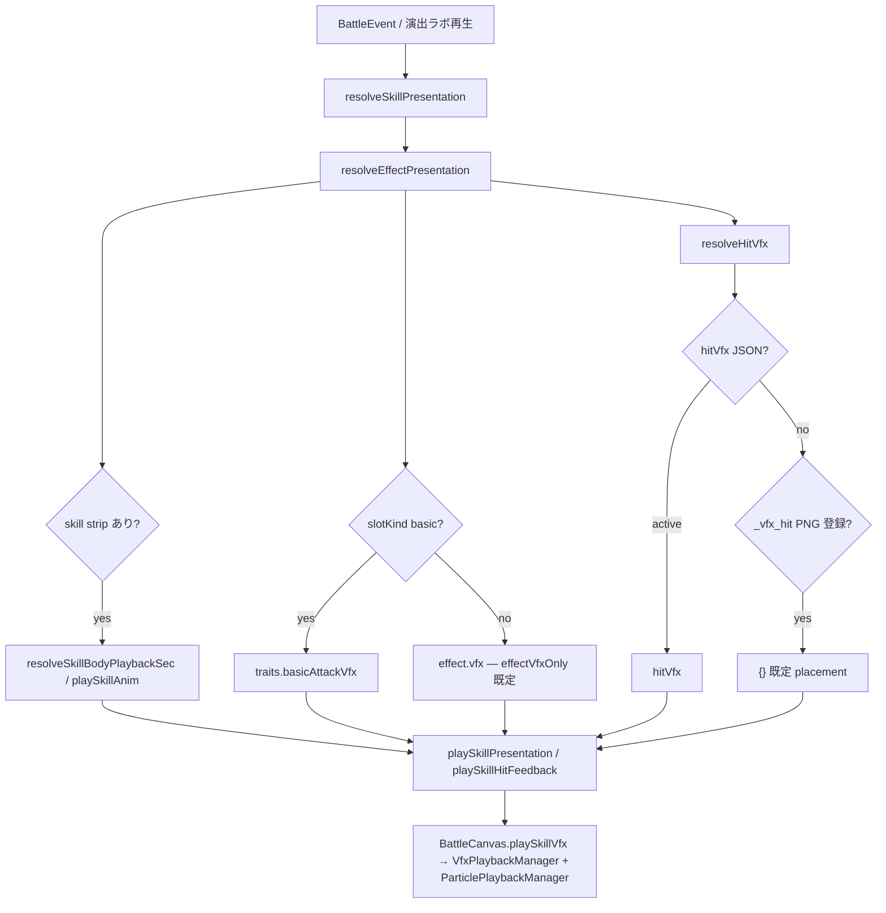

# クラスとスキル

ゲームデータは `data/*.json`。型・スキーマ定数：`src/battle/types.ts`, `src/battle/data/gameDataSchema.ts`。ロード・検証：`loadGameData.ts`, `validateGameData.ts`

**スキルマスタ：** `data/classes.json`（15 クラス）と `data/skills/`（`passives.json` + `actives/<stem>.json`。共有パッシブ + クラス別 basic/active）が本番マスタ。数値バランスは調整対象だが、ID・形状・パッシブ種別はこの仕様に従う。

## データ編集ツールとの同期

スキル JSON スキーマに effect、target、条件、数値フィールド、表示要素などの新しいデータ要素を追加・変更する場合は、`src/editor/SkillEditorStep.ts` と `src/editor/editorApi.ts` からその要素を作成・編集・保存できる状態にする。必要に応じてバリデーション、正規化、既定値、表示名、説明、インポート/エクスポート処理も同じ作業内で更新する。

データ編集ツールで扱えないスキル要素は、一時的な内部実験を除き本番マスタへ追加しない。ゲームルール・データ形状が変わる場合は、関連する spec と `.cursor/rules/skill-data-editor-sync.mdc` の同期ルールに従う。

## 用語（スキル習得 vs 装備）

スキルは **習得した時点で常時使用可能** とし、戦闘用スロットへの付け替え・セット・装備変更の概念は持たない。

| 日本語 | 意味 | コード上のフィールド（例） |
| ------ | ---- | -------------------------- |
| **習得** | LvUP 等でアクティブが使用可能状態になること | `learnedActiveIds` |
| **アクティブ枠** | 習得済みアクティブが常時参加する枠。Lv0=2、Lv10=3、Lv20=4 | `learnedActiveIds` の先頭から枠数分 |
| **装備** | **将来**のアイテム・武器防具など。スキルには使わない | — |

- UI・仕様書・コメントでは「スキルを装備」「スキルをセット」「セット枠」と書かない。
- `equippedActiveSlots` は歴史的互換フィールドとしてのみ扱い、設計上の戦闘参加判定には使わない。新規仕様・新規 UI では使用しない。

### 戦闘用語

| 用語     | 定義                                                                              |
| -------- | --------------------------------------------------------------------------------- |
| **攻撃** | `damage` または `dot` を含むスキル（通常攻撃 `slotKind: basic` 含む）             |
| **反撃** | 攻撃を受けたとき、設定量のダメージを攻撃者へ返す効果。バフ/デバフタグには含めない |

## スキル機能レイヤー

スキル設計の正本は、一般 RPG 的な職業語ではなく **Kill / Flow / Survival** の戦闘機能レイヤーで説明する。
全スキルは、以下のいずれか、または複合として定義する。

| レイヤー | 目的 | スキルが作る構造 |
| -------- | ---- | ---------------- |
| **Kill** | 敵戦力を減算し、撃破条件を成立させる | ダメージ、バースト、確殺ライン、耐性軸への適合 |
| **Flow** | 戦場の優先度・位置・行動ルールを操作する | ターゲット制御、移動制御、戦場分断、時間密度操作 |
| **Survival** | 味方の戦闘継続性を維持する | 被害抑制、回復、バリア、状態異常管理、崩壊防止 |

`defender` / `attacker` / `supporter` などの `role` は、編成 UI・配置既定・表示上の分類であり、スキル設計上の定義には使わない。

# ロール体系設計（v1.0）

---

# 1. UI 上のロール分類（3 大ロール）

本ゲームの全ユニットは、編成 UI・配置既定・表示整理のために以下の 3 ロールへ分類される。
ただし、これは設計定義の正本ではない。スキルと戦闘上の役割は [スキル機能レイヤー](#スキル機能レイヤー) の Kill / Flow / Survival で定義する。

---

## ■ ディフェンダー

### コンセプト

**「味方を守り、戦線を維持するロール」**

攻撃の種類（単体・範囲・分散）に応じて防御の役割を分業し、戦線の安定・主導権・持続性をそれぞれ別軸で成立させる。防御を「硬さ」ではなく「防御対象の違い」で分解する設計。

### 役割

- 被ダメージの吸収
- 前線維持
- 味方の生存補助

### 特徴

- 耐久性能が高い
- 敵の攻撃を受ける前提の設計
- 防御・軽減・保護が主軸
- 内部 3 系統（鉄衛士 / 護法士 / 闘技士）で分化

詳細は **§クラスディフェンダー設計方針** を正とする。

---

## ■ UI ラベル: アタッカー

### コンセプト

**「敵を撃破し戦況を進行させるロール」**

### 役割

- 敵ユニットの撃破
- ダメージソースの中核
- 戦闘進行の推進力

### 特徴

- 最も多様な攻撃手段を持つ
- 近接・遠隔・魔法に分化
- 火力と役割特化の両立
- Kill / Flow / Survival の機能レイヤーで戦闘介入レベルを分類（§2）

---

## ■ UI ラベル: ヒーラー（サポーター）

### コンセプト

**「味方の戦闘継続能力を維持・補助するロール」**

### 役割

- 回復
- バフ・デバフ
- 状態異常対策

### 特徴

- 直接火力には関与しない
- 戦闘の安定性を支える
- 補助・制御寄りの性能

---

# 2. Kill / Flow / Survival レイヤー（スキル戦闘構造）

すべてのスキルは **Kill（撃破処理）** / **Flow（戦場操作）** / **Survival（継続維持）** の 3 層構造で整理する。重要なのは UI ロールの名称ではなく、**戦闘ルールへの介入レベル**と、そのスキルがどの戦闘条件を変えるかである。

各クラスの詳細は、下位のクラス別設計方針を参照する。

---

## ■ Kill Layer（撃破処理層）

### 定義

Kill Layer は、敵 HP を直接減少させることを主目的とする処理層である。戦闘の勝敗は「どれだけ効率よく HP を削れるか」によって決定される。

### 本質

- 敵 HP を減らすための出力処理系
- ダメージの「量」と「適合性」が重要
- 戦場ルールは基本的に変更しない

### 内部分類

#### ① Fixed Kill（固定出力型）

- 魔術士（`at_sorcerer`）

##### 特徴

- 純粋な火力供給
- 状況依存が少ない安定 DPS
- 少数・ボス戦に強い基準火力

> 戦闘における「火力の基準値」

---

#### ② Structured Kill（構造可変型）

- 印術師（`at_sigilist`）

##### 特徴

- スキル構造が戦況で変化
- ダメージ配分や対象構造が最適化される
- 火力そのものではなく「効率」を変化させる
- 付与・支援ではなく、攻撃式と対象形状の条件適応を扱う

> 火力の「形」を再構成する Kill

---

#### ③ Targeted Kill（対象特化型）

- 剣術士（`at_warrior`）
- 双刃士（`at_assassin`）
- 弓術士（`at_ranger`）
- 弩砲士（`at_ballista`）

##### 特徴

- 優先ターゲット依存の設計
- 対象適合性による火力最適化
- 処理対象の選択が戦闘効率を左右する

| クラス | classId       | 優先ターゲット                |
| ------ | ------------- | ----------------------------- |
| 剣術士 | `at_warrior`  | 高 DEF 敵                     |
| 双刃士 | `at_assassin` | 瀕死の敵                      |
| 弓術士 | `at_ranger`   | 遠隔敵                        |
| 弩砲士 | `at_ballista` | Max HP が高い敵（ボス・強敵） |

---

## ■ Flow Layer（戦場操作層）

### 定義

Flow Layer は、戦場そのもののルール・構造・時間軸を操作する処理層である。戦闘の勝敗はダメージ効率ではなく**戦場制御能力**によって影響を受ける。

### 本質

- 戦場のルールそのものを変更する
- 戦闘の空間・時間・構造に干渉する
- HP 削減ではなく「戦闘条件」を操作する

### 内部分類

#### ① Position Flow（戦線制御）

- 槍術士（`at_lancer`）

##### 特徴

- 前線へのバフ・デバフ付与
- 戦線の押し引きを制御
- 戦闘接触ラインの最適化

> 「どこで戦うか」を決定する

---

#### ② Field Flow（局所制御）

- 狩猟士（`at_hunter`）

##### 特徴

- 視界・命中妨害による認知干渉
- 罠による局所行動制御
- 範囲 DoT（時間圧縮型）による戦闘テンポ操作

##### 特徴的要素

- 視界不良による命中低下
- 罠による局所的拘束・妨害
- DoT の残り時間圧縮による戦闘速度変化

> 敵の「行動精度」と「戦闘テンポ」を崩す

---

#### ③ Structure Flow（構造制御）

- 法陣師（`at_geomancer`）

##### 特徴

- ダメージ流量の再配置
- 単体 ⇄ 範囲など攻撃構造の変換
- 味方を含む戦場効率の最適化

> 戦場全体のダメージ構造を再設計する

---

## ■ Survival Layer（継続維持層）

### 定義

Survival Layer は、味方の戦闘継続性を維持し、敗北条件への到達を遅らせる処理層である。

### 本質

- HP / barrier / HoT / dispel / damageTaken / damageDelay などで損失を制御する
- 被害の入口、後処理、状態異常対策を分けて扱う
- “戦線崩壊を遅延・回避する”ための構造を作る

### 内部分類

| 分類 | 主な担当 | 操作しているもの |
| ---- | -------- | ---------------- |
| Defense Control | 鉄衛士 / 護法士 / 闘技士 | 被害の受け口、前線維持、被弾起点の制圧 |
| Recovery Control | 療養師 | 欠損 HP の回復、余剰回復のバリア変換 |
| Stability Control | 結界師 / 薬草師 | バリア、軽減、HoT、解除、長期戦維持 |

---

## ■ 機能レイヤー対比

| 項目     | Kill Layer       | Flow Layer             | Survival Layer |
| -------- | ---------------- | ---------------------- | -------------- |
| 対象     | 敵 HP / 敵戦力   | 戦場ルール             | 味方継続性     |
| 主目的   | 撃破             | 制御                   | 崩壊遅延       |
| 操作対象 | ダメージ量・対象 | 空間・時間・構造       | HP・バリア・軽減・解除 |
| 影響範囲 | 局所〜敵戦力全体 | 戦場全体               | 味方戦線全体   |
| 例       | 魔術士・弓術士   | 槍術士・法陣師・狩猟士 | 鉄衛士・療養師・結界師 |

---

## ■ 全体構造

```text
スキル機能レイヤー構造

├─ Kill Layer（撃破処理）
│   ├─ Fixed Kill（魔術士）
│   ├─ Structured Kill（印術師）
│   └─ Targeted Kill（物理処理群）
│
├─ Flow Layer（戦場操作）
│   ├─ Position Flow（槍術士）
│   ├─ Field Flow（狩猟士）
│   └─ Structure Flow（法陣師）
│
└─ Survival Layer（継続維持）
    ├─ Defense Control（鉄衛士 / 護法士 / 闘技士）
    ├─ Recovery Control（療養師）
    └─ Stability Control（結界師 / 薬草師）
```

### 設計思想

- Kill と Flow は上下関係ではない
- Flow は支援ではなく「戦場ルール操作」
- Kill は単なる火力ではなく「処理設計」
- Survival は UI 上の回復職だけではなく、被害入口・回復・軽減・解除を含む継続維持構造
- 魔法職は Kill 内で「構造変換」に特化する

### 最終定義

- **Kill** = 敵 HP を削る設計
- **Flow** = 戦闘成立条件そのものを設計するレイヤー
- **Survival** = 味方の戦闘継続性を維持し、崩壊を遅延・回避するレイヤー

> Kill は「敵 HP をどう削るか」を設計する層である。Flow は「敵をどう倒すか」ではなく「戦闘がどう成立するか」を設計する層である。Survival は「誰が回復役か」ではなく「敗北条件への到達をどう遅らせるか」を設計する層である。

---

# 3. Kill / Flow 処理群の内部分類

Kill / Flow 主軸のクラスは、攻撃イベント・射程・ダメージ構造により以下の 3 系統に分化する。

---

## ■ ファイター（近接 Kill / Flow）

### コンセプト

**「接近戦で敵の処理対象を担当する近接物理職群」**

攻撃イベントの生成構造と処理対象の違いで役割が分かれる。§3 の 3 系統のうち「単体突破・高速処理」の近接側を担う。

### 役割

- 単体突破（硬い敵の処理）
- 高速処理（低耐久・瀕死の処理）
- 前線での戦闘維持（変則系は戦況制御）

### 特徴

- 近接帯・前列配置
- Hit 数・攻撃回数・時間構造が性能を決定
- 内部 3 系統（剣術士 / 双刃士 / 槍術士）で分化

詳細は **§物理 Kill / Flow 設計方針** を正とする。

---

## ■ シューター（物理遠隔 Kill / Flow）

### コンセプト

**「射撃という行為の時間構造を火力に変換する遠隔 DPS 職群」**

攻撃間隔・回数・制圧状態によって戦闘性能が変化する。単純火力ではなく行動ルール差で役割を分割し、「撃つ・待つ・仕込む」の 3 軸で構成される。

### 役割

- 射撃行為の時間軸による火力設計
- 遠距離からの物理 DPS
- 行動ルール差による役割分担（連射 / 溜め / 制圧）

### 特徴

- 全クラスが異なる時間設計を持つ
- 魔法職とは異なる耐性処理（物理遠隔）
- 内部 3 系統（弓術士 / 弩砲士 / 狩猟士）で分化

詳細は **§物理 Kill / Flow 設計方針** を正とする。

---

## ■ キャスター（魔法 Kill / Flow）

### コンセプト

**「魔法によって戦場の出力・流れ・意味を操作する職群」**

単純な火力職ではなく、ダメージの発生だけでなく流れ・配置・条件適応までを設計対象とする。自動戦闘でも成立する**事前設計型の戦術ロール**。

### 役割

- 魔法ダメージ（単体・範囲）
- 戦況に応じた出力・構造の調整
- 戦闘の「意味」の再解釈（印術師・法陣師）

### 特徴

- 魔法耐性前提の独自ダメージ体系
- 出力だけでなく戦闘構造に干渉
- 内部 3 系統（魔術師 / 印術師 / 法陣師）で分化

詳細は **§クラスキャスター設計方針** を正とする。

---

# 4. Kill / Flow 3 系統の関係性

| 系統       | 主軸       | 役割           |
| ---------- | ---------- | -------------- |
| ファイター | 単体突破   | 近接確殺       |
| シューター | 遠距離制圧 | 物理処理       |
| キャスター | 戦況変化   | 魔法制御＋火力 |

---

# 5. 全体設計思想

## ■ 機能レイヤー設計原則

- Kill＝敵戦力を減算し、撃破条件を成立させる
- Flow＝戦場の優先度・位置・行動ルールを操作する
- Survival＝味方の戦闘継続性を維持し、崩壊を遅延・回避する

---

## ■ Kill / Flow 設計原則

- ファイター＝接近確殺
- シューター＝遠距離制圧
- キャスター＝魔法による構造変化

---

## ■ Survival 設計原則

- 鉄衛士＝単一路線の絶対防衛
- 護法士＝戦場全体の安定
- 闘技士＝被弾起点の制圧

---

# 6. まとめ

本ゲームの戦闘設計は以下の機能レイヤー構造である。

- Survival 内部：鉄衛士 / 護法士 / 闘技士 / 療養師 / 結界師 / 薬草師
- Kill / Flow 下位：ファイター / シューター / キャスター
- シューター内部：弓術士 / 弩砲士 / 狩猟士
- キャスター内部：魔術師 / 印術師 / 法陣師

この構造により、
**戦闘の「撃破・制御・維持」と「近接・遠隔・魔法」の両軸を明確に分離する。**

## UI ロール（3 種）

| UI ロール | 表示・配置上の意味 |
| --------- | ------------------ |
| `defender` | 前列配置と被害入口を担当する表示分類 |
| `attacker` | Kill / Flow 主軸クラスの表示分類。近接帯（`rangePx < 100`）は前列、遠隔帯は後列が既定 |
| `supporter` | Survival 主軸クラスの表示分類。後列が典型 |

`classId` 命名：`{rolePrefix}_{englishSlug}`

| プレフィックス | ロール      |
| -------------- | ----------- |
| `df_`          | `defender`  |
| `at_`          | `attacker`  |
| `sp_`          | `supporter` |

例：`df_guardian`, `at_ranger`, `sp_cleric`

## クラス区分

### クラス設計方針

各ロールは以下の 3 系統で構成される。

#### 基礎

ロール本来の役割に特化した標準クラス。

#### 拡張

ロール本来の役割を維持しながら、
その性能を発展・強化したクラス。

#### 変則

ロール本来の役割に加えて、
別ロールの要素を取り入れた複合クラス。

| 区分               | 現状          | 備考                                            |
| ------------------ | ------------- | ----------------------------------------------- |
| **プレイ可能**     | 15 種（下表） | `data/classes.json` に定義                      |
| **予約フィールド** | なし          | `jobTier` / `promotion` / `promotesFrom` は廃止 |

クラス ID と表示名、ロール、射程、スキル習得は `classes.json` を正とする。将来の追加クラスは同じ形式で拡張する。

### クラスマスタ（15 種）

表示名の英語肩書きは `epithetEn`（UI 表示は Phase 3c 以降）。

#### defender（`df_`）

| classId       | 表示名 | epithetEn | 列    | 射程 | パッシブ（Lv0 代表）             | アクティブ（Lv0）  |
| ------------- | ------ | --------- | ----- | ---- | -------------------------------- | ------------------ |
| `df_guardian` | 鉄衛士 | Guardian  | front | 近接 | 共有 block + 追加 block          | 防御強化／防御専念 |
| `df_paladin`  | 護法士 | Paladin   | front | 近接 | 低 HP 味方への回復量増           | 光の剣／聖盾       |
| `df_duelist`  | 闘技士 | Gladiator | front | 近接 | 低 HP 時 DEF 上昇（`passive_2`） | 戦叫び／体力温存   |

※ ディフェンダー 3 クラス（鉄衛士 / 護法士 / 闘技士）の設計思想・三分類・TBD は **§クラスディフェンダー設計方針** を正とする。

#### attacker（`at_`）

| classId        | 表示名 | epithetEn | 列    | 射程     | パッシブ（Lv0 代表）                          | アクティブ（Lv0）    |
| -------------- | ------ | --------- | ----- | -------- | --------------------------------------------- | -------------------- |
| `at_warrior`   | 剣術士 | Swordsman | front | 近接     | 最高 DEF 狙い + DEF 無視                      | 叩き付け／薙ぎ払い   |
| `at_assassin`  | 双刃士 | Assassin  | front | 近接     | 最低 HP 比率狙い + 回避                       | 引き裂き／影の刃     |
| `at_lancer`    | 槍術士 | Lancer    | front | 近接     | 貫通範囲 近傍 ATK debuff + 近傍 ATK buff aura | 踏み込み突き／足払い |
| `at_ranger`    | 弓術士 | Ranger    | back  | 遠隔物理 | 遠隔敵優先 + 攻撃速度 buff                    | 連射／連ね矢         |
| `at_ballista`  | 弩砲士 | Ballista  | back  | 遠隔物理 | 最高 HP 狙い + （未実装）                     | 重撃態勢／貫く一射   |
| `at_hunter`    | 狩猟士 | Hunter    | back  | 遠隔物理 | — （未実装）                                  | （未実装）           |
| `at_sorcerer`  | 魔術士 | Sorcerer  | back  | 遠隔魔法 | —（未実装）                                   | （未実装）           |
| `at_sigilist`  | 印術師 | Sigilist  | back  | 遠隔魔法 | —（未実装）                                   | （未実装）           |
| `at_geomancer` | 法陣師 | Geomancer | back  | 遠隔魔法 | —（未実装）                                   | （未実装）           |

※ 物理 6 クラス（剣術士 / 双刃士 / 槍術士 / 弓術士 / 弩砲士 / 狩猟士）の設計思想・三分類・TBD は **§物理 Kill / Flow 設計方針** を正とする。

※ 魔法 3 クラス（魔術士 / 印術師 / 法陣師）の設計思想・三分類・TBD は **§クラスキャスター設計方針** を正とする。

※ `at_lancer_passive_1`（牽制）は常時 debuff として再評価する。`at_lancer_passive_2`（連携）は `selfOrigin` + `aoe` の味方 ATK aura。

#### `sp_`（Survival 主軸）

| classId        | 表示名 | epithetEn | 列    | 射程 | パッシブ（Lv0）                                                     | アクティブ（Lv0）                       |
| -------------- | ------ | --------- | ----- | ---- | ------------------------------------------------------------------- | --------------------------------------- |
| `sp_cleric`    | 療養師 | Cleric    | back  | 遠隔 | 低 HP 回復増 + 余剰回復 → バリア（`passive_1` / `passive_2`）       | `sp_cleric_active_1`（癒しの光）のみ    |
| `sp_abjurer`   | 結界師 | Abjurer   | back  | 遠隔 | 高 HP 味方被ダメ軽減 + Wave 開始バリア（`passive_1` / `passive_2`） | `sp_abjurer_active_1`（盾添え）のみ     |
| `sp_alchemist` | 薬草師 | Herbalist | front | 近接 | 常時 HoT aura + 高 HP 味方 DEF buff（`passive_1` / `passive_2`）    | `sp_alchemist_active_1`（薬粉撒き）のみ |

### デモ編成（`parties.json` demo）

| 枠  | classId       | 表示名 |
| --- | ------------- | ------ |
| 1   | `df_guardian` | 鉄衛士 |
| 2   | `at_warrior`  | 剣術士 |
| 3   | `sp_cleric`   | 療養師 |
| 4   | `at_ranger`   | 弓術士 |

未編成の残り 11 クラスは `DEFAULT_ROSTER_EXTRAS.demo` でアンロック（編成画面から選択可）。

詳細な設計方針・Lv 習得表・TBD は **§`sp_` クラス群 Survival 設計方針** を正とする。

## クラスディフェンダー設計方針

ディフェンダーは前列で戦線を維持するロールであり、攻撃形態に応じた**防御対象の分業**で戦場の安定性を成立させる職群。§1 の上位ロールのうち「防御・前線維持」軸を担う。

### 設計思想

攻撃の種類（単体・範囲・分散）に応じて防御の役割を分業し、戦線の安定・主導権・持続性をそれぞれ別軸で成立させる。

- 防御を「硬さ」ではなく**防御対象の違い**で分解する
- 戦線維持・前線構築・制圧を別ロールに分担する
- ステージ構造に応じて編成の意味が変化する設計
- 単体防御だけでなく**戦場全体の安定性**も評価対象に含める

### 三分類と classId

| 系統 | classId       | 表示名 |
| ---- | ------------- | ------ |
| 基礎 | `df_guardian` | 鉄衛士 |
| 拡張 | `df_paladin`  | 護法士 |
| 変則 | `df_duelist`  | 闘技士 |

`formationRow: front`、近接帯。Lv0 / Lv10 / Lv20 の習得パターンは全クラス共通のアクティブ習得構造（Lv0=2、Lv10=3、Lv20=4）を正とする。

### Defender 共通 passive の考え方

Defender 共通の初期 passive は、まず「ブロック能力を持つ」という共通基盤を担う。ただし、Threat の維持方法は Defender 間で同一ではない。

- Guardian は、受け止め続けることで Threat を保持する main tank
- Paladin は、front 全体の被害分担を安定させる shared tank
- Duelist は、被弾を control / counter へ変換する local tank

このため、Defender 共通 passive と各 Defender の Threat 挙動は同一視しない。被弾による Threat 維持・上昇は、必要に応じてクラス固有 passive / skill で明示する。

### 鉄衛士（`df_guardian`・基礎）

#### コンセプト

単一路線に対して絶対的な耐久と押し返し性能を持つ**前線構築型**ディフェンダー。

#### 役割

- 単一路線の完全防衛
- 高 HP による正面受け
- 被弾による前線押し上げ
- 局所的な戦線形成

#### 特徴

- 「ここは絶対に抜かれない」という安心感
- 正面ラッシュに対する圧倒的安定性
- 防御がそのまま前線移動に変わる
- シンプルで分かりやすい前線維持体験

#### 立ち位置

戦場の**物理ラインそのものを作る壁**。

---

### 護法士（`df_paladin`・拡張）

#### コンセプト

単体防御ではなく、範囲攻撃や魔法ダメージを含む戦場全体の被害を緩和し、戦線の安定性を底上げする**補助型**ディフェンダー。

#### 役割

- 範囲・魔法ダメージへの耐性補助
- パーティ全体の耐久補強
- 前衛 Kill / Flow クラスの Survival 補助
- 戦線崩壊リスクの低減

#### 特徴

- どんな編成でも「事故りにくくなる」安心感
- 複数方向からの攻撃に強い安定性
- 単騎でも一定の成立性がある持久力
- 医療や編成依存を軽減する柔軟性

#### 立ち位置

戦線全体の**崩れを吸収する安定装置**。

---

### 闘技士（`df_duelist`・変則）

#### コンセプト

防御性能を持ちながらも攻撃性と制圧能力に重点を置き、単体強敵との戦闘で主導権を握る**攻撃的**ディフェンダー。

#### 役割

- 単体強敵への制圧・拘束
- 被弾を起点とした戦闘優位の獲得
- カウンター・スタン・ノックバックによる行動阻害
- 局所戦闘の制御

#### 特徴

- 殴られるほど戦況が変わる逆転感
- ボス戦での高い存在感
- 敵を止めて崩していく制圧感
- Survival 主軸でありながら制圧・反撃による Kill / Flow 的手触り

#### 立ち位置

戦闘そのものを**崩しながら勝つディフェンダー**。

---

### 三ディフェンダーの役割分担（設計確定分）

| classId       | 個性     | 設計の柱                                               | 他系統との差分                                          |
| ------------- | -------- | ------------------------------------------------------ | ------------------------------------------------------- |
| `df_guardian` | 前線構築 | 単一路線の完全防衛・高 HP 正面受け・被弾による前線押上 | 範囲 / 魔法被害の全体軽減なし。制圧・カウンター主軸なし |
| `df_paladin`  | 戦線安定 | 範囲・魔法ダメージへの耐性補助・パーティ全体耐久       | 単一路線特化の絶対壁ではない。攻撃的制圧は副次          |
| `df_duelist`  | 攻撃防御 | 単体強敵への制圧・拘束・カウンター・行動阻害           | 正面ラッシュ特化の絶対壁ではない。全体安定補助は副次    |

## `sp_` クラス群 Survival 設計方針

`sp_` クラス群は、UI 上は回復・維持系として表示されるが、設計定義では **Survival Layer** の操作点で扱う。
この節では「誰が回復役か」ではなく、味方全滅までの時間をどの構造で延ばすかを正本にする。

### 共通ルール

| 項目 | 内容 |
| ---- | ---- |
| **アクティブ習得構造** | 全クラス共通で Lv0=2、Lv10=+1、Lv20=+1。最大 4 アクティブを常時使用可能 |
| **付け替え** | なし。習得したアクティブは枠上限内で常時戦闘参加する |
| **設計単位** | Recovery / Barrier / Sustain / Dispel / Damage Mitigation などの Survival 操作点 |
| **火力寄与** | Kill / Flow 影響を持つ場合も、主目的が Survival を崩さないことを前提に個別説明する |

### Lv0 / Lv10 / Lv20 習得パターン

| 段階 | アクティブ枠 | 典型内容 |
| ---- | ------------ | -------- |
| Lv0  | 2 | 基礎 Survival 手段 + クラス固有の補助 Survival 手段 |
| Lv10 | 3 | 基礎役割の範囲化・維持化・複数対象化を追加 |
| Lv20 | 4 | 上位 Survival、または Survival 内での高度な複合運用を追加 |

この構造は全クラス共通であり、`sp_` クラス群だけ Lv0 で 1 枠にする例外は廃止する。

### `sp_` クラス群の機能レイヤー分担

| classId | 主レイヤー | Lv0 の柱 | 補助レイヤー |
| ------- | ---------- | -------- | ------------ |
| `sp_cleric` | Survival / Recovery Control | 直接 heal + 低 HP 回復特化 + 余剰回復 → barrier | 過剰回復を barrier に変換する Stability |
| `sp_abjurer` | Survival / Stability Control | 高 HP 味方被ダメ軽減 + Wave 開始 barrier + 直接 heal | 範囲 barrier による崩壊前猶予 |
| `sp_alchemist` | Survival / Sustain Control | HoT aura + 高 HP 味方 DEF buff + active 範囲 HoT / debuff | Flow 寄りの敵 `atk` debuff、状態異常対策 |

この 3 職は同じ「回復役」の数値違いではなく、**どの段階の損失を処理するか** で分担する。

- `sp_cleric` — **欠損後の復元**。大きく減った HP を即時に戻し、戦線崩壊後の損失を回収する
- `sp_abjurer` — **崩壊前の猶予作成**。barrier / 軽減で HP 欠損が致命化する前に余裕を作る
- `sp_alchemist` — **長期維持と継戦リズム調整**。HoT と局所的な被害速度低下で戦線を長く保つ

**療養師（Cleric）参照:** 療養師の主責務は Recovery であり、持続維持や事前軽減ではなく **欠損 HP の即時復元** を正本とする。`sp_cleric_active_2`（広域治療）は単体救命ではなく Recovery の範囲化・維持化に属するため **Lv10 習得** を正とする。Lv20 の上位 Recovery では、大きな被害を受けた味方を即座に立て直す **反応型 heal** を候補とする。現行仕様では、まず A 案として `time` + `firePolicy: smart` + `fireConditions` による待機型即応 heal を許容する。

**結界師（Abjurer）参照:** 結界師は直接 heal も扱うが、主責務は Recovery ではなく Stability である。小回復は barrier / 軽減による保護を実戦で成立させるための補助であり、役割の本体は **崩壊前猶予の作成** にある。

**薬草師（Herbalist）参照:** Lv0 では毒 DoT・scatter 与ダメ・通常攻撃 dmg+heal 同時は載せない。狩猟士との差分は、狩猟士が Flow として罠・DoT 毒で局所戦場を制御するのに対し、薬草師は Survival として HoT sustain、被害低減、状態異常対策を扱う点にある。`traits.rangePx` は近接帯（`rangePx < 100`）で前列配置とするが、これは戦場制御を主目的にしたものではなく、**Survival 主軸内での射程個性の分離** と、**薬草師というフレーバーを長射程 caster 系と分けるための設計** を正本とする。戦闘構造上は、前列 supporter として最前帯の直後に留まり、近接帯の味方へ HoT / sustain を差し込む役割を持つ。`active_1` の敵 debuff は `targetShape: aoe` + `aoeRadiusPx: 70`（最近接敵をアンカーにした範囲）とし、Survival の範囲に留まる **被害量・被害速度の抑制** に限定する。`effect.range` の拡張は使わない。

**バランス目標:** 鉄衛 + 薬草師 90 秒 sim で実効 HP は cleric 比 **上限 75%**。

### 未決・TBD

- `sp_` クラス群: Lv10 / Lv20 で追加する `active_3` / `active_4` の具体設計
- 療養師: Lv20 上位 Recovery を、A 案（`time` + `firePolicy: smart` + `fireConditions`）で先行するか、将来の被ダメ反応 trigger で実装するかの詳細方式

## 物理 Kill / Flow 設計方針

物理 Kill / Flow クラスは近接・遠隔を問わず、敵の**処理対象と戦闘イベント構造**によって役割分担される職群である。§2 Kill / Flow の Targeted Kill・§3 の 3 系統のうち「単体突破・高速処理」を中心に構成される（近接＝ファイター、遠隔＝シューター）。

### 設計思想

物理 Kill / Flow クラスは「ダメージ量」ではなく、**攻撃イベントの生成構造と処理対象の違い**によって役割が分かれる。

- 攻撃は Attack / Hit のイベントとして分離される
- Hit 数・攻撃回数・時間構造が性能を決定する
- 各クラスは「敵の処理方法」を担当する
- 近接・遠隔は実装差であり本質ではない

### 三分類と classId

| 系統         | classId       | 表示名 |
| ------------ | ------------- | ------ |
| 基礎（近接） | `at_warrior`  | 剣術士 |
| 拡張（近接） | `at_assassin` | 双刃士 |
| 変則（近接） | `at_lancer`   | 槍術士 |
| 基礎（遠隔） | `at_ranger`   | 弓術士 |
| 拡張（遠隔） | `at_ballista` | 弩砲士 |
| 変則（遠隔） | `at_hunter`   | 狩猟士 |

`traits.damageType: physical`。近接 3 クラスは `formationRow: front`・近接帯、遠隔 3 クラスは `formationRow: back`・遠隔物理帯。

### 物理 Kill / Flow 共通設計（重要）

物理 Kill / Flow クラスは以下の 2 つの処理軸で分割される。

- **単体突破** — 硬い敵の処理
- **高速処理** — 低耐久・瀕死・遠隔敵の処理

さらに内部的には以下の戦闘構造を持つ。

- **Attack**（行動）
- **Hit**（命中イベント）
- **Skill Gauge**（リソース）

Hit と Attack は分離され、Hit 単位で追加効果やゲージ処理が発生する。

### 剣術士（`at_warrior`・基礎・近接）

#### コンセプト

シンプルな近接単体火力職。安定した攻撃性能で高 DEF の単体敵を確実に処理する。

#### 役割

- DEF 貫通軸の単体処理
- 安定 DPS

#### 処理対象

- 高 DEF 単体敵

#### 立ち位置

近接物理の**標準単体処理職**。

---

### 双刃士（`at_assassin`・拡張・近接）

#### コンセプト

ヒット数とコンボ加速によって戦闘密度を上げる高速連撃型。

#### 役割

- 2 Hit 通常攻撃
- 背後攻撃で Hit 増加
- 攻撃回数回復高速化
- コンボ加速構造
- 優先ターゲット：瀕死の敵

#### 処理対象

- 瀕死の敵

#### 立ち位置

近接物理の**高速処理・フィニッシャー職**。

背後侵入系 move は、処理対象へ一時アクセスするためのものであり、Defender 的な前線保持を意味しない。rear assault 中の立ち位置は Kill 成立のためのアクセス状態として扱い、通常の front line ownership と分けて考える。

---

### 槍術士（`at_lancer`・変則・近接）

#### コンセプト

前線そのものに干渉し、バフとデバフを通じて戦線の“位置と圧力”を制御する**前線指揮型ファイター**。

#### 役割

- 前線へのバフ付与（味方近接の戦闘効率強化）
- 前線へのデバフ付与（敵接触圧の低下・弱体化）
- 近接範囲攻撃による戦線維持
- 戦闘ラインの押し上げ・維持・再形成
- 接敵領域そのものの制御

#### 処理対象

- なし（戦場操作枠）

#### 立ち位置

近接物理における**Position Flow（戦線制御）担当**。  
敵・味方の優先ターゲットに依存せず、「どこで戦闘が発生するか」を決定する戦場制御職。

---

### 弓術士（`at_ranger`・基礎・遠隔）

#### コンセプト

攻撃回数と攻撃速度を軸に、連射によって火力を積み上げるコンボ型遠隔 DPS。

#### 役割

- 攻撃回数依存の火力設計
- 攻撃速度との相互作用
- スキルによる攻撃構造変形（1 Hit → 2 Hit）
- 攻撃回復による回転加速
- 優先ターゲット：遠隔敵

#### 処理対象

- 遠隔敵

#### 立ち位置

遠隔物理の**継続火力・構造変形職**。

---

### 弩砲士（`at_ballista`・拡張・遠隔）

#### コンセプト

フィールド端から端まで届く貫通範囲攻撃によって、Max HP が高い対象（ボス・強敵）を圧殺する攻城射撃職。

#### 役割

- 攻撃間隔依存ダメージ設計
- 重撃態勢（SPD↓ / ATK↑）
- フィールド貫通範囲攻撃
- 高 HP 対象の処理
- 優先ターゲット：Max HP が高い敵

#### 処理対象

- 高 Max HP 単体・貫通ライン上の敵

#### 立ち位置

遠隔物理の**貫通攻城・高耐久処理職**。

---

### 狩猟士（`at_hunter`・変則・遠隔）

#### コンセプト

視界妨害・罠・範囲 DoT（時間圧縮型）によって敵の行動精度と戦闘テンポを崩し、戦場そのものの“進行速度”を制御する制圧型遠隔職。

#### 役割

- 視界・命中干渉による認知妨害（敵のターゲット精度低下）
- 罠設置による局所エリア制御（行動誘導・拘束）
- 範囲 DoT（毒・出血）による持続圧力付与
- DoT の残り時間圧縮による戦闘テンポ操作
- 局所的な戦闘密度のコントロール

#### 処理対象

- なし（戦場操作枠）

#### 立ち位置

遠隔物理の**Field Flow（局所戦場制御）担当**。  
直接的な撃破性能ではなく、敵の行動精度と戦闘速度を崩すことで戦況優位を作る制圧職。

---

### 三物理 Kill / Flow クラスの役割分担（設計確定）

| classId       | 個性     | 設計の柱           | 処理対象       |
| ------------- | -------- | ------------------ | -------------- |
| `at_warrior`  | 単体安定 | DEF 貫通・固定 DPS | 高 DEF 単体    |
| `at_assassin` | 高速処理 | Hit 数・コンボ加速 | 瀕死の敵       |
| `at_ranger`   | 連射変形 | 攻撃回数・遠隔制圧 | 遠隔敵         |
| `at_ballista` | 貫通重撃 | 時間圧縮・貫通範囲 | 高 Max HP 対象 |

※ 槍術士・狩猟士は処理対象を持たず戦場操作枠（変則系）。上表は単体突破 / 高速処理の 4 主軸クラス。

### 未実装・TBD

- 各クラスのスキルツリー詳細設計（Lv10 / Lv20 分岐）
- Hit / Attack / Gauge の厳密な内部仕様ドキュメント化（[combat.md](combat.md) への反映含む）
- 優先ターゲット AI の詳細アルゴリズム（ターゲット選択優先順位ロジック）
- 弩砲士: フィールド貫通ライン仕様、Lv0 `passive_2` 以降の具体設計
- 狩猟士: 範囲 DoT・範囲ノックバック（1.5 秒移動硬直）の combat 実装と `data/skills/` への反映

## クラスキャスター設計方針

キャスターは魔法によって戦闘の**出力・流れ・意味**を操作する職群。§2 Kill / Flow の Fixed / Structured Kill・Structure Flow と §3 の 3 系統のうち「戦況変化」軸を担う。

### 三分類と classId

| 系統 | classId        | 表示名 |
| ---- | -------------- | ------ |
| 基礎 | `at_sorcerer`  | 魔術士 |
| 拡張 | `at_sigilist`  | 印術師 |
| 変則 | `at_geomancer` | 法陣師 |

成長は 3 クラスとも `growthPresetKey: "caster"`（[stats.md](stats.md)）。`traits.damageType: magic`、`formationRow: back`、射程帯は遠隔魔法（参考 `rangePx` 30）。

### 魔術師（`at_sorcerer`・基礎）

#### コンセプト

魔力をそのまま火力へ変換する、**純粋出力型**キャスター。

#### 役割

- 単体・範囲の安定魔法ダメージ
- 魔法耐性前提の基準火力供給
- 継続的な DPS 維持
- 損失のないマルチロックによる少数殲滅性能

#### 特徴

- 状況に左右されない安定出力
- 最もシンプルなダメージ構造
- キャスター火力の**基準ライン**
- **マルチロック** — 対象数不足時でもロック枠が無駄にならず、既存対象へ再配分される。少数戦でも火力ロスが発生しない

#### 立ち位置

戦場に対して**直接ダメージを発生させる**存在。

#### 属性イメージ

**火** — 純粋な破壊エネルギーとしての直感的火力。

---

### 印術師（`at_sigilist`・拡張）

#### コンセプト

対象の条件を読み取り、攻撃式・対象形状・副次効果をより有利な形へ**分岐**させる柔軟適応型キャスター。
印は味方への付与ではなく、攻撃単位に組み込まれる条件式として扱う。

#### 役割

- 対象数・HP 割合・隊列などの戦況条件に応じた効果分岐
- 1 スキルが 2 系統の攻撃効果を持ち、状況に応じて自動的に最適側へ切り替わる
- 付与する状態異常やターゲット形状（単体・範囲・拡散など）の最適化
- 戦況を崩さず、常に攻撃効率が高い側へ寄せる出力調整

#### 特徴

- 条件分岐は対象数・HP 割合・隊列などの**戦術情報**に依存
- 各スキルは 2 種類の攻撃効果を持ち、状況に応じて**自動分岐**
- ランダムではなく**完全に予測可能**な条件型変化
- 回復・支援方向への変化は行わず、**攻撃性能の中で**最適化
- 状態異常・攻撃範囲・ターゲット構造の「攻撃的な解釈変換」に特化
- 構造を変えるのではなく、**攻撃の当て方と効率**を最適化
- Flow のように戦場ルールを変更せず、Kill の範囲で火力の形を再構成する
- 状況対応能力が高く器用だが、攻撃性能は魔術師を超えない

#### 立ち位置

戦況条件を読み取り、攻撃効果を最も有利な形へ調整する**適応型**キャスター。

#### 属性イメージ

**風・地（乾坤）** — 風＝拡散・変化・流動、地＝集中・安定・収束。条件に応じて二方向へ分岐する柔軟性の象徴。

---

### 法陣師（`at_geomancer`・変則）

#### コンセプト

戦場のダメージ配置と流れを再構築し、味方を含む戦闘全体の効率を最適化する**構造操作型**キャスター。

#### 役割

- 敵へのダメージはロスなく集中・分配し、火力効率を最大化する**火力支援**
- 味方へのダメージは被害そのものを軽減・防御値を上げるのではなく、**被害の発生構造**を変えて損失を抑える**防御支援**
- 単体 ⇄ 範囲など攻撃構造の変換
- 戦場全体のダメージ偏りを均質化し、総合的な損失を最小化

#### 特徴

- **領域（法陣）** によって戦場のダメージルールそのものを再定義
- 火力支援は「攻撃・ダメージ増加」ではなく、既存火力の無駄を消し**効率を最大化**
- 防御支援は「防御力上昇・ダメージ軽減」ではなく、ダメージの**分配・転送・集中制御**による損失圧縮
- 攻撃と防御を別軸として扱わず、すべてを**ダメージ流量の最適化問題**として統合
- 味方支援を含む戦闘全体の最適化装置

#### 立ち位置

戦場のダメージ構造を設計し直し、火力は「無駄を消して強く見せる」、防御は「受け方を変えて弱くしない」ことで全体効率を最大化するキャスター。

#### 属性イメージ

**水** — 流れ・循環・再配置としてのダメージ制御。

---

### 三キャスターの役割分担（設計確定分）

| classId        | 個性     | 設計の柱                                           | 他系統との差分                                  |
| -------------- | -------- | -------------------------------------------------- | ----------------------------------------------- |
| `at_sorcerer`  | 純出力   | 安定 DPS・基準火力・マルチロック再配分             | 条件分岐・領域再定義なし                        |
| `at_sigilist`  | 条件適応 | 2 系統効果の予測可能分岐・攻撃効率の最適化         | 回復/支援分岐なし。構造は変えず当て方を最適化   |
| `at_geomancer` | 構造操作 | 法陣によるダメージ流量の再配置・味方含む全体最適化 | ATK/DEF buff ではなく分配・転送・集中で損失圧縮 |

### 未実装・TBD

- 印術師: 条件分岐スキルの `fireConditions` / effect 分岐の具体 JSON
- 法陣師: 味方ダメージ分配・転送、地点指定範囲の combat 実装と `data/skills/` への反映
- 3 キャスター: Lv0 / Lv10 / Lv20 枝・属性（火 / 風地 / 水）と VFX の対応

## 配置

`formationRow` で列を決定：`front` → `back`（左＝敵側）。正本は `classes.json` の各クラス `formationRow`。

**列の既定：**

| ロール     | `formationRow`                                                         |
| ---------- | ---------------------------------------------------------------------- |
| `defender` | `front`                                                                |
| `attacker` | 近接帯（`rangePx < 100`）→ `front`、遠隔帯（`rangePx >= 100`）→ `back` |
| `supporter` | `back`（**例外:** `sp_alchemist` は近接帯のため `front`）              |

敵のデフォルトターゲットは射程内でヘイト最大（[combat.md](combat.md) の Threat 節）。近接 Kill / Flow クラスが前列にいても、`defender` UI ロールがヘイトを引きつける想定。

同一 `formationRow` 内の X 深度（左＝後方、右＝前方）は [battle-field.md](battle-field.md) §2.6（`partyFormation.ts` の近接帯深度）を正とする。

味方の heal / move 向け `closestAlly` は **battleX 距離**が最小の味方。敵の `closestAlly` は **ヘイト加重抽選**（[combat.md](combat.md) の Threat 節）。

### EntityTraits（PC・敵共通）

`classes.json` / `enemies.json` の `traits`（省略可。ロード時に正規化）:

| フィールド       | 省略時                                                                                                                                                                                                                                          |
| ---------------- | ----------------------------------------------------------------------------------------------------------------------------------------------------------------------------------------------------------------------------------------------- |
| `rangePx`        | `0`（分類用: 0〜99 は近接帯、100 以上は遠隔帯）                                                                                                                                                                                                 |
| `damageType`     | `physical`                                                                                                                                                                                                                                      |
| `basicAttackVfx` | 省略時は未設定。**通常攻撃（`slotKind: basic`）専用**の PNG VFX 定義（`SkillVfxDef`）。`enabled` / `placement` / strip フェーズ。対応 PNG は `sheets/vfx/{entityId}_basic_attack_vfx.png`。effect `vfx` や skill `vfx` にはフォールバックしない |

`basicAttackSkillId` は省略可（`{entityId}_basic_attack`）。通常攻撃スキルはロード時に合成。`data/skills/actives/` に同名 ID があれば `name` / `atkScale` / `interval` 等のみ上書き可（`range` / `damageType` / `vfx` は traits 正）。

## スプライト・演出アセット

アセットパス・寸法の詳細は [sheets/README.md](../../src/assets/sprites/sheets/README.md)。フェーズ計画は [phase-roadmap.md](../plans/phase-roadmap.md) Phase 5 / 6。

### entity 本体（idle / move / death）

- **1 枚 PNG / entity:** `sheets/bodies/{classId|enemyId}.png`
- **レイアウト正本:** `data/entityAnimLayout.json` — 味方・敵 **共通**（idle 4 / move 4 / death 3 コマ、各 48×48、fps 8）
- **attack は entity に含めない** — 振り・弓引き等はすべてスキル strip
- **実装:** `src/render/entityAtlas.ts`（layout 読込・矩形計算・body preload）、`drawSpriteFrameAtFootAnchor`（bodies atlas 優先）。未配置時は旧 `sheets/{id}/{anim}.png` または静止画フォールバック

### スキル body（通常攻撃 + 全 active）

- **配置:** `sheets/skills/{skillId}.png` または `{skillId}_{effectIndex}.png`
- **1 コマ:** 64×48 px（横 strip）。通常攻撃 `{entityId}_basic_attack` も同規格
- **解決:** `resolveSkillAnimKey` → あれば **skill anim**。entity `attack` フォールバックは使わない（本番）
- **先頭 idle 参照コマ:** strip 0 コマ目に entity idle 0 と同絵を入れてよい。再生は effect **`animStartFrame`**（default `0`、idle 入りなら `1`）から（**実装済み:** `skillAnimPlayback.ts` / `SpriteAnimator`）
- **3 段再生（intro / hold / outro）:** effect に **`animLoopFrame`** を指定すると有効。`animIntroEndFrame`（省略時 = loop 開始）、`animLoopEndFrame`（省略時 = loop 開始）、`animOutroStartFrame`（省略時 = loop 終了 + 1）。hold 中は loop 開始〜終了コマをループ。hold 時間は `resolveSkillBodyPlaybackSec` が正本で、現時点では `useDurationSec > 0` のときのみ hold を積む（`skillAnimPlayback.ts`）

### スキル VFX（PNG strip + パーティクル）

- **配置:** `sheets/vfx/{skillId}_vfx.png` または `{skillId}_{effectIndex}_vfx.png`（命中用は `_vfx_hit` サフィックス）
- **1 コマ:** **64 × 64 px**（`VFX_ANIM_CELL_WIDTH` / `VFX_ANIM_CELL_HEIGHT`）。body strip（64×48）より高い
- **解決:** `resolveVfxAnimKey(skillId, effectIndex, kind)` — index 付き → 無 index。通常攻撃は `{entityId}_basic_attack_vfx`（= `{entityId}_basic_attack` スキル ID の `_vfx`）
- **再生:** `vfxAnimPlayback.ts`（`resolveVfxPlaybackSec` / `resolveVfxPlacement`）→ `VfxPlaybackManager`（`spawn` / `tick` / `draw`）。フェーズ計算は `skillAnimPlayback.ts` と共有
- **パーティクル:** `SkillVfxDef.particles` — preset レジストリ（`particlePresets.ts`）+ JSON 上書き（`particlePresetResolve.ts` が `count` / `durationSec` / `delaySec` / `tint` をマージ）。`resolveParticlePlaybackSec` は `presentationLock` と演出ラボの timeline `particleSec` 用秒数で、`delaySec` も含める。`particles.placement` は未指定時に親 `SkillVfxDef.placement` を継承。`ParticlePlaybackManager.spawn(instanceId, worldPos, layer, VfxParticleDef, presetDefaults)` が `tick` / `draw` で Canvas 2D 再生（外部ライブラリなし）。PNG と同時 spawn 可。PNG 未配置でも particles のみ再生可
- **preset:** コード正本（`PARTICLE_PRESET_IDS`）。`kind` は `particles` / `ring` / `composite`（拡張可）。単体中回復の標準は `heal_normal`（同一 composite = 拡散リング + 少数の大きな緑 `+` 上昇）。`cross` shape は 1 粒子で縦横両腕を描く。同時 emitter 数・粒子数は Manager 定数で cap。新 preset は `particlePresets.ts` + validate 同期
- preset 一覧: `heal_minor`, `heal_normal`, `heal_major`, `heal_cast`, `heal_area`, `heal_party`, `heal_major_party`
- エンジンは正円リング固定中心のみ（楕円・上昇リング未対応）。
- 回復系の推奨: 直接 heal の命中表現は `hitVfx` に `particles` を載せる。`preset: heal_normal` と `placement: { anchor: 'target', layer: 'front' }` のように胴体中心へ寄せると、PNG strip を主形、粒子を余韻として分離しやすい。
- 回復系 preset 使い分け表:

| preset             | 用途           | 対象 / アンカー     |
| ------------------ | -------------- | ------------------- |
| `heal_minor`       | 小回復単体     | `hitVfx` / `target` |
| `heal_normal`      | 中回復単体     | `hitVfx` / `target` |
| `heal_major`       | 大回復単体     | `hitVfx` / `target` |
| `heal_cast`        | 詠唱フラッシュ | `vfx` / `footActor` |
| `heal_area`        | 範囲回復       | `vfx` / `footActor` |
| `heal_party`       | 全体回復       | `vfx` / `footActor` |
| `heal_major_party` | 大全体回復     | `vfx` / `footActor` |

- 回復 hitVfx 推奨 anchor は target（胴体中心オーラ）
- **非推奨 VFX フィールド（validate 拒否）:** `preset` / `arc` / `durationMs`（Phase 6 以前の Canvas preset VFX）

- **配置:** `vfxPlacement.ts` の `resolveVfxWorldPosition` — `footActor` / `footTarget` は entity 足元中央を 64×64 VFX の下辺中央に合わせる。`particles.placement` 省略時は親 `vfx.placement` を継承
- **描画:** `spriteFrameDraw.drawVfxFrameAtAnchor` — `BattleCanvas.playSkillVfx`（`layer` behind → entities → front）。パーティクルも同一 layer 順
- **再生フェーズ:** body と同型の **`AnimPhaseFields`**（`animStartFrame` 〜 `animOutroStartFrame`）。`applyFrame` は body strip の絶対コマ基準のまま（VFX 側の `animStartFrame` は VFX strip 内）
- **配置 JSON:** `vfx.placement` — `anchor`（`actor` / `target` / `between` / `footActor` / `footTarget`）、`offsetX` / `offsetY`、`layer`（`behind` / `front`）
- **命中 VFX:** effect **`hitVfx`**（main `vfx` とは別 PNG・別 `placement` 可）。JSON 省略時は `_vfx_hit` PNG が登録されていれば `{}`（既定 placement）で再生

### 通常攻撃の見た目

| 条件                                           | body            | VFX                                                                                     |
| ---------------------------------------------- | --------------- | --------------------------------------------------------------------------------------- |
| `sheets/skills/{id}_basic_attack.png` **あり** | skill anim 再生 | `traits.basicAttackVfx` + `sheets/vfx/{id}_basic_attack_vfx.png`                        |
| body PNG **なし**                              | なし            | `basicAttackVfx` と `_basic_attack_vfx.png` が揃えば VFX のみ。どちらも無ければ演出なし |

**遠隔**（`rangePx >= RANGED_ATTACK_MIN_PX`）も同じ。弓引き PNG を置けば body 再生する。VFX strip も `sheets/vfx/` に配置する。

### 演出解決（コード）

**ラボ保存 JSON = 実戦正本。** 演出ラボ（`presentation-lab.html`）で編集・保存した `data/skills/actives/*.json` および `classes.json` / `enemies.json` の `traits.basicAttackVfx` が、そのまま戦闘の見た目・タイミングの正本。ラボ専用の上書き JSON や別解決経路は持たない。

Battle イベント → `resolveSkillPresentation` / `resolveEffectPresentation` → skill anim 優先 → PNG VFX。戦闘（`BattleView` / `SkillExecutor`）とラボ（`PresentationPreviewRunner` / `computePresentationTimeline`）は次を**同一関数**で共有する:



| 用途             | 共有関数                                                                          |
| ---------------- | --------------------------------------------------------------------------------- |
| VFX 解決         | `resolveSkillPresentation`（内部で `resolveEffectPresentation`）                  |
| コンテキスト構築 | `buildSkillPresentationContext`（ラボは `buildSkillVfxContext` — 同一フィールド） |
| 命中遅延         | `resolveEffectApplyDelaySec`（`applyFrame` → 秒）                                 |
| ヒット VFX 再生  | `playSkillHitFeedback`                                                            |
| body 再生秒数    | `resolveSkillBodyPlaybackSec`                                                     |
| 表示ロック秒数   | `resolvePresentationLockSec`（タイムライン表示用）                                |

**`effectVfxOnly` ポリシー（戦闘・ラボ共通、既定 `true`）:** アクティブ等（`slotKind !== 'basic'`）では **effect に明示した `vfx` / `hitVfx` のみ**再生する。`skill.vfx` へのフォールバックはしない（レガシー JSON の skill 直下 `vfx` は新規演出では使わない）。**通常攻撃**（`slotKind: basic`）は effect `vfx` を見ず **`traits.basicAttackVfx` のみ**（未設定なら VFX なし）。`presentationLock` の秒数計算だけ `effectVfxOnly: false` で skill 直下 `vfx` を含めうる（[combat.md](combat.md) 参照）。

調整 UI は **演出ラボ**（`PresentationPreviewRunner` — Canvas プレビュー + VFX 統合。BattleEngine 非依存）。同一 skill JSON に対し `vfxSec` / `applyDelaySec` は `presentationTimeline.test.ts` で戦闘 resolver との一致をテスト固定する。

### 射程

| スキル種別                 | `effect.range`                              |
| -------------------------- | ------------------------------------------- |
| **通常攻撃**（合成 basic） | effect に書かない（`actor.traits.rangePx`） |
| アクティブ等               | 任意。省略時 = `actor.traits.rangePx`       |

**設定上限:** `traits.rangePx` および `effect.range` は `0〜CONFIGURABLE_RANGE_PX_MAX` px（`rangeLimits.ts`: `CANVAS_W - PARTY_FORMATION_LEFT_ANCHOR`）。

分類用途では `RANGED_ATTACK_MIN_PX`（100）を使う。`traits.rangePx >= RANGED_ATTACK_MIN_PX` で遠隔攻撃（`rangedAttackingEnemy`）とし、`traits.damageType === 'magic'` で `magicAttackingEnemy`。

距離用途では [battle-field.md §2.5](./battle-field.md#25-攻撃位置move新軸) の `effectiveRangePx` 共通式を使う。`0〜MELEE_RANGE_MAX_PX` は近接帯（slash VFX）で、停止位置や移動量の計算に 100px 境界は使わない。

**クラス `rangePx`（参考）：** 双刃士/闘技 0、鉄衛/護法 5、剣術 8、槍術 24、魔法 30、物理レンジ 40。

## クラスステータスと成長（Phase 4）

`classes.json` の `ClassPreset` に加え、各クラスは次を定義する。

```typescript
type GrowthTier = 1 | 2 | 3; // UI: 低 / 中 / 高

interface GrowthTierSet {
  maxHp: GrowthTier;
  atk: GrowthTier;
  def: GrowthTier;
}

// ClassPreset（抜粋）
maxHp: number;   // Lv1
atk: number;
def: number;
reg: number;     // 固定（成長なし）。許容値: 0, 5, 10, 15, 20
growthTier: GrowthTierSet;
growthPresetKey?: "attacker" | "caster"; // 魔術系（at_sorcerer 等）の成長合成
attackSpeedTier?: AttackSpeedTier;       // 未指定 = normal
epithetEn?: string;   // 英語肩書き（UI 未接続）
passiveIds?: string[]; // クラス固有パッシブ（`data/skills/passives.json` への参照）
```

- 成長の実数解決・`growthPresets` 表・術師合成ルール → [stats.md](stats.md)
- 開発 GUI（`ClassEditorStep`）で Lv1 / 成長段階 / SPD を編集可能

## スキル枠

| 枠          | 数      | 出所                                                      | UI                 |
| ----------- | ------- | --------------------------------------------------------- | ------------------ |
| **basic**   | 1       | `ClassPreset.basicAttackSkillId`                          | 非表示             |
| **passive** | 0〜複数 | `ClassPreset.passiveIds` → `learnedPassiveIds` に自動反映 | 将来               |
| **active**  | 最大 4  | `build.learnedActiveIds`（習得即戦闘参加）                | HUD 2×2 リキャスト |

- 基本攻撃も `data/skills/actives/` に `{entityId}_basic_attack` として定義し、`slotKind: 'basic'` で実行。
- 基本攻撃 ID はアクティブ習得枠に含めない。
- 全クラス共通で Lv0 にアクティブ 2 種、Lv10 に 1 種、Lv20 に 1 種を習得する（合計最大 4）。
- 戦闘エンジンは **習得済みアクティブを最大 4 枠まで**自動参加（段階解放: Lv0=2 / Lv10=3 / Lv20=4）。
- 付け替え・セット・装備変更は行わない。`equippedActiveSlots` は歴史的互換フィールドであり、本番戦闘・新規 UI・新規仕様では使用しない。

### LvUP 習得データ

- `classes.json` の `skills[]` にレベル別 `skillIds` を定義（**passive ID は `passiveIds` のみ**。`skills[]` に入れない）。
- `passiveIds` は Lv に関係なく常時有効（`resolveLearnedSkills` が `learnedPassiveIds` へ展開）。

## ビルドルール

```typescript
interface CharacterBuild {
  learnedPassiveIds: string[]; // すべて同時発動
  learnedActiveIds: string[]; // 習得済みアクティブ（最大 4。Lv0 / Lv10 / Lv20 で増加）
  equippedActiveSlots: string[]; // 歴史的互換のみ。設計上は使用しない
}
```

- **パッシブ：** `learnedPassiveIds` の全 ID が同時に有効（枠上限なし）
- **アクティブ：** `learnedActiveIds` のうち Lv に応じた枠数までが戦闘に自動参加し、発動条件を満たしたときに自動発動

### アクティブの発動条件（`trigger`）

| フィールド       | 説明                                                                                                                                                                                                               |
| ---------------- | ------------------------------------------------------------------------------------------------------------------------------------------------------------------------------------------------------------------ |
| `trigger.kind`   | `time`（秒）／`basicAttackCount`（通常攻撃回数）／`hitsTaken`（被攻撃回数）                                                                                                                                        |
| `trigger.value`  | 条件の閾値 N。ステージ開始時 `remaining = N`（ゲージ未充填）。カウントトリガーは N 回のイベントで `remaining === 0`（ゲージ Max）となり、N+1 回目で発動・`remaining = N` にリセット。時間トリガーは 0 到達で即発動 |
| `useDurationSec` | optional。SkillHold 時間（秒）。スキルデータ層では「このスキルは hold / channel / commit time を持つ」という宣言のみを担う。省略 / `0` = 即時。デバフではない。発動後の busy 判定、basic CD / active CD / イベントゲージ停止、残時間管理は戦闘エンジン層の責務（詳細は [combat.md](combat.md)）        |
| `firePolicy`     | optional。`immediate`（既定）／`smart`（条件成立まで発動保留）                                                                                                                                                     |
| `fireConditions` | `firePolicy: smart` 時の AND 条件（[combat.md](combat.md)）                                                                                                                                                        |
| `fireTimeoutSec` | smart 保留の最大秒。経過後は条件無視で発動                                                                                                                                                                         |
| `maxCharges`     | optional。保持ストック上限（0〜3）。省略 = **0**（保持なし）                                                                                                                                                       |

### パッシブ `skillPropertyOverride`（多段チャージ）

| フィールド                      | 説明                                                       |
| ------------------------------- | ---------------------------------------------------------- |
| `effect: skillPropertyOverride` | 対象アクティブの属性を上書き                               |
| `maxChargesBonus`               | 対象スキルの `maxCharges` 加算（上限 3 でクリップ）        |
| `skillPropertyTargetSkillIds`   | optional。対象アクティブ ID（未指定 = 習得アクティブ全体） |

- `basicAttackCount` — ステージ開始時 `remaining = value`（未充填）。**通常攻撃のダメージが発生するたび**、習得済みの全 `basicAttackCount` アクティブがそれぞれ `remaining--`（`remaining > 0` のとき。多段通常攻撃はダメージごとにカウントし、攻撃枠単位ではまとめない。回避時は進まない）。2 段通常攻撃なら 1 回の攻撃枠で各スキルとも 2 カウント（例: 8 必要なら 1,2 → 3,4 → …）。N 回目でゲージ Max（発動せず）、**N+1 回目の通常攻撃枠でアクティブ発動**（通常攻撃の代わり）
- `hitsTaken` — 被ダメ（`hurt`）のたび `remaining--`（`remaining > 0` のとき）。N 回目でゲージ Max（発動せず）、**N+1 回目の被弾でアクティブ発動**（ダメージは通常通り）
- **通常攻撃** は従来どおり JSON の `interval`（時間のみ）+ `attackSpeedTier` / SPD
- レガシー JSON の `interval` はアクティブでも `trigger: { kind: "time", value: interval }` として読み込む

```json
{
  "id": "at_warrior_active_1",
  "trigger": { "kind": "basicAttackCount", "value": 4 },
  "effect": [ ... ]
}
```

### スキルアイコン（`iconKey`）

`passives[]` / `actives[]` の各エントリに optional で指定。PNG は `src/assets/skill-icons/{iconKey}.png`。

| 優先                                                                                 | 未指定時の表示                                   |
| ------------------------------------------------------------------------------------ | ------------------------------------------------ |
| 1. `iconKey`                                                                         | カスタム PNG（glob 自動登録）                    |
| 2. `allowedClassIds[0]`                                                              | 該当クラスの role / `attackRange` プレースホルダ |
| 3. UI コンテキストの所属クラス                                                       | 同上                                             |
| 4. `id` の role プレフィックス（`df_*` / `at_*` / `sp_*`、レガシー `defender_*` 等） | 同上                                             |
| 5. 上記いずれも不可                                                                  | `supporter_placeholder`                          |

### バフ・デバフ・HoT・バリア仕様一覧

戦闘中にユニットに付与される、または常時適用されるステータス効果（StatusEffect）および持続効果の一覧と仕様です。詳細な計算式や挙動は `docs/spec/combat.md` を参照してください。

#### 1. バフ（Buff）

味方のステータスを強化、または特殊な防御効果を付与する効果です。

| サブ種別 (`buffSubKind`) | 対象・効果                                                            | 主なパラメータ                                    | 重複・スタックルール                                                | 備考                                                                                                                                 |
| :----------------------- | :-------------------------------------------------------------------- | :------------------------------------------------ | :------------------------------------------------------------------ | :----------------------------------------------------------------------------------------------------------------------------------- |
| `stat`                   | ステータス（`atk`, `def`, `reg`, `damageTaken`, `attackSpeed`）の上昇 | `buffStat`<br>`buffMultiplier`<br>`buffFlatBonus` | `multiplier` は乗算、`flatBonus` は代数和。持続時間は長い方を優先。 | `damageTaken` の減少（被ダメ軽減）や `attackSpeed`（攻撃速度）の上昇もこれに含みます。                                               |
| `barrier`                | ダメージを身代わりに受けるバリアを付与                                | `ResourceAmountSpec`                              | 既定は `barrierHp` に加算。`barrierStack: false` で新量に置換。     | 持続時間制限なし（消費されるまで維持）。詳細は後述の「バリア」参照。                                                                 |
| `block`                  | 物理直接ダメージのブロック率を上昇                                    | `chance`（0〜1）                                  | 複数ソースは加算（上限 1.0）。                                      | 成功時、DEF 適用後の物理直接ダメージを一定割合カット。DoT は対象外。                                                                 |
| `evasion`                | 直接ダメージ（物理/魔法）の回避率を上昇                               | `chance`（0〜1）                                  | 複数ソースは加算（上限 1.0）。                                      | 成功時、直接ダメージを完全に無効化。DoT は対象外。                                                                                   |
| `damageDelay`            | 一部ダメージ後払い                                                    | `ratio`, `buffDurationSec`                        | 複数ソースは `ratio` 加算（上限 1.0）。遅延プールは加算。           | 軽減ではない。Block 後の確定ダメージを分割し、遅延分は DEF/REG/Barrier/Block/Evasion を再適用しない。詳細は [combat.md](combat.md)。 |

- **通常攻撃変形 (`basicAttackTransform`)**: 自身に付与する特殊バフ。バフ持続中、通常攻撃（`slotKind: basic`）の性能を上書き・追加効果をマージします（複数付与時は最新 1 件のみ有効）。

#### 2. デバフ（Debuff）

敵のステータスを弱体化、または行動を阻害する効果です。

| サブ種別 (`debuffSubKind`) | 対象・効果                                                            | 主なパラメータ                                          | 重複・スタックルール                                                | 備考                                                                                     |
| :------------------------- | :-------------------------------------------------------------------- | :------------------------------------------------------ | :------------------------------------------------------------------ | :--------------------------------------------------------------------------------------- |
| `stat`                     | ステータス（`atk`, `def`, `reg`, `damageTaken`, `attackSpeed`）の低下 | `debuffStat`<br>`debuffMultiplier`<br>`debuffFlatBonus` | `multiplier` は乗算、`flatBonus` は代数和。持続時間は長い方を優先。 | `damageTaken` の増加（被ダメ UP）や `attackSpeed` の低下（スロウ）もこれに含みます。     |
| `dot`                      | 持続ダメージ（Damage over Time）を付与                                | `ResourceAmountSpec`                                    | 同一効果は持続時間の長い方を優先。                                  | 1 秒ごとにダメージを再計算（付与時の ATK バフ等の変動をリアルタイムに反映）。            |
| `stun`                     | 行動不能（CC）状態にする                                              | `durationSec`（上限 5 秒）                              | 持続時間の長い方を優先。                                            | 使用者として通常攻撃・アクティブ発動・ターゲット選択不可。CD は停止しない。 |
| `freeze`                   | 時間停止系拘束（予約概念）                                            | 未定                                                   | 未定                                                               | CD 停止が必要な場合は stun ではなく別状態として定義する。現行 JSON では未使用。 |

#### 3. 持続回復（HoT - Heal over Time）

時間経過とともに味方の HP を継続的に回復する効果です。

| 定義方法                                          | 対象・効果                                  | 主なパラメータ                                     | 重複・スタックルール                 | 備考                                                                |
| :------------------------------------------------ | :------------------------------------------ | :------------------------------------------------- | :----------------------------------- | :------------------------------------------------------------------ |
| **アクティブ** (`type: heal`, `healSubKind: hot`) | 対象に HoT 状態を付与し、持続回復を行う     | `ResourceAmountSpec`<br>`durationSec`              | 同一効果は持続時間の長い方を優先。   | 1 秒ごとに回復量を再計算（使用者のリアルタイムな ATK 変動を反映）。 |
| **パッシブ** (`effect: heal`, `healSubKind: hot`) | 常時、または Stage/Wave 開始時に HoT を適用 | `ResourceAmountSpec`<br>`hotDurationSec`（0=無限） | パッシブの対象解決ルールに従い同期。 | 薬草師の「常時 HoT aura」などがこれに該当します。                   |

- **被回復量増加**: 対象がパッシブ `healReceivedIncrease` を持っている場合、直接回復だけでなく HoT の毎秒 tick 回復量も `floor(量 × (1 + percent合算))` で増加します。

#### 4. バリア（Barrier）

HP とは別の `barrierHp` プールを作成し、ダメージを肩代わりする効果です。

| 項目              | 仕様                                                                                                                                  | 備考                                                                         |
| :---------------- | :------------------------------------------------------------------------------------------------------------------------------------ | :--------------------------------------------------------------------------- |
| **付与方法**      | ・アクティブ: `type: barrier` または `effect: buff`（`buffSubKind: barrier`）<br>・パッシブ: `effect: buff`（`buffSubKind: barrier`） | 効果量は `ResourceAmountSpec`（heal と同式）で決定されます。                 |
| **スタック**      | 既定は既存の `barrierHp` に**加算**。`barrierStack: false` で新量に**置換**（既存残量は破棄）。                                       | maxHp を超えていくらでも付与可能です。                                       |
| **持続時間**      | 時間切れなし。**ダメージで消費されるまで維持**されます。                                                                              | ステージクリアや Wave 跨ぎでも維持されます。                                 |
| **ダメージ吸収**  | 被ダメージ時、HP より先にバリアが消費されます（直接ダメージ・DoT 共通）。                                                             | `barrierHp` が減少し、バリアで防ぎきれなかった超過分のみが HP から減ります。 |
| **HP 割合の参照** | HP 割合（`hp / maxHp`）の計算時, `barrierHp` は**含めません**。                                                                       | 満タン HP ＋大バリアでも HP 割合は 1.0 となります。                          |
| **余剰回復変換**  | パッシブ `excessHealToBarrier` により、直接回復の超過分をバリアに変換。                                                               | 変換されたバリアは**置換**（`barrierStack: false`）として適用されます。      |

### パッシブ効果（`PassiveEffectKind`）

共有パッシブは `data/skills/passives.json` に定義し、クラスは `passiveIds` で参照する。

| effect                  | 主なフィールド                                                                                                                                              | 挙動                                                                                                                                                                                                                                                              |
| ----------------------- | ----------------------------------------------------------------------------------------------------------------------------------------------------------- | ----------------------------------------------------------------------------------------------------------------------------------------------------------------------------------------------------------------------------------------------------------------- |
| `targetRuleOverride`    | `targetRuleOverride`, `targetRuleOverrideApplyTo?` (`enemy` / `ally`)                                                                                       | effect のターゲット陣営とスコープが一致するときだけ `targetRuleOverride` で上書き（`enemy` = 敵向け effect・通常攻撃・接近、`ally` = 味方向け effect。`kind: self` は常に除外。複数時は配列の後ろ優先）                                                           |
| `specialEffect`         | `specialEffectApplyTo`, `specialEffect`                                                                                                                     | 条件付き特効倍率。`damage` = 与ダメ、`heal` = 被回復（直接 heal のみ、HoT 非対象）。`conditions: []` は無条件で `scale` 適用                                                                                                                                      |
| `buff`                  | `buffSubKind`, `buffTargetRule`, `buffTargetShape?`, `buffRange?`, 形状別フィールド, `chance?`, `buffStat?`, `ratio?`, `periodicTrigger?` 等                | **常時**（未指定時。barrier は除く）または **Stage/Wave 開始時**（`stageStart` / `waveStart`）。ターゲット形状・射程はアクティブ `buff` effect と同型（接頭辞 `buff`）。`buffSubKind`: `stat` / `barrier` / `block` / `evasion` / `damageDelay`                   |
| `debuff`                | `debuffSubKind`, `debuffTargetRule`, `debuffTargetShape?`, `debuffRange?`, 形状別フィールド（`debuffAoeRadiusPx` 等）, `debuffStat?`, `periodicTrigger?` 等 | **常時**（未指定時）または **Stage/Wave 開始時**（`stageStart` / `waveStart`）。ターゲット形状・射程はアクティブ `debuff` effect と同型（接頭辞 `debuff`）。現行 `debuffSubKind`: `stat` / `dot` / `stun`。`freeze` は予約概念で、現行 JSON では未使用                                                              |
| `counter`               | `chance`, `counterResponses[]`, `counterRange?`                                                                                                             | 常時受付。被 `damage` / `dot` で HP に入ったダメージがあるたび、射程内なら `chance` を判定し、成功時に `counterResponses` を攻撃者へ直接適用（反撃 StatusEffect は付与しない）                                                                                    |
| `damageReduction`       | `damageReductionPercent`, `damageReductionTargetRule`, `damageReductionTargetShape?`, `damageReductionRange?`, 形状別フィールド                             | 対象に常時被ダメ軽減を付与（戦闘開始時同期）。ターゲット形状・射程はアクティブ effect と同型（接頭辞 `damageReduction`）                                                                                                                                          |
| `defenseIgnore`         | `defenseIgnore`                                                                                                                                             | 与ダメ時の DEF / REG 無視（`damage` / `dot` でも effect 単位で指定可）                                                                                                                                                                                            |
| `periodicDispel`        | `periodicTrigger`, `dispelTriggerLimit?`, `dispelTargetRule`, `dispelTargetShape?`, `dispelRange?`, 形状別フィールド, `dispelCount`, `dispelTags?`          | Stage/Wave 開始時、または **対象がデバフを受けた時**（`onDebuffReceived`）にデバフ解除。`dispelTriggerLimit` = 1 Wave 内の発動上限（未指定 = 無制限）。ターゲット形状・射程はアクティブ `dispel` effect と同型（接頭辞 `dispel`）                                 |
| `aoeCrowdBonus`         | `perExtraTargetScale`, `maxExtraTargets`                                                                                                                    | `aoe` / `scatter` の追加ヒット数ボーナス                                                                                                                                                                                                                          |
| `heal`                  | `healSubKind`, `hotAmount`, `hotTargetRule`, `hotTargetShape?`, `hotRange?`, 形状別フィールド, `periodicTrigger?`, `hotDurationSec?`                        | パッシブ `heal` は **`healSubKind: hot` のみ**（未指定 = hot）。`periodicTrigger: stageStart` / `waveStart` で開幕付与。`hotDurationSec` は付与 HoT の持続（0=無限）。ターゲット形状・射程はアクティブ heal(hot) effect と同型（接頭辞 `hot`）                    |
| `excessHealToBarrier`   | `barrierScale`, `excessHealSources?`                                                                                                                        | 回復が maxHp を超過した分をバリアに変換（**上書き**）。`outgoing`（与回復）/ `incoming`（被回復）を複数選択可。未指定 = `outgoing` のみ。直接 `heal` のみ                                                                                                         |
| `selfHpRatioBuff`       | `buffStat`, `buffMultiplierMax?` / `buffFlatBonusMax?`, `maxBuffAtHpRatio`                                                                                  | 自身 HP 割合（`hp/maxHp`。バリア非含有）に応じた常時バフ（対象・形状は自身単体固定）。満タン時は中立、指定 HP 割合以下で最大                                                                                                                                      |
| `skillAmountOverride`   | `targetSkillId`, `amount`, `effectIndex?`, `passiveAmountField?`                                                                                            | 指定スキル（アクティブ / 取得済みパッシブ）の `ResourceAmountSpec` を完全上書き。アクティブは `effectIndex` 省略で amount 持ち effect すべて。パッシブは `hotAmount` / `barrierAmount`。複数時は `learnedPassiveIds` の後方優先。反撃 `counterResponses` は対象外 |
| `skillPropertyOverride` | `maxChargesBonus`, `skillPropertyTargetSkillIds?`                                                                                                           | 対象アクティブの `maxCharges` 加算（上限 3）                                                                                                                                                                                                                      |
| `threatControl`         | `onDamageTakenFlat?`, `onDamageTakenScale?`, `onBlockFlat?`, `threatDecayMultiplier?`, `frontThreatFloor?`, `frontThreatDecayMultiplier?`, `frontDamageTakenReduction?` | Defender 等の Threat 維持・上昇。被ダメ / ブロック成功時に threat 加算。`threatDecayMultiplier` は自身の tick 減衰倍率。`frontThreatFloor` は生存中 source threat × ratio を前列味方の下限に。`frontThreatDecayMultiplier` は前列味方の減衰倍率。`frontDamageTakenReduction` は前列味方の被ダメ軽減 aura |

**スタン（`stun` / `debuffSubKind: stun` / counter `kind: stun`）:** `durationSec` **上限 5 秒**。スタン中は使用者として通常攻撃・アクティブ発動・ターゲット選択不可。CD は停止しない。CD 停止が必要な状態はスタンではなく、凍結 / 時間停止系拘束など別 `StatusEffect` として定義する。詳細は [combat.md](combat.md) のスタン行。

**ブロック / 回避 / ダメージ遅延（`buff` + `buffSubKind`）:** `block` / `evasion` は `chance`（0〜1）を `StatusEffect`（`overlay: block` / `evasion`）として同期。`chance` は判定パラメータであり、被ダメ時に成功 / 失敗へ即時解決する。戦闘状態として未判定の確率状態は保持しない。`damageDelay` は `ratio` + `buffDurationSec` を `overlay: damageDelay` で付与。被ダメ時に確定ダメージの一部を後払いプールへ送り、持続中は 1 秒ごとに HP へ tick（軽減ではなくタイミングのみ遅延）。複数ソースの `ratio` は加算（上限 1）。ブロックは DEF 適用後の物理直接ダメージのみ判定。回避は直接 `damage` のみ（DoT 非対象）。`counter` の `chance` は被攻撃時の反撃確率。上記以外の Stage/Wave 開始パッシブは同じ `chance` フィールドで **発動確率**（未指定=1）。

**パッシブ発動タイミング（`periodicTrigger`）:** エディタでは「発動タイミング」。`buff` / `debuff` / `heal`（HoT）/ barrier で **常時**（未指定）または **`stageStart` / `waveStart`**。`periodicDispel` は **`stageStart` / `waveStart` / `onDebuffReceived`（対象がデバフを受けた時）**。Stage/Wave 開始時および `onDebuffReceived` では `chance` で発動確率をロール（`block` / `evasion` / `counter` は除外）し、成功 / 失敗の確定結果だけを適用する。`periodicDispel` の **`dispelTriggerLimit`** は **1 Wave 内の発動回数上限**（未指定 = 無制限）。`onDebuffReceived` では効果対象にデバフ付与のたび 1 回判定し、**確率成功時のみ発動回数を消費**（失敗時は消費せず、同一イベントで再判定もしない）。

**読み込み互換（正規化）:** `evasionChance` → `buff`+`evasion`、`block`+`blockChance` → `buff`+`block`、`counterChance` → `counter`、`damageIncrease` / `healReceivedIncrease` → `specialEffect`、`hot` / `partyHotAura` → `heal`+`hot`、`extendSelfAppliedDebuff` / `damageTakenToHeal` は削除（データから除去済み）

**移行（削除済み）:** `selfLowHpDamageScale` → `selfHpRatioBuff`、`damageVsDotTarget` → `specialEffect`（`debuff` + `dot`）、`healAppliesBarrier` → `excessHealToBarrier`、`damageIncrease` の `selfHp` 条件 → `selfHpRatioBuff`

### 特効効果（`specialEffect` / `DamageIncreaseSpec`）

パッシブ `specialEffect` とアクティブ effect の `damageIncrease`（回復時は heal 特効）で共用。

| フィールド               | 説明                                                               |
| ------------------------ | ------------------------------------------------------------------ |
| `scale`                  | 条件成立時（または `conditions: []` で無条件）の倍率               |
| `conditions[]`           | 全条件 **AND**。種別: `debuff` / `targetHp`。空配列 = 常時 `scale` |
| `debuff.tags`            | デバフタグ（OR）。`DEBUFF_FILTER_TAGS` 参照                        |
| `debuff.selfAppliedOnly` | DoT 等で自分付与のみ                                               |
| `targetHp.maxHpRatio`    | 対象 `hp/maxHp ≤ ratio`（バリア非含有）                            |

### 防御無視（`DefenseIgnoreSpec`）

| フィールド    | 説明                               |
| ------------- | ---------------------------------- |
| `chance`      | 発動確率（0〜1）。未指定 = 1       |
| `def.mode`    | `flat` / `percent`                 |
| `def.amount`  | 固定値 or 0〜1 割合                |
| `reg.percent` | REG 無視割合（0〜1、魔法ダメージ） |

### デバフ解除（`dispel` effect / `periodicDispel` passive）

| フィールド           | 説明                                                                                            |
| -------------------- | ----------------------------------------------------------------------------------------------- |
| `dispelCount`        | `0` = 対象タグすべて、`N>0` = 優先度に従い N 件                                                 |
| `dispelTags`         | 未指定 = 全デバフタグ（`atk` / `def` / `reg` / `damageTaken` / `attackSpeed` / `dot` / `stun`） |
| `dispelPriority`     | 未指定 = `longest`（最長）。`strongest` = 効果量最大を優先                                      |
| `dispelTriggerLimit` | パッシブ `periodicDispel` のみ。1 Wave 内の発動回数上限（未指定 = 無制限）                      |

### ブロック / 回避 / ダメージ遅延（`buff` effect、`buffSubKind`）

| フィールド        | 説明                                                     |
| ----------------- | -------------------------------------------------------- |
| `buffSubKind`     | `block` / `evasion` / `damageDelay` / `stat` / `barrier` |
| `chance`          | `block` / `evasion` 用。0〜1。複数ソースは加算（上限 1） |
| `ratio`           | `damageDelay` 用。後払いにする被ダメ割合（0.5 = 50%）    |
| `buffDurationSec` | 付与 buff の持続（秒）                                   |

アクティブは `type: buff` + `buffSubKind` で `StatusEffect` を付与（`overlay: block` / `evasion` / `damageDelay` 等）。パッシブは `syncBuffAuras` で常時同期。旧 `type: block` / パッシブ `block` は読み込み時に正規化。

**闘技士 `df_duelist_active_2`（体力温存）:** 受けたダメージの一部を後払いにする（`damageDelay`）。総被ダメージ量は変化しない。

### 通常攻撃変形（`basicAttackTransform` effect）

アクティブ effect の `type: "basicAttackTransform"`。付与対象は **自身固定**（`target: self`）。

| フィールド              | 説明                                                                 |
| ----------------------- | -------------------------------------------------------------------- |
| `buffDurationSec`       | 変形持続（秒）                                                       |
| `hitCountMultiplier`    | optional。既存 primary の `hitCount` に乗算                          |
| `primaryEffectOverride` | optional。primary effect を丸ごと差し替え（`damage` / `heal` 等）    |
| `primaryPatch`          | optional。`damageType` / `amount.atkScale` / `target` 等の部分上書き |
| `appendEffects`         | optional。primary の後に追加する effect 配列                         |

旧形式 `type: "buff"` + `buffSubKind: "basicAttackTransform"` は読み込み時に正規化される。

バフ持続中のみ通常攻撃を実行時マージ。スキル発動アニメ中は従来どおり通常攻撃停止。`animLock` / `presentationLock` / `useDurationSec` の役割分担は [combat.md](combat.md) を参照。

### 反撃（`counter` effect）

| フィールド              | 説明                                                                                                                    |
| ----------------------- | ----------------------------------------------------------------------------------------------------------------------- |
| `target`                | **常に `{ kind: "self" }`**（パーサーで正規化。付与は自身のみ）                                                         |
| `responses[]`           | 反撃時に攻撃者へ適用する内容（**1 種別以上必須**）。各要素の `kind`: `damage` / `debuff` / `dot` / `stun` / `knockback` |
| `responses[].amount` 等 | 種別ごとに通常 effect と同型のフィールド（`damage` は `amount` + `damageType?`、`debuff` は `debuffStat` 等）           |
| `durationSec`           | 反撃状態の持続（秒）                                                                                                    |
| `range`                 | optional。反撃発動の射程（px）。未指定・`0` = 持有者 `traits.rangePx`（エディタ `+0`）。正の値は絶対 px                 |
| `targetShape`           | **`multiLock` 禁止**（その他の形状も付与は自身のみのため実質未使用）                                                    |

アクティブ `counter` は `StatusEffect`（`overlay: counter`, `responses`, `counterRangePx?`）を付与。バフ/デバフフィルタタグには含めない。詳細は [combat.md](combat.md) の反撃節。

### 確率反撃（`counter` passive）

| フィールド           | 説明                                                                                                    |
| -------------------- | ------------------------------------------------------------------------------------------------------- |
| `chance`             | 被攻撃時の反撃発動確率（0〜1）                                                                          |
| `counterResponses[]` | 反撃内容（アクティブ `counter` の `responses[]` と同型）                                                |
| `counterRange`       | optional。反撃発動の射程（px）。未指定・`0` = 持有者 `traits.rangePx`（エディタ `+0`）。正の値は絶対 px |

常時受付。被 `damage` / `dot` で HP に入ったダメージがあるたび、射程内なら `chance` を判定し、成功時に `counterResponses` を攻撃者へ直接適用。反撃 `StatusEffect` は付与しない。アクティブ `counter` とは独立に併用可。旧 `counterChance` は読み込み時に `counter` + `chance` へ正規化。

**旧 JSON 互換:** トップレベル `amount` のみの場合は `responses: [{ kind: "damage", amount, damageType? }]` に昇格。

レガシー合成（未使用の旧クラスデータに残る場合）:

| 効果                    | 合成ルール            |
| ----------------------- | --------------------- |
| `damageMultiplier`      | 乗算                  |
| `damageTakenMultiplier` | 乗算                  |
| `healBonus`             | 加算                  |
| `activeCooldownRate`    | 乗算（active 枠のみ） |

## ターゲット指定（`target: TargetSpec`）

effect・パッシブのターゲットは構造化オブジェクト `target` で指定する。読み込み時に旧 `targetRule` 文字列は正規化される（書き込みは `target` のみ）。

### 種別一覧

| `kind`       | 説明                                                                                                                                                                                                                          |
| ------------ | ----------------------------------------------------------------------------------------------------------------------------------------------------------------------------------------------------------------------------- |
| `distance`   | `side`（ally/enemy）+ `order`（nearest/farthest/**selfOrigin**）。`selfOrigin` = 使用者位置・向きを効果範囲の起点とする（aoe / pierce / single）。`includeSelf`（任意）= 味方 side 時、最終対象に使用者を含める（既定 false） |
| `stat`       | `side` + `stat`（hp/atk/def/reg）+ `order`（highest/lowest/ratio）。`ratio` は HP のみ（`hp/maxHp` 最小 = 最もダメージを受けた味方）。`multiLock` 時は満タン（`hp >= maxHp`）の味方をプールから除外                           |
| `attackType` | `physical` / `magic` / `melee` / `ranged` チェックボックス（OR）。両グループにチェック時は AND。フィルタ後 anchor は最前線                                                                                                    |
| `status`     | `side`（既定 enemy）+ `debuffTags` / `buffTags`（OR。`DEBUFF_FILTER_TAGS` / `BUFF_FILTER_TAGS` 参照）。フィルタ後 anchor は最前線                                                                                             |
| `self`       | 自身                                                                                                                                                                                                                          |
| `all`        | `side` で味方全員 / 敵全員（射程無視）                                                                                                                                                                                        |

### アンカーの意味

- `nearest` / `farthest` は「どの対象を選ぶか」の距離順で、`selfOrigin` は「どこを起点に形状を解くか」のアンカー指定。
- `selfOrigin` は `aoe` / `pierce` / `chain` の幾何解決に使う。`single` では単一対象選択の起点に留まり、`self` と同義ではない。
- `includeSelf` は `distance.side: ally` の最終対象に自分を含めるかだけを制御し、アンカーの意味は変えない。

### パッシブのターゲット解決

- パッシブは `TargetSpec` を active と同じルールで解決するが、`periodicTrigger` の有無で再評価タイミングが変わる。
- `periodicTrigger` 省略の常時パッシブは、対象を一度固定せず、戦闘中に定期的に再評価する前提とする。対象が後から範囲内に入るなら、その都度有効化される。
- `target: self` は常に自身単体、`distance.order: selfOrigin` は自身をアンカーにした範囲解決であり、役割が異なる。

### 旧 `targetRule` との対応（読み込み互換）

| 旧 `targetRule`                        | 新 `target`                                                            |
| -------------------------------------- | ---------------------------------------------------------------------- |
| `frontEnemy`                           | `{ "kind": "distance", "side": "enemy", "order": "nearest" }`          |
| `closestAlly`                          | `{ "kind": "distance", "side": "ally", "order": "nearest" }`           |
| `farthestEnemy`                        | `{ "kind": "distance", "side": "enemy", "order": "farthest" }`         |
| `lowestHpEnemy`                        | `{ "kind": "stat", "side": "enemy", "stat": "hp", "order": "lowest" }` |
| `mostDamagedAlly`                      | `{ "kind": "stat", "side": "ally", "stat": "hp", "order": "ratio" }`   |
| `rangedAttackingEnemy`                 | `{ "kind": "attackType", "ranged": true }`                             |
| `debuffedEnemy` + `targetDebuffFilter` | `{ "kind": "status", "side": "enemy", "debuffTags": [...] }`           |
| `allAllies` / `allEnemies`             | `{ "kind": "all", "side": "ally" \| "enemy" }`                         |

## effect 共通フィールド（`data/skills/`）

| フィールド                                                   | 説明                                                                                                                                                                                     |
| ------------------------------------------------------------ | ---------------------------------------------------------------------------------------------------------------------------------------------------------------------------------------- |
| `target`                                                     | anchor 選定（`TargetSpec`）。**射程内**のユニットのみ対象（`self` / `all` を除く）                                                                                                       |
| `damageIncrease`                                             | 任意。`damage` / `heal` / `dot` 用条件付き倍率（`heal` は直接回復のみ）                                                                                                                  |
| `defenseIgnore`                                              | 任意。`damage` / `dot` 用 DEF / REG 無視                                                                                                                                                 |
| `threatBurstFlat` / `threatBurstScale`                       | 任意。`damage` effect の追加 Threat（`appliedDamage` 成功時）。basic には付けない。burst 用 active のみ                                                                                    |
| `targetShape`                                                | `single`（既定）／`aoe`／`multiLock`／`pierce`／`chain`／`scatter`                                                                                                                       |
| `aoeRadiusPx`                                                | `aoe` 必須。anchor の X から ±px                                                                                                                                                         |
| `hitCount`                                                   | `multiLock` 必須（整数 ≥ 2）。`single` / `aoe` 任意（整数 ≥ 2、省略=1）                                                                                                                  |
| `hitDurationSec`                                             | `single` / `aoe` で `hitCount >= 2` 時必須。全ヒットを均等分散                                                                                                                           |
| `chainCount` / `chainMaxDistancePx`                          | `chain` 必須                                                                                                                                                                             |
| `chainPowerStepMultiplier` / `chainPowerStepMode`            | `chain` 任意。跳ごとの威力減衰（`multiply` / `divide`）                                                                                                                                  |
| `chainDurationSec`                                           | `chain` 任意。複数命中の適用時間分散（秒）。未指定 = `0.15 × chainCount + 0.5` 秒（2 体以上命中時）                                                                                      |
| `scatterSpreadRadiusPx`                                      | `scatter` 任意。着弾位置の分散半径（±px）。未指定 = `scatterRadiusPx`                                                                                                                    |
| `scatterRadiusPx` / `scatterHitCount` / `scatterDurationSec` | `scatter` 必須（`scatterRadiusPx` = 乱打半径・命中判定）                                                                                                                                 |
| `scatterSpreadRate`                                          | `scatter` 任意（0〜1。0 = anchor 中心固定。着弾 offset = `scatterSpreadRadiusPx × rate`）                                                                                                |
| `waitAfterSec`                                               | 任意。**この effect 適用後**、次 effect までの待機秒（正数）。move シーケンスの tail wait にも使う（`skillSequence.ts`）                                                                 |
| `piercePowerStepMultiplier` / `piercePowerStepMode`          | `pierce` 任意。命中ごとの威力減衰（`multiply` / `divide`）                                                                                                                               |
| `pierceDurationSec`                                          | `pierce` 任意。複数命中の適用時間分散（秒）                                                                                                                                              |
| `range`                                                      | 命中判定・VFX 共用（px）。省略時 = `actor.traits.rangePx`。`pierce` + `selfOrigin` では向き前方の効果距離                                                                                |
| `anim`                                                       | 任意。スキル PNG 未配置時の entity anim フォールバック（本番では **skill strip 優先**）。`none` で body 抑制                                                                             |
| `animStartFrame`                                             | 任意。スキル strip 内の再生開始コマ。先頭 idle 参照コマを skip するとき `1`（**実装済み**）                                                                                              |
| `animLoopFrame`                                              | 任意。ループ開始コマ。指定時は intro → hold（開始〜終了をループ）→ outro の 3 段再生（**実装済み**）                                                                                     |
| `animLoopEndFrame`                                           | 任意。ループ終了コマ（inclusive）。省略時は `animLoopFrame`                                                                                                                              |
| `animIntroEndFrame`                                          | 任意。イントロ最終コマ（inclusive）。省略時は `animLoopFrame`                                                                                                                            |
| `animOutroStartFrame`                                        | 任意。アウトロ開始コマ。省略時は `(animLoopEndFrame ?? animLoopFrame) + 1`                                                                                                               |
| `applyFrame`                                                 | 任意。strip 内の**効果適用コマ**（絶対 index）。省略 = 即時。遅延秒 = `max(0, applyFrame - animStartFrame) / 8`。body は発動直後、VFX・ダメージは apply コマ（`skillWindup` → pending）  |
| `vfx`                                                        | 任意。effect 単位の main VFX（`sheets/vfx/{skillId}[_index]_vfx.png` + `placement` / `enabled` / `particles`）。`effectVfxOnly` 既定時は effect のみ（skill 直下へのフォールバックなし） |
| `vfx.particles`                                              | 任意。パーティクル preset（`preset` 必須、`count` / `durationSec` / `tint` / `placement` で上書き）。PNG strip と併用、または particles のみ                                             |
| `hitVfx`                                                     | 任意。命中 VFX（`sheets/vfx/{skillId}[_index]_vfx_hit.png`）。再生時に未設定なら main `vfx` を target placement でフォールバック（`playSkillHitFeedback`）。`particles` も同型           |

**パッシブ `debuff`:** 上記 `target` / `targetShape` / `range` / 形状別フィールドと同型の項目を **`debuff` 接頭辞**で保持（例: `target` → `debuffTargetRule`、`targetShape` → `debuffTargetShape`、`range` → `debuffRange`、`aoeRadiusPx` → `debuffAoeRadiusPx`）。変換は `passiveDebuffBridge.ts`。発動タイミングは **常時**（未指定）または **`periodicTrigger: stageStart` / `waveStart`**。Stage/Wave 開始時は `chance`（0〜1、未指定=1）で発動確率を判定。アクティブの `trigger`（`basicAttackCount` 等）や `fireConditions` は使わない。

**パッシブ `buff`:** 同様に **`buff` 接頭辞**（`buffTargetRule` / `buffTargetShape` / `buffRange` 等）。変換は `passiveBuffBridge.ts`。barrier サブ種は常時 ではなく **Stage/Wave 開始時**（未指定 = `stageStart`）。それ以外のサブ種は debuff と同様に未指定 = 常時。`block` / `evasion` の `chance` はブロック/回避率（発動確率ではない）。

**パッシブ `heal`（HoT）:** **`hot` 接頭辞**（`hotTargetRule` / `hotTargetShape` / `hotRange` 等）。変換は `passiveHotBridge.ts`。発動タイミングは debuff / buff と同様（未指定 = 常時、`periodicTrigger` = Stage/Wave 開始時、`chance` = 発動確率）。

**時間間隔（`intervalSec` / `periodicTrigger: interval`）:** 廃止。読み込み時に除去される。

**パッシブ `damageReduction`:** **`damageReduction` 接頭辞**（`damageReductionTargetRule` / `damageReductionTargetShape` / `damageReductionRange` 等）。変換は `passiveDamageReductionBridge.ts`。常時 のみ（時間周期なし）。

**パッシブ `periodicDispel`:** **`dispel` 接頭辞**（`dispelTargetRule` / `dispelTargetShape` / `dispelRange` 等）。変換は `passiveDispelBridge.ts`。発動タイミングは **`stageStart` / `waveStart` / `onDebuffReceived`**（未指定 = `waveStart`）。`chance` で発動確率を指定可。`dispelTriggerLimit` で Wave 内の発動回数を制限。

**move を含むスキル:** 各 step 発火時にスキル strip（64×48、`sheets/skills/{skillId}_{index}.png`）→ VFX。entity `move` / `attack` シートは使わない（[§スプライト・演出アセット](#スプライト演出アセット)）。

### ResourceAmountSpec（`damage` / `heal` / `hot` / `barrier`）

| フィールド                      | 説明                                                                                             |
| ------------------------------- | ------------------------------------------------------------------------------------------------ |
| `amount.kind`                   | `atkBased`（既定）／`defBased`／`flat`／`percentMaxHp`                                           |
| `amount.atkOffset` / `atkScale` | `atkBased` 用（加減 net / 倍率 net。未指定: offset=0, scale=1）                                  |
| `amount.defOffset` / `defScale` | `defBased` 用（加減 net / 倍率 net。未指定: offset=0, scale=1）。参照は **使用者 effective DEF** |
| `amount.flatAmount`             | `flat` 必須                                                                                      |
| `amount.percentOfMaxHp`         | `percentMaxHp` 必須（0〜1）                                                                      |
| `amount.maxHpRef`               | `percentMaxHp` 任意 — `self`（自身 maxHp）／未指定・`target`（対象 maxHp。既定）                 |
| `powerMultiplier`               | **旧 JSON 互換** — `amount` 未指定時は `atkBased` + `atkScale` として読む                        |

### heal 専用（アクティブ `type: heal`）

| フィールド    | 説明                                                               |
| ------------- | ------------------------------------------------------------------ |
| `healSubKind` | `instant`（既定）／`hot`／`dispel`。省略時 = `instant`（直接回復） |
| `durationSec` | `hot` 時必須。HoT 持続（秒）                                       |
| `dispelCount` | `dispel` 時。`0` = 全デバフ、`N>0` = 優先度に従い N 件             |
| `dispelTags`  | `dispel` 時 optional。未指定 = 全デバフタグ                        |

パッシブ `effect: heal` は **`healSubKind: hot` のみ**（上記パッシブ表参照）。

### barrier 専用

| フィールド     | 説明                                                           |
| -------------- | -------------------------------------------------------------- |
| `barrierStack` | 未指定 = 既存 `barrierHp` に加算（既定）。`false` = 新量で置換 |

### move 専用

| フィールド        | 説明                                                                                                             |
| ----------------- | ---------------------------------------------------------------------------------------------------------------- |
| `type: move`      | 使用者（actor）の `battleX` を anchor 基準位置へ移動                                                             |
| `moveDurationSec` | 補間秒（必須・正数）                                                                                             |
| `moveMode`        | `engage`（接敵・射程内）／`toAnchor`（anchor 座標 + オフセット）                                                 |
| `anchorOffsetPx`  | `toAnchor` 時、anchor からの px（−=味方側、+=敵背後）。未指定=0                                                  |
| `range`           | `toAnchor` で敵対 anchor へ向かう移動の 1 回上限 px（未指定=`traits.rangePx`）。味方 anchor への帰還等は上限なし |

- `targetShape` は **single のみ**（Phase 1）
- `toAnchor` は任意 side の `target` + `anchorOffsetPx` で位置決定（offset 0 = anchor 座標そのもの）
- `engage` は敵向け `target` が一般的（射程内へ自動計算）
- move の `target` で `order: nearest` / `farthest` を指定した場合、anchor は **使用者との battleX 距離**で選ぶ（自動接近 chase の「編成奥 = max battleX」とは別）
- move を含むスキルは effect 列を **順序実行**（`buildSkillSequence` → `SkillSequenceRunner`）。各 step は `applyAtBattleSec` でスケジュールされ、move 完了後に次 effect へ進む
- 任意 effect の **`waitAfterSec`** は step 適用後の tail 待機。最終 step の tail 中も `isActorInSkillMotion` を維持
- CD はシーケンス全 step 完了後にリセット
- シーケンス `move` step 適用時、build 時の `targetId` が死亡済みなら **effect の `target` spec を再解決**して anchor を取り直す（影の刃の帰還 `engage` 等）
- move 含むスキルで味方 `nearest` ターゲットが使用者のみのとき、その move step は **スキップ**（帰還先なし）

### targetShape の JSON 例（スキーマ参考・具体 ID は未固定）

**範囲（aoe）** — `frontEnemy` anchor + 半径:

```json
{
  "target": { "kind": "distance", "side": "enemy", "order": "nearest" },
  "targetShape": "aoe",
  "aoeRadiusPx": 70,
  "type": "damage",
  "damageType": "magic",
  "amount": { "kind": "atkBased", "atkScale": 1.2 },
  "range": 120
}
```

**連鎖（chain）** — anchor から近傍の同陣営へ。次 hop は **直前 hop と別ユニット** のみ。範囲内に **未命中** がいれば最も近い未命中を優先（A→B→C→A は可、A→A→… は不可。一直線 3 体なら A→B→C になりやすい）:

```json
{
  "target": {
    "kind": "stat",
    "side": "enemy",
    "stat": "hp",
    "order": "lowest"
  },
  "targetShape": "chain",
  "chainCount": 3,
  "chainMaxDistancePx": 80,
  "type": "damage",
  "damageType": "magic",
  "amount": { "kind": "atkBased", "atkScale": 0.9 },
  "range": 120
}
```

## コンテンツ追加手順

1. `classes.json` にクラスを追加
2. 必要なら `data/skills/passives.json` または `data/skills/actives/<classStem>.json` にスキルを追加
3. `parties.json` または将来のセーブ形式で ID を参照
4. 起動時 `validateGameData` が ID 参照の整合性をチェック
