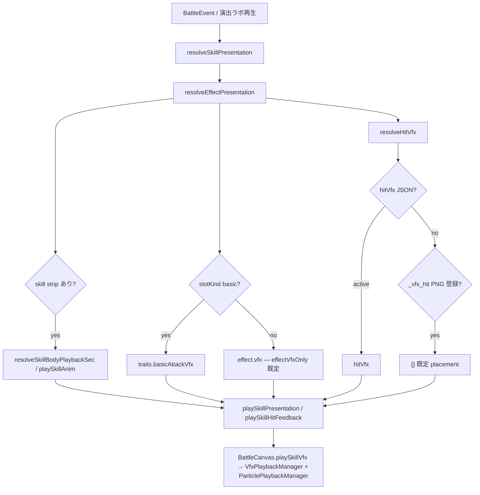

# クラスとスキル

ゲームデータは `data/*.json`。型・スキーマ定数：`src/battle/types.ts`, `src/battle/data/gameDataSchema.ts`。ロード・検証：`loadGameData.ts`, `validateGameData.ts`

**スキルマスタ：** `data/classes.json`（15 クラス）と `data/skills/`（`passives/<stem>.json` + `actives/<stem>.json`。クラス別パッシブ + basic/active）が本番マスタ。数値バランスは調整対象だが、ID・形状・パッシブ種別はこの仕様に従う。

## データ編集ツールとの同期

スキル JSON スキーマに effect、target、条件、数値フィールド、表示要素などの新しいデータ要素を追加・変更する場合は、`src/editor/SkillEditorStep.ts` と `src/editor/editorApi.ts` からその要素を作成・編集・保存できる状態にする。必要に応じてバリデーション、正規化、既定値、表示名、説明、インポート/エクスポート処理も同じ作業内で更新する。

データ編集ツールで扱えないスキル要素は、一時的な内部実験を除き本番マスタへ追加しない。ゲームルール・データ形状が変わる場合は、関連する spec と `.cursor/rules/skill-data-editor-sync.mdc` の同期ルールに従う。

---

## 新仕様構造（R2）

**R2 注記:** 本節が新戦闘・兵科仕様の正本。**§Legacy — 旧スキル枠** 以降の basic + passive×4 + active×4 表は現行 production データの説明。[skill-finalization-table.md](../plans/skill-finalization-table.md) は **参照資料のみ**。正本として引用しない。

**R4 注記（2026-07-12）:** 兵科 / 戦闘方式 / 作戦内パッシブ / 敵グループ / Stage-Wave / 作戦状態の **データ責務分離・validate・エディタ責務・legacy 移行方針** は [combat-data-schema-refactor.md](../plans/combat-data-schema-refactor.md) を正本とする。本書はゲームルールと M1 方式 **候補** の正本のまま。具体的な JSON フィールド名・型は R5 で subset 確定。

**R9.5a 注記（2026-07-13）:** R5 対象 4 兵科で CombatModule 通常行動が解決済みのとき、legacy active JSON と `classes.json` 参照は **データ互換のため維持** するが、runtime では active cooldown を生成しない（[combat.md §戦闘方式](combat.md#戦闘方式)）。R9f まで JSON 削除は行わない。

**R12e 注記（2026-07-15）:** 試作 Stage から導出した必要能力・対処能力は [operation-loop.md §19](operation-loop.md#19-必要能力対処能力r12e) を正本とする。

**R12f 注記（2026-07-16）:** A〜G の兵科・CombatModule・作戦内パッシブへの正式分配は [§R12f](#r12f--必要能力の分配確定) および [operation-loop.md §20](operation-loop.md#20-必要能力の兵科combatmodule作戦内パッシブ分配r12f) を正本とする。下記「M1 兵科 — 新仕様候補（R2）」表および R11b 候補 ID は **legacy / 候補記録** であり、R12f 確定値ではない。データ再設計は **R12g**。

### 兵科の主要構造

| レイヤ | 内容 |
| ------ | ---- |
| **兵科本体** | 基礎 HP / ATK / DEF / RES、攻撃間隔、射程、基本ロール、**固定優先ターゲット**、**固定ダメージ属性** |
| **戦闘方式 ×2** | Wave ごとに選択。攻撃 / 回復 / 防護の形、Hit 構造、射程・停止位置・移動・対象数・範囲など。**単なる倍率違い禁止** |
| **作戦内パッシブ候補** | 作戦中に任意取得する構築要素（挙動変化優先）。**パッシブがなくても基本役割が成立**する |
| **固定優先ターゲット** | 兵科固定。方式変更では変えない（[combat.md §優先ターゲット](combat.md#優先ターゲット)） |

旧 **Lv0 / Lv10 / Lv20**、**passive_1〜4 / active_1〜4** 枠、**習得解放**、**CD / gauge** は新仕様の正本から **外す**。

**active 廃止の意図（方針）:** 旧 active は CD / gauge / smart 条件 / SkillHold 待ちなどにより、**効果が欲しいタイミングに発動しない**ことが起き得た。戦闘方式（CombatModule）へ寄せるのは、選択中の通常行動と選択中永続効果を **攻撃間隔・選択状態に沿って確実に効かせる**ためでもある（詳細は [combat.md §戦闘方式](combat.md#戦闘方式)）。

### 旧 active / passive の再分類

旧スキル JSON は **素材** として次へ再分類する。旧枠・旧レベル・旧 CD・旧ゲージは **引き継がない**。

| 再分類 | 例 |
| ------ | -- |
| 兵科の基礎特性 | 鉄衛士の block 思想、療養師の低 HP 回復特化 |
| 戦闘方式 | 剣術士の叩き付け / 薙ぎ払い相当の形状差、弩砲の溜め射 |
| 作戦内パッシブ候補 | 迎撃態勢、毒の武器、援護反撃 |
| 廃止 | RES 無視、種火 / 熾火連鎖、gauge 前提 active、細か stat +10% |

### 作戦内パッシブ（設計アイデア — 未確定）

各兵科に **数件の候補アイデア** を記録してよい。**以下は R2 で確定しない:** 個数、コスト、取得上限、rarity、重複、データ形式、UI、実装順。

| 原則 | 内容 |
| ---- | ---- |
| 任意性 | 取得しなくても兵科の基本役割が成立する |
| 優先 | 挙動変化 > 単純 stat 上昇 |
| 保留 | 移動阻害、ノックバック強化、移動速度差 → **R8 候補**。R5 最小縦切りには **含めない** |

### 魔術師（`at_sorcerer`）— 簡素化方向（R2 記録）

> R12f 確定の固定役割・Module・Passive は [§R12f 魔術師](#at_sorcerer-魔術師) を正とする。以下は R2 簡素化方向の記録。

| 廃止方向 | 内容 |
| -------- | ---- |
| RES 無視 | 正本から **外す**（旧 P1 猛火の術） |
| 複雑な耐性貫通 | 廃止方向 |
| Lv 段階の種火 / 熾火完成 | active 連鎖前提の構造を廃止方向 |
| active 連鎖 | P3 連なる炎等 |

**R2 整理方向（R12f と整合する部分）:**

- 単純な **魔法攻撃兵科**
- 優先ターゲット: **最近傍候補**
- **2 戦闘方式** で攻撃形状を変える（方式名・倍率・Hit 数は **未確定** → R12g）
- **RES の影響を通常どおり受ける**

**未確定（R12g 以降）:** MultiLock の具体、方式名、倍率、攻撃間隔。種火 / 熾火は廃止方向を維持。

### 双刃士（`at_assassin`）— 新仕様候補（R2 記録）

> R12f 確定は [§R12f 双刃士](#at_assassin-双刃士) を正とする。以下の方式候補 A/B は R12f の M1 後方侵入型 / M2 前線内仕留め型の素材記録。

**兵科固定責務:** 低 HP 対象優先（現在 HP 最低）、仕留め役。

**重要:** 双刃士 **本体に固定 2 Hit を残さない**。2 Hit が必要なら **戦闘方式側** で定義する。

#### 方式候補 A（R2・素材）

- 前線で停止せず、低 HP の優先対象へ接近
- 対象の **背後** へ回り込む（単体処理向け）
- **瞬間移動ではなく実移動** 候補（特殊移動の詳細は **未確定**）
- 正式名称、射程、Hit 数、対象数、数値 — **未確定**

#### 方式候補 B（R2・素材）

- 槍術士程度の **中距離** 位置から投げナイフで攻撃
- 低 HP 対象優先は維持
- 前線へ深く侵入しない
- 対象数・Hit 構造 — **未確定**

移動阻害・鉄衛士周囲減速は **今回実装仕様に含めない**（作戦内パッシブ候補の検討は R12g）。

---

## M1 兵科 — 新仕様候補（R2・legacy 記録）

> **legacy / 候補記録。** R2〜R11 時点の方式・パッシブ候補。**R12f の正本は [§R12f](#r12f--必要能力の分配確定)**。本表の方式 A/B・旧再利用・R11b ID は確定値として扱わない。R12g でデータ再設計する。数値・方式名・Hit 数・射程・攻撃間隔はすべて **未確定**。

Defender / Supporter は無理に単体 / 複数へ揃えず、兵科に合う 2 軸で方式を持つ。

### 一覧表（R2 候補・非正本）

| classId | 名称 | 基本ロール | 固定優先ターゲット | 固定属性 | 方式 A 方向性 | 方式 B 方向性 | 旧スキル再利用候補 | 廃止する旧要素 | 未確定事項 |
| ------- | ---- | ---------- | ------------------ | -------- | ------------- | ------------- | ------------------ | -------------- | ---------- |
| `df_guardian` | 鉄衛士 | 前線・単路線防衛 | 敵 default（defender 被弾入口） | 物理 | **集中防護** — 前線停止、高 block / 被ダメ軽減、単体被弾の主受け口 | **反撃圧** — 被弾起点の短距離反撃・前線押し上げ（城塞構えの **思想** のみ素材） | block、立ちはだかる壁（damageReduction）、迎撃態勢（blockResonance **候補** → 方式 or 作戦内パッシブ） | DEF buff active、hitsTaken + gauge 構え、Lv20 無敵の Lv 前提 | 方式名、block 数値、攻撃間隔、Hit 構造 |
| `df_paladin` | 護法士 | 戦線全体の被害分担 | 同上 | 物理 | **広域防護** — 前列 block aura + 半径内 damageReduction（護法陣思想） | **自己防御** — 厚い自己 barrier / 短時間被ダメ軽減、前線からやや後退 | frontBlockAura、護法陣 aura、光明剣 barrier 思想 | 魔法 block Lv 前提拡張、gauge active | 半径、barrier 量、方式切替時の位置 |
| `at_swordsman` | 剣術士 | 高 DEF 処理 | **高 DEF 敵** | 物理 | **単体叩き付け** — 単体高 DEF 向け、DEF 無視 or 高係数 Hit（剛剣思想は **作戦内パッシブ候補**） | **薙ぎ払い** — 前方 pierce / 小 AoE で複数 DEF 帯を処理 | DEF 無視条件、叩き付け / 薙ぎ払い active の **形状** | ignoredDefBonus の Lv20 前提、gauge BAC | 方式名、DEF 無視を方式に含めるか、Hit 数 |
| `at_assassin` | 双刃士 | 低 HP 処刑 | **低 HP 敵（現在 HP）** | 物理 | **背後回り込み** — 実移動で対象背後、単体処理（§方式候補 A） | **投げナイフ** — 中距離、低 HP 優先、前線非侵入（§方式候補 B） | 薄命狩り（優先ターゲット）、影の刃 move 思想、出血 DoT **候補** | 固定 2 Hit basic、bonusBasicAttackOnHit gauge、DEF 100% 無視 P3 | 方式名、移動詳細、Hit 数、射程 |
| `at_ranger` | 弓術士 | 遠隔物理 DPS | **遠隔敵** | 物理 | **連射** — 単体または少数への高頻度 Hit | **連ね矢** — 複数対象への分配 Hit（multiLock 等 **候補**） | 遠隔優先、連射 / 連ね矢 active の形状 | attackSpeed buff 前提、Lv 解放連射 | 方式名、Hit 数、対象数、攻撃間隔 |
| `at_ballista` | 弩砲士 | 高 Max HP 処理 | **高 Max HP 敵** | 物理 | **重矢単体** — 溜め or 高係数単体（破城矢思想） | **砲撃標的 splash** — マーク対象中心の副次 Hit（ballistaMark 思想） | idleAtkRamp 溜め、ballistaMark splash、targetHpRatioDamageScale | gauge 待機蓄積、nextOutgoingDamage 武装 | 方式名、溜めを方式に含めるか、Hit 数 |
| `at_sorcerer` | 魔術師 | 安定魔法火力 | **最近傍候補** | 魔法 | **単体魔法** — 単体 high 係数 magic Hit | **拡散魔法** — 複数対象 or 小 AoE magic Hit | 炎術 / 双炎 / 散火の **形状差** のみ素材 | RES 無視、種火 / 熾火、active 連鎖、Lv 完成 | 種火廃止可否、MultiLock、方式名、倍率 |
| `sp_cleric` | 療養師 | 回復・欠損復元 | **PHT**（負傷者 HP 割合最小） | 回復（行動属性） | **単体回復** — PHT へ concentrated heal / 短 HoT | **複数回復** — 半径内複数負傷者 or 全体小 heal | 低 HP heal 特化、excessHealToBarrier、smart heal withhold | Lv10/20 回復精度段階、healReservation gauge | 方式名、対象数、HoT 要否 |
| `sp_wardweaver` | 結界師 | 事前 barrier・猶予 | **PHT**（barrier 付与時 stat ratio） | 回復 / 防護 | **厚い Barrier** — 単体 PHT へ大 barrier | **広い Barrier** — 半径内複数 or 全体 thin barrier | 低 HP 特効 barrier、barrierDepletionHeal 思想 | Wave 開始全体 barrier の Lv 前提 | 方式名、barrier 量、対象数 |

### 作戦内パッシブ候補（R11b — R5 4 兵科・枠のみ維持）

> **R11b は枠・専用 ID の縦切り完了記録。** 効果内容・維持義務は持たない。Passive 方向の正本は [§R12f](#r12f--必要能力の分配確定)。ID・数値の再設計は **R12g**。

| classId | R11b 作戦向け候補（短名・現行 catalog） |
| ------- | ---------------------------- |
| `df_guardian` | 堅盾の構え / 城壁の護り / 最後の誓い（`df_guardian_op_brace` / `_wall_aura` / `_last_stand`） |
| `at_swordsman` | 鎧砕き / 重装狙い / 剛剣の切先（`at_swordsman_op_armor_break` / `_high_def_focus` / `_finish_cut`） |
| `at_sorcerer` | 弧火の術 / 余燼の火力 / 共鳴打撃（`at_sorcerer_op_arc_bolt` / `_ember_dot` / `_resonant_hit`） |
| `sp_cleric` | 応急の加護 / 余剰の盾 / 治癒の備蓄（`sp_cleric_op_triage` / `_excess_ward` / `_heal_reserve`） |

> 現行候補 ID とコスト帯は `data/operation-passive-catalog.json`。legacy `passive_1〜4` 定義は残すが、作戦候補一覧からは外す。

### 作戦内パッシブ候補（設計アイデア — M1 外・未確定・legacy）

| classId | 候補アイデア（確定ではない。R12f 方向と不一致なら R12g で捨てる） |
| ------- | ---------------------------- |
| `df_paladin` | 魔法 block 付与、護法半径拡大、余剰被ダメを barrier へ |
| `at_assassin` | 低 HP 特効、出血付与、追加 Hit 確率 |
| `at_ranger` | 遠隔優先強化、連射時 Hit 増、DoT 付与 |
| `at_ballista` | 溜め ATK 加速、マーク splash 強化、高 HP 特効 |
| `sp_wardweaver` | barrier 枯渇 heal、低 HP barrier 増、ward 軽減 |

---

## R12f — 必要能力の分配（確定）

本節は試作 Stage 対象 **8 兵科** について、[operation-loop.md §19](operation-loop.md#19-必要能力対処能力r12e) の A〜G を兵科本体 / CombatModule / 作戦内パッシブへ分配した **設計正本** である。A〜G の主担当表・能力セット成立は [operation-loop.md §20](operation-loop.md#20-必要能力の兵科combatmodule作戦内パッシブ分配r12f) を正とする。

**今回対象外:** 具体名称・ID・数値・倍率・秒数・コスト・VFX、production JSON、全兵科の詳細再設計。

**Kill / Flow / Survival を維持する。** A〜G は新しいロール分類ではない。新 CombatModule・作戦内パッシブも、現行兵科の方向性を大きく変えない（Kill↔Survival 反転禁止、Passive による固定優先ターゲット変更禁止、Flow 兵科領域の侵食禁止）。

### 分配原則（兵科本体 / CombatModule / 作戦内 Passive）

| 層 | 担うもの |
| -- | -------- |
| **兵科本体** | 基礎ステ方向、攻撃間隔・射程の骨格、**固定優先ターゲット**、固定ダメージ属性、分類（Kill / Survival） |
| **CombatModule（×2）** | 処理の形（集中/分散、侵入/非侵入、重点/広域）。**単なる倍率違い禁止**。M1 と M2 を同時には使えない。防護・軽減・自己強化は **選択中永続が原則**（周期バフ禁止 — [combat.md §戦闘方式](combat.md#戦闘方式)） |
| **作戦内 Passive** | 方式の深掘り、または隣接補完。取得しなくても基本役割が成立する |

### Passive 分配原則

#### 深掘り

| 兵科 | 方向 |
| ---- | ---- |
| 剣術士 | 高 DEF 対象への継続安定 |
| 双刃士 | 侵入・仕留め・撃破後移行 |
| 弓術士 | 中核への集中維持 |
| 魔術師 | 初動・主対象への魔法継続 |
| 鉄衛士 | 自己耐久 |
| 護法士 | 味方防護 |
| 療養師 | HP 復元 |
| 結界師 | Barrier 維持 |

#### 隣接補完

| 兵科 | 方向 |
| ---- | ---- |
| 鉄衛士 | 追加取得時のみ、限定的な味方支援（護法士より範囲・強度・安定性で劣る） |
| 療養師 | 余剰回復 Barrier（**兵科本体には置かない**） |
| 結界師 | Barrier 消費後の小回復（**兵科本体には置かない**） |
| 双刃士 | 侵入直後の短い生存猶予 |
| 弓術士 | 最低限の自衛 |

#### 禁止

- 固定優先ターゲット変更
- Kill / Flow / Survival 分類の反転
- 弱点の完全消去
- M1 と M2 の長所の同時完成
- 鉄衛士が護法士並みの常設防護を得る
- 療養師と結界師が互いを完全代替
- 双刃士が恒常的な魔法耐久を得る
- 魔術師が広域区域魔法を得る

### 将来拡張境界（壊さない分離）

今回確定する対象は上記 8 兵科のみ。将来兵科が A〜G の副担当へ追加される余地を残し、次の分離を壊さない。

- B1 支援役到達 / B2 攻撃中核到達
- A 高耐久突破 / B1 支援役到達
- C 即応処理 / D 抑制
- Kill / Flow / Survival 分類

| 将来兵科 | 境界 |
| -------- | ---- |
| 闘技士 | 高 HP 候補。HP 割合が低いほど強くなる。自己回復を持たない。反撃・妨害・ターゲット強制変更によってダメージを制御する |
| 槍術士 | 前線指揮官系 Flow。双刃士 M2 との違いは射程差ではなく **Kill / Flow 分類差** |
| 印術師 | 前線・区域・密集への範囲魔法領域を残す。魔術師へ広域区域魔法を持たせて領域を食わない |

### 直接ダメージ（鉄衛士 M2 前提）

設計用語の定義と鉄衛士 M2 トリガーの狭い定義は [operation-loop.md §20.5](operation-loop.md#205-直接ダメージ上位概念) を正とする。combat.md への編入・TypeScript 型・schema は **今回決めない**。現行 effect schema で表現できなくても production 実装へ広げない（→ **R12g** でデータ形状と実装先を判断）。

### 8 兵科 — 固定役割・2 Module・Passive

#### `at_swordsman` 剣術士

| 項目 | 内容 |
| ---- | ---- |
| 分類 | Kill |
| 固定役割 | 高 DEF 対象を固定優先。ファイター内で高めの耐久。正面で高 DEF 対象を安定して担当し続ける |
| 主担当 | A |
| 副担当 | C、F、G |
| DEF 無視 | **限定的**。高 DEF を実質無効化するほど強くしない。現行 10〜15% 程度を将来数値候補として残せるが、今回は数値確定しない |
| M1 正面集中型 | 高 DEF 対象へ処理を集中。撃破するまで担当を維持 |
| M2 前線分担型 | 高 DEF 主対象を維持しつつ、前線の別対象へ処理を分ける。双刃士への確実な C ではない |
| Passive | 高 DEF 対象への継続安定、被弾中の攻撃維持、撃破後の対象移行 |
| 持たせない | 後方到達、低 HP 優先、広域殲滅、大幅な追加 DEF 無視 |
| R12g-e1 data | `data/combat-modules/at_swordsman.json` — M1 `at_swordsman_mod_single_slash`（正面集中・敵 DEF highest 単体・高 atkScale）、M2 `at_swordsman_mod_pierce_slash`（前線分担・DEF highest 複数 multiLock・`refillSameTargetOnShortfall: false`）。DEF 無視は class passive `at_swordsman_passive_1` 所有（Module 差は対象数と damage 量）。近接維持。数値は仮。**Backend 完了 / Player 未完了** |

#### `at_assassin` 双刃士

| 項目 | 内容 |
| ---- | ---- |
| 分類 | Kill |
| 固定役割 | 現在 HP 最低対象を優先して仕留める |
| 主担当 | B1 |
| 副担当 | C、F、G |
| M1 後方侵入型 | 前線を越えて現在 HP 最低対象へ接近。支援役到達を担当。敵魔術師の最近傍攻撃を受けやすい。魔術師との相克を越えて療養師へ到達する |
| M2 前線内仕留め型 | 前線を追い越さない。中距離射程内の現在 HP 最低対象を攻撃。敵後衛の初期位置へ直接届かない。侵入した敵双刃士が射程内かつ最低 HP なら C へ条件付き寄与（敵双刃士を固定優先する方式ではない） |
| 射程 | 具体値未確定。槍術士との違いは射程差ではなく Kill / Flow 分類差 |
| Passive | 侵入直後の短い生存猶予、撃破後移行、低 HP 処理の安定 |
| 持たせない | 高 DEF 突破、遠隔攻撃役優先、自己回復・HP 吸収、恒常的な高魔法耐久 |

#### `at_ranger` 弓術士

| 項目 | 内容 |
| ---- | ---- |
| 分類 | Kill |
| 固定役割 | 後方から攻撃圧力を発生させる遠隔攻撃役を固定優先。支援役は対象に含めない |
| 主担当 | B2、F |
| 副担当 | G |
| M1 中核集中型 | 単一の遠隔攻撃役へ攻撃を維持。魔術師の期限内処理へ寄せる |
| M2 中核分担型 | 複数の遠隔攻撃役へ処理を分配。一体への決定力は M1 より低い |
| Passive | 同一中核への集中維持、撃破後移行、最低限の自衛 |
| 持たせない | 支援役優先、高 DEF 突破、前衛万能処理、双刃士への完全な自衛 |

#### `at_sorcerer` 魔術師

| 項目 | 内容 |
| ---- | ---- |
| 分類 | Kill |
| 固定役割 | 最近傍へ DEF に左右されない魔法圧力を与える。**RES 無視は持たない** |
| 主担当 | C |
| 副担当 | A の属性上の代替出力、前線突破後・対象露出後の F、G |
| B2 | **担当しない** |
| M1 単体即応型 | 最近傍一体へ重い魔法処理。侵入双刃士への C 主担当 |
| M2 少数分散型 | 最近傍を起点に少数対象へ MultiLock。前線区域・密集全体を覆う広域攻撃にはしない |
| Passive | 初動処理、同一対象への継続、分散時の主対象維持 |
| 持たせない | RES 無視、支援役優先、遠隔攻撃役優先、前線区域への広域魔法、単体と分散の同時完成 |

#### `df_guardian` 鉄衛士

| 項目 | 内容 |
| ---- | ---- |
| 分類 | Survival |
| 固定役割 | ディフェンダー内で自己耐久ステータスが明確に最上位。高 DEF と十分な HP。前線の通常圧力を単独維持する。前線外の敵への干渉がディフェンダー内で最も不得意。**常設 Module では味方支援を持たない** |
| 最高 HP | そのものは将来の闘技士へ残せる |
| RES | 0 固定を撤回候補。魔法に即座に崩れない最低限の RES を持たせる方向。具体値は数値調整 Phase。護法士より魔法耐久は明確に低くする |
| M1 物理堅守型 | 自身が受ける物理ダメージを軽減。強攻撃判定や攻撃者数条件は持たせない。結果として大ダメージ単 Hit 物理に M2 より強い |
| M2 不屈型 | 敵の直接攻撃による HP ダメージ Hit ごとに固定量を自己回復（被ダメージ割合回復ではない）。Hit ごとに発動。小ダメージ多 Hit に対して HP 黒字を許容。単体多 Hit にも有効。複数敵条件は持たない。多段・手数型への明確なメタ。大ダメージ単 Hit には弱い。自身だけを回復。余剰回復を Barrier へ変換しない。致死 Hit 後に復活しない |
| M2 トリガー | [operation-loop.md §20.5](operation-loop.md#205-直接ダメージ上位概念) — 敵の Attack Hit による実 HP ダメージ各 Hit。敵側でも同じ効果を持ち得るが、固定優先ターゲットの関係上、主に味方側で活躍する方式 |
| Passive | 自己耐久深掘り。追加取得時のみ、自己防護を条件付き・限定的に味方へ波及（護法士より劣る） |
| 持たせない | 常設の味方防護、強い妨害、ターゲット強制変更、反撃主軸、前線外への高い干渉 |
| D / E | **直接担当として数えない**。自身への支援要求を減らし、他味方へ支援資源を回す間接貢献 |
| R12g-d1 data | `data/combat-modules/df_guardian.json` — M1 `df_guardian_mod_nearest_strike`（`runtimeEffect.physicalDamageTakenReduction`・選択中永続）、M2 `df_guardian_mod_guard_focus`（`runtimeEffect.healOnEnemyAttackHpHit`）。数値は仮。**Backend 完了 / Player 未完了** |

> **legacy との差分（記録）:** Legacy 節の「鉄衛士は barrier / HoT を持たない」および R2 候補表の方式 B「反撃圧」は、本節の M2 不屈型・反撃主軸禁止と食い違う。**新仕様の正本は本節。** Legacy 説明は現行 production データの説明に留める。

#### `df_paladin` 護法士

| 項目 | 内容 |
| ---- | ---- |
| 分類 | Survival |
| 固定役割 | 前線防護と魔法被害軽減によって味方を守る。味方支援はディフェンダー内で最も高い |
| M1 前線広域防護型 | 前線の複数味方へ魔法中心の軽減。**E を主担当** |
| M2 危険対象防護型 | 後衛を含む危険対象一体または少数へ全属性防護。魔法には特に強い。**D を主担当**。鉄衛士の追加支援 Passive より明確に強い |
| M1/M2 | 同時には使えない |
| Passive | 防護持続、対象切替、限定的な物理補完 |
| 持たせない | HP 回復、厚い Barrier、鉄衛士以上の自己耐久 |
| danger targeting | **集中攻撃の防護**が主判定。HP 割合最低 / 現在 HP 最低 / Barrier 最低 / PHT / 自己防御へ置換しない |
| 後衛 | 距離制限なしで対象になり得る。formation row 固定優先にしない |
| 基本対象数 | **1 体**。常時複数保護を標準にしない |
| tie-break | pending 中の異なる敵数 → 最短 apply 時刻 → pending Hit 数 → HP 割合 → 決定的 ID 順 |
| 魔法特化 | 対象選定と effect 強度を分離。魔法は同値時の補助加点候補に留める |
| 未接続 | 仮 Module ID / 仮数値の data 移管は **R12g-d2 Backend 完了**。Player 手元確認は未達。editor 追加 UI の残りは **R12g-g** |
| R12g-c4〜c5 / R12g-d2 runtime | `dfPaladinM1.ts` / `dfPaladinM2.ts` / `dfPaladinModules.ts` — M1 `df_paladin_mod_frontline_ward`（前線複数・魔法中心）、M2 `df_paladin_mod_danger_guard`（danger 1 体・全属性＋魔法追加）。倍率・duration・window・maxTargets は CombatModule data 所有。**Backend 完了 / Player 未完了** |

#### `sp_cleric` 療養師

| 項目 | 内容 |
| ---- | ---- |
| 分類 | Survival |
| 固定役割 | HP 割合の低い味方を優先。発生した HP 欠損を即時復元 |
| M1 緊急単体復元型 | 危険な一体を救命。**D 寄り** |
| M2 分散復元型 | 複数人の欠損を並行して戻す。**E 寄り** |
| Passive | 余剰回復 Barrier、対象切替、方式間の最低限補完。余剰回復 Barrier は **兵科本体に置かない** |
| 持たせない | 本体 Barrier、広域軽減、事前防護、単体と分散の同時完成 |
| R12g-d3 data | `data/combat-modules/sp_cleric.json` — M1 `sp_cleric_mod_single_mend`（緊急単体・HP割合最低負傷者1体・高 atkScale）、M2 `sp_cleric_mod_party_mend`（分散・上位 N 体へ同量低 heal・`refillSameTargetOnShortfall: false`）。数値は仮。**Backend 完了 / Player 未完了** |

#### `sp_wardweaver` 結界師

| 項目 | 内容 |
| ---- | ---- |
| 分類 | Survival |
| 固定役割 | HP 被害前の Barrier によって、撃破・回復までの猶予を作る |
| M1 重点 Barrier 型 | 危険対象一体へ厚い Barrier。**D 寄り** |
| M2 分散 Barrier 型 | 複数人へ薄い Barrier。**E 寄り** |
| Passive | Barrier 消費後の小規模回復、再付与安定、方式間の最低限補完。Barrier 消費後回復は **兵科本体に置かない** |
| 持たせない | 本体回復、無限 Barrier、全体完全防護、療養師と同等の HP 復元 |
| R12g-d4 data | `data/combat-modules/sp_wardweaver.json` — M1 `sp_wardweaver_mod_focus_barrier`（danger 味方1体・厚い Barrier・`barrierStack: true`）、M2 `sp_wardweaver_mod_spread_barrier`（ally Barrier 不足複数・薄い Barrier・`requireBelow`・`refillSameTargetOnShortfall: false`）。数値は仮。**Backend 完了 / Player 未完了** |
| R12g-d5 統合 | Survival 4 兵科（鉄衛士・護法士・療養師・結界師）を同一実戦経路で確認。`src/battle/survivalCombatModules.integration.test.ts`。**R12g-d 本流 Backend 完了 / Player 未完了**。次は Kill 兵科（R12g-e1〜） |
| R12g-e1 data | 剣術士 M1/M2 — 上記 `at_swordsman` 節。`src/battle/atSwordsmanModules.test.ts`。**Backend 完了 / Player 未完了**。次は R12g-e2（双刃士） |

### R12f → R12g 未接続事項

| 項目 | 扱い |
| ---- | ---- |
| 方式名・Passive 名・ID | R12g 以降 |
| 数値・倍率・秒数・コスト | R12i 中心（形状は R12g） |
| 危険対象判定規則（護法士 M2 等） | **R12g-c Backend 完了**（c1〜c5）。Survival Module JSON は **R12g-d1〜d5 Backend 完了**。Player 手元確認は R12g-d5 Player 層 |
| 鉄衛士 M2 の effect schema / 直接ダメージ型 | R12g-b で **DamageAppliedEvent** 契約確定（[combat.md §DamageAppliedEvent](combat.md#damageappliedevent-r12g-b)）。runtime 実装は R12g-b1〜b2。JSON 数値入力は R12g 本流 |
| R11b 現行 Passive 効果 | 維持義務なし。R12f 方向に合わせて再設計 |
| R2 候補表の方式 A/B | 本節の M1/M2 方向が正。旧案は素材のみ |

---

## Legacy — 旧スキル枠

> 以下は現行 `data/skills/` + `classes.json` の **legacy 実装** 説明。習得 Lv・passive×4 + active×4 表は新仕様の正本 **ではない**。

## 用語（スキル習得 vs 装備）

スキルは **習得した時点で常時使用可能** とし、戦闘用スロットへの付け替え・セット・装備変更の概念は持たない。

| 日本語           | 意味                                                      | コード上のフィールド（例）              |
| ---------------- | --------------------------------------------------------- | --------------------------------------- |
| **習得**         | LvUP 等で passive / active が使用可能状態になること       | `learnedPassiveIds`, `learnedActiveIds` |
| **パッシブ枠**   | 習得済み passive が常時参加する枠。Lv0=2、Lv10=3、Lv20=4  | `learnedPassiveIds` の先頭から枠数分    |
| **アクティブ枠** | 習得済みアクティブが常時参加する枠。Lv0=2、Lv10=3、Lv20=4 | `learnedActiveIds` の先頭から枠数分     |
| **装備**         | **将来**のアイテム・武器防具など。スキルには使わない      | —                                       |

- UI・仕様書・コメントでは「スキルを装備」「スキルをセット」「セット枠」と書かない。
- `equippedActiveSlots` は歴史的互換フィールドとしてのみ扱い、設計上の戦闘参加判定には使わない。新規仕様・新規 UI では使用しない。

### 戦闘用語

| 用語     | 定義                                                                              |
| -------- | --------------------------------------------------------------------------------- |
| **攻撃** | `damage` または `dot` を含むスキル（通常攻撃 `slotKind: basic` 含む）             |
| **反撃** | 攻撃を受けたとき、設定量のダメージを攻撃者へ返す効果。バフ/デバフタグには含めない |

### UI 用語辞書

スキル説明など DOM UI 上の **ゲーム用語** を、クリックで補足説明できるようにするための辞書。戦闘ルールの正本は引き続き [combat.md](combat.md) および本書の各節。辞書は **プレイヤー向け要約** を載せ、詳細数式・パイプラインは spec へ委ねる。

**実装:** `src/ui/gameTermGlossary.ts`（辞書）、`src/ui/annotateGameTerms.ts`（本文へのリンク化）、`src/ui/GameTermPanel.ts`（用語パネル）、`src/styles/game-term-panel.css`。画面振る舞いは [party-formation-ui.md §6.4](party-formation-ui.md#64-用語注釈スキルカード) を正とする。**表示分類の正本**は下記 [ゲーム用語表（表示分類）](#ゲーム用語表表示分類)。

#### ゲーム用語表（表示分類）

Hensei Only のスキルカード表示は、プレイヤー向け UI 上で次の **3 系統** に整理する。日本語表示を正本とし、英語は [i18n-en.md](i18n-en.md) の制御英語に従う。一般 RPG 用語で補完しない。

| 系統 | 役割 |
| ---- | ---- |
| **文中リンク** | 効果本文中の白 1.5px 下線 + 下→上 白（透明度 50%→100%）グラデ背景付き用語（`aliases` 登録語。クリックで tooltip） |
| **Plain Text** | `aliases` 未登録の基本語（本文中の通常テキスト） |

**戦闘 HUD** では、実際にユニットへ付いている状態を **HUD バッジ** として別表示する（スキルカード UI とは独立）。

**情報責務:** [party-formation-ui.md §スキルカード情報設計](party-formation-ui.md#スキルカード情報設計)。

**辞書データ:** `gameTermGlossary.ts` / `gameTermGlossaryEn.ts`（`GameTermId`）。`description` = 用語辞典（用語パネル・状態説明の正本）、`tooltip` = 文中リンク tooltip 用短文化。文中リンク化は **`aliases` 登録** で判定。[party-formation-ui.md §6.4](party-formation-ui.md#64-用語注釈スキルカード) を正とする。

##### 1. 文中リンク

効果本文中に表示される **`aliases` 登録語** の白 1.5px 下線 + 下→上 白（透明度 50%→100%）グラデ背景リンク。クリックで tooltip（2〜3 行）。対象形状・範囲形状・攻撃の当たり方・計算修飾・行動制御・特殊挙動・状態名（`aliases` あり）など。

**対象例（固定リストではない）:** マルチロック / AoE / 周囲 / 地点 / 貫通 / 防御力無視 / 種火 / バリア 等

**注意:**

- 上記は例であり、固定リストとして扱わない
- リンク化するかは **glossary の `aliases`** に基づく（`skillCardDisplayRules` の inline allowlist は廃止）
- **別枠タグ行は持たない**。形状ラベルは本文行内に置き、同じ情報を二重表示しない

**tooltip 内容:** ルール用語は `description` の先頭 2 行要約。`statusCategory` 付き状態は `description` **全文**。**`description` より短く書くときだけ** `tooltip` を指定する。

##### 2. 戦闘 HUD 状態（参考）

戦闘中に **状態として保持される** もの。HUD バッジ + 用語パネル / ホバー tooltip で表示。**スキルカード編成 UI では State Chip 行を持たない**（状態定義は文中リンク tooltip へ統合）。

**対象例（固定リストではない）:** バリア / 障壁 / 防壁 / DoT / HoT / 毒 / 出血 / 種火 / 熾火 / 印 / 薬効

**辞書:** 状態も `description` を正本とする。スキルカードでは `aliases` + 文中リンク tooltip で参照。

| 日本語 | English | `GameTermId` |
| ------ | ------- | ------------ |
| 種火 | Seed Flame | `seedFlame` |
| 熾火 | Blazing Flame | `blazingFlame` |
| 乾印 | Qian Mark | `windMark` |
| 坤印 | Kun Mark | `earthMark` |
| 闘士の指名 | Gladiator's Mark | `arenaMark` |
| 砲撃標的 | Barrage Mark | `ballistaMark` |
| 防壁 | Bulwark | `blockResonance` |
| 城塞の構え | Citadel Stance | `blockResonanceStance` |
| 治癒の残響 | Healing Echo | `healReservation` |
| 薬効 | Herbal Potency | `herbalPotency` |
| 頑健 | Hardy | `herbalPotencyConstitution` |
| 追撃状態 | Follow-Up Ready | `allyAttackFollowUp` |
| 毒の武器 | Poison Weapon | `poisonWeapon` |
| 次のダメージ増加 | Next Hit Amp | `nextOutgoingDamage` |
| 不屈 | Last Stand | `lastStandGuts` |
| 闘技場の掟 | Arena Law | `arenaDominance` |
| 闘士の矜持 | Duelist's Pride | `duelistPride` |
| ダメージ遅延 | Damage Delay | `damageDelay` |
| 通常攻撃変形 | Basic Attack Transform | `basicAttackTransform` |

汎用状態（バリア / 障壁 / DoT / HoT / 毒 / 出血 等）も State Chip 対象になりうる。`description` + `statusCategory` で定義する。

##### 3. Plain Text

tooltip を読まなくても意味が分かる **基本語**。glossary の `aliases` **未登録** の語は Plain Text として表示する（`aliases` 登録語は文中リンク）。

**対象例:** 物理ダメージ / 魔法ダメージ / 攻撃力 / HP / 防御力 / 魔法耐性 / 回復 / ダメージを与える / 付与する

##### 表示フォーマット（効果行）

`formatSkillCardLines` の `effectLines` および 1 行説明の効果部は次を基本とする。

- 並び順: **特殊ルール → 計算修飾 → 基礎効果 → 追加効果**
- `maxCharges > 0` のアクティブは効果行末に `チャージ可能 N`（N = `maxCharges`、英語 `Charge available N`）を付ける
- Inline Term Label の **直後** に対応する数値を置く（ラベルと数値を分離）
- 複数要素は ` / ` で区切る
- 割合には `%` を付ける。個数・対象数には `%` を付けない
- 仕様書・設計メモでは Inline Term Label を `[ラベル]` と表記してよい（UI 上は tooltip 付きボタンとして描画）

**範囲形状ラベル（中心の違い）:**

| Inline Label | 中心 | 内部 | 例 |
| ------------ | ---- | ---- | -- |
| **AoE** | 選ばれた対象（anchor） | `targetShape: aoe` + `nearest` / `farthest` / `stat` 等 | `[AoE] 5 / 敵の攻撃力-10%` |
| **周囲** | 使用者 | `targetShape: aoe` + `order: selfOrigin` | `[周囲] 5 / 味方の攻撃力+5%` |
| **地点** | 戦場座標（持続） | `placedField`（`clusterCenter` 等） | `[地点] 7 / 5秒 / 毒` |

AoE・周囲・地点は半径の中心が異なるため、同一ラベルにまとめない。

**例（`[]` は Inline Term Label の表記）:**

```
[マルチロック] 2 / 攻撃力の120%の魔法ダメージ
[マルチロック] 2 / [防御力無視] 25% / 攻撃力の160%の物理ダメージ
[AoE] 5 / 敵の攻撃力-20%
[周囲] 5 / 味方の攻撃力+20%
[地点] 7 / 5秒 / 毒
[貫通] 3 / 攻撃力の140%の物理ダメージ / [ノックバック]
[スタン] 1.5秒
[反撃] / 攻撃力の80%の物理ダメージ
[回避] +20%
```

##### 重複禁止

| 禁止 | 正本 |
| ---- | ---- |
| Inline Term Label と別枠タグで同じ情報を二重表示 | 本文内 Inline Term Label のみ |
| State Chip と本文中ラベルで同じ状態名を二重表示 | State Chip（本文は付与の要約のみ） |
| State tooltip の詳細を本文へ長く重複記載 | State tooltip |

##### HUD バッジ

戦闘中に **実際に付与されている状態** を表示する。スキルカードの 3 系統とは **別物**。表示可否は「戦闘中に状態として存在するか」で判断する。

例: バリア / 障壁 / ブロック / 毒 / 出血 / スタン / 種火 / 熾火 / 闘士の指名 / ダメージ遅延

HUD バッジのクリック説明・簡易/詳細表示は [combat.md §簡易表示 vs 詳細表示](combat.md#簡易表示-vs-詳細表示)・[battle-field.md §7.1.2](battle-field.md#712-状態バッジクリック用語パネル) を正とする。

##### 表記統一

| 項目 | ルール |
| ---- | ------ |
| 再使用 | **Recast**（Cooldown / CD は UI 表示に使わない） |
| 継続ダメージ | **DoT**（Dot / dot は使わない） |
| 複数対象 | 表示名 **Multi-Lock**（MultiLock / Multi-Locks は使わない。**動詞化しない**） |
| 被ダメ | **damage taken**（incoming damage と混在しない） |
| 防御系 | Ward = 障壁 / Barrier = バリア / Bulwark = 防壁 |
| ステ略称 | ATK / DEF / RES / HP を維持 |
| RES | **EN:** RES。**JA:** 魔法耐性（攻撃力・防御力と同様、日本語は略称にしない） |
| Attack Speed | UI 表示名。**内部キー `spd` / `attackSpeed` と混同しない** |

#### 混同禁止（別 ID 必須）

| ID（例）      | 日本語              | 正本                                                                                     |
| ------------- | ------------------- | ---------------------------------------------------------------------------------------- |
| `barrier`     | **バリア**          | `barrierHp` — HP より先に消費されるダメージ吸収（[combat.md §バリア](combat.md#バリア)） |
| `wardBarrier` | **障壁**            | `wardBarrier` スタック — ダメージ軽減。バリアより先に消費（本書 結界師節）               |
| `windMark`    | **乾印**            | 印術師専用 overlay。拡散側（[§印術師](#印術師at_sigilist拡張)）                          |
| `earthMark`   | **坤印**            | 印術師専用 overlay。収束側（同上）                                                       |
| `ballistaMark`| **砲撃標的**        | 弩砲士専用。乾印・坤印と混同しない                                                       |
| `arenaMark`   | **闘士の指名** 等   | 闘技士 `arenaDominance` 系。印術師の印と混同しない                                       |
| `damageReduction` | **ダメージ軽減** | `damageTaken` stat の軽減 buff / パッシブ `damageReduction`。倍率 `<1` は `ダメージ軽減N%` と表記 |
| `damageIncrease`  | **被ダメージ増加** | `damageTaken` stat の増加 debuff。倍率 `>1` は `被ダメージ増加N%` と表記 |

#### スコープ（v1）

| 項目        | 内容                                                                                                                                                                                                                                                                      |
| ----------- | ------------------------------------------------------------------------------------------------------------------------------------------------------------------------------------------------------------------------------------------------------------------------- |
| 表示言語    | **4d まで `ja` 固定**。**4e** で `en` のみ追加（[phase-roadmap.md §4e](../plans/phase-roadmap.md#4e--英語-i18n--release-m1-向け)）                                                                                                                                      |
| 適用面      | 編成 UI のスキルカード説明文（Phase 4d）。エディタのスキル説明プレビューは同辞書で揃える                                                                                                                                                                                  |
| 説明文生成  | 1 行: `formatActiveDescription` / `formatPassiveDescription`。カード改行: `formatSkillCardLines`（[party-formation-ui.md §6.3](party-formation-ui.md#formatskillcardlines-apiphase-4d-pr1-1-確定)）。本文の文中リンクは `annotateGameTerms` + glossary `aliases`（クリック tooltip）。`resolveSkillCardDisplay` が list 行を含む `headlineLines` を flatten |
| スキル JSON | 用語説明フィールドは **持たない**（4b 方針と同様。説明は生成 + 辞書）                                                                                                                                                                                                     |

#### エントリ形状（locale キー付き）

内部 ID（`GameTermId`）を正本とし、表示・マッチ・説明は locale ごとに保持する。v1 では `ja` のみ必須。

| フィールド        | 意味                                                                                                                                                            |
| ----------------- | --------------------------------------------------------------------------------------------------------------------------------------------------------------- |
| `id`              | 言語非依存の辞書キー（例: `stun`, `barrier`, `wardBarrier`）                                                                                                    |
| `title`           | `{ ja: "スタン", … }` — 用語パネル見出し                                                                                                                        |
| `description?`    | `{ ja: "…", … }` — 用語パネル本文（正本）。ルール用語は 1〜3 文の要約、状態は持続・スタック等を含む全文可。改行は `\n`（表示は `white-space: pre-line`）。文中リンク tooltip は省略時 `description` から生成（ルール用語は先頭 2 行、`statusCategory` 付きは全文）。**HUD 表示名のみの ID（下記例外）は省略可** |
| `tooltip?`        | Inline Term Label ホバー専用の短文化（2〜3 行）。**パネルと同文なら省略**（`description` に一本化） |
| `aliases?`        | `{ ja: ["スタン"], … }` — 本文中でリンク化する表記。**長い語を先**にマッチ。省略時はスキル説明ではリンク化しない（HUD バッジクリック等で補足可） |
| `statusCategory?` | 状態系のみ。[combat.md §ステータス効果](combat.md#ステータス効果) の `StatusDisplayCategory` と対応。`StatusIconRegistry` に PNG が登録されているときのみ用語パネル見出しに表示 |
| `statusIconCategory?` | 用語パネル見出しアイコンのみ。HUD カテゴリと別 ID の用語が同じ PNG を使うとき（例: `magicBlock` → `block`） |

**多言語:** **Phase 4b / 4d** までは表示は **`ja` 固定**（型・データ形状だけ locale キーを持つ）。**Phase 4e** で **`en` のみ** 追加（3 言語目以降はスコープ外）。**4e 本番は M1 リリース直前** — UI 調整により日本語文案が変わる可能性があるため。M1 8 クラス Lv0 の **日本語文案は現時点の正本**（2026-06、[phase-4-roadmap.md §4b](../plans/phase-4-roadmap.md#4b--スキル説明自動生成日本語--完了2026-06)）。4e では **確定後の日本語** を翻訳正本とし locale 分岐する。`aliases` のマッチは **現在 locale の aliases のみ** を使う（日本語 aliases で英語文をマッチさせない）。**英語文案の書き方**（命令形・用語表・`NEEDS_REVIEW`）は [i18n-en.md](i18n-en.md) を正とする。

#### 登録方針

- 初版は `formatSkillText` 出力で **頻出する用語** から段階追加（全用語一括は不要）
- **`StatusDisplayCategory` 全件**（HUD 状態アイコン）には `statusCategory` 付き辞書エントリを用意する。HUD 表示名のみのエントリは `description` / `aliases` を省略し、スキル説明文内では用語リンクしない（`annotateGameTerms` は `aliases` 登録分のみマッチ）。**`description` なし** は戦闘 HUD で **ホバー tooltip**（表示名）。**`description` あり・`aliases` なし** のエントリも同様に本文リンク化しないが、ホバー tooltip は出さず **クリック** で用語パネルを開ける（[combat.md §簡易表示 vs 詳細表示](combat.md#簡易表示-vs-詳細表示)）
- 頻出の非 stat 用語（**ブロック** / **魔法ブロック**・**defender 優先ターゲット**・**通常攻撃**・**種火** / **熾火** 等）も `gameTermGlossary.ts` に登録する
- ルール変更時は **本書 / combat.md と辞書の `ja` を同作業内で更新**
- 状態アイコン・カテゴリの正本は [combat.md §ステータス効果](combat.md#ステータス効果) の HUD バッジ節。辞書の `statusCategory` はそれに従う

### スキル説明自動生成（Phase 4b）

スキル JSON に `description` フィールドは持たない。説明文は `src/ui/formatSkillText.ts` で組み立てる。戦闘ルールの正本は [combat.md](combat.md) および本書の effect 定義。**数値・確定文案の正本は JSON と `src/ui/formatSkillText.test.ts`**。本節はテンプレ方針のみ（スキル一覧への文案転記はしない）。**英語（4e）** は日本語出力を翻訳正本とし、[i18n-en.md](i18n-en.md) の効果文ルールに従う（`skillTextPhrases.ts`）。

#### 出力 API（責務分担）

| API | 用途 | 出力形 |
| --- | ---- | ------ |
| `formatSkillCardLines` | **編成 UI**（`SkillMenuPanel`）のスキルカード | `metaLine` + `effectLines`（効果単位改行。詳細は [party-formation-ui.md §6.3](party-formation-ui.md#formatskillcardlines-apiphase-4d-pr1-1-確定)） |
| `formatActiveDescription` / `formatPassiveDescription` | **エディタ**（`SkillEditorStep`）の 1 行プレビュー・折りたたみサマリ | 下記 1 行テンプレ |

編成 UI とエディタは **別 API** だが、効果部のコンパクト表記（§表示フォーマット）は同じ `formatActiveEffectDetail`（compact）経路を共有する。Passive カードは `metaLine` にトリガー要約、`effectLines` には `効果：` プレフィックスを付けない（1 行の `効果：` とは異なる）。

#### 出力テンプレ（v1・1 行）

**Active**

`再使用：[時間|被攻撃N回|通常攻撃N回] / 持続：[あれば] / 硬直：[秒数][あれば] / 移動停止あり：[useDurationPauseApproach 時] / 発動条件：[あれば] / [効果…] /`

- `再使用` — スキル再発動までの条件（旧表記 `CD` は使わない）。`time` → `N秒`、`hitsTaken` → `被攻撃N回`、`basicAttackCount` → `通常攻撃N回`
- `持続` — 効果残り秒（`buffDurationSec` 等の最大）。`useDurationSec`（硬直）とは分ける
- `硬直` — `useDurationSec`（SkillHold）。`硬直：N秒` と単独項目で表示。基本情報欄の `硬直` のみ用語 tooltip 対象（[party-formation-ui.md §6.4](party-formation-ui.md#64-用語注釈スキルカード)）
- `移動停止あり` — `useDurationPauseApproach: true` の追加フラグ。硬直中の自動接近停止を示す。単体の状態名・効果名としては表示しない。用語 tooltip は付けない
- `発動条件` — `firePolicy: smart` の `fireConditions` 要約（例: `対象のHPが50%以上`）
- `[効果…]` — コンパクト表記。[ゲーム用語表 §表示フォーマット](classes-and-skills.md#ゲーム用語表表示分類) に従う（1 行・カード行で同じ形状ラベル規則）。`atkBased` 単体ダメージ（既定 nearest 敵）は `攻撃力のN%の物理ダメージ`（名詞形・至近等の省略）。`atkBased` 即時 heal（既定 lowest HP 味方）は `味方のHPを攻撃力のN%で回復`（最低HP味方の省略）。`target: all ally` heal は `味方全体のHPを攻撃力のN%で回復`。`multiLock` は `マルチロック N / {効果}`（対象数はラベル直後）。計算修飾（`防御力無視 N%` 等）は基礎効果の前に ` / ` 区切りで並べる。不足対象時の再配分は本文に書かず **Inline Term Label の tooltip** へ
- 複数 effect を 1 行に畳むとき、effect 同士は `、` 区切り（メタ部との区切りは ` / ` のまま）

**Passive**

`効果：[説明]`（1 行 API）。カードの `effectLines` には `効果：` を付けず、トリガーは `metaLine` へ分離（[party-formation-ui.md §6.3](party-formation-ui.md#formatskillcardlines-apiphase-4d-pr1-1-確定)）。counter 等は 1 行ではトリガーを `効果：` 本文に含めてよい

#### 表記ルール

- 対象「自身」は effect 表示から省略（compact 時）
- 秒表記は `秒`（`s` 表記にしない）。**英語（4e）** は `Ns`（`skillTextLocale`）
- `damageTaken` stat の倍率は `被ダメ×N` ではなく、`<1` → `ダメージ軽減N%`、`>1` → `被ダメージ増加N%`（N = |1 − 倍率| × 100）
- その他 stat（`atk` / `def` / `res` / `attackSpeed` / `hp`）は略称（`ATK` 等）を使わず表示名（`攻撃力` / `防御力` / `魔法耐性` / `攻撃速度` / `HP`）。flat は `魔法耐性+20`、乗算 buff は `防御力+20%`（N = |1 − 倍率| × 100）、resource の atk/def scale は `攻撃力90%`（scale をそのまま % 化）。**Active 効果行の計算修飾**（`防御力無視` / `REG無視` 等）は §表示フォーマット例どおり用語表ラベルを使う
- ブロック率に「（加算）」は各スキル説明に書かない（barrier の加算表記は既存どおり）
- 参照実装・確定例: `formatSkillText.test.ts` の `df_guardian` / `at_swordsman` / `sp_cleric` テスト
- `targetRuleOverride`（stat 最高値）— `最も{stat}が高い敵を優先して攻撃する`
- `targetRuleOverride`（`stat: hp` + `order: lowest`）— `最もHPが低い敵を優先して攻撃する`（現在 HP 絶対値。例: 双刃士 P1）
- `targetRuleOverride`（`attackType.ranged`）— `遠隔攻撃の敵を優先して攻撃する`
- 常時 self evasion buff — `回避+20%` 等（対象・常時の冗長表記は省略）
- active `damageIncrease`（単一条件）— `対象に{状態}が付与されているなら、このダメージは+{scale%}される` / `対象のHPがN%以下なら、このダメージは+{scale%}される`
- bleed DoT 付与 — `その後攻撃した対象に{N}秒間毎秒攻撃力の{scale%}の物理ダメージを与える出血を付与する`
- active evasion buff — `{N}秒間回避+{chance%}`
- move `toAnchor` + 直後 damage — `対象の背後に移動した後、{ダメージ文}`
- 常時 self stat buff — `攻撃速度+25%` 等（対象・常時の冗長表記は省略）
- 常時 `defenseIgnore` — `攻撃時、対象の防御力をN%無視する`（`def`）/ `攻撃時、対象の魔法耐性をN%無視する`（`res`）
- `seedFlameOnActiveHit` — トリガー 1 行 + `種火` / `熾火` を `effectLines` のリストブロック（`kind: "list"`）で表示。数値は passive JSON の `seedFlame*` / `blazingFlame*` を `mergeSorcererFlameDotConfig` で解決（戦闘と同経路）
- `specialEffect` heal（低 HP 条件）— `HPがN%以下の味方を回復時、HP回復効果+{bonus}`
- `specialEffect` barrier（低 HP 条件）— `HPがN%以下の味方にバリア付与時、バリア量+{bonus}`
- `barrierDepletionHeal` — `味方に付与したバリアが完全に消失した時、対象を攻撃力のN%で回復（味方ごとにWave1回まで）`
- `excessHealToBarrier`（与）— `味方を回復時、最大HPを超えた回復量のN%をバリアとして対象に付与する`

#### 運用

- 新 effect / ターゲット形状を足す **データ PR ごと** に `formatSkillText` とテストを同梱（[phase-4-roadmap.md §4b](../plans/phase-4-roadmap.md#4b--スキル説明自動生成日本語--完了2026-06)）
- **Phase 4b の目視 polish は Lv0 スキルのみ**（passive 1–2 / active 1–2）。`formatSkillText` のテンプレ変更は **全習得段階**（Lv10 / Lv20 含む）に自動適用する
- クラス単位で **Lv0 文案**をテスト固定する。Lv10+ の個別 polish は Phase 7a 前でよい
- Phase 4d 以降: 編成 UI のスキルカードは [party-formation-ui.md §6.3](party-formation-ui.md#63-習得スキル閲覧専用) の **効果単位改行**（`formatSkillCardLines` — API は [§6.3 formatSkillCardLines](party-formation-ui.md#formatskillcardlines-apiphase-4d-pr1-1-確定)）。1 行 API は **エディタ**互換として維持（上記 [出力 API](#出力-api責務分担)）

## スキル機能レイヤー

スキル設計の正本は、一般 RPG 的な職業語ではなく **Kill / Flow / Survival** の戦闘機能レイヤーで説明する。
全スキルは、以下のいずれか、または複合として定義する。

| レイヤー     | 目的                                     | スキルが作る構造                                 |
| ------------ | ---------------------------------------- | ------------------------------------------------ |
| **Kill**     | 敵戦力を減算し、撃破条件を成立させる     | ダメージ、バースト、確殺ライン、耐性軸への適合   |
| **Flow**     | 戦場の優先度・位置・行動ルールを操作する | ターゲット制御、移動制御、戦場分断、時間密度操作 |
| **Survival** | 味方の戦闘継続性を維持する               | 被害抑制、回復、バリア、状態異常管理、崩壊防止   |

`defender` / `attacker` / `supporter` などの `role` は、編成 UI・配置既定・表示上の分類であり、スキル設計上の定義には使わない。編成画面の表示要件は [party-formation-ui.md](party-formation-ui.md) を正とする。ここでの「配置既定」は **クラスマスタの `formationRow`** を指し、メンバー枠の番号ではない（[battle-field.md](battle-field.md)）。

# ロール体系設計（v1.0）

---

# 1. UI 上のロール分類（3 大ロール）

本ゲームの全ユニットは、編成 UI・配置既定・表示整理のために以下の 3 ロールへ分類される。
ただし、これは設計定義の正本ではない。スキルと戦闘上の役割は [スキル機能レイヤー](#スキル機能レイヤー) の Kill / Flow / Survival で定義する。

---

## ■ ディフェンダー

### コンセプト

**「味方を守り、戦線を維持するロール」**

攻撃の種類（単体・範囲・分散）に応じて防御の役割を分業し、戦線の安定・主導権・持続性をそれぞれ別軸で成立させる。防御を「硬さ」ではなく「防御対象の違い」で分解する設計。

### 役割

- 被ダメージの吸収
- 前線維持
- 味方の生存補助

### 特徴

- 耐久性能が高い
- 敵の攻撃を受ける前提の設計
- 防御・軽減・保護が主軸
- 内部 3 系統（鉄衛士 / 護法士 / 闘技士）で分化

詳細は **§クラスディフェンダー設計方針** を正とする。

---

## ■ UI ラベル: アタッカー

### コンセプト

**「敵を撃破し戦況を進行させるロール」**

### 役割

- 敵ユニットの撃破
- ダメージソースの中核
- 戦闘進行の推進力

### 特徴

- 最も多様な攻撃手段を持つ
- 近接・遠隔・魔法に分化
- 火力と役割特化の両立
- Kill / Flow / Survival の機能レイヤーで戦闘介入レベルを分類（§2）

---

## ■ UI ラベル: ヒーラー（サポーター）

### コンセプト

**「味方の戦闘継続能力を維持・補助するロール」**

### 役割

- 回復
- バフ・デバフ
- 状態異常対策

### 特徴

- 直接火力には関与しない
- 戦闘の安定性を支える
- 補助・制御寄りの性能

---

# 2. Kill / Flow / Survival レイヤー（スキル戦闘構造）

すべてのスキルは **Kill（撃破処理）** / **Flow（戦場操作）** / **Survival（継続維持）** の 3 層構造で整理する。重要なのは UI ロールの名称ではなく、**戦闘ルールへの介入レベル**と、そのスキルがどの戦闘条件を変えるかである。

各クラスの詳細は、下位のクラス別設計方針を参照する。

---

## ■ Kill Layer（撃破処理層）

### 定義

Kill Layer は、敵 HP を直接減少させることを主目的とする処理層である。戦闘の勝敗は「どれだけ効率よく HP を削れるか」によって決定される。

### 本質

- 敵 HP を減らすための出力処理系
- ダメージの「量」と「適合性」が重要
- 戦場ルールは基本的に変更しない

### 内部分類

#### ① Fixed Kill（固定出力型）

- 魔術師（`at_sorcerer`）

##### 特徴

- 純粋な火力供給
- 状況依存が少ない安定 DPS
- 少数・ボス戦に強い基準火力

> 戦闘における「火力の基準値」

---

#### ② Structured Kill（構造可変型）

- 印術師（`at_sigilist`）

##### 特徴

- 敵数などの戦況に応じて印の種別（乾印 / 坤印）や起爆形状が変化
- 手動起爆のタイミングと stack 配置でダメージ配分が最適化される
- 火力そのものではなく「印の当て方と起爆効率」を変化させる
- 直接ダメージは手動起爆のみ。付与・自動起爆は拡散 / 収束の準備

> 火力の「形」を再構成する Kill

---

#### ③ Targeted Kill（対象特化型）

- 剣術士（`at_swordsman`）
- 双刃士（`at_assassin`）
- 弓術士（`at_ranger`）
- 弩砲士（`at_ballista`）

##### 特徴

- 優先ターゲット依存の設計
- 対象適合性による火力最適化
- 処理対象の選択が戦闘効率を左右する

| クラス | classId       | 優先ターゲット                |
| ------ | ------------- | ----------------------------- |
| 剣術士 | `at_swordsman`  | 高 DEF 敵                     |
| 双刃士 | `at_assassin` | 瀕死の敵                      |
| 弓術士 | `at_ranger`   | 遠隔敵                        |
| 弩砲士 | `at_ballista` | Max HP が高い敵（ボス・強敵） |

---

## ■ Flow Layer（戦場操作層）

### 定義

Flow Layer は、戦場そのもののルール・構造・時間軸を操作する処理層である。戦闘の勝敗はダメージ効率ではなく**戦場制御能力**によって影響を受ける。

### 本質

- 戦場のルールそのものを変更する
- 戦闘の空間・時間・構造に干渉する
- HP 削減ではなく「戦闘条件」を操作する

### 内部分類

#### ① Position Flow（戦線制御）

- 槍術士（`at_lancer`）

##### 特徴

- 前線へのバフ・デバフ付与
- 戦線の押し引きを制御
- 戦闘接触ラインの最適化

> 「どこで戦うか」を決定する

---

#### ② Field Flow（局所制御）

- 狩猟士（`at_hunter`）

##### 特徴

- 視界・命中妨害による認知干渉
- 罠による局所行動制御
- 範囲 DoT（時間圧縮型）による戦闘テンポ操作

##### 特徴的要素

- 視界不良による命中低下
- 罠による局所的拘束・妨害
- DoT の残り時間圧縮による戦闘速度変化

> 敵の「行動精度」と「戦闘テンポ」を崩す

---

#### ③ Structure Flow（構造制御）

- 法陣師（`at_conductor`）

##### 特徴

- ダメージ流量の再配置
- 単体 ⇄ 範囲など攻撃構造の変換
- 味方を含む戦場効率の最適化

> 戦場全体のダメージ構造を再設計する

---

## ■ Survival Layer（継続維持層）

### 定義

Survival Layer は、味方の戦闘継続性を維持し、敗北条件への到達を遅らせる処理層である。

### 本質

- HP / barrier / HoT / dispel / damageTaken / damageDelay などで損失を制御する
- 被害の入口、後処理、状態異常対策を分けて扱う
- “戦線崩壊を遅延・回避する”ための構造を作る

### 内部分類

| 分類              | 主な担当                 | 操作しているもの                            |
| ----------------- | ------------------------ | ------------------------------------------- |
| Defense Control   | 鉄衛士 / 護法士 / 闘技士 | 被害の受け口、前線維持、被弾起点の制圧      |
| Recovery Control  | 療養師                   | 欠損 HP の回復、余剰回復のバリア変換        |
| Stability Control | 結界師 / 薬草師          | バリア、HoT、薬効スタック、解除、長期戦維持 |

---

## ■ 機能レイヤー対比

| 項目     | Kill Layer       | Flow Layer             | Survival Layer         |
| -------- | ---------------- | ---------------------- | ---------------------- |
| 対象     | 敵 HP / 敵戦力   | 戦場ルール             | 味方継続性             |
| 主目的   | 撃破             | 制御                   | 崩壊遅延               |
| 操作対象 | ダメージ量・対象 | 空間・時間・構造       | HP・バリア・軽減・解除 |
| 影響範囲 | 局所〜敵戦力全体 | 戦場全体               | 味方戦線全体           |
| 例       | 魔術師・弓術士   | 槍術士・法陣師・狩猟士 | 鉄衛士・療養師・結界師 |

---

## ■ 全体構造

```text
スキル機能レイヤー構造

├─ Kill Layer（撃破処理）
│   ├─ Fixed Kill（魔術師）
│   ├─ Structured Kill（印術師）
│   └─ Targeted Kill（物理処理群）
│
├─ Flow Layer（戦場操作）
│   ├─ Position Flow（槍術士）
│   ├─ Field Flow（狩猟士）
│   └─ Structure Flow（法陣師）
│
└─ Survival Layer（継続維持）
    ├─ Defense Control（鉄衛士 / 護法士 / 闘技士）
    ├─ Recovery Control（療養師）
    └─ Stability Control（結界師 / 薬草師）
```

### 設計思想

- Kill と Flow は上下関係ではない
- Flow は支援ではなく「戦場ルール操作」
- Kill は単なる火力ではなく「処理設計」
- Survival は UI 上の回復職だけではなく、被害入口・回復・軽減・解除を含む継続維持構造
- 魔法職は Kill 内で「構造変換」に特化する

### 最終定義

- **Kill** = 敵 HP を削る設計
- **Flow** = 戦闘成立条件そのものを設計するレイヤー
- **Survival** = 味方の戦闘継続性を維持し、崩壊を遅延・回避するレイヤー

> Kill は「敵 HP をどう削るか」を設計する層である。Flow は「敵をどう倒すか」ではなく「戦闘がどう成立するか」を設計する層である。Survival は「誰が回復役か」ではなく「敗北条件への到達をどう遅らせるか」を設計する層である。

---

# 3. Kill / Flow 処理群の内部分類

Kill / Flow 主軸のクラスは、攻撃イベント・射程・ダメージ構造により以下の 3 系統に分化する。

---

## ■ ファイター（近接 Kill / Flow）

### コンセプト

**「接近戦で敵の処理対象を担当する近接物理職群」**

攻撃イベントの生成構造と処理対象の違いで役割が分かれる。§3 の 3 系統のうち「単体突破・高速処理」の近接側を担う。

### 役割

- 単体突破（硬い敵の処理）
- 高速処理（低耐久・瀕死の処理）
- 前線での戦闘維持（変則系は戦況制御）

### 特徴

- 近接帯・前列配置
- Hit 数・攻撃回数・時間構造が性能を決定
- 内部 3 系統（剣術士 / 双刃士 / 槍術士）で分化

詳細は **§物理 Kill / Flow 設計方針** を正とする。

---

## ■ シューター（物理遠隔 Kill / Flow）

### コンセプト

**「射撃という行為の時間構造を火力に変換する遠隔 DPS 職群」**

攻撃間隔・回数・制圧状態によって戦闘性能が変化する。単純火力ではなく行動ルール差で役割を分割し、「撃つ・待つ・仕込む」の 3 軸で構成される。

### 役割

- 射撃行為の時間軸による火力設計
- 遠距離からの物理 DPS
- 行動ルール差による役割分担（連射 / 溜め / 制圧）

### 特徴

- 全クラスが異なる時間設計を持つ
- 魔法職とは異なる耐性処理（物理遠隔）
- 内部 3 系統（弓術士 / 弩砲士 / 狩猟士）で分化

詳細は **§物理 Kill / Flow 設計方針** を正とする。

---

## ■ キャスター（魔法 Kill / Flow）

### コンセプト

**「魔法によって戦場の出力・流れ・意味を操作する職群」**

単純な火力職ではなく、ダメージの発生だけでなく流れ・配置・条件適応までを設計対象とする。自動戦闘でも成立する**事前設計型の戦術ロール**。

### 役割

- 魔法ダメージ（単体・範囲）
- 戦況に応じた出力・構造の調整
- 戦闘の「意味」の再解釈（印術師・法陣師）

### 特徴

- 魔法耐性前提の独自ダメージ体系
- 出力だけでなく戦闘構造に干渉
- 内部 3 系統（魔術師 / 印術師 / 法陣師）で分化

詳細は **§クラスキャスター設計方針** を正とする。

---

# 4. Kill / Flow 3 系統の関係性

| 系統       | 主軸       | 役割           |
| ---------- | ---------- | -------------- |
| ファイター | 単体突破   | 近接確殺       |
| シューター | 遠距離制圧 | 物理処理       |
| キャスター | 戦況変化   | 魔法制御＋火力 |

---

# 5. 全体設計思想

## ■ 機能レイヤー設計原則

- Kill ＝敵戦力を減算し、撃破条件を成立させる
- Flow ＝戦場の優先度・位置・行動ルールを操作する
- Survival ＝味方の戦闘継続性を維持し、崩壊を遅延・回避する

---

## ■ Kill / Flow 設計原則

- ファイター＝接近確殺
- シューター＝遠距離制圧
- キャスター＝魔法による構造変化

---

## ■ Survival 設計原則

- 鉄衛士＝単一路線の絶対防衛
- 護法士＝戦場全体の安定
- 闘技士＝被弾起点の制圧

---

# 6. まとめ

本ゲームの戦闘設計は以下の機能レイヤー構造である。

- Survival 内部：鉄衛士 / 護法士 / 闘技士 / 療養師 / 結界師 / 薬草師
- Kill / Flow 下位：ファイター / シューター / キャスター
- シューター内部：弓術士 / 弩砲士 / 狩猟士
- キャスター内部：魔術師 / 印術師 / 法陣師

この構造により、
**戦闘の「撃破・制御・維持」と「近接・遠隔・魔法」の両軸を明確に分離する。**

## UI ロール（3 種）

| UI ロール   | 表示・配置上の意味                                                                    |
| ----------- | ------------------------------------------------------------------------------------- |
| `defender`  | 前列配置と被害入口を担当する表示分類                                                  |
| `attacker`  | Kill / Flow 主軸クラスの表示分類。近接帯（`rangePx < 100`）は前列、遠隔帯は後列が既定 |
| `supporter` | Survival 主軸クラスの表示分類。後列が典型                                             |

`classId` 命名：`{rolePrefix}_{englishSlug}`

| プレフィックス | ロール      |
| -------------- | ----------- |
| `df_`          | `defender`  |
| `at_`          | `attacker`  |
| `sp_`          | `supporter` |

例：`df_guardian`, `at_ranger`, `sp_cleric`

## クラス区分

### クラス設計方針

各ロールは以下の 3 系統で構成される。

#### 基礎

ロール本来の役割に特化した標準クラス。

#### 拡張

ロール本来の役割を維持しながら、
その性能を発展・強化したクラス。

#### 変則

ロール本来の役割に加えて、
別ロールの要素を取り入れた複合クラス。

| 区分               | 現状          | 備考                                            |
| ------------------ | ------------- | ----------------------------------------------- |
| **プレイ可能**     | 15 種（下表） | `data/classes.json` に定義                      |
| **予約フィールド** | なし          | `jobTier` / `promotion` / `promotesFrom` は廃止 |

クラス ID と表示名、ロール、射程、スキル習得は `classes.json` を正とする。将来の追加クラスは同じ形式で拡張する。

**クラス要約（`summary.ja`）:** 編成 UI（詳細・Picker）向けのプレイヤー向け解説。改行は JSON 内 `\n`（`en` は locale ごとに別位置でよい）。表示は `white-space: pre-line`。全 15 種に設定済み。本文の正本は `classes.json` のみ（本 spec へ転記しない）。

**特徴タグ（`featureTags.ja`）:** 編成 UI 概要の短い戦闘傾向タグ（任意）。M1 8 クラスに設定。スキル名の再掲はしない。表示・編集は [party-formation-ui.md §6.3](party-formation-ui.md#63-習得スキル閲覧専用) / `ClassEditorStep`。

### クラスマスタ（15 種）

表示名の英語肩書きは `epithetEn`（UI 表示は Phase 3c 以降）。

#### defender（`df_`）

| classId       | 表示名 | epithetEn | 列    | 射程 | パッシブ（Lv0 代表）             | アクティブ（Lv0）  |
| ------------- | ------ | --------- | ----- | ---- | -------------------------------- | ------------------ |
| `df_guardian` | 鉄衛士 | Guardian  | front | 近接 | 共有 block + 追加 block          | 防御強化／防御専念 |
| `df_paladin`  | 護法士 | Paladin   | front | 近接 | 護法陣 DR aura + 前列 block      | 光明剣／障身法     |
| `df_duelist`  | 闘技士 | Gladiator | front | 近接 | 低 HP 時 DEF 上昇（`passive_2`） | 戦叫び／体力温存   |

※ ディフェンダー 3 クラス（鉄衛士 / 護法士 / 闘技士）の設計思想・三分類・TBD は **§クラスディフェンダー設計方針** を正とする。

#### attacker（`at_`）

| classId        | 表示名 | epithetEn | 列    | 射程     | パッシブ（Lv0 代表）                                             | アクティブ（Lv0）                          |
| -------------- | ------ | --------- | ----- | -------- | ---------------------------------------------------------------- | ------------------------------------------ |
| `at_swordsman`   | 剣術士 | Swordsman | front | 近接     | 最高 DEF 狙い + DEF 無視                                         | 叩き付け／薙ぎ払い                         |
| `at_assassin`  | 双刃士 | Assassin  | front | 近接     | 最低 HP（現在値）狙い + 回避                                     | 引き裂き／影の刃                           |
| `at_lancer`    | 槍術士 | Lancer    | front | 近接     | 貫通範囲 近傍 ATK debuff + 近傍 ATK buff aura                    | 号令／崩勢／鼓舞／追撃                     |
| `at_ranger`    | 弓術士 | Ranger    | back  | 遠隔物理 | 遠隔敵優先 + 攻撃速度 buff                                       | 連射／連ね矢                               |
| `at_ballista`  | 弩砲士 | Ballista  | back  | 遠隔物理 | 高 Max HP 狙い + 待機蓄積 + 砲撃標的                             | 破城矢装填／重矢                           |
| `at_hunter`    | 狩猟士 | Hunter    | back  | 遠隔物理 | DoT 圧縮補助 + 味方物理 basic 毒 proc                            | 毒罠／粘着罠／追い込み／毒収穫             |
| `at_sorcerer`  | 魔術師 | Sorcerer  | back  | 遠隔魔法 | 猛火の術 / 焼き尽くす熾火（Lv0）+ 連なる炎 / 花開く炎（Lv10/20） | 炎術 / 双炎（Lv0）+ 散火 / 燎原（Lv10/20） |
| `at_sigilist`  | 印術師 | Sigilist  | back  | 遠隔魔法 | 印術 / 刻み返し（Lv0）+ 共鳴する印 / 印術の完成（Lv10/20）       | 刻み直し / 重ね刻み（Lv0）+ 重ね鳴り / 早鳴りの印（Lv10/20） |
| `at_conductor` | 法陣師 | Conductor | back  | 遠隔魔法 | —（未実装）                                                      | （未実装・JSON 廃棄）                      |

※ 物理 6 クラス（剣術士 / 双刃士 / 槍術士 / 弓術士 / 弩砲士 / 狩猟士）の設計思想・三分類・TBD は **§物理 Kill / Flow 設計方針** を正とする。

※ 魔法 3 クラス（魔術師 / 印術師 / 法陣師）の設計思想・三分類・TBD は **§クラスキャスター設計方針** を正とする。

※ `at_lancer_passive_1`（牽制）は常時 debuff として再評価する。`at_lancer_passive_2`（連携）は `selfOrigin` + `aoe` の味方 ATK aura。

#### `sp_`（Survival 主軸）

| classId         | 表示名 | epithetEn  | 列    | 射程 | パッシブ（Lv0）                                                                                   | アクティブ（Lv0）                                                    |
| --------------- | ------ | ---------- | ----- | ---- | ------------------------------------------------------------------------------------------------- | -------------------------------------------------------------------- |
| `sp_cleric`     | 療養師 | Cleric     | back  | 遠隔 | 低 HP 回復増 + 余剰回復 → バリア（`passive_1` / `passive_2`）。Lv10 / Lv20 で回復精度・治癒の残響 | `sp_cleric_active_1` + `sp_cleric_active_2`（低 HP smart heal）      |
| `sp_wardweaver` | 結界師 | Wardweaver | back  | 遠隔 | 低 HP 特効 barrier + バリア枯渇回復（`passive_1` / `passive_2`）                                  | `sp_wardweaver_active_1` + `sp_wardweaver_active_2`（smart barrier） |
| `sp_alchemist`  | 薬草師 | Herbalist  | front | 近接 | 薬効浸潤 aura + 高 HP 味方 hp buff（`passive_1` / `passive_2`）                                   | `sp_alchemist_active_1` + `sp_alchemist_active_2`（HoT sustain）     |

### デモ編成（`parties.json` demo）

| 枠  | classId       | 表示名 |
| --- | ------------- | ------ |
| 1   | `df_guardian` | 鉄衛士 |
| 2   | `at_swordsman`  | 剣術士 |
| 3   | `sp_cleric`   | 療養師 |
| 4   | `at_ranger`   | 弓術士 |

未編成の M1 初期 4 クラス（`df_paladin` / `at_assassin` / `at_sorcerer` / `sp_wardweaver`）は `DEFAULT_ROSTER_EXTRAS.demo` でアンロック（編成画面から選択可）。`at_ballista` は初期解禁に含めず、`demo_ch1_07` クリア報酬（`unlockClassIdsOnClear`）で追加する。

詳細な設計方針・Lv 習得表・TBD は **§`sp_` クラス群 Survival 設計方針** を正とする。

## クラスディフェンダー設計方針

ディフェンダーは前列で戦線を維持するロールであり、攻撃形態に応じた**防御対象の分業**で戦場の安定性を成立させる職群。§1 の上位ロールのうち「防御・前線維持」軸を担う。

### 設計思想

攻撃の種類（単体・範囲・分散）に応じて防御の役割を分業し、戦線の安定・主導権・持続性をそれぞれ別軸で成立させる。

- 防御を「硬さ」ではなく**防御対象の違い**で分解する
- 戦線維持・前線構築・制圧を別ロールに分担する
- ステージ構造に応じて編成の意味が変化する設計
- 単体防御だけでなく**戦場全体の安定性**も評価対象に含める

### 三分類と classId

| 系統 | classId       | 表示名 |
| ---- | ------------- | ------ |
| 基礎 | `df_guardian` | 鉄衛士 |
| 拡張 | `df_paladin`  | 護法士 |
| 変則 | `df_duelist`  | 闘技士 |

`formationRow: front`、近接帯。Lv0 / Lv10 / Lv20 の習得パターンは全クラス共通で passive / active ともに Lv0=2、Lv10=3、Lv20=4 を正とする。

### Defender 初期 passive の考え方

Defender は共通して「前列で被害入口を作る」役割を持つが、初期 passive は全員同一の block にしない。Lv0 passive は 2 枠までであり、各 Defender の受け口設計に合わせて分ける。

- Guardian は、`role: defender` と敵対デフォルトターゲット（[combat.md](combat.md) §敵対単体ターゲット選定）により単体の主受け口となる main tank。`df_guardian_passive_1` の block 等で一点を維持する
- Paladin は、front 全体の被害分担を安定させる shared tank。自己 block（盾受け）ではなく、**護法陣**（半径 50px `damageReduction` aura）+ 前列 block 付与を初期 passive の柱にする。block は Lv0 では物理直接ダメージ対策に留め、魔法も block 可能にする拡張は後半 passive 候補とする
- Duelist は、被弾を control / counter へ変換する local tank

Defender 共通 passive と各 Defender の受け口設計は同一視しない。単体ターゲット固定は敵 AI の defender 優先で表現し、範囲・魔法の軽減は Paladin 護法陣等の passive で表現する。

### 鉄衛士（`df_guardian`・基礎）

#### コンセプト

単一路線に対して絶対的な耐久と押し返し性能を持つ**前線構築型**ディフェンダー。

#### 役割

- 単一路線の完全防衛
- 高 HP による正面受け
- 被弾による前線押し上げ
- 局所的な戦線形成

#### 特徴

- 「ここは絶対に抜かれない」という安心感
- 正面ラッシュに対する圧倒的安定性
- 防御がそのまま前線移動に変わる
- シンプルで分かりやすい前線維持体験

#### 立ち位置

戦場の**物理ラインそのものを作る壁**。

#### 習得スキル（v1.6 確定）

鉄衛士は barrier / HoT を持たない（Recovery 系は療養師・護法士のみ例外）。

| 枠             | ID                         | 名称           | 効果                                                                                                     |
| -------------- | -------------------------- | -------------- | -------------------------------------------------------------------------------------------------------- |
| basic          | `df_guardian_basic_attack` | —              | 最近接 physical                                                                                          |
| passive 1 Lv0  | `df_guardian_passive_1`    | 大盾使い       | 自己 block                                                                                               |
| passive 2 Lv0  | `df_guardian_passive_2`    | 立ちはだかる壁 | passive `damageReduction`（自身対象・常時 `damageTaken` 軽減 8%）。main tank は defender 優先ターゲット + P1 block |
| active 1 Lv0   | `df_guardian_active_1`     | 防御強化       | 自己 DEF buff                                                                                            |
| active 2 Lv0   | `df_guardian_active_2`     | 防御専念       | `hitsTaken` + DEF / block + `useDurationSec`                                                             |
| passive 3 Lv10 | `df_guardian_passive_3`    | 迎撃態勢       | 常時 block +10% + `blockResonance`（block 成功で stack 蓄積・減衰・ダメージ軽減）                        |
| active 3 Lv10  | `df_guardian_active_3`     | 鉄身           | smart 自己 `damageTaken` 低下（HoT 廃止）                                                                |
| passive 4 Lv20 | `df_guardian_passive_4`    | 不撓の誓い     | `lastStandInvulnerable`（致死時 Wave 1 回・3 秒無敵）                                                    |
| active 4 Lv20  | `df_guardian_active_4`     | 城塞の構え     | `hitsTaken` + smart `blockResonanceStacks≥1` → stack 消費態勢。構え中 block で周囲敵に DEF ダメージ + KB |

新 effect: `blockResonance` / `lastStandInvulnerable` / `blockResonanceConsume`。共通 overlay: `invulnerable`（[combat.md](combat.md)）。

---

### 護法士（`df_paladin`・拡張）

#### コンセプト

単体防御ではなく、範囲攻撃や魔法ダメージを含む戦場全体の被害を緩和し、戦線の安定性を底上げする**補助型**ディフェンダー。

#### 役割

- 範囲・魔法ダメージへの耐性補助
- パーティ全体の耐久補強
- 前衛 Kill / Flow クラスの Survival 補助
- 戦線崩壊リスクの低減

#### 特徴

- どんな編成でも「事故りにくくなる」安心感
- 複数方向からの攻撃に強い安定性
- 単騎でも一定の成立性がある持久力
- ヒーラーや編成依存を軽減する柔軟性

#### 立ち位置

戦線全体の**崩れを吸収する安定装置**。

#### 習得スキル（v1 確定）

護法士のみ Defender 内で barrier を持てる（鉄衛士は barrier / HoT なし）。

| 枠             | ID                        | 名称     | 効果                                                                                                           |
| -------------- | ------------------------- | -------- | -------------------------------------------------------------------------------------------------------------- |
| basic          | `df_paladin_basic_attack` | —        | 最近接 physical                                                                                                |
| passive 1 Lv0  | `df_paladin_passive_1`    | 護身手   | `frontBlockAura`（前列 block chance 0.10・物理直接）                                                           |
| passive 2 Lv0  | `df_paladin_passive_2`    | 護法陣   | passive `damageReduction`（`damageReductionTargetShape: aoe`、`damageReductionAoeRadiusPx: 50`、自身起点・味方対象。物理・魔法の `damageTaken` 軽減） |
| active 1 Lv0   | `df_paladin_active_1`     | 光明剣   | 低 HP 味方 heal + 最近接 magic damage                                                                          |
| active 2 Lv0   | `df_paladin_active_2`     | 障身法   | `hitsTaken` + smart。自身起点 周囲 50px 内の近傍味方へ REG / ダメージ軽減 / barrier stack（前列全体が入る半径） |
| passive 3 Lv10 | `df_paladin_passive_3`    | 真言加護 | P1 強化: block +0.05 + 魔法直接も block                                                                        |
| active 3 Lv10  | `df_paladin_active_3`     | 慈光     | 味方全体 被ダメ −10% + REG+20（バリアなし）                                                                    |
| passive 4 Lv20 | `df_paladin_passive_4`    | 不退転   | `lastStandRecovery`（致死半復活 + 自己/前列 DR）                                                               |
| active 4 Lv20  | `df_paladin_active_4`     | 降魔光明 | `basicAttackTransform`（魔法 DEF ダメ + 最低 HP heal）                                                         |

新 effect: `frontBlockAura` / `lastStandRecovery`。魔法 block は [combat.md](combat.md)。

---

### 闘技士（`df_duelist`・変則）

#### コンセプト

防御性能を持ちながらも攻撃性と制圧能力に重点を置き、単体強敵との戦闘で主導権を握る**攻撃的**ディフェンダー。

#### 役割

- 単体強敵への制圧・拘束
- 被弾を起点とした戦闘優位の獲得
- カウンター・スタン・ノックバックによる行動阻害
- 局所戦闘の制御

#### 特徴

- 殴られるほど戦況が変わる逆転感
- ボス戦での高い存在感
- 敵を止めて崩していく制圧感
- Survival 主軸でありながら制圧・反撃による Kill / Flow 的手触り

#### 立ち位置

戦闘そのものを**崩しながら勝つディフェンダー**。

#### v1 スキル構成（4+4）

| 枠      | ID                     | 名称               | effect                                                                                      |
| ------- | ---------------------- | ------------------ | ------------------------------------------------------------------------------------------- |
| P1 Lv0  | `df_duelist_passive_1` | 闘士の矜持         | `duelistPride`                                                                              |
| P2 Lv0  | `df_duelist_passive_2` | 剣闘士は流血で滾る | `bloodlustDuelist`                                                                          |
| P3 Lv10 | `df_duelist_passive_3` | 攻撃誘導           | `lowHpCover`                                                                                |
| P4 Lv20 | `df_duelist_passive_4` | 不屈の闘士         | `lastStandGuts`                                                                             |
| A2 Lv0  | `df_duelist_active_2`  | 誘い込み           | `enemyReelIn`（`attackType.ranged` 単体引き寄せ。`firePolicy: smart` + `enemyCount` / `inRange`） |
| A2 Lv0  | `df_duelist_active_2`  | 体捌き             | `damageDelay`                                                                               |
| A3 Lv10 | `df_duelist_active_3`  | 隙打ち             | attackSpeed buff + counter + debuff 追撃                                                    |
| A4 Lv20 | `df_duelist_active_4`  | 闘技場の掟         | `arenaDominance`（`finalWaveStart` / `stageTriggerLimit: 1`）。最高 ATK 敵に **闘士の指名** |

ルール詳細は [combat.md](combat.md) §闘技士 v1。

---

### 三ディフェンダーの役割分担（設計確定分）

| classId       | 個性     | 設計の柱                                               | 他系統との差分                                          |
| ------------- | -------- | ------------------------------------------------------ | ------------------------------------------------------- |
| `df_guardian` | 前線構築 | 単一路線の完全防衛・高 HP 正面受け・被弾による前線押上 | 範囲 / 魔法被害の全体軽減なし。制圧・カウンター主軸なし |
| `df_paladin`  | 戦線安定 | 範囲・魔法ダメージへの耐性補助・パーティ全体耐久       | 単一路線特化の絶対壁ではない。攻撃的制圧は副次          |
| `df_duelist`  | 攻撃防御 | 単体強敵への制圧・拘束・カウンター・行動阻害           | 正面ラッシュ特化の絶対壁ではない。全体安定補助は副次    |

## `sp_` クラス群 Survival 設計方針

`sp_` クラス群は、UI 上は回復・維持系として表示されるが、設計定義では **Survival Layer** の操作点で扱う。
この節では「誰が回復役か」ではなく、味方全滅までの時間をどの構造で延ばすかを正本にする。

### 共通ルール

| 項目               | 内容                                                                                      |
| ------------------ | ----------------------------------------------------------------------------------------- |
| **スキル習得構造** | 全クラス共通で passive / active ともに Lv0=2、Lv10=+1、Lv20=+1。各最大 4 種を常時使用可能 |
| **付け替え**       | なし。習得したアクティブは枠上限内で常時戦闘参加する                                      |
| **設計単位**       | Recovery / Barrier / Sustain / Dispel / Damage Mitigation などの Survival 操作点          |
| **火力寄与**       | Kill / Flow 影響を持つ場合も、主目的が Survival を崩さないことを前提に個別説明する        |

### Lv0 / Lv10 / Lv20 習得パターン

| 段階 | アクティブ枠 | 典型内容                                                  |
| ---- | ------------ | --------------------------------------------------------- |
| Lv0  | 2            | 基礎 Survival 手段 + クラス固有の補助 Survival 手段       |
| Lv10 | 3            | 基礎役割の範囲化・維持化・複数対象化を追加                |
| Lv20 | 4            | 上位 Survival、または Survival 内での高度な複合運用を追加 |

この構造は全クラス共通であり、`sp_` クラス群だけ Lv0 で 1 枠にする例外は廃止する。

### `sp_` クラス群の機能レイヤー分担

| classId         | 主レイヤー                   | Lv0 の柱                                                                | 補助レイヤー                                   |
| --------------- | ---------------------------- | ----------------------------------------------------------------------- | ---------------------------------------------- |
| `sp_cleric`     | Survival / Recovery Control  | 直接 heal + 低 HP 回復特化 + 余剰回復 → barrier                         | 回復結果の補正（段階的 heal 効率・治癒の残響） |
| `sp_wardweaver` | Survival / Stability Control | 低 HP 特効 barrier + 枯渇回復 + Wave 開始全体 barrier                   | 障壁（ward）・先読み smart・崩壊前猶予         |
| `sp_alchemist`  | Survival / Sustain Control   | 薬効浸潤（`herbalPotency`）HoT aura + 薬効スタック + 高 HP 味方 hp buff | 限定的な DoT 解除（`periodicDispel`）          |

この 3 職は同じ「回復役」の数値違いではなく、**どの段階の損失を処理するか** で分担する。

- `sp_cleric` — **欠損後の復元**。大きく減った HP を即時に戻し、戦線崩壊後の損失を回収する
- `sp_wardweaver` — **崩壊前の猶予作成**。barrier / 軽減で HP 欠損が致命化する前に余裕を作る
- `sp_alchemist` — **長期維持と継戦リズム調整**。薬効スタック蓄積・HoT 特化・薬効顕現（`active_4`）で戦線を長く保つ

**療養師（Cleric）参照:** 療養師の主責務は Recovery であり、持続維持や事前軽減ではなく **欠損 HP の即時復元** を正本とする。パッシブは回復そのものを無限に強化するのではなく、**回復の結果処理と安定性** を制御する（HP 直接操作・防御生成・被ダメ介入は行わない）。

- **設計思想:** 回復が戦闘に与える影響を整える。Active との機能重複は禁止。
- **Passive 構造:** Lv0 / Lv10 / Lv20 の 3 段階。各段階は独立した常時効果で、上位は下位を置き換えず **累積** する。

| 段階 | id                    | 名称（JSON） | 効果                                                                                                                                             | 役割                                             |
| ---- | --------------------- | ------------ | ------------------------------------------------------------------------------------------------------------------------------------------------ | ------------------------------------------------ |
| Lv0  | `sp_cleric_passive_1` | 慈悲の加護   | 対象 HP 割合が低いほど回復量増（`specialEffect` heal、軽度補正）                                                                                 | 基礎回復の安定性・緊急回復の最低保証             |
| Lv0  | `sp_cleric_passive_2` | 癒光循環     | 余剰回復（オーバーヒール）を固定率でバリアに変換（`excessHealToBarrier`）                                                                        | 回復リソースの無駄削減・実効 HP への変換         |
| Lv10 | `sp_cleric_passive_3` | 生命調律     | オーバーヒールの一部を **次に HP 割合が低い味方** へ転送（`excessHealRedirect`、1 ホップのみ）                                                   | 回復リソースの再配分。満タン回復時の無駄を減らす |
| Lv20 | `sp_cleric_passive_4` | ヒール予約   | 低 HP 対象を回復した際にバフ「治癒の残響」を付与。被ダメで HP が閾値以下になったら 1 スタック消費して即時回復（`healReservation`、蘇生ではない） | 回復後の即死リスク軽減・短期保険                 |

**Active 参照:** Lv0 の `sp_cleric_active_1` は単体即時 heal + 短 HoT、`sp_cleric_active_2` は低 HP 味方向けの smart heal（`time` + `firePolicy: smart` + `fireConditions`）。旧 `sp_cleric_active_2`（広域治療）は `sp_cleric_active_3` として **Lv10 習得** に移した。Lv20 の `sp_cleric_active_4` は大きな欠損を即座に立て直す smart heal（被ダメ反応 trigger は将来ゲート。現行は A 案の待機型即応 heal）。

**結界師（Wardweaver）参照:** 主責務は Recovery ではなく **Stability Control（崩壊前猶予）**。療養師と Lv0 で同等の崩壊対策を目指し、直接 heal は補助。用語: **バリア** = `barrierHp`（ダメージ先消耗シールド）、**障壁** = `wardBarrier` スタック（上位軽減・バリアより先に消費）、**乾印 / 坤印** = 印術師専用（`windMark` / `earthMark`。結界師・弩砲士・闘技士のマーク系と混同しない）。

| 枠             | 内容                                                                                       |
| -------------- | ------------------------------------------------------------------------------------------ |
| Lv0 basic      | 最低 HP 味方へ heal ATK×0.7 のみ（barrier なし）                                           |
| Lv0 passive_1  | `specialEffectApplyTo: barrier` 1.25（対象 HP≤50%）                                        |
| Lv0 passive_2  | `barrierDepletionHeal` ATK×0.65（味方バリア完全消失時・Wave 1 回）                         |
| Lv0 active_1   | 支えの御盾: heal×0.35 + barrier×1.9                                                        |
| Lv0 active_2   | 双璧の護り: barrier×2.0 multiLock×2、smart HP≤50%、`targetBarrierBelowGrant`               |
| Lv10 passive_3 | Wave 開始味方全体 barrier×0.5                                                              |
| Lv10 active_3  | 庇護の帷: 近傍味方 aoe barrier×1.0 + 範囲内 HP 割合最低 1 体へ `barrierStack` barrier×1.25 |
| Lv20 passive_4 | `barrierBreakRegen`（障壁消費では発火しない）                                              |
| Lv20 active_4  | 三重の障壁: 障壁 ×2 + barrier×1.25 全体、smart `any`（先読み被ダメ OR HP≤50%）、CD 15      |

**薬草師（Herbalist）参照:** Lv0 では毒 DoT・scatter 与ダメ・即時 heal は載せない（**HoT のみ**）。主軸は **`herbalPotency`（薬効浸潤）** — 習得済み `effect: herbalPotency` パッシブを合成する。

**薬効浸潤（正本）**

| 項目       | ルール                                                                                                                                                                 |
| ---------- | ---------------------------------------------------------------------------------------------------------------------------------------------------------------------- |
| 蓄積       | 薬草師由来 HoT が 1 本でも乗っている味方へ、**実時間 `herbalPotencyAccumulateSec` ごとに stack +1**（未指定 = 3 秒。HoT tick 毎ではない。複数 HoT 重ねても加速しない） |
| stack 加算 | stack ごとにその味方への HoT `percentMaxHp` を加算（`herbalPotencyHotPerStackPercent`、正本は JSON）。HUD 表示名は **薬効**                                            |
| 上限       | Lv0 `passive_1`: `maxStacks: 6`。Lv20 `passive_4` 習得後は合成 **`maxStacks: 9`**（複数 `herbalPotency` パッシブの `herbalPotencyMaxStacks` の **最大値**）            |
| 常時 aura  | `passive_1` の弱い party HoT（`herbalPotencyHotTickSec`、未指定 = 1 秒 tick。満タン時の tick 無駄は許容）                                                              |
| 体質段階   | `passive_4`: stack 閾値 3 / 6 / 9 で段階的 `hp` 乗算（表示名 **頑健**、`herbalPotencyConstitutionDisplayName` で変更可）。**`active_4` 消費で体質段階は剥がさない**（消えるのは stack カウンタと HoT 加算のみ）     |
| HUD        | `overlay: herbalPotency` + `stacks`。1 アイコン + 累積数（2 以上のみ）。[combat.md HUD バッジ](combat.md#ステータス効果) 共通ルール                                    |

| 枠        | 名称       | 内容                                                                                                                                                                                                                                                             |
| --------- | ---------- | ---------------------------------------------------------------------------------------------------------------------------------------------------------------------------------------------------------------------------------------------------------------- |
| passive_1 | 薬効の香り | `herbalPotency` — aura HoT + 蓄積基礎（max 6）                                                                                                                                                                                                                   |
| passive_2 | 健康体     | 最高 HP 味方 `hp` ×1.05。HUD: `hp` パッシブ buff アイコン                                                                                                                                                                                                        |
| passive_3 | 毒消し     | `periodicDispel` dot 限定（Wave 回数上限）                                                                                                                                                                                                                       |
| passive_4 | 薬草の極意 | `herbalPotency` — max 9 + 体質閾値                                                                                                                                                                                                                               |
| basic     | 薬手当て   | PHT へ短い `percentMaxHp` HoT（`stat` ally / `order: ratio`）。ally-heal 接近・停止の正本は [combat.md](combat.md) §回復 PHT                                                                                                                                     |
| active_1  | 薬粉撒き   | 使用者足元 `selfOrigin` + `aoe` 70px HoT + `stackOnApply`。**方針 A:** JSON 形状維持。発動保留・接近は PHT ∈ 半径。命中は半径内の全負傷味方。前列 `front` 配置（[battle-field.md](battle-field.md) §4.4） |
| active_2  | 薬香の霧   | 味方全体中程度 HoT                                                                                                                                                                                                                                               |
| active_3  | 滋養強壮薬 | 味方全体長 HoT + `hp` flat buff（MaxHP 底上げが主役）                                                                                                                                                                                                            |
| active_4  | 薬効顕現   | `herbalPotencyConsume` → 全 stack 消費。**即時 heal なし**。`conditionalEffect`: 最低 HP ≤50% → 濃縮 HoT（消費 n 比例）+ 短 ATK buff / else → 強め ATK + 短 `hp` buff                                                                                            |

実装: `src/battle/herbalPotency.ts` / `passiveHotBridge.resolvePassiveAuraHotTargets`（aura は満タン保留を bypass）

**回復ターゲット（PHT 整合）**

| 枠                  | target 形状                               | PHT との関係                                                                                           |
| ------------------- | ----------------------------------------- | ------------------------------------------------------------------------------------------------------ |
| basic               | `stat` ally / `order: ratio`              | 単体 PHT へ HoT。接近は味方最前線基準・回復対象は PHT（[combat.md](combat.md) §回復 PHT） |
| active_1            | `distance` ally / `selfOrigin` + `aoe` 70 | 発動: PHT ∈ 足元半径。命中: 半径内全負傷味方（庇護の帷型 `poolFromEffectIndex` は採用しない — 方針 A） |
| active_2 / active_3 | `all` ally                                | withhold: パーティに負傷者がいれば可（位置無関係）                                                     |
| active_4 条件分岐   | `stat` ally / `order: ratio`              | 最低 HP ≤50% への濃縮 HoT                                                                              |

- Lv10 `sp_alchemist_passive_3` — Wave 回数限定の debuff cleanse（`periodicDispel` / `onDebuffReceived`）。薬草師専用の補助個性。

### 未決・TBD

- 療養師 Lv20 smart heal: 将来の被ダメ反応 trigger へ移行するか（現行 A 案は `time` + `firePolicy: smart` + `fireConditions`）

## 物理 Kill / Flow 設計方針

物理 Kill / Flow クラスは近接・遠隔を問わず、敵の**処理対象と戦闘イベント構造**によって役割分担される職群である。§2 Kill / Flow の Targeted Kill・§3 の 3 系統のうち「単体突破・高速処理」を中心に構成される（近接＝ファイター、遠隔＝シューター）。

### 設計思想

物理 Kill / Flow クラスは「ダメージ量」ではなく、**攻撃イベントの生成構造と処理対象の違い**によって役割が分かれる。

- 攻撃は Attack / Hit のイベントとして分離される
- Hit 数・攻撃回数・時間構造が性能を決定する
- 各クラスは「敵の処理方法」を担当する
- 近接・遠隔は実装差であり本質ではない

### Targeted Kill の passive 段階（設計ルール）

**適用対象:** 処理対象を持つ Targeted Kill — `at_swordsman` / `at_assassin` / `at_ranger` / `at_ballista`。

**非適用:** Flow 職（`at_lancer` / `at_hunter` / `at_conductor` 等）は処理対象を持たないため、この passive 枠割りは使わない。

「誰を狙うか」と「処理対象に当たったときどれだけ効くか」の概念分離は [system-mechanics.md](../system-mechanics.md) の「ターゲット選択とターゲット特効」を正とする。以下はその概念を passive 枠番号へ割り当てる設計ルールである。

| 枠  | 習得 | 役割                                         | 典型 effect                                                   |
| --- | ---- | -------------------------------------------- | ------------------------------------------------------------- |
| P1  | Lv0  | 処理対象の選定                               | `targetRuleOverride`                                          |
| P2  | Lv0  | クラス基盤（回転・貫通・自衛等。特効とは別） | `defenseIgnore` / attackSpeed buff / evasion 等               |
| P3  | Lv10 | 処理対象特効                                 | `specialEffect` / 条件付き `defenseIgnore` / `damageIncrease` |
| P4  | Lv20 | 処理の完成形                                 | `ignoredDefBonusDamage` / `bonusBasicAttackOnHit` 等          |

- P2 はクラス個性の土台であり、必ずしも処理対象そのものへの特効ではない（例: [双刃士](#双刃士at_assassin拡張近接) P2=回避）。
- P3 は「誰を狙うか」ではなく「処理対象に当たったときどれだけ効くか」の段階強化。
- active 側は回転・火力形状を担い、passive の特効とは役割分担する。

**参照例（詳細は各クラス節のスキル表を正とする）:** [剣術士](#剣術士at_swordsman基礎近接) P1=重装狙い / P3=穿甲の一撃 / P4=剛剣の冴え、[双刃士](#双刃士at_assassin拡張近接) P1=薄命狩り / P3=刈り取り / P4=無慈悲な刃、[弓術士](#弓術士at_ranger基礎遠隔) P1=射手排除 / P3=遠隔狩り / P4=二の矢。

### 三分類と classId

| 系統         | classId       | 表示名 |
| ------------ | ------------- | ------ |
| 基礎（近接） | `at_swordsman`  | 剣術士 |
| 拡張（近接） | `at_assassin` | 双刃士 |
| 変則（近接） | `at_lancer`   | 槍術士 |
| 基礎（遠隔） | `at_ranger`   | 弓術士 |
| 拡張（遠隔） | `at_ballista` | 弩砲士 |
| 変則（遠隔） | `at_hunter`   | 狩猟士 |

`traits.damageType: physical`。近接 3 クラスは `formationRow: front`・近接帯、遠隔 3 クラスは `formationRow: back`・遠隔物理帯。

### 物理 Kill / Flow 共通設計（重要）

物理 Kill / Flow クラスは以下の 2 つの処理軸で分割される。

- **単体突破** — 硬い敵の処理
- **高速処理** — 低耐久・瀕死・遠隔敵の処理

さらに内部的には以下の戦闘構造を持つ。

- **Attack**（行動）
- **Hit**（命中イベント）
- **Skill Gauge**（リソース）

Hit と Attack は分離され、Hit 単位で追加効果やゲージ処理が発生する。

### 剣術士（`at_swordsman`・基礎・近接）

#### コンセプト

Targeted Kill。高 DEF 前衛・重装敵の**防御突破**担当。DEF を下げず**無視**し、無視した装甲を火力源に変換する。

#### 役割

- 高 DEF 単体の防御突破（DEF debuff は付けない）
- 無視 DEF 量のボーナスダメ（Lv20 パッシブ）
- Paladin と組んだ際の前衛 sub-defender

#### スキル枠（basic + passive×4 + active×4）

| 枠             | ID                        | 名称       | 概要                                                           |
| -------------- | ------------------------- | ---------- | -------------------------------------------------------------- |
| basic          | `at_swordsman_basic_attack` | 斬撃       | 標準物理単体                                                   |
| passive 1 Lv0  | `at_swordsman_passive_1`    | 重装狙い   | 高 DEF 優先 `targetRuleOverride`                               |
| passive 2 Lv0  | `at_swordsman_passive_2`    | 鎧砕き     | 常時 DEF 25% 無視                                              |
| passive 3 Lv10 | `at_swordsman_passive_3`    | 穿甲の一撃 | DEF 100% 無視（`chance: 0.15`）                                |
| passive 4 Lv20 | `at_swordsman_passive_4`    | 剛剣の冴え | `ignoredDefBonusDamage` — 無視 DEF × 0.5 追加ダメ              |
| active 1 Lv0   | `at_swordsman_active_1`     | 叩き付け   | 高 HP 単体重撃（`threatBurst*` は廃止）                        |
| active 2 Lv0   | `at_swordsman_active_2`     | 薙ぎ払い   | 近接複数対応（弱め）                                           |
| active 3 Lv10  | `at_swordsman_active_3`     | 突き通し   | BAC 7・小前進 + DEF 100% 無視単体（回転核）                    |
| active 4 Lv20  | `at_swordsman_active_4`     | 断鉄       | BAC 14・溜め斬り・DEF 100% 無視 + 全軽減貫通フラグ（回避除く） |

新 effect: `ignoredDefBonusDamage` / `pierceBarrier` / `pierceWard` / `pierceBlock` / `ignoreDamageTakenReduction`（[combat.md](combat.md) 物理ダメージ節）。

#### 処理対象

- 高 DEF 単体敵

#### 立ち位置

近接物理の**標準単体処理職**。

---

### 双刃士（`at_assassin`・拡張・近接）

#### コンセプト

ヒット数とコンボ加速によって戦闘密度を上げる高速連撃型。

#### 役割

- 2 Hit 通常攻撃
- 背後攻撃で Hit 増加
- 攻撃回数回復高速化
- コンボ加速構造
- 優先ターゲット：瀕死の敵
- 既存 evasion による最低限の自衛。追加防御を重ねず、Hit 密度と処理速度へ伸ばす

#### スキル枠（basic + passive×4 + active×4）

| 枠             | ID                         | 名称       | 概要                                                                       |
| -------------- | -------------------------- | ---------- | -------------------------------------------------------------------------- |
| basic          | `at_assassin_basic_attack` | —          | 2 Hit 標準物理単体                                                         |
| passive 1 Lv0  | `at_assassin_passive_1`    | 薄命狩り | 低 HP（現在値）優先 `targetRuleOverride`（`stat: hp` + `order: lowest`）   |
| passive 2 Lv0  | `at_assassin_passive_2`    | 影の歩み   | 回避 buff（`chance: 0.2`）                                                 |
| passive 3 Lv10 | `at_assassin_passive_3`    | 刈り取り   | HP≤30% 対象 damage×1.2 + 条件成立時 DEF 100% 無視（複合 passive）          |
| passive 4 Lv20 | `at_assassin_passive_4`    | 無慈悲な刃 | `bonusBasicAttackOnHit` — 瀕死対象 basic Hit 後 50% で追加 1 Hit（非再帰） |
| active 1 Lv0   | `at_assassin_active_1`     | 引き裂き   | 出血 DoT 付与 + 出血中追加ダメ                                             |
| active 2 Lv0   | `at_assassin_active_2`     | 影の刃     | evasion → 背後 `toAnchor` → 低 HP 追撃（move 仕様は下記）                  |
| active 3 Lv10  | `at_assassin_active_3`     | 失血刻印   | smart + `bleed` 条件。対象 `damageTaken` debuff（被ダメ増）                |
| active 4 Lv20  | `at_assassin_active_4`     | 百花繚乱   | BAC 16・`multiLock` range 100・低 HP 優先投擲（位置移動なし）              |

新 effect: `bonusBasicAttackOnHit`（[combat.md](combat.md) 物理ダメージ節）。passive `specialEffect` + `defenseIgnore` 併記は条件成立時のみ DEF 無視を合算する。

#### 処理対象

- 瀕死の敵

#### 立ち位置

近接物理の**高速処理・フィニッシャー職**。

背後侵入系 move は、処理対象へ一時アクセスするためのものであり、Defender 的な前線保持を意味しない。rear assault 中の立ち位置は Kill 成立のためのアクセス状態として扱い、通常の front line ownership と分けて考える。同期間は formation / overlap / march follow の基準からも除外する（[battle-field.md](battle-field.md) の rear assault 節）。

**影の刃（`at_assassin_active_2`）:** effect 順は evasion buff → 敵対 `toAnchor`（`anchorOffsetPx > 0`）→ damage。専用 `engage` 帰還 step は持たない。MoveAnchor の distance nearest 既定は**敵前衛**（min `battleX`）だが、薄命狩り（`targetRuleOverride`）習得後は低 HP 敵へ寄せる（後衛も含む）。シーケンス完了後は**いま背後にいる敵**へ追従（`flank + anchorOffsetPx`。前衛 contact 固定で左引きしない）し、反転向きで攻撃継続（[battle-field.md](battle-field.md) rear assault 節）。

---

### 槍術士（`at_lancer`・変則・近接）

#### コンセプト

前線そのものに干渉し、バフとデバフを通じて戦線の“位置と圧力”を制御する**前線指揮型ファイター**。

Kill 対象を持たない **Position Flow / 戦線指揮** 職。位置取りの正本はスキル `move` ではなく自動接近（pierce approach、[battle-field.md](battle-field.md) §4.4）。`at_lancer_active_1`（旧踏み込み突き）の `move` は設計上削除する。足止め（移動封じ）を主目的にしたスキルは採用しない（[design-philosophy.md](../design-philosophy.md) §8）。

#### 役割

- 前線へのバフ付与（味方近接の戦闘効率強化）
- 前線へのデバフ付与（敵接触圧の低下・弱体化）
- 近接範囲攻撃による戦線維持
- 戦闘ラインの押し上げ・維持・再形成
- 接敵領域そのものの制御

スキルは動詞を分ける。**前線への圧力**（pierce / debuff）・**攻撃抑制**（`stun` / `attackSpeed` debuff）・**味方鼓舞**（近傍 ATK buff）・**戦線再形成**（`knockback`）。`moveLock` / 移動封じは主目的にしない。

#### スキル枠（basic + passive×4 + active×4）

数値（`atkScale` / CD / 秒数）は Phase 8。名称の（要命名）は実装前に確定する。

| 枠             | ID                       | 名称（案） | 効果形状（確定方針）                                                                                                                               |
| -------------- | ------------------------ | ---------- | -------------------------------------------------------------------------------------------------------------------------------------------------- |
| basic          | `at_lancer_basic_attack` | —          | `selfOrigin` pierce 物理（常時ライン圧力）                                                                                                         |
| passive 1 Lv0  | `at_lancer_passive_1`    | 牽制       | 敵前方 pierce 常時 ATK debuff（**残す**）                                                                                                          |
| passive 2 Lv0  | `at_lancer_passive_2`    | 連携       | 味方 `selfOrigin` + `aoe` 常時 ATK aura（**残す**）                                                                                                |
| passive 3 Lv10 | `at_lancer_passive_3`    | 堅陣       | 味方 `selfOrigin` + `aoe` 常時 `buffStatModifiers`: DEF×1.1 + REG+5（P2 と同型 aura）                                                              |
| passive 4 Lv20 | `at_lancer_passive_4`    | 援護       | 自分以外の前列味方被弾時、攻撃者へ counter（chance 0.25 / counter ATK×0.5 / 攻撃者 ATK×0.9 debuff）。[combat.md](combat.md) §援護反撃              |
| active 1 Lv0   | `at_lancer_active_1`     | 号令       | `move` なし。pierce 物理ダメ + 味方 ATK buff 短時間パルス（`selfOrigin` + `aoe`）                                                                  |
| active 2 Lv0   | `at_lancer_active_2`     | 崩勢       | pierce 形状で `stun` 3 秒 + `knockback` のみ。`damage` / `attackSpeed` debuff / DEF debuff / `moveLock` なし                                       |
| active 3 Lv10  | `at_lancer_active_3`     | 鼓舞       | 味方前線 ATK buff + `attackSpeed` buff（持続寄り）。P2 常時より能動の上位                                                                          |
| active 4 Lv20  | `at_lancer_active_4`     | 追撃       | 自身へ `allyAttackFollowUp` 追撃状態。近傍味方 basic 後に槍術士 basic 1 回・追撃 basic 命中で敵 DEF debuff ×0.95。[combat.md](combat.md) §追撃状態 |

#### 処理対象

- なし（戦場操作枠）

#### 立ち位置

近接物理における**Position Flow（戦線制御）担当**。  
敵・味方の優先ターゲットに依存せず、「どこで戦闘が発生するか」を決定する戦場制御職。前列への立ち位置は pierce 通常攻撃の自動接近（[battle-field.md](battle-field.md) §4.4）が正本。

---

### 弓術士（`at_ranger`・基礎・遠隔）

#### コンセプト

攻撃回数と攻撃速度を軸に、連射によって火力を積み上げるコンボ型遠隔 DPS。

#### 役割

- 攻撃回数依存の火力設計
- 攻撃速度との相互作用
- スキルによる攻撃構造変形（1 Hit → 2 Hit）
- 攻撃回復による回転加速
- 優先ターゲット：遠隔敵

#### スキル枠（basic + passive×4 + active×4）

| 枠             | ID                       | 名称     | 概要                                                                    |
| -------------- | ------------------------ | -------- | ----------------------------------------------------------------------- |
| basic          | `at_ranger_basic_attack` | —        | 標準物理単体                                                            |
| passive 1 Lv0  | `at_ranger_passive_1`    | 射手排除 | 遠隔敵優先 `targetRuleOverride`（`attackType.ranged`）                  |
| passive 2 Lv0  | `at_ranger_passive_2`    | 速射の技 | 常時 self `attackSpeed` buff（×1.25）                                   |
| passive 3 Lv10 | `at_ranger_passive_3`    | 遠隔狩り | 遠隔敵への damage×1.2（`specialEffect` + `attackType` 条件）            |
| passive 4 Lv20 | `at_ranger_passive_4`    | 二の矢   | 遠隔敵 basic Hit 後 50% で追加 1 Hit（非再帰。HP 条件なし）             |
| active 1 Lv0   | `at_ranger_active_1`     | 連射     | BAC 5・single 2 Hit 物理ダメ                                            |
| active 2 Lv0   | `at_ranger_active_2`     | 連ね矢   | 10s・5s 間 basic `hitCountMultiplier: 2`（唯一の basicAttackTransform） |
| active 3 Lv10  | `at_ranger_active_3`     | 早射ち   | 10s・self `attackSpeed` buff（6s・×1.25）                               |
| active 4 Lv20  | `at_ranger_active_4`     | 矢の雨   | BAC 11・小範囲 scatter 短時間弾幕（damage のみ）                        |

応射（`counter`）は採用しない。`basicAttackTransform` は A2 のみ。

#### 処理対象

- 遠隔敵

#### 立ち位置

遠隔物理の**継続火力・構造変形職**。

---

### 弩砲士（`at_ballista`・拡張・遠隔）

#### コンセプト

フィールド端から端まで届く貫通範囲攻撃によって、Max HP が高い対象（ボス・強敵）を圧殺する攻城射撃職。

#### 役割

- 攻撃間隔依存ダメージ設計
- 重撃態勢（SPD↓ / ATK↑）
- フィールド貫通範囲攻撃
- 高 HP 対象の処理
- 優先ターゲット：Max HP が高い敵

#### 処理対象

- 高 Max HP 単体・貫通ライン上の敵

#### 立ち位置

遠隔物理の**貫通攻城・高耐久処理職**。

#### スキル枠（basic + passive×4 + active×4）

| 枠             | ID                         | 名称         | 概要                                                             |
| -------------- | -------------------------- | ------------ | ---------------------------------------------------------------- |
| basic          | `at_ballista_basic_attack` | 通常射撃     | 標準物理単体                                                     |
| passive 1 Lv0  | `at_ballista_passive_1`    | 城落としの弩 | 高 Max HP 優先 `targetRuleOverride`（`stat: maxHp`）             |
| passive 2 Lv0  | `at_ballista_passive_2`    | 巻き上げ機構 | `idleAtkRamp` — 非攻撃時間で ATK 蓄積（攻撃速度低下で上限上昇）  |
| passive 3 Lv10 | `at_ballista_passive_3`    | 城塞穿ち     | `targetHpRatioDamageScale` — 対象 HP が高いほど与ダメ増          |
| passive 4 Lv20 | `at_ballista_passive_4`    | 粉砕する大矢 | `ballistaMark` + 着弾飛散 + 自身 `attackSpeed` ×0.85             |
| active 1 Lv0   | `at_ballista_active_1`     | 破城矢装填   | `grantNextOutgoingDamage` + `useDurationSec` 5 — 次の与ダメ ×1.3 |
| active 2 Lv0   | `at_ballista_active_2`     | 重矢         | 物理単体（modest `atkScale`）                                    |
| active 3 Lv10  | `at_ballista_active_3`     | 重撃態勢     | self ATK×1.5 + attackSpeed×0.7、8s、smart `targetHp` ≤0.7        |
| active 4 Lv20  | `at_ballista_active_4`     | 貫く一射     | `pierce` + `selfOrigin` + 最大 `range`、装填 hold、BAC 発動      |

---

### 狩猟士（`at_hunter`・変則・遠隔）

#### コンセプト

毒（poison）と局所持続範囲（placedField）で戦場の DoT 密度と時間圧縮を操作する **Field Flow** 遠隔職。視界妨害・命中干渉は v1 対象外。

#### 役割

- 味方物理 basic 経由の poison 付与（P2）と唯一のアクティブ毒付与（A1）
- 持続罠による dot 再付与・延長・圧縮（A1/A2/A3）
- dot 中敵への回復抑制・仕留め被ダメ補正（P3/P4）
- 毒収穫と poison 蔓延による dot 再分配（A4）

#### 処理対象

- なし（戦場操作枠）

#### 立ち位置

Hunter = poison Field（P2/A1）+ 任意 dot 延長・圧縮（A2/A3）+ 毒収穫再分配（A4）+ 仕留め補正（P4）の Field Flow。

#### スキル枠（basic + passive×4 + active×4）

| 枠             | ID                       | 名称     | 効果形状（確定方針）                                                                 |
| -------------- | ------------------------ | -------- | ------------------------------------------------------------------------------------ |
| basic          | `at_hunter_basic_attack` | 通常射撃 | 物理単体 nearest。dot・罠補助なし                                                    |
| passive 1 Lv0  | `at_hunter_passive_1`    | 濃縮毒   | 狩猟士の dot 圧縮基準倍率 0.7（`dotCompressAssist`）                                 |
| passive 2 Lv0  | `at_hunter_passive_2`    | 毒の武器 | 味方物理 basic 命中 20% で poison dot（flat 10 / magic / 5s）                        |
| passive 3 Lv10 | `at_hunter_passive_3`    | 癒えぬ傷 | dot 中敵 heal×0.8 + 全味方 dot 付与 duration×1.5                                     |
| passive 4 Lv20 | `at_hunter_passive_4`    | 仕留め時 | hasDot かつ HP≤50% 敵への被ダメ ×1.2（全味方与ダメ。[combat.md](combat.md) §仕留め） |
| active 1 Lv0   | `at_hunter_active_1`     | 毒罠     | clusterCenter + placedField 70px / 5s。poison dot。滞在 1s 再付与（累積）            |
| active 2 Lv0   | `at_hunter_active_2`     | 粘着罠   | placedField 70px / 8s。stun 1.5s。滞在 2s dot 延長                                   |
| active 3 Lv10  | `at_hunter_active_3`     | 追い込み | placedField 150px / 10s。基礎 dot 圧縮 0.5 + 滞在 1s +0.05                           |
| active 4 Lv20  | `at_hunter_active_4`     | 毒収穫   | smart 単体 dotHarvest 10% + poisonSpread 70px 50% duration                           |

---

### 三物理 Kill / Flow クラスの役割分担（設計確定）

| classId       | 個性     | 設計の柱           | 処理対象       |
| ------------- | -------- | ------------------ | -------------- |
| `at_swordsman`  | 単体安定 | DEF 貫通・固定 DPS | 高 DEF 単体    |
| `at_assassin` | 高速処理 | Hit 数・コンボ加速 | 瀕死の敵       |
| `at_ranger`   | 連射変形 | 攻撃回数・遠隔制圧 | 遠隔敵         |
| `at_ballista` | 貫通重撃 | 時間圧縮・貫通範囲 | 高 Max HP 対象 |

※ 槍術士・狩猟士は処理対象を持たず戦場操作枠（変則系）。上表は単体突破 / 高速処理の 4 主軸クラス。

### 未実装・TBD

- ~~各クラスのスキルツリー詳細設計（Lv10 / Lv20 分岐）~~ 槍術士は [槍術士節](#槍術士at_lancer変則近接) で doc / JSON 確定（pierce approach は [battle-field.md](battle-field.md) §4.4）。他 Kill / Flow クラスは [skill-finalization-table.md](../plans/skill-finalization-table.md) を参照
- Hit / Attack / Gauge の厳密な内部仕様ドキュメント化（[combat.md](combat.md) への反映含む）
- 優先ターゲット AI の詳細アルゴリズム（ターゲット選択優先順位ロジック）
- 弩砲士: ~~フィールド貫通ライン仕様、Lv0 `passive_2` 以降の具体設計~~ **Physical pass B 実装済**（[弩砲士節](#弩砲士at_ballista拡張遠隔)）
- 狩猟士: ~~範囲 DoT・範囲ノックバック~~ **Physical pass B 実装済**（[狩猟士節](#狩猟士at_hunter変則遠隔)）

## クラスキャスター設計方針

キャスターは魔法によって戦闘の**出力・流れ・意味**を操作する職群。§2 Kill / Flow の Fixed / Structured Kill・Structure Flow と §3 の 3 系統のうち「戦況変化」軸を担う。

### 三分類と classId

| 系統 | classId        | 表示名 |
| ---- | -------------- | ------ |
| 基礎 | `at_sorcerer`  | 魔術師 |
| 拡張 | `at_sigilist`  | 印術師 |
| 変則 | `at_conductor` | 法陣師 |

成長は 3 クラスとも `growthPresetKey: "caster"`（[stats.md](stats.md)）。`traits.damageType: magic`、`formationRow: back`、射程帯は遠隔魔法（正本 `rangePx`: 魔術師 / 印術師 200、法陣師 300）。

### 魔術師（`at_sorcerer`・基礎）

#### コンセプト

魔力をそのまま火力へ変換する、**純粋出力型**キャスター。

#### 役割

- 単体・範囲の安定魔法ダメージ
- 魔法耐性前提の基準火力供給
- 継続的な DPS 維持
- 損失のないマルチロックによる少数殲滅性能

#### 特徴

- 状況に左右されない安定出力
- 最もシンプルなダメージ構造
- キャスター火力の**基準ライン**
- **マルチロック** — 対象数不足時でもロック枠が無駄にならず、既存対象へ再配分される。少数戦でも火力ロスが発生しない

#### 立ち位置

戦場に対して**直接ダメージを発生させる**存在。

#### 属性イメージ

**火** — 純粋な破壊エネルギーとしての直感的火力。

#### スキル枠（Phase 3 確定）

| 枠      | id                         | 名称           | 概要                                 |
| ------- | -------------------------- | -------------- | ------------------------------------ |
| basic   | `at_sorcerer_basic_attack` | （名称なし）   | magic single。P2/P3/P4 非対象        |
| P1 Lv0  | `at_sorcerer_passive_1`    | 猛火の術       | REG 20% 無視                         |
| P2 Lv0  | `at_sorcerer_passive_2`    | 焼き尽くす熾火 | active Hit ごとに種火 +1             |
| P3 Lv10 | `at_sorcerer_passive_3`    | 連なる炎       | active Hit 後 A1 追撃（非再帰）      |
| P4 Lv20 | `at_sorcerer_passive_4`    | 花開く炎       | 熾火起爆 + 熾火上限解除              |
| A1 Lv0  | `at_sorcerer_active_1`     | 炎術           | magic single（CD 8s）                |
| A2 Lv0  | `at_sorcerer_active_2`     | 双炎           | multiLock×2（CD 10s）                |
| A3 Lv10 | `at_sorcerer_active_3`     | 散火           | multiLock×3（CD 14s）                |
| A4 Lv20 | `at_sorcerer_active_4`     | 燎原           | 種火 overlay 敵へ poolEach（CD 18s） |

種火 / 熾火 / P4 爆発 / dotCompress 除外の combat ルールは [combat.md](combat.md) §種火 / 熾火を正とする。実装: `src/battle/sorcererFlame.ts`。

---

### 印術師（`at_sigilist`・拡張）

#### コンセプト

敵へ **乾印**（`windMark`）と **坤印**（`earthMark`）を刻み、**手動起爆**で火力を出すキャスター。
通常攻撃は直接ダメージを与えず、印の付与・起爆・拡散 / 収束の循環が主戦闘ループになる。

#### 役割

- 敵数に応じて乾印（多数戦）または坤印（少数戦）を選び、戦況に適応する
- 印の手動起爆が唯一のダメージ源（active も直接ダメージなし）
- 乾印は拡散、坤印は収束 — 自動起爆で印を再配置し、手動起爆の準備を進める

#### 特徴

- **通常攻撃は印術**（P1）— 直接ダメージなし。命中対象の同属性印を手動起爆するか、なければ印を付与
- 印は敵ごとに独立保持。同一敵に乾印・坤印を同時保持できる（overlay は別バッジ）
- **手動起爆**のみダメージ。時間切れの **自動起爆**はダメージなしで拡散 / 収束のみ
- P2 刻み返しで「起爆 → 再付与」の連続サイクルへ。P2 未習得は見習い型（付与 → 起爆の交互）
- P3 共鳴する印で手動起爆数に応じたダメージボーナス（自動起爆は対象外）
- P4 印術の完成で通常攻撃形状が変化（乾印 = AoE、坤印 = multiLock）。起爆効果自体は不変
- Flow のように戦場ルールを変えず、Kill の範囲で印の当て方と効率を最適化する
- 攻撃性能は魔術師を超えない

#### 立ち位置

敵数と印の配置を読み取り、手動起爆のタイミングと active 支援で火力を組み立てる **印起爆型** キャスター。

#### 属性イメージ

**乾・坤（風・地）** — 乾印＝拡散・流動、坤印＝収束・安定。敵数で自動的にどちらを主軸にするかが切り替わる。

#### コアルール

| 項目 | ルール |
| ---- | ------ |
| 通常攻撃 | 直接ダメージなし。P1 印術が通常攻撃を置き換える |
| 印の選択 | **現在の生存敵数**に応じて乾印または坤印を扱う（多数戦 → 乾印、少数戦 → 坤印）。敵数閾値は [§数値 TBD](#数値tbd実装まで保留) |
| 印の保持 | 敵ごとに独立。`windMark` / `earthMark` は別 overlay・別 HUD バッジ |
| 手動起爆 | 同属性の印術師攻撃が命中したとき、対象の **同属性印** を消費して起爆。ダメージあり |
| 自動起爆 | 印の残り時間が 0 以下で発生。ダメージなし。乾印は拡散、坤印は同対象へ収束（スタック増） |
| 弩砲士・闘技士のマーク | `ballistaMark` / `arenaMark` とは ID・ combat ルールとも別体系（混同禁止表参照） |

combat 上の起爆・拡散・収束の詳細は [combat.md §印術師の印](combat.md#印術師の印乾印坤印) を正とする。

#### 印（乾印・坤印）

印術師専用の敵付着状態。**2 種のみ**とし、単一の汎用「印」は持たない。

| overlay ID  | 日本語 | 向き   | 自動起爆（ダメージなし）     | 手動起爆（ダメージあり） |
| ----------- | ------ | ------ | ---------------------------- | ------------------------ |
| `windMark`  | 乾印   | 拡散   | 元対象から消え、周囲へ拡散   | 範囲攻撃                 |
| `earthMark` | 坤印   | 収束   | 同対象へ収束しスタック増加   | 単体攻撃                 |

- 乾印は多数戦向け。坤印は少数戦向け
- 印は stack として保持する（手動起爆時の stack 消費ルールは [combat.md](combat.md#印術師の印乾印坤印) 正本）
- 持続時間・stack 上限・ダメージ式などの **数値は実装（Phase 9a）まで保留**（下記 [§数値 TBD](#数値tbd実装まで保留)）

#### 数値 TBD（実装まで保留）

印術師のルール・スキル枠は確定済み。以下は **Phase 9a の combat / JSON 実装時まで仕様書に数値を書かない**（推測で補完しない）。

- 多数戦 / 少数戦の敵数閾値
- 印の持続時間・stack 上限
- 手動起爆の stack 消費数とダメージ式（ATK 倍率等）
- 乾印手動起爆の範囲半径・乾印自動拡散の半径と付与 stack
- 共鳴する印（P3）のボーナス係数
- 早鳴りの印（A4）の時間短縮量

一覧の正本は [combat.md §印術師の印](combat.md#印術師の印乾印坤印) の「数値 TBD」と同一。

#### スキル枠（設計確定）

| 枠      | id                         | 名称         | 概要 |
| ------- | -------------------------- | ------------ | ---- |
| P1 Lv0  | `at_sigilist_passive_1`    | 印術         | 通常攻撃を印術に置換。同属性印があれば手動起爆、なければ付与。P1 のみでは起爆後に再付与しない |
| P2 Lv0  | `at_sigilist_passive_2`    | 刻み返し     | 通常攻撃の手動起爆後、同対象へ同属性印を再付与。未習得時は見習い型 |
| P3 Lv10 | `at_sigilist_passive_3`    | 共鳴する印   | 手動起爆数が多いほど起爆ダメージ上昇。乾印・坤印両方。自動起爆は対象外 |
| P4 Lv20 | `at_sigilist_passive_4`    | 印術の完成   | 乾印：通常攻撃 AoE 化。坤印：通常攻撃 multiLock 化。起爆効果は不変 |
| A1 Lv0  | `at_sigilist_active_1`     | 刻み直し     | 対象の印を現在の敵数に応じた属性へ変換。直接ダメージ・起爆なし |
| A2 Lv0  | `at_sigilist_active_2`     | 重ね刻み     | 対象の印 stack を 1.5 倍（端数切り捨て）。直接ダメージ・起爆なし |
| A3 Lv10 | `at_sigilist_active_3`     | 重ね鳴り     | 次の手動起爆に追加起爆（元起爆数の半分、切り上げ）。消費型。自動起爆対象外 |
| A4 Lv20 | `at_sigilist_active_4`     | 早鳴りの印   | 戦場の全乾印・坤印の残り時間を短縮し自動起爆を早める。直接ダメージ・手動起爆なし |

**重ね鳴り × 共鳴する印:** 重ね鳴りの追加起爆にも共鳴ボーナスを適用する。参照する起爆数は **重ね鳴りを発動させた元の手動起爆数**（例: 坤印 9 起爆 → 追加 ceil(9/2)=5 起爆にも 9 起爆分のボーナス）。

**早鳴りの印:** 残り時間 ≤0 の印は自動起爆（乾印 = 拡散、坤印 = 収束・スタック増）。いずれもダメージなし。

実装: **Phase 9a 以降**。旧 JSON（連印 / 爆印 / `conditionalEffect` Branch 案）は廃棄済み。

---

### 法陣師（`at_conductor`・変則）

英語名は **Conductor**（旧 Geomancer）。内部 ID は `at_conductor`。

#### コンセプト

Conductor は自身でダメージを与えるキャスターではない。

戦場で発生するダメージの流れを観測・蓄積し、法陣によってその流れを集中・分散・再循環させる **Damage Routing / Distribution / Recycling** 特化クラス。

#### 役割

- スキル非発動中の戦場 damage を蓄積プールへ回収し、非稼働時間に価値を持たせる
- 自身が受けた damage を蓄積へ転送し、後列狙い・範囲攻撃への耐性価値を持たせる
- 法陣で敵 / 味方の damage を集中または分散し、戦場の偏りを調整する
- 上位法陣で damage を貯留し、終了時に敵へ再配分する

#### 特徴

- **自身は攻撃しない**（通常攻撃含む）
- ダメージ軽減職・ATK/DEF buff 職ではない
- damage の発生量を直接増減しない
- 蓄積プールは主役ではなく補助エンジン。集中・分散・返流がコア体験
- 火力支援は「自分で殴る」「ATK buff」ではなく、既存火力の偏りを収束させる
- 防御支援は「DEF buff」「単純軽減」ではなく、味方への damage を頭割りして損失構造を変える
- 地点指定範囲 / 持続範囲は Hunter と共有するが、配置する effect で差別化する

#### 成長ライン

| 段階 | 役割                                                |
| ---- | --------------------------------------------------- |
| Lv0  | 観測（passive）・集中（active 1）・分散（active 2） |
| Lv10 | 観測能力拡張（passive + Continuous Observation）    |
| Lv20 | ダメージ再循環（Reflux Field）                      |

#### コアシステム（蓄積プール）

- Conductor は戦闘中 `damage reservoir`（蓄積プール）を保持する
- スキル非発動中、戦場で発生した damage の一部をプールへ加算する（Damage Observation）
- Conductor が受けた damage は全量プールへ加算する（Self Reservoir）
- スキル発動中の回収は別枠・低係数とし、軽減・転送・無効化は行わない

#### Passive 設計（確定案）

| 枠            | 効果                 | 方針                                        |
| ------------- | -------------------- | ------------------------------------------- |
| Lv0 passive 1 | Damage Observation   | スキル非発動中の戦場 damage 回収。蓄積基盤  |
| Lv0 passive 2 | Self Reservoir       | 自身被弾 damage の全量回収。Defender 副属性 |
| Lv10 passive  | Enhanced Observation | 非発動中回収量増加                          |
| Lv20 passive  | Advanced Observation | 非発動中回収量増加（上位）                  |

#### Active 設計（確定案）

| 枠            | 名称                           | 効果                                                           | コンセプト            |
| ------------- | ------------------------------ | -------------------------------------------------------------- | --------------------- |
| Lv0 active 1  | Convergence Field（集中法陣）  | 法陣内 damage を収束。敵は現在 HP 絶対値最大へ、味方も同様     | Damage Concentration  |
| Lv0 active 2  | Distribution Field（分散法陣） | 法陣内 damage を敵 / 味方集団内で頭割り                        | Damage Distribution   |
| Lv10 active 3 | Continuous Observation         | 永続自己強化。発動中 damage もごく一部を蓄積へ（別枠・低係数） | Observation Expansion |
| Lv20 active 4 | Reflux Field（返流法陣）       | 法陣中の damage を追加蓄積。終了時にプールを敵へ再配分         | Damage Recycling      |

#### 立ち位置

戦場のダメージ流量を観測・蓄積し、法陣で集中 / 分散 / 再循環させる **構造操作型** キャスター。

#### 属性イメージ

**水** — 流れ・循環・集積・放流を表現するフレーバー。水魔法による攻撃ではない。

#### 実装影響（TBD 同期対象）

| 区分                                  | 候補                                                                                                                      |
| ------------------------------------- | ------------------------------------------------------------------------------------------------------------------------- |
| state                                 | `damageReservoir`                                                                                                         |
| effect                                | `damageObservation`, `selfReservoir`, `damageConcentration`, `damageDistribution`, `activeObservation`, `damageRecycling` |
| targetShape                           | 地点指定範囲 + 持続効果                                                                                                   |
| editor / validate / `formatSkillText` | 蓄積・法陣・回収・放出の編集・検証・表示                                                                                  |
| docs                                  | 本節、`combat.md`、[`skill-finalization-table.md`](../plans/skill-finalization-table.md)                                  |

---

### 三キャスターの役割分担（設計確定分）

| classId        | 個性     | 設計の柱                                                 | 他系統との差分                                                                    |
| -------------- | -------- | -------------------------------------------------------- | --------------------------------------------------------------------------------- |
| `at_sorcerer`  | 純出力   | 安定 DPS・基準火力・マルチロック再配分                   | 条件分岐・領域再定義なし                                                          |
| `at_sigilist`  | 印起爆   | 乾印 / 坤印の付与・手動起爆・自動起爆の拡散 / 収束       | 直接ダメージは印の手動起爆のみ。敵数で乾印 / 坤印を切替。印は `windMark` / `earthMark` の 2 種 |
| `at_conductor` | 構造操作 | 戦場 damage の観測・蓄積・法陣による集中 / 分散 / 再循環 | 自身 damage なし。軽減 / ATK/DEF buff ではなく routing / distribution / recycling |

### 未実装・TBD

- 印術師（`at_sigilist`）: 乾印（`windMark`）/ 坤印（`earthMark`）overlay、印術通常攻撃、手動 / 自動起爆、`data/skills/` 投入 — **Phase 9a 以降**。数値 TBD は [§数値 TBD](#数値tbd実装まで保留) のとおり **実装まで保留**。旧 JSON（連印 / 爆印 / Branch `conditionalEffect` 案）は廃棄済み
- 法陣師（`at_conductor`）: damage reservoir、damage observation / concentration / distribution / recycling、地点指定範囲の combat 実装と `data/skills/` への反映 — **Phase 8 以降**。旧 `at_geomancer` ID・攻撃寄り active JSON は廃棄済み
- 3 キャスター: Lv0 / Lv10 / Lv20 枝・属性（火 / 風地 / 水）と VFX の対応

## 配置

`formationRow`（前衛 / 後衛）は **`classes.json` の明示フィールド**を正本とする。読み込み時に `ClassPreset.formationRow` へ正規化し、戦闘ユニット生成時に `CombatantState.formationRow` へ設定する。

| ロール      | 省略時フォールバック |
| ----------- | -------------------- |
| `defender`  | `front`              |
| それ以外    | `back`               |

実装: `partyFormation.ts` の `resolveClassFormationRow`（第 2 引数に明示 `formationRow` を渡す）。

`formationRow` で列を決定：`front` → `back`（左＝敵側）。

敵対単体の **デフォルト** は [combat.md](combat.md) §敵対単体ターゲット選定 — 相手戦線で最前の `defender` 優先、いなければ最前キャラ。近接 Kill / Flow が前列にいても、defender ロールが単体の主受け口になる。

同一 `formationRow` 内の X 深度（左＝後方、右＝前方）は [battle-field.md](battle-field.md) §2.6（`partyFormation.ts` の近接帯深度）を正とする。

味方の heal / move 向け `closestAlly` は **battleX 距離**が最小の味方。敵の `closestAlly` も **battleX 距離**最小（ヘイト加重抽選は廃止）。

### EntityTraits（PC・敵共通）

`classes.json` / `enemies.json` の `traits`（省略可。ロード時に正規化）:

| フィールド       | 省略時                                                                                                                                                                                                                                          |
| ---------------- | ----------------------------------------------------------------------------------------------------------------------------------------------------------------------------------------------------------------------------------------------- |
| `rangePx`        | `0`（連続距離 px。停止・射程計算に使用）                                                                                                                                                                                                          |
| `damageType`     | `physical`                                                                                                                                                                                                                                      |
| `basicAttackVfx` | 省略時は未設定。**通常攻撃（`slotKind: basic`）専用**の PNG VFX 定義（`SkillVfxDef`）。`enabled` / `placement` / strip フェーズ。対応 PNG は `sheets/vfx/{entityId}_basic_attack_vfx.png`。effect `vfx` や skill `vfx` にはフォールバックしない |

`basicAttackSkillId` は省略可（`{entityId}_basic_attack`）。通常攻撃スキルはロード時に合成。`data/skills/actives/` に同名 ID があれば `name` / `atkScale` / `interval` 等のみ上書き可（`range` / `damageType` / `vfx` は traits 正）。

## スプライト・演出アセット

アセットパス・寸法の詳細は [sheets/README.md](../../src/assets/sprites/sheets/README.md)。フェーズ計画は [phase-roadmap.md](../plans/phase-roadmap.md) Phase 6 / 7。

**VFX / body strip 未配置時**の Canvas 暫定演出（白い光・attack 跳ね等）は確認用プレースホルダー。本番は本節のアセット + `playSkillHitFeedback` が正本。発火条件・廃止方針は [combat.md](combat.md#確認用プレースホルダー演出vfx--body-strip-未投入時) を参照。

### entity 本体（idle / move / death）

- **1 枚 PNG / entity:** `sheets/bodies/{classId|enemyId}.png`
- **レイアウト正本:** `data/entityAnimLayout.json` — 味方・敵 **共通**（idle 4 / move 4 / death 4 コマ、各 48×48、fps 8）
- **attack は entity に含めない** — 振り・弓引き等はすべてスキル strip
- **実装:** `src/render/entityAtlas.ts`（layout 読込・矩形計算・body preload）、`drawSpriteFrameAtFootAnchor`（bodies atlas 優先）。未配置時は旧 `sheets/{id}/{anim}.png` または静止画フォールバック

### スキル body（通常攻撃 + 全 active）

- **配置:** `sheets/skills/{skillId}.png` または `{skillId}_{effectIndex}.png`
- **1 コマ:** 64×48 px（横 strip）。通常攻撃 `{entityId}_basic_attack` も同規格
- **解決:** `resolveSkillAnimKey` → あれば **skill anim**。entity `attack` フォールバックは使わない（本番）
- **先頭 idle 参照コマ:** strip 0 コマ目に entity idle 0 と同絵を入れてよい。再生は effect **`animStartFrame`**（default `0`、idle 入りなら `1`）から（**実装済み:** `skillAnimPlayback.ts` / `SpriteAnimator`）
- **3 段再生（intro / hold / outro）:** effect に **`animLoopFrame`** を指定すると有効。`animIntroEndFrame`（省略時 = loop 開始）、`animLoopEndFrame`（省略時 = loop 開始）、`animOutroStartFrame`（省略時 = loop 終了 + 1）。hold 中は loop 開始〜終了コマをループ。hold 時間は `resolveSkillBodyPlaybackSec` が正本で、現時点では `useDurationSec > 0` のときのみ hold を積む（`skillAnimPlayback.ts`）

### スキル VFX（PNG strip + パーティクル）

- **配置:** `sheets/vfx/{skillId}_vfx.png` または `{skillId}_{effectIndex}_vfx.png`（命中用は `_vfx_hit` サフィックス）
- **1 コマ:** **64 × 64 px**（`VFX_ANIM_CELL_WIDTH` / `VFX_ANIM_CELL_HEIGHT`）。body strip（64×48）より高い
- **解決:** `resolveVfxAnimKey(skillId, effectIndex, kind)` — index 付き → 無 index。通常攻撃は `{entityId}_basic_attack_vfx`（= `{entityId}_basic_attack` スキル ID の `_vfx`）
- **再生:** `vfxAnimPlayback.ts`（`resolveVfxPlaybackSec` / `resolveVfxPlacement`）→ `VfxPlaybackManager`（`spawn` / `tick` / `draw`）。フェーズ計算は `skillAnimPlayback.ts` と共有
- **パーティクル:** `SkillVfxDef.particles` — preset レジストリ（`particlePresets.ts`）+ JSON 上書き（`particlePresetResolve.ts` が `count` / `durationSec` / `delaySec` / `tint` をマージ）。`resolveParticlePlaybackSec` は `presentationLock` と演出ラボの timeline `particleSec` 用秒数で、`delaySec` も含める。`particles.placement` は未指定時に親 `SkillVfxDef.placement` を継承。`ParticlePlaybackManager.spawn(instanceId, worldPos, layer, VfxParticleDef, presetDefaults)` が `tick` / `draw` で Canvas 2D 再生（外部ライブラリなし）。PNG と同時 spawn 可。PNG 未配置でも particles のみ再生可
- **preset:** コード正本（`PARTICLE_PRESET_IDS`）。`kind` は `particles` / `ring` / `composite`（拡張可）。単体中回復の標準は `heal_normal`（同一 composite = 拡散リング + 少数の大きな緑 `+` 上昇）。`cross` shape は 1 粒子で縦横両腕を描く。同時 emitter 数・粒子数は Manager 定数で cap。新 preset は `particlePresets.ts` + validate 同期
- preset 一覧: `heal_minor`, `heal_normal`, `heal_major`, `heal_cast`, `heal_area`, `heal_party`, `heal_major_party`
- エンジンは正円リング固定中心のみ（楕円・上昇リング未対応）。
- 回復系の推奨: 直接 heal の命中表現は `hitVfx` に `particles` を載せる。`preset: heal_normal` と `placement: { anchor: 'target', layer: 'front' }` のように胴体中心へ寄せると、PNG strip を主形、粒子を余韻として分離しやすい。
- 回復系 preset 使い分け表:

| preset             | 用途           | 対象 / アンカー     |
| ------------------ | -------------- | ------------------- |
| `heal_minor`       | 小回復単体     | `hitVfx` / `target` |
| `heal_normal`      | 中回復単体     | `hitVfx` / `target` |
| `heal_major`       | 大回復単体     | `hitVfx` / `target` |
| `heal_cast`        | 詠唱フラッシュ | `vfx` / `footActor` |
| `heal_area`        | 範囲回復       | `vfx` / `footActor` |
| `heal_party`       | 全体回復       | `vfx` / `footActor` |
| `heal_major_party` | 大全体回復     | `vfx` / `footActor` |

- 回復 hitVfx 推奨 anchor は target（胴体中心オーラ）
- **非推奨 VFX フィールド（validate 拒否）:** `preset` / `arc` / `durationMs`（Phase 7 以前の Canvas preset VFX）

- **配置:** `vfxPlacement.ts` の `resolveVfxWorldPosition` — `footActor` / `footTarget` は entity 足元中央を 64×64 VFX の下辺中央に合わせる。`particles.placement` 省略時は親 `vfx.placement` を継承
- **描画:** `spriteFrameDraw.drawVfxFrameAtAnchor` — `BattleCanvas.playSkillVfx`（`layer` behind → entities → front）。パーティクルも同一 layer 順
- **再生フェーズ:** body と同型の **`AnimPhaseFields`**（`animStartFrame` 〜 `animOutroStartFrame`）。`applyFrame` は body strip の絶対コマ基準のまま（VFX 側の `animStartFrame` は VFX strip 内）
- **配置 JSON:** `vfx.placement` — `anchor`（`actor` / `target` / `between` / `footActor` / `footTarget`）、`offsetX` / `offsetY`、`layer`（`behind` / `front`）
- **命中 VFX:** effect **`hitVfx`**（main `vfx` とは別 PNG・別 `placement` 可）。JSON 省略時は `_vfx_hit` PNG が登録されていれば `{}`（既定 placement）で再生

### 通常攻撃の見た目

| 条件                                           | body            | VFX                                                                                     |
| ---------------------------------------------- | --------------- | --------------------------------------------------------------------------------------- |
| `sheets/skills/{id}_basic_attack.png` **あり** | skill anim 再生 | `traits.basicAttackVfx` + `sheets/vfx/{id}_basic_attack_vfx.png`                        |
| body PNG **なし**                              | なし            | `basicAttackVfx` と `_basic_attack_vfx.png` が揃えば VFX のみ。どちらも無ければ演出なし |

**遠隔**（解決済み `attackMethod: ranged`）も同じ。弓引き PNG を置けば body 再生する。VFX strip も `sheets/vfx/` に配置する。

### 演出解決（コード）

**ラボ保存 JSON = 実戦正本。** 演出ラボ（`presentation-lab.html`）で編集・保存した `data/skills/actives/*.json` および `classes.json` / `enemies.json` の `traits.basicAttackVfx` が、そのまま戦闘の見た目・タイミングの正本。ラボ専用の上書き JSON や別解決経路は持たない。

Battle イベント → `resolveSkillPresentation` / `resolveEffectPresentation` → skill anim 優先 → PNG VFX。戦闘（`BattleView` / `SkillExecutor`）とラボ（`PresentationPreviewRunner` / `computePresentationTimeline`）は次を**同一関数**で共有する:



| 用途             | 共有関数                                                                          |
| ---------------- | --------------------------------------------------------------------------------- |
| VFX 解決         | `resolveSkillPresentation`（内部で `resolveEffectPresentation`）                  |
| コンテキスト構築 | `buildSkillPresentationContext`（ラボは `buildSkillVfxContext` — 同一フィールド） |
| 命中遅延         | `resolveEffectApplyDelaySec`（`applyFrame` → 秒）                                 |
| ヒット VFX 再生  | `playSkillHitFeedback`                                                            |
| body 再生秒数    | `resolveSkillBodyPlaybackSec`                                                     |
| 表示ロック秒数   | `resolvePresentationLockSec`（タイムライン表示用）                                |

**`effectVfxOnly` ポリシー（戦闘・ラボ共通、既定 `true`）:** アクティブ等（`slotKind !== 'basic'`）では **effect に明示した `vfx` / `hitVfx` のみ**再生する。`skill.vfx` へのフォールバックはしない（レガシー JSON の skill 直下 `vfx` は新規演出では使わない）。**通常攻撃**（`slotKind: basic`）は effect `vfx` を見ず **`traits.basicAttackVfx` のみ**（未設定なら VFX なし）。`presentationLock` の秒数計算だけ `effectVfxOnly: false` で skill 直下 `vfx` を含めうる（[combat.md](combat.md) 参照）。

調整 UI は **演出ラボ**（`PresentationPreviewRunner` — Canvas プレビュー + VFX 統合 + **entity body** idle / move / death 確認。BattleEngine 非依存）。同一 skill JSON に対し `vfxSec` / `applyDelaySec` は `presentationTimeline.test.ts` で戦闘 resolver との一致をテスト固定する。

### 射程

| スキル種別                 | `effect.range`                              |
| -------------------------- | ------------------------------------------- |
| **通常攻撃**（合成 basic） | effect に書かない（`actor.traits.rangePx`） |
| アクティブ等               | 任意。省略時 = `actor.traits.rangePx`       |

**設定上限:** `traits.rangePx` および `effect.range` は `0〜CONFIGURABLE_RANGE_PX_MAX` px（`rangeLimits.ts`: `CANVAS_W - PARTY_FORMATION_LEFT_ANCHOR`）。

`attackType` フィルタの `melee` / `ranged` は対象の解決済み通常攻撃 `attackMethod`（`resolveUnitAttackMethod`）で判定する。`traits.damageType === 'magic'` で `magicAttackingEnemy`（attackType.physical/magic フィルタ）。

距離用途では [battle-field.md §2.5](./battle-field.md#25-攻撃位置move新軸) の `effectiveRangePx` 共通式を使う。敵対接近・攻撃の実効射程は `engagedMinBodyGap()` を下回らない（宣言 `rangePx` が短い双刃士などでも体幅より手前で停止）。隊形順は raw `traits.rangePx` 昇順。近接/遠隔の**分類**は `attackMethod`（通常攻撃 JSON または合成 basic の明示フィールド）。

**クラス `rangePx`（正本は `classes.json`。以下は転記確認用）：**

| classId | 表示名 | rangePx |
| ------- | ------ | ------- |
| `at_assassin` | 双刃士 | 25 |
| `df_guardian` / `df_paladin` / `df_duelist` | 鉄衛士 / 護法士 / 闘技士 | 30 |
| `at_swordsman` | 剣術士 | 40 |
| `at_lancer` | 槍術士 | 60 |
| `sp_alchemist` | 薬草師 | 80 |
| `sp_wardweaver` | 結界師 | 100 |
| `sp_cleric` | 療養師 | 110 |
| `at_sorcerer` / `at_sigilist` | 魔術師 / 印術師 | 200 |
| `at_ranger` / `at_hunter` / `at_conductor` | 弓術士 / 狩猟士 / 法陣師 | 300 |
| `at_ballista` | 弩砲士 | 400 |

数値変更時は JSON のみ更新し、本表を食い違ったら同作業で直す。

## クラスステータスと成長（Phase 4）

`classes.json` の `ClassPreset` に加え、各クラスは次を定義する。

```typescript
type GrowthTier = 1 | 2 | 3; // UI: 低 / 中 / 高

interface GrowthTierSet {
  maxHp: GrowthTier;
  atk: GrowthTier;
  def: GrowthTier;
}

// ClassPreset（抜粋）
maxHp: number;   // Lv1
atk: number;
def: number;
res: number;     // 固定（成長なし）。許容値: 0, 5, 10, 15, 20
growthTier: GrowthTierSet;
growthPresetKey?: "attacker" | "caster"; // 魔術系（at_sorcerer 等）の成長合成
attackSpeedTier?: AttackSpeedTier;       // 未指定 = normal
epithetEn?: string;   // 英語肩書き
summary: { ja: string; en?: string }; // 編成 UI 要約（必須）。正本は classes.json。ClassEditorStep で編集
featureTags?: { ja: string[]; en?: string[] }; // 編成 UI 特徴タグ（任意）。スキル名再掲はしない
passiveIds?: string[]; // クラス固有パッシブ（`data/skills/passives/<stem>.json` への参照）
```

- 成長の実数解決・`growthPresets` 表・術師合成ルール → [stats.md](stats.md)
- 開発 GUI（`ClassEditorStep`）で Lv1 / 成長段階 / SPD を編集可能

## スキル枠

| 枠          | 数     | 出所                                        | UI                 |
| ----------- | ------ | ------------------------------------------- | ------------------ |
| **basic**   | 1      | `ClassPreset.basicAttackSkillId`            | 非表示             |
| **passive** | 最大 4 | `build.learnedPassiveIds`（習得即常時発動） | 将来               |
| **active**  | 最大 4 | `build.learnedActiveIds`（習得即戦闘参加）  | HUD 2×2 リキャスト |

- 基本攻撃も `data/skills/actives/` に `{entityId}_basic_attack` として定義し、`slotKind: 'basic'` で実行。
- 基本攻撃 ID はアクティブ習得枠に含めない。
- 全クラス共通で passive / active ともに Lv0 に 2 種、Lv10 に 1 種、Lv20 に 1 種を習得する（各カテゴリ合計最大 4）。
- 戦闘エンジンは **習得済み passive / active を各最大 4 枠まで**自動参加（段階解放: Lv0=2 / Lv10=3 / Lv20=4）。
- 付け替え・セット・装備変更は行わない。`equippedActiveSlots` は歴史的互換フィールドであり、本番戦闘・新規 UI・新規仕様では使用しない。

### LvUP 習得データ

- `classes.json` の `skills[]` にレベル別 `skillIds` を定義する。passive / active ともに Lv0 / Lv10 / Lv20 の習得段階を持つ。
- `passiveIds` は歴史的互換またはクラス定義上の参照元として扱い、設計上の戦闘参加数は active と同じ Lv 段階ルールで決定する（Phase 3 で `learnedPassiveIds` へ統一済）。

## ビルドルール

```typescript
interface CharacterBuild {
  learnedPassiveIds: string[]; // 習得済みパッシブ（最大 4。Lv0 / Lv10 / Lv20 で増加）
  learnedActiveIds: string[]; // 習得済みアクティブ（最大 4。Lv0 / Lv10 / Lv20 で増加）
  equippedActiveSlots: string[]; // 歴史的互換のみ。設計上は使用しない
}
```

- **パッシブ：** `learnedPassiveIds` のうち Lv に応じた枠数までが常時有効
- **アクティブ：** `learnedActiveIds` のうち Lv に応じた枠数までが戦闘に自動参加し、発動条件を満たしたときに自動発動

### アクティブの発動条件（`trigger`）

| フィールド                 | 説明                                                                                                                                                                                                               |
| -------------------------- | ------------------------------------------------------------------------------------------------------------------------------------------------------------------------------------------------------------------ |
| `trigger.kind`             | `time`（秒）／`basicAttackCount`（通常攻撃回数）／`hitsTaken`（被攻撃回数）                                                                                                                                        |
| `trigger.value`            | 条件の閾値 N。ステージ開始時 `remaining = N`（ゲージ未充填）。カウントトリガーは N 回のイベントで `remaining === 0`（ゲージ Max）となり、N+1 回目で発動・`remaining = N` にリセット。時間トリガーは 0 到達で即発動 |
| `useDurationSec`           | optional。SkillHold（硬直）時間（秒）。省略 / `0` = 即時。詳細は [combat.md](combat.md)                                                                                                                            |
| `useDurationPauseApproach` | optional boolean。`true` のとき SkillHold 中の自動接近も停止。省略 = `false`                                                                                                                                       |
| `firePolicy`               | optional。`immediate`（既定）／`smart`（条件成立まで発動保留）                                                                                                                                                     |
| `fireConditions`           | `firePolicy: smart` 時の AND 条件（[combat.md](combat.md)）                                                                                                                                                        |
| `fireTimeoutSec`           | smart 保留の最大秒。経過後は条件無視で発動                                                                                                                                                                         |
| `maxCharges`               | optional。保持ストック上限（0〜3）。省略 = **0**（保持なし）                                                                                                                                                       |

### パッシブ `skillPropertyOverride`（多段チャージ）

| フィールド                      | 説明                                                       |
| ------------------------------- | ---------------------------------------------------------- |
| `effect: skillPropertyOverride` | 対象アクティブの属性を上書き                               |
| `maxChargesBonus`               | 対象スキルの `maxCharges` 加算（上限 3 でクリップ）        |
| `skillPropertyTargetSkillIds`   | optional。対象アクティブ ID（未指定 = 習得アクティブ全体） |

- `basicAttackCount` — ステージ開始時 `remaining = value`（未充填）。**通常攻撃のダメージが発生するたび**、習得済みの全 `basicAttackCount` アクティブがそれぞれ `remaining--`（`remaining > 0` のとき。多段通常攻撃はダメージごとにカウントし、攻撃枠単位ではまとめない。回避時は進まない）。2 段通常攻撃なら 1 回の攻撃枠で各スキルとも 2 カウント（例: 8 必要なら 1,2 → 3,4 → …）。N 回目でゲージ Max（発動せず）、**N+1 回目の通常攻撃枠でアクティブ発動**（通常攻撃の代わり）
- `hitsTaken` — 被ダメ（`hurt`）のたび `remaining--`（`remaining > 0` のとき）。N 回目でゲージ Max（発動せず）、**N+1 回目の被弾でアクティブ発動**（ダメージは通常通り）
- **通常攻撃** は従来どおり JSON の `interval`（時間のみ）+ `attackSpeedTier` / SPD
- レガシー JSON の `interval` はアクティブでも `trigger: { kind: "time", value: interval }` として読み込む

```json
{
  "id": "at_swordsman_active_1",
  "trigger": { "kind": "basicAttackCount", "value": 4 },
  "effect": [ ... ]
}
```

### スキルアイコン（`iconKey`）

`passives[]` / `actives[]` の各エントリに optional で指定。PNG は `src/assets/skill-icons/{iconKey}.png`。

| 優先                                                                                 | 未指定時の表示                                   |
| ------------------------------------------------------------------------------------ | ------------------------------------------------ |
| 1. `iconKey`                                                                         | カスタム PNG（glob 自動登録）                    |
| 2. `allowedClassIds[0]`                                                              | 該当クラスの role / `attackRange` プレースホルダ |
| 3. UI コンテキストの所属クラス                                                       | 同上                                             |
| 4. `id` の role プレフィックス（`df_*` / `at_*` / `sp_*`、レガシー `defender_*` 等） | 同上                                             |
| 5. 上記いずれも不可                                                                  | `supporter_placeholder`                          |

### バフ・デバフ・HoT・バリア仕様一覧

戦闘中にユニットに付与される、または常時適用されるステータス効果（StatusEffect）および持続効果の一覧と仕様です。詳細な計算式や挙動は `docs/spec/combat.md` を参照してください。

#### 1. バフ（Buff）

味方のステータスを強化、または特殊な防御効果を付与する効果です。

| サブ種別 (`buffSubKind`) | 対象・効果                                                                  | 主なパラメータ                                                                                            | 重複・スタックルール                                                                                                                                                                    | 備考                                                                                                                                                                    |
| :----------------------- | :-------------------------------------------------------------------------- | :-------------------------------------------------------------------------------------------------------- | :-------------------------------------------------------------------------------------------------------------------------------------------------------------------------------------- | :---------------------------------------------------------------------------------------------------------------------------------------------------------------------- |
| `stat`                   | ステータス（`StatusEffectStat` または `damageTaken`）の上昇 | `buffStat`<br>`buffMultiplier`<br>`buffFlatBonus`<br>`buffStatModifiers?`<br>`damageTakenDamageTypes?` | `multiplier` は乗算、`flatBonus` は代数和。同一 `skillId`+`stat` の再付与は置換（重ねがけしない）。複数ステを別々に上げるときは `buffStatModifiers`（`{ stat, multiplier?, flatBonus? }[]`）を正本とする。1 ステのみは従来 3 フィールドでも可。 | `hp` は maxHp 上昇（`effectiveMaxHp`）。`damageTaken`（`StatBuffTarget`）の減少（ダメージ軽減）や `attackSpeed` の上昇もこれに含みます。`damageTakenDamageTypes` は `damageTaken` 専用（例: `["physical"]`）。未指定 = 全属性。 |
| `barrier`                | ダメージを身代わりに受けるバリアを付与                                      | `ResourceAmountSpec`                                                                                      | 既定は max(既存, 付与量)。`barrierStack: true` で加算。                                                                                                                                 | 持続時間制限なし（消費されるまで維持）。詳細は後述の「バリア」参照。                                                                                                    |
| `block`                  | 物理直接ダメージのブロック率を上昇                                          | `chance`（0〜1）                                                                                          | 複数ソースは加算（上限 1.0）。                                                                                                                                                          | 成功時、DEF 適用後の物理直接ダメージを一定割合カット。DoT は対象外。魔法 block は Paladin 後半 passive 候補で、採用時は新フィールドまたは新 effect として別途定義する。 |
| `evasion`                | 直接ダメージ（物理/魔法）の回避率を上昇                                     | `chance`（0〜1）                                                                                          | 複数ソースは加算（上限 1.0）。                                                                                                                                                          | 成功時、直接ダメージを完全に無効化。DoT は対象外。                                                                                                                      |
| `damageDelay`            | 一部ダメージ後払い                                                          | `ratio`, `buffDurationSec`                                                                                | 複数ソースは `ratio` 加算（上限 1.0）。遅延プールは加算。                                                                                                                               | 軽減ではない。Block 後の確定ダメージを分割し、遅延分は DEF/REG/Barrier/Block/Evasion を再適用しない。詳細は [combat.md](combat.md)。                                    |
| `allyAttackFollowUp`     | 追撃状態（近傍味方 basic 後に自身 basic 追撃）                              | `buffDurationSec`, `allyFollowUpRadiusPx`, `followUpDefDebuffMultiplier`, `followUpDefDebuffDurationSec?` | 同一対象への複数付与は **最新 1 件のみ**（overlay 置換）                                                                                                                                | 正本は [combat.md](combat.md) §追撃状態。槍術士 A4。パッシブ aura ではない。                                                                                            |

- **通常攻撃変形 (`basicAttackTransform`)**: 自身に付与する特殊バフ。バフ持続中、通常攻撃（`slotKind: basic`）の性能を上書き・追加効果をマージします（複数付与時は最新 1 件のみ有効）。
- **条件分岐 (`conditionalEffect`)**: 1 effect 内で `conditions`（AND）を評価し、成立時は `thenEffects`、未成立時は `elseEffects` のみ実行。コンテナ自体に `target` / `targetShape` は持たせず、branch 内の通常 effect に委譲。branch 内 `conditionalEffect` の入れ子は不可。skill 直下 `fireConditions` は発動ゲート専用（[combat.md](combat.md)）。

#### 2. デバフ（Debuff）

敵のステータスを弱体化、または行動を阻害する効果です。

| サブ種別 (`debuffSubKind`) | 対象・効果                                                                  | 主なパラメータ                                             | 重複・スタックルール                                                                    | 備考                                                                                                                         |
| :------------------------- | :-------------------------------------------------------------------------- | :--------------------------------------------------------- | :-------------------------------------------------------------------------------------- | :--------------------------------------------------------------------------------------------------------------------------- |
| `stat`                     | ステータス（`StatusEffectStat` または `damageTaken`）の低下 | `debuffStat`<br>`debuffMultiplier`<br>`debuffFlatBonus`    | `multiplier` は乗算、`flatBonus` は代数和。持続時間は長い方を優先。                     | `hp` は maxHp 低下（`effectiveMaxHp`）。`damageTaken`（`StatBuffTarget`）の増加（被ダメ UP）や `attackSpeed` の低下（スロウ）もこれに含みます。 |
| `dot`                      | 持続ダメージ（Damage over Time）を付与                                      | `ResourceAmountSpec`<br>`dotFlavor?`（`bleed` / `poison`） | **累積**: 同一対象へ独立 StatusEffect を追加し各实例が tick（stat/stun 等は長い方優先） | 1 秒ごとにダメージを再計算。`dotFlavor` 未指定 = 汎用 DoT。HUD はフレーバー別アイコン（`bleed` / `poison` / 未指定 `dot`）。 |
| `stun`                     | 行動不能（CC）状態にする                                                    | `durationSec`（上限 5 秒）                                 | 持続時間の長い方を優先。                                                                | 使用者として通常攻撃・アクティブ発動・ターゲット選択不可。付与成功時に **通常攻撃 CD のみ** 満タンリセット。アクティブ CD・イベントゲージは停止しない。                                                  |
| `freeze`                   | 時間停止系拘束（予約概念）                                                  | 未定                                                       | 未定                                                                                    | CD 停止が必要な場合は stun ではなく別状態として定義する。現行 JSON では未使用。                                              |

#### 3. 持続回復（HoT - Heal over Time）

時間経過とともに味方の HP を継続的に回復する効果です。

| 定義方法                                          | 対象・効果                                  | 主なパラメータ                                                                                                                                                                       | 重複・スタックルール                                                                                                  | 備考                                                                                  |
| :------------------------------------------------ | :------------------------------------------ | :----------------------------------------------------------------------------------------------------------------------------------------------------------------------------------- | :-------------------------------------------------------------------------------------------------------------------- | :------------------------------------------------------------------------------------ |
| **アクティブ** (`type: heal`, `healSubKind: hot`) | 対象に HoT 状態を付与し、持続回復を行う     | `ResourceAmountSpec`<br>`durationSec`                                                                                                                                                | 同一効果は持続時間の長い方を優先。                                                                                    | 1 秒ごとに回復量を再計算（使用者のリアルタイムな ATK 変動を反映）。                   |
| **パッシブ** (`effect: heal`, `healSubKind: hot`) | 常時、または Stage/Wave 開始時に HoT を適用 | `ResourceAmountSpec`<br>`hotDurationSec`（0=無限）                                                                                                                                   | パッシブの対象解決ルールに従い同期。                                                                                  | 一般パッシブ HoT。常時 aura は `resolvePassiveAuraHotTargets` で満タン保留を bypass。 |
| **パッシブ** (`effect: herbalPotency`)            | 薬効浸潤: aura HoT + stack 蓄積 + 体質段階  | `herbalPotencyMaxStacks`<br>`herbalPotencyHotPerStackPercent`<br>`herbalPotencyHotTickSec` / `herbalPotencyAccumulateSec`<br>`herbalPotencyConstitutionThresholds` / `HpMultipliers`<br>`herbalPotencyConstitutionDisplayName?` | 習得済み `herbalPotency` を合成（`maxStacks` は最大値。tick / 蓄積間隔は後勝ち）。累積バフ名: **薬効** / **頑健**（表示名は JSON 可変） | 薬草師専用。実装: `herbalPotency.ts`                                                  |

- **被回復量増加**: 対象がパッシブ `healReceivedIncrease` を持っている場合、直接回復だけでなく HoT の毎秒 tick 回復量も `floor(量 × (1 + percent合算))` で増加します。

#### 4. バリア（Barrier）

HP とは別の `barrierHp` プールを作成し、ダメージを肩代わりする効果です。

| 項目              | 仕様                                                                                                                                  | 備考                                                                         |
| :---------------- | :------------------------------------------------------------------------------------------------------------------------------------ | :--------------------------------------------------------------------------- |
| **付与方法**      | ・アクティブ: `type: barrier` または `effect: buff`（`buffSubKind: barrier`）<br>・パッシブ: `effect: buff`（`buffSubKind: barrier`） | 効果量は `ResourceAmountSpec`（heal と同式）で決定されます。                 |
| **スタック**      | 既定は max(既存 `barrierHp`, 付与量)。小さい付与は無視。`barrierStack: true` で既存に**加算**。                                       | maxHp を超えていくらでも付与可能です。                                       |
| **持続時間**      | 時間切れなし。**ダメージで消費されるまで維持**されます。                                                                              | ステージクリアや Wave 跨ぎでも維持されます。                                 |
| **ダメージ吸収**  | 被ダメージ時、HP より先にバリアが消費されます（直接ダメージ・DoT 共通）。                                                             | `barrierHp` が減少し、バリアで防ぎきれなかった超過分のみが HP から減ります。 |
| **HP 割合の参照** | HP 割合（`hp / maxHp`）の計算時, `barrierHp` は**含めません**。                                                                       | 満タン HP ＋大バリアでも HP 割合は 1.0 となります。                          |
| **余剰回復変換**  | パッシブ `excessHealToBarrier` により、直接回復の超過分をバリアに変換。                                                               | 変換されたバリアは max マージ（`barrierStack` なし）として適用されます。     |

### パッシブ効果（`PassiveEffectKind`）

クラス固有パッシブは `data/skills/passives/<stem>.json` に定義し（stem はスキル ID 先頭 2 セグメント。`actives/` と同規則）、クラスは `passiveIds` で参照する。

| effect                     | 主なフィールド                                                                                                                                                                                                    | 挙動                                                                                                                                                                                                                                                                                                                                                                                     |
| -------------------------- | ----------------------------------------------------------------------------------------------------------------------------------------------------------------------------------------------------------------- | ---------------------------------------------------------------------------------------------------------------------------------------------------------------------------------------------------------------------------------------------------------------------------------------------------------------------------------------------------------------------------------------- |
| `targetRuleOverride`       | `targetRuleOverride`, `targetRuleOverrideApplyTo?` (`enemy` / `ally`)                                                                                                                                             | effect のターゲット陣営とスコープが一致するときだけ `targetRuleOverride` で上書き（`enemy` = 敵向け effect・通常攻撃・接近、`ally` = 味方向け effect。`kind: self` は常に除外。複数時は配列の後ろ優先）                                                                                                                                                                                  |
| `specialEffect`            | `specialEffectApplyTo`, `specialEffect`                                                                                                                                                                           | 条件付き特効倍率。`damage` = 与ダメ、`heal` = 被回復（直接 heal のみ、HoT 非対象）。`conditions: []` は無条件で `scale` 適用                                                                                                                                                                                                                                                             |
| `buff`                     | `buffSubKind`, `buffTargetRule`, `buffTargetShape?`, `buffRange?`, 形状別フィールド, `chance?`, `buffStat?`, `ratio?`, `periodicTrigger?` 等                                                                      | **常時**（未指定時。barrier は除く）または **Stage/Wave 開始時**（`stageStart` / `waveStart`）。ターゲット形状・射程はアクティブ `buff` effect と同型（接頭辞 `buff`）。`buffSubKind`: `stat` / `barrier` / `block` / `evasion` / `damageDelay`                                                                                                                                          |
| `debuff`                   | `debuffSubKind`, `debuffTargetRule`, `debuffTargetShape?`, `debuffRange?`, 形状別フィールド（`debuffAoeRadiusPx` 等）, `debuffStat?`, `periodicTrigger?` 等                                                       | **常時**（未指定時）または **Stage/Wave 開始時**（`stageStart` / `waveStart`）。ターゲット形状・射程はアクティブ `debuff` effect と同型（接頭辞 `debuff`）。現行 `debuffSubKind`: `stat` / `dot` / `stun`。`freeze` は予約概念で、現行 JSON では未使用                                                                                                                                   |
| `counter`                  | `chance`, `counterResponses[]`, `counterRange?`                                                                                                                                                                   | 常時受付。被 `damage` / `dot` で HP に入ったダメージがあるたび、射程内なら `chance` を判定し、成功時に `counterResponses` を攻撃者へ直接適用（反撃 StatusEffect は付与しない）                                                                                                                                                                                                           |
| `damageReduction`          | `damageReductionPercent`, `damageReductionTargetRule`, `damageReductionTargetShape?`, `damageReductionRange?`, 形状別フィールド                                                                                   | 対象に常時ダメージ軽減を付与（戦闘開始時同期）。ターゲット形状・射程はアクティブ effect と同型（接頭辞 `damageReduction`）                                                                                                                                                                                                                                                               |
| `defenseIgnore`            | `defenseIgnore`                                                                                                                                                                                                   | 与ダメ時の DEF / REG 無視（`damage` / `dot` でも effect 単位で指定可）                                                                                                                                                                                                                                                                                                                   |
| `ignoredDefBonusDamage`    | `ignoredDefBonusScale`                                                                                                                                                                                            | 物理直接 `damage` 時、無視した DEF 量 × scale を `afterDefense` に加算（パッシブのみ）                                                                                                                                                                                                                                                                                                   |
| `periodicDispel`           | `periodicTrigger`, `dispelTriggerLimit?`, `dispelTargetRule`, `dispelTargetShape?`, `dispelRange?`, 形状別フィールド, `dispelCount`, `dispelTags?`                                                                | Stage/Wave 開始時、または **対象がデバフを受けた時**（`onDebuffReceived`）にデバフ解除。`dispelTriggerLimit` = 1 Wave 内の発動上限（未指定 = 無制限）。ターゲット形状・射程はアクティブ `dispel` effect と同型（接頭辞 `dispel`）                                                                                                                                                        |
| `aoeCrowdBonus`            | `perExtraTargetScale`, `maxExtraTargets`                                                                                                                                                                          | `aoe` / `scatter` の追加ヒット数ボーナス                                                                                                                                                                                                                                                                                                                                                 |
| `heal`                     | `healSubKind`, `hotAmount`, `hotTargetRule`, `hotTargetShape?`, `hotRange?`, 形状別フィールド, `periodicTrigger?`, `hotDurationSec?`                                                                              | パッシブ `heal` は **`healSubKind: hot` のみ**（未指定 = hot）。`periodicTrigger: stageStart` / `waveStart` で開幕付与。`hotDurationSec` は付与 HoT の持続（0=無限）。ターゲット形状・射程はアクティブ heal(hot) effect と同型（接頭辞 `hot`）                                                                                                                                           |
| `excessHealToBarrier`      | `barrierScale`, `excessHealSources?`                                                                                                                                                                              | 回復が maxHp を超過した分をバリアに変換（**上書き**）。`outgoing`（与回復）/ `incoming`（被回復）を複数選択可。未指定 = `outgoing` のみ。直接 `heal` のみ                                                                                                                                                                                                                                |
| `excessHealRedirect`       | `redirectScale`, `excessHealSources?`                                                                                                                                                                             | 与回復のオーバーヒールの `redirectScale` 合算分を、主対象を除く **HP 割合が最も低い味方** へ転送（同率時は maxHp が小さい方、さらに同率ならプール順）。転送 heal には healer の `specialEffect` heal のみ（effect 特効・再転送は非対象）。残り余剰は `excessHealToBarrier` 等へ。直接 `heal` のみ。1 ホップ                                                                              |
| `targetHpRatioHealScale`   | `healScaleMax`, `maxScaleAtHpRatio`                                                                                                                                                                               | 与回復時、対象 `hp/maxHp` に応じて回復倍率を **緩やかに** 補正。満タン時は 1、対象 HP が `maxScaleAtHpRatio` 以下で `healScaleMax` に到達（線形）。直接 `heal` のみ。HoT 非対象（汎用 effect。現行 `sp_cleric` では未使用）                                                                                                                                                              |
| `targetHpRatioDamageScale` | `damageScaleMax`, `minScaleAtHpRatio`                                                                                                                                                                             | 与ダメ時、対象 `hp/maxHp` に応じてダメ倍率を補正。満タン時 `damageScaleMax`、対象 HP が `minScaleAtHpRatio` 以下で 1.0（線形）。`targetHpRatioHealScale` の逆方向                                                                                                                                                                                                                        |
| `idleAtkRamp`              | `rampToMaxSec`, `atkMulMin`, `atkMulMax`, `fullRampAttackSpeedMul`                                                                                                                                                | 非攻撃経過時間で ATK 倍率を蓄積（basic / active の damage 発動でリセット）。`attackSpeed` 低下 severity で `atkMulMin`〜`atkMulMax` を補間。hold 中も経過                                                                                                                                                                                                                                |
| `ballistaMark`             | `ballistaMarkSplashRadiusPx`, `ballistaMarkSplashDamageScale`, `ballistaMarkSelfAttackSpeedMul?`, `targetRuleOverride?`                                                                                           | 優先ターゲットに `ballistaMark` overlay。本人の攻撃がマーク対象に命中したとき、半径内の他敵へ実ダメ ×`splashDamageScale`（マーク対象へ二重適用なし）。常時自身 attackSpeed debuff                                                                                                                                                                                                        |
| `healReservation`          | `grantOnHealMaxHpRatio`, `stackDurationSec`, `triggerHpRatio`, `healAmount`, `buffDisplayName?`                                                                                                                   | 与回復時、回復 **前** の対象 HP 割合が `grantOnHealMaxHpRatio` 以下ならバフ（既定表示名「治癒の残響」）を 1 スタック付与（複数保持可、時間経過で消滅）。被ダメで HP ダメージが入り、**後** の HP 割合が `triggerHpRatio` 以下なら 1 スタック消費して `healAmount` で即時回復（source ATK 基準可）。1 被弾につき最大 1 スタック。致死無効ではない                                         |
| `barrierBreakRegen`        | `barrierAmount`                                                                                                                                                                                                   | 味方のバリアが被ダメで **完全消失** したとき、パッシブ持有者の `barrierAmount`（既定 ATK 基準）で追加バリアを **置換付与**（既存量の参照・合算なし）。**対象ユニット 1 回限り**（`barrierBreakRegenUsed`）。再生成バリアの破壊では再発動しない。HP 回復・蘇生ではない                                                                                                                    |
| `selfHpRatioBuff`          | `buffStat`, `buffMultiplierMax?` / `buffFlatBonusMax?`, `maxBuffAtHpRatio`                                                                                                                                        | 自身 HP 割合（`hp/maxHp`。バリア非含有）に応じた常時バフ（対象・形状は自身単体固定）。満タン時は中立、指定 HP 割合以下で最大                                                                                                                                                                                                                                                             |
| `skillAmountOverride`      | `targetSkillId`, `amount`, `effectIndex?`, `passiveAmountField?`                                                                                                                                                  | 指定スキル（アクティブ / 取得済みパッシブ）の `ResourceAmountSpec` を完全上書き。アクティブは `effectIndex` 省略で amount 持ち effect すべて。パッシブは `hotAmount` / `barrierAmount`。複数時は `learnedPassiveIds` の後方優先。反撃 `counterResponses` は対象外                                                                                                                        |
| `skillPropertyOverride`    | `maxChargesBonus`, `skillPropertyTargetSkillIds?`                                                                                                                                                                 | 対象アクティブの `maxCharges` 加算（上限 3）                                                                                                                                                                                                                                                                                                                                             |
| `threatControl`            | —                                                                                                                                                                                                                                                 | **廃止**（ヘイトランタイム削除）。旧: 被弾 / block によるヘイト維持・`frontThreatFloor` aura。護法陣は `damageReduction` passive へ移行（[combat.md](combat.md)） |
| `blockResonance`           | `chance?`, `blockResonanceMaxStacks`, `blockResonanceDamageTakenPerStack`, `blockResonanceDecayIntervalSec?`                                                                                                      | 常時 block（`chance`）+ 物理直接ダメージの block 成功で stack 蓄積。stack ごとにダメージ軽減。`overlay: blockResonance`。減衰タイマーは `herbalPotency` とは別。実装: `blockResonance.ts`                                                                                                                                                                                                |
| `herbalPotency`            | `hotAmount?`, `hotTargetRule?`, `herbalPotencyMaxStacks`, `herbalPotencyHotPerStackPercent?`, `herbalPotencyHotTickSec?`, `herbalPotencyAccumulateSec?`, `herbalPotencyConstitutionThresholds?` / `HpMultipliers`, `herbalPotencyConstitutionDisplayName?` | aura HoT + **薬効** stack 蓄積 + **頑健**（hp 乗算、表示名は JSON 可変）。習得済みパッシブを合成（`maxStacks` は最大値、間隔系は後勝ち）。実装: `herbalPotency.ts`                                                                                                                                                                                                                                       |
| `lastStandInvulnerable`    | （フィールドなし）                                                                                                                                                                                                | 致死ダメージ直前に Wave 1 回だけダメージ 0 + 3 秒 `overlay: invulnerable`。実装: `lastStandInvulnerable.ts`                                                                                                                                                                                                                                                                              |
| `frontBlockAura`           | `chance?`, `frontBlockAuraMagicBlock?`, `frontBlockAuraRadiusPx?`                                                                                                                                                                            | 生存中、周囲味方へ block overlay。`frontBlockAuraMagicBlock` で魔法直接も block 対象。実装: `frontBlockAura.ts`                                                                                                                                                                                                                                                                          |
| `lastStandRecovery`        | `lastStandRecoveryHpRatio?`, `lastStandRecoverySelfDamageTakenMultiplier?`, `lastStandRecoveryFrontAllyDamageTakenMultiplier?`, `lastStandRecoveryFrontAllyAuraRadiusPx?`, `lastStandRecoveryDurationSec?`                                                   | 致死直前 Wave 1 回・半復活 + 自己/周囲 DR。実装: `lastStandRecovery.ts`                                                                                                                                                                                                                                                                                                                  |
| `duelistPride`             | `prideHpRatioMin?`, `prideHealMultiplier?`                                                                                                                                                                        | HP 高帯で被回復（即時・HoT）を抑制。バリア非対象。実装: `duelistPride.ts`                                                                                                                                                                                                                                                                                                                |
| `seedFlameOnActiveHit`     | `seedFlameMaxStacks?`, `seedFlameDurationSec?`, `seedFlameDotAtkScale?`, `blazingFlameDotAtkScale?`, `blazingFlameMagicTakenPerStack?`, `blazingFlameMaxStacksDefault?`                                          | 習得者の **active** damage Hit ごとに対象へ種火 +1。basic 非対象。種火 / 熾火 DoT 数値の正本は JSON（未指定時のみ `sorcererFlame.ts` 既定）。実装: `sorcererFlame.ts`                                                                                                                                                                                                                    |
| `bonusActiveOnHit`         | `bonusActiveSkillId`                                                                                                                                                                                              | active Hit 後、指定 active の damage effect を CD 消費なし追撃（`suppressBonusActiveOnHit` で P3 非再帰）。実装: `sorcererFlame.ts`                                                                                                                                                                                                                                                      |
| `blazingFlameDetonate`     | `blazingFlameDetonateSpreadRadiusPx?`, `blazingFlameDetonatePerSeedScale?`, `blazingFlameDetonateMultiplier?`, `blazingFlameUncap?`                                                                               | 熾火 ≥1 の対象へ active Hit ごとに起爆 + spread 種火。`blazingFlameUncap` で熾火 stack 上限解除。実装: `sorcererFlame.ts`                                                                                                                                                                                                                                                                |
| `lowHpCover`               | `coverHpRatioThreshold?`, `coverWaveLimit?`                                                                                                                                                                       | 低 HP 味方への被ダメを闘技士へ肩代わり。Wave 内上限。実装: `lowHpCover.ts`                                                                                                                                                                                                                                                                                                               |
| `lastStandGuts`            | `lastStandGutsDurationSec?`, `lastStandGutsEndStunSec?`, `lastStandGutsEndKnockbackPx?`                                                                                                                           | 致死直前 Wave 1 回・HP1 維持（無敵ではない）。終了時敵全体 stun+KB。実装: `lastStandGuts.ts`                                                                                                                                                                                                                                                                                             |
| `bloodlustDuelist`         | `bloodlustBlockChance?`, `bloodlustDefMaxBuffAtHpRatio?`, `bloodlustDefBuffMultiplierMax?`, `bloodlustAtkMaxBuffAtHpRatio?`, `bloodlustAtkBuffMultiplierMax?`, `bloodlustAtkBuffCurveExponent?`                   | block + 低 HP DEF（線形）/ ATK（指数カーブ可）。実装: `bloodlustDuelist.ts`                                                                                                                                                                                                                                                                                                              |

**スタン（`stun` / `debuffSubKind: stun` / counter `kind: stun`）:** `durationSec` **上限 5 秒**。スタン中は使用者として通常攻撃・アクティブ発動・ターゲット選択不可。**付与成功時**に **通常攻撃 CD のみ** 満タンリセット。アクティブ CD・イベントゲージは停止しない。CD 進行停止が必要な状態はスタンではなく、凍結 / 時間停止系拘束など別 `StatusEffect` として定義する。詳細は [combat.md](combat.md) のスタン行。

**ブロック / 回避 / ダメージ遅延（`buff` + `buffSubKind`）:** `block` / `evasion` は `chance`（0〜1）を `StatusEffect`（`overlay: block` / `evasion`）として同期。`chance` は判定パラメータであり、被ダメ時に成功 / 失敗へ即時解決する。戦闘状態として未判定の確率状態は保持しない。`damageDelay` は `ratio` + `buffDurationSec` を `overlay: damageDelay` で付与。被ダメ時に確定ダメージの一部を後払いプールへ送り、持続中は 1 秒ごとに HP へ tick（軽減ではなくタイミングのみ遅延）。複数ソースの `ratio` は加算（上限 1）。ブロックは DEF 適用後の物理直接ダメージのみ判定。回避は直接 `damage` のみ（DoT 非対象）。`counter` の `chance` は被攻撃時の反撃確率。上記以外の Stage/Wave 開始パッシブは同じ `chance` フィールドで **発動確率**（未指定=1）。

**パッシブ発動タイミング（`periodicTrigger`）:** エディタでは「発動タイミング」。`buff` / `debuff` / `heal`（HoT）/ barrier で **常時**（未指定）または **`stageStart` / `waveStart`**。`periodicDispel` は **`stageStart` / `waveStart` / `onDebuffReceived`（対象がデバフを受けた時）**。Stage/Wave 開始時および `onDebuffReceived` では `chance` で発動確率をロール（`block` / `evasion` / `counter` は除外）し、成功 / 失敗の確定結果だけを適用する。`periodicDispel` の **`dispelTriggerLimit`** は **1 Wave 内の発動回数上限**（未指定 = 無制限）。`onDebuffReceived` では効果対象にデバフ付与のたび 1 回判定し、**確率成功時のみ発動回数を消費**（失敗時は消費せず、同一イベントで再判定もしない）。

**読み込み互換（正規化）:** `evasionChance` → `buff`+`evasion`、`block`+`blockChance` → `buff`+`block`、`counterChance` → `counter`、`damageIncrease` / `healReceivedIncrease` → `specialEffect`、`hot` / `partyHotAura` → `heal`+`hot`、`extendSelfAppliedDebuff` / `damageTakenToHeal` は削除（データから除去済み）

**移行（削除済み）:** `selfLowHpDamageScale` → `selfHpRatioBuff`、`damageVsDotTarget` → `specialEffect`（`debuff` + `dot`）、`healAppliesBarrier` → `excessHealToBarrier`、`damageIncrease` の `selfHp` 条件 → `selfHpRatioBuff`

### 特効効果（`specialEffect` / `DamageIncreaseSpec`）

パッシブ `specialEffect` とアクティブ effect の `damageIncrease`（回復時は heal 特効）で共用。

| フィールド               | 説明                                                                                             |
| ------------------------ | ------------------------------------------------------------------------------------------------ |
| `scale`                  | 条件成立時（または `conditions: []` で無条件）の倍率                                             |
| `conditions[]`           | 全条件 **AND**。種別: `debuff` / `targetHp` / `attackType`。空配列 = 常時 `scale`                |
| `debuff.tags`            | デバフタグ（OR）。`DEBUFF_FILTER_TAGS` 参照                                                      |
| `debuff.selfAppliedOnly` | DoT 等で自分付与のみ                                                                             |
| `targetHp.maxHpRatio`    | 対象 `hp/maxHp ≤ ratio`（バリア非含有）                                                          |
| `attackType`             | `target.attackType` と同型。`melee` / `ranged` は対象の解決済み通常攻撃 `attackMethod`（`matchesAttackType` + `resolveUnitAttackMethod`）。`physical` / `magic` は `traits.damageType` |

### 防御無視（`DefenseIgnoreSpec`）

| フィールド    | 説明                               |
| ------------- | ---------------------------------- |
| `chance`      | 発動確率（0〜1）。未指定 = 1       |
| `def.mode`    | `flat` / `percent`                 |
| `def.amount`  | 固定値 or 0〜1 割合                |
| `res.percent` | RES 無視割合（0〜1、魔法ダメージ） |

### デバフ解除（`dispel` effect / `periodicDispel` passive）

| フィールド           | 説明                                                                                                                                                                  |
| -------------------- | --------------------------------------------------------------------------------------------------------------------------------------------------------------------- |
| `dispelCount`        | `0` = 対象タグすべて、`N>0` = 優先度に従い N 件                                                                                                                       |
| `dispelTags`         | 未指定 = 全デバフタグ（`atk` / `def` / `res` / `damageTaken` / `attackSpeed` / `dot` / `bleed` / `poison` / `stun`）。`dot` は全 DoT（全フレーバー + 未指定）にマッチ |
| `dispelPriority`     | 未指定 = `longest`（最長）。`strongest` = 効果量最大を優先                                                                                                            |
| `dispelTriggerLimit` | パッシブ `periodicDispel` のみ。1 Wave 内の発動回数上限（未指定 = 無制限）                                                                                            |

### ブロック / 回避 / ダメージ遅延（`buff` effect、`buffSubKind`）

| フィールド        | 説明                                                                            |
| ----------------- | ------------------------------------------------------------------------------- |
| `buffSubKind`     | `block` / `evasion` / `damageDelay` / `allyAttackFollowUp` / `stat` / `barrier` |
| `chance`          | `block` / `evasion` 用。0〜1。複数ソースは加算（上限 1）                        |
| `ratio`           | `damageDelay` 用。後払いにする被ダメ割合（0.5 = 50%）                           |
| `buffDurationSec` | 付与 buff の持続（秒）                                                          |

アクティブは `type: buff` + `buffSubKind` で `StatusEffect` を付与（`overlay: block` / `evasion` / `damageDelay` 等）。パッシブは `syncBuffAuras` で常時同期。旧 `type: block` / パッシブ `block` は読み込み時に正規化。

**闘技士 `df_duelist_active_2`（体力温存）:** 受けたダメージの一部を後払いにする（`damageDelay`）。総被ダメージ量は変化しない。

### 通常攻撃変形（`basicAttackTransform` effect）

アクティブ effect の `type: "basicAttackTransform"`。付与対象は **自身固定**（`target: self`）。

| フィールド              | 説明                                                                 |
| ----------------------- | -------------------------------------------------------------------- |
| `buffDurationSec`       | 変形持続（秒）                                                       |
| `hitCountMultiplier`    | optional。既存 primary の `hitCount` に乗算                          |
| `primaryEffectOverride` | optional。primary effect を丸ごと差し替え（`damage` / `heal` 等）    |
| `primaryPatch`          | optional。`damageType` / `amount.atkScale` / `target` 等の部分上書き |
| `appendEffects`         | optional。primary の後に追加する effect 配列                         |

旧形式 `type: "buff"` + `buffSubKind: "basicAttackTransform"` は読み込み時に正規化される。

バフ持続中のみ通常攻撃を実行時マージ。スキル発動アニメ中は従来どおり通常攻撃停止。`animLock` / `presentationLock` / `useDurationSec` の役割分担は [combat.md](combat.md) を参照。

### 反撃（`counter` effect）

| フィールド              | 説明                                                                                                                    |
| ----------------------- | ----------------------------------------------------------------------------------------------------------------------- |
| `target`                | **常に `{ kind: "self" }`**（パーサーで正規化。付与は自身のみ）                                                         |
| `responses[]`           | 反撃時に攻撃者へ適用する内容（**1 種別以上必須**）。各要素の `kind`: `damage` / `debuff` / `dot` / `stun` / `knockback` |
| `responses[].amount` 等 | 種別ごとに通常 effect と同型のフィールド（`damage` は `amount` + `damageType?`、`debuff` は `debuffStat` 等）           |
| `durationSec`           | 反撃状態の持続（秒）                                                                                                    |
| `range`                 | optional。反撃発動の射程（px）。未指定・`0` = 持有者 `traits.rangePx`（エディタ `+0`）。正の値は絶対 px                 |
| `targetShape`           | **`multiLock` 禁止**（その他の形状も付与は自身のみのため実質未使用）                                                    |

アクティブ `counter` は `StatusEffect`（`overlay: counter`, `responses`, `counterRangePx?`）を付与。バフ/デバフフィルタタグには含めない。詳細は [combat.md](combat.md) の反撃節。

### 確率反撃（`counter` passive）

| フィールド           | 説明                                                                                                    |
| -------------------- | ------------------------------------------------------------------------------------------------------- |
| `chance`             | 被攻撃時の反撃発動確率（0〜1）                                                                          |
| `counterResponses[]` | 反撃内容（アクティブ `counter` の `responses[]` と同型）                                                |
| `counterRange`       | optional。反撃発動の射程（px）。未指定・`0` = 持有者 `traits.rangePx`（エディタ `+0`）。正の値は絶対 px |

常時受付。被 `damage` / `dot` で HP に入ったダメージがあるたび、射程内なら `chance` を判定し、成功時に `counterResponses` を攻撃者へ直接適用。反撃 `StatusEffect` は付与しない。アクティブ `counter` とは独立に併用可。旧 `counterChance` は読み込み時に `counter` + `chance` へ正規化。

**旧 JSON 互換:** トップレベル `amount` のみの場合は `responses: [{ kind: "damage", amount, damageType? }]` に昇格。

レガシー合成（未使用の旧クラスデータに残る場合）:

| 効果                    | 合成ルール            |
| ----------------------- | --------------------- |
| `damageMultiplier`      | 乗算                  |
| `damageTakenMultiplier` | 乗算                  |
| `healBonus`             | 加算                  |
| `activeCooldownRate`    | 乗算（active 枠のみ） |

## ターゲット指定（`target: TargetSpec`）

effect・パッシブのターゲットは構造化オブジェクト `target` で指定する。読み込み時に旧 `targetRule` 文字列は正規化される（書き込みは `target` のみ）。

### エディタでの選び方（2 種類）

スキルエディタ・パッシブエディタで敵対単体の狙い方を設定するとき、UI は次の **2 モード** に分ける（実装は段階的に `SkillEditorStep` / `skillEditorCombatFields` を追従）。

| モード | 意味 | データ |
| ------ | ---- | ------ |
| **デフォルト** | [combat.md](combat.md) §敵対単体ターゲット選定の共通ルール（相手戦線の最前・defender 優先） | `target` 未指定、または `distance/enemy/nearest` のみ（優先条件なし） |
| **優先ターゲット** | 兵科固有の条件でプールを絞り込み | `targetRuleOverride` または effect `target`（`stat` / `attackType` / `status` 等） |

**例外（デフォルト列に含めない）:**

| 用途 | 正本 |
| ---- | ---- |
| 味方回復（ヒーラー basic 等） | **デフォルト** = HP 割合が最も低い負傷味方（[combat.md](combat.md) §回復 PHT）。敵対デフォルトとは別 UI ラベル |
| `move` の MoveAnchor | 使用者距離・敵前衛 min 等。AttackTarget デフォルトとは別 |

優先ターゲットで候補 0 のときは、毎 tick 敵対デフォルトへフォールバックする。

### 種別一覧

| `kind`       | 説明                                                                                                                                                                                                                                                                                                                                                                         |
| ------------ | ---------------------------------------------------------------------------------------------------------------------------------------------------------------------------------------------------------------------------------------------------------------------------------------------------------------------------------------------------------------------------- |
| `distance`   | `side`（ally/enemy）+ `order`（nearest/farthest/**selfOrigin**）。**敵対単体 AttackTarget のデフォルト**は `distance/enemy/nearest` だが、実行時は [combat.md](combat.md) §敵対単体ターゲット選定（相手戦線の最前）に解決する。`order: nearest` を「使用者からの距離」や「編成の奥」と解釈しない。`selfOrigin` = 使用者位置・向きを効果範囲の起点とする（aoe / pierce / single）。`includeSelf`（任意）= 味方 side 時、最終対象に使用者を含める（既定 false） |
| `stat`       | `side` + `stat`（hp/maxHp/atk/def/res）+ `order`（highest/lowest/ratio）。`stat: hp` + `lowest` = 現在 HP 絶対値（`unit.hp`）最小（例: `lowestHpEnemy` / 双刃士 P1）。`ratio` は HP のみ（`hp/maxHp` 最小 = 最もダメージを受けた味方）。`maxHp` は effective maxHp 比較。**heal** の味方 stat は使用者も候補に含む。`multiLock` 時は満タン（`hp >= maxHp`）の味方をプールから除外。`poolFromEffectIndex`（任意）= 同一スキル内の先行 effect 命中プール内だけで stat 選定 |
| `attackType` | `physical` / `magic` / `melee` / `ranged` チェックボックス（OR）。両グループにチェック時は AND。`melee` / `ranged` は対象の解決済み通常攻撃 `attackMethod`（`resolveUnitAttackMethod`）で判定。heal-only basic は `attackMethod` 未設定のため melee/ranged フィルタに一致しない。任意 `excludeRoles` でロール除外可。フィルタ後 anchor は最前線 |
| `status`     | `side`（既定 enemy）+ `debuffTags` / `buffTags`（OR。`DEBUFF_FILTER_TAGS` / `BUFF_FILTER_TAGS` 参照）。フィルタ後 anchor は最前線                                                                                                                                                                                                                                            |
| `self`       | 自身                                                                                                                                                                                                                                                                                                                                                                         |
| `all`        | `side` で味方全員 / 敵全員（射程無視）                                                                                                                                                                                                                                                                                                                                       |
| `danger`     | **R12g-c3** — 集中攻撃 danger targeting。`side` + `maxTargets`（`>= 1`）+ `windowSec`（`>= 0`）。主判定は [combat.md](combat.md) §Danger Targeting。danger signal 全 0 時は対象なし。射程・距離制限なし。runtime 解決に `TargetingRuntimeContext` が必要                                                                                                                      |

**`attackMethod`（通常攻撃 / 戦闘方式）:** `ActiveSkillDef` および `CombatModuleDef.action` の任意フィールド。`"melee"` | `"ranged"`。**primary effect が `damage` のとき必須**。heal-only basic / buff module は未設定。`resolveUnitAttackMethod(unit, gameData)` は basic スロットの `skillId` から解決（CombatModule 差し替え対応）。接近・射程計算は従来どおり `traits.rangePx` / effect `range`。

**`CombatModuleDef.runtimeEffect`（任意・R12g-d1/d2）:** 通常 `action` では表現しない選択中永続効果・被 Hit リアクション等。現行 kind:
- `physicalDamageTakenReduction`（`takenMultiplier` ∈ (0, 1]）— 鉄衛士 M1。選択中は永続物理被ダメ軽減
- `healOnEnemyAttackHpHit`（`flatAmount > 0`）— 鉄衛士 M2。固定自己回復量の所有者
- `protectFrontlineAllies`（`maxTargets` / `magicDamageTakenMultiplier` / 任意 `allDamageTakenMultiplier`）— 護法士 M1。`formationRow: front` の同陣営複数味方へ選択中永続防護
- `protectDangerTarget`（`maxTargets` / `windowSec` / `allDamageTakenMultiplier` / `magicDamageTakenMultiplier` / `durationSec`）— 護法士 M2。danger TargetSpec を runtime 構築し危険対象を防護

大規模汎用 trigger DSL ではない。防護・軽減系は [combat.md §戦闘方式](combat.md#戦闘方式) の **選択中永続原則**（周期バフ禁止）に従う。

### アンカーの意味

- `nearest` / `farthest` は「どの対象を選ぶか」の距離順で、`selfOrigin` は「どこを起点に形状を解くか」のアンカー指定。
- `selfOrigin` は `aoe` / `pierce` / `chain` の幾何解決に使う。`single` では単一対象選択の起点に留まり、`self` と同義ではない。
- `includeSelf` は `distance.side: ally` の最終対象に自分を含めるかだけを制御し、アンカーの意味は変えない。

### 同一スキル内の先行 effect プール（`poolFromEffectIndex`）

- `stat` target の任意フィールド。値 = 同一スキル `effect[]` のインデックス（0 始まり）。
- 指定時、その effect の**命中プール**（発動 tick で解決した全 hit 対象）内だけで stat 選定する。射程・形状の再解決は行わない。
- 未指定 = 従来どおり effect 単位で独立解決。
- 例: 庇護の帷 — effect 0 の aoe 範囲内全員 → effect 1 で範囲内 HP 割合最低 1 体へ追加バリア。
- **例外:** スキル共通ターゲット（下記）で共有ロックされた命中集合も、先行 effect のプールとして参照できる。

### アクティブスキル共通ターゲット（レイヤ A）

`ActiveSkillDef` 直下に effect と同型のターゲットフィールド（`target` / `targetShape` / `range` / `aoeRadiusPx` / 形状別フィールド等）を置ける。`targetFormationRow` は廃止（幾何のみ）。

**継承ルール（effect 単位）:**

- effect 側で各フィールドが**省略**されていれば、スキル直下の値を使う（`mergeEffectWithSkillTargeting` 1 経路）。
- effect に `target` が**明示**されていれば、その effect だけ独立解決（混在スキル: 敵 damage + 自身 buff 等）。
- `move` / `counter` / `basicAttackTransform` / `placedField` / `conditionalEffect` コンテナ等、従来どおり effect 単位の例外は維持。
- `conditionalEffect` の branch 内 effect も同じ継承ルール。

**解決:** スキル共通ターゲットを継承する effect は、発動 tick で同一の merged targeting key ごとに命中集合を 1 回ロックし、後続 effect は再ターゲットしない。`poolFromEffectIndex` は従来どおり先行 effect 命中プールを参照（共有ロックと整合）。

**後方互換:** スキル直下に共通ターゲット未指定かつ effect 単独指定のみのスキルは現行挙動を維持。

**JSON 例（障身法型）:** スキル直下に `target` + `targetShape: aoe` + `aoeRadiusPx: 50`。3 effect は buff 内容のみ（`barrierStack` は barrier effect のみ `true`）。

### パッシブのターゲット解決

- パッシブは `TargetSpec` を active と同じルールで解決するが、`periodicTrigger` の有無で再評価タイミングが変わる。
- `periodicTrigger` 省略の常時パッシブは、対象を一度固定せず、戦闘中に定期的に再評価する前提とする。対象が後から範囲内に入るなら、その都度有効化される。
- `target: self` は常に自身単体、`distance.order: selfOrigin` は自身をアンカーにした範囲解決であり、役割が異なる。

### 旧 `targetRule` との対応（読み込み互換）

| 旧 `targetRule`                        | 新 `target`                                                            |
| -------------------------------------- | ---------------------------------------------------------------------- |
| `frontEnemy`                           | `{ "kind": "distance", "side": "enemy", "order": "nearest" }`          |
| `closestAlly`                          | `{ "kind": "distance", "side": "ally", "order": "nearest" }`           |
| `farthestEnemy`                        | `{ "kind": "distance", "side": "enemy", "order": "farthest" }`         |
| `lowestHpEnemy`                        | `{ "kind": "stat", "side": "enemy", "stat": "hp", "order": "lowest" }` |
| `mostDamagedAlly`                      | `{ "kind": "stat", "side": "ally", "stat": "hp", "order": "ratio" }`   |
| `rangedAttackingEnemy`                 | `{ "kind": "attackType", "ranged": true }`                             |
| `debuffedEnemy` + `targetDebuffFilter` | `{ "kind": "status", "side": "enemy", "debuffTags": [...] }`           |
| `allAllies` / `allEnemies`             | `{ "kind": "all", "side": "ally" \| "enemy" }`                         |

## effect 共通フィールド（`data/skills/`）

アクティブスキル **`ActiveSkillDef` 直下**にも effect と同型のターゲットフィールド（`target` / `targetShape` / `range` / 形状別）を置ける（§アクティブスキル共通ターゲット）。effect 省略時は継承。

| フィールド                                                   | 説明                                                                                                                                                                                     |
| ------------------------------------------------------------ | ---------------------------------------------------------------------------------------------------------------------------------------------------------------------------------------- |
| `target`                                                     | anchor 選定（`TargetSpec`）。**射程内**のユニットのみ対象（`self` / `all` を除く）                                                                                                       |
| `damageIncrease`                                             | 任意。`damage` / `heal` / `dot` 用条件付き倍率（`heal` は直接回復のみ）                                                                                                                  |
| `defenseIgnore`                                              | 任意。`damage` / `dot` 用 DEF / REG 無視                                                                                                                                                 |
| `pierceBarrier` / `pierceWard` / `pierceBlock`               | 任意。`damage` のみ。⑨ 後の barrier / wardBarrier / block を個別スキップ                                                                                                                 |
| `ignoreDamageTakenReduction`                                 | 任意。`damage` のみ。⑨ で `damageTakenMul` を 1.0 として計算                                                                                                                             |
| `threatBurstFlat` / `threatBurstScale`                       | —                                                                                                                                                                                        | **廃止**（damage effect の追加ヘイト。旧: `appliedDamage` 成功時）                                                                                                                     |
| `targetShape`                                                | `single`（既定）／`aoe`／`multiLock`／`pierce`／`chain`／`scatter`／`poolEach`（プール全員各 1 Hit）                                                                                     |
| `aoeRadiusPx`                                                | `aoe` 必須。anchor の X から ±px                                                                                                                                                         |
| `hitCount`                                                   | `multiLock` 必須（整数 ≥ 2）。`single` / `aoe` 任意（整数 ≥ 2、省略=1）                                                                                                                  |
| `hitDurationSec`                                             | `single` / `aoe` で `hitCount >= 2` 時必須。全ヒットを均等分散                                                                                                                           |
| `chainCount` / `chainMaxDistancePx`                          | `chain` 必須                                                                                                                                                                             |
| `chainPowerStepMultiplier` / `chainPowerStepMode`            | `chain` 任意。跳ごとの威力減衰（`multiply` / `divide`）                                                                                                                                  |
| `chainDurationSec`                                           | `chain` 任意。複数命中の適用時間分散（秒）。未指定 = `0.15 × chainCount + 0.5` 秒（2 体以上命中時）                                                                                      |
| `scatterSpreadRadiusPx`                                      | `scatter` 任意。着弾位置の分散半径（±px）。未指定 = `scatterRadiusPx`                                                                                                                    |
| `scatterRadiusPx` / `scatterHitCount` / `scatterDurationSec` | `scatter` 必須（`scatterRadiusPx` = 乱打半径・命中判定）                                                                                                                                 |
| `scatterSpreadRate`                                          | `scatter` 任意（0〜1。0 = anchor 中心固定。着弾 offset = `scatterSpreadRadiusPx × rate`）                                                                                                |
| `waitAfterSec`                                               | 任意。**この effect 適用後**、次 effect までの待機秒（正数）。move シーケンスの tail wait にも使う（`skillSequence.ts`）                                                                 |
| `piercePowerStepMultiplier` / `piercePowerStepMode`          | `pierce` 任意。命中ごとの威力減衰（`multiply` / `divide`）                                                                                                                               |
| `pierceDurationSec`                                          | `pierce` 任意。複数命中の適用時間分散（秒）                                                                                                                                              |
| `range`                                                      | 命中判定・VFX 共用（px）。省略時 = `actor.traits.rangePx`。`pierce` + `selfOrigin` では向き前方の効果距離                                                                                |
| `anim`                                                       | 任意。スキル PNG 未配置時の entity anim フォールバック（本番では **skill strip 優先**）。`none` で body 抑制                                                                             |
| `animStartFrame`                                             | 任意。スキル strip 内の再生開始コマ。先頭 idle 参照コマを skip するとき `1`（**実装済み**）                                                                                              |
| `animLoopFrame`                                              | 任意。ループ開始コマ。指定時は intro → hold（開始〜終了をループ）→ outro の 3 段再生（**実装済み**）                                                                                     |
| `animLoopEndFrame`                                           | 任意。ループ終了コマ（inclusive）。省略時は `animLoopFrame`                                                                                                                              |
| `animIntroEndFrame`                                          | 任意。イントロ最終コマ（inclusive）。省略時は `animLoopFrame`                                                                                                                            |
| `animOutroStartFrame`                                        | 任意。アウトロ開始コマ。省略時は `(animLoopEndFrame ?? animLoopFrame) + 1`                                                                                                               |
| `applyFrame`                                                 | 任意。strip 内の**効果適用コマ**（絶対 index）。省略 = 即時。遅延秒 = `max(0, applyFrame - animStartFrame) / 8`。body は発動直後、VFX・ダメージは apply コマ（`skillWindup` → pending）  |
| `vfx`                                                        | 任意。effect 単位の main VFX（`sheets/vfx/{skillId}[_index]_vfx.png` + `placement` / `enabled` / `particles`）。`effectVfxOnly` 既定時は effect のみ（skill 直下へのフォールバックなし） |
| `vfx.particles`                                              | 任意。パーティクル preset（`preset` 必須、`count` / `durationSec` / `tint` / `placement` で上書き）。PNG strip と併用、または particles のみ                                             |
| `hitVfx`                                                     | 任意。命中 VFX（`sheets/vfx/{skillId}[_index]_vfx_hit.png`）。再生時に未設定なら main `vfx` を target placement でフォールバック（`playSkillHitFeedback`）。`particles` も同型           |

**パッシブ `debuff`:** 上記 `target` / `targetShape` / `range` / 形状別フィールドと同型の項目を **`debuff` 接頭辞**で保持（例: `target` → `debuffTargetRule`、`targetShape` → `debuffTargetShape`、`range` → `debuffRange`、`aoeRadiusPx` → `debuffAoeRadiusPx`）。変換は `passiveDebuffBridge.ts`。発動タイミングは **常時**（未指定）または **`periodicTrigger: stageStart` / `waveStart`**。Stage/Wave 開始時は `chance`（0〜1、未指定=1）で発動確率を判定。アクティブの `trigger`（`basicAttackCount` 等）や `fireConditions` は使わない。

**パッシブ `buff`:** 同様に **`buff` 接頭辞**（`buffTargetRule` / `buffTargetShape` / `buffRange` 等）。変換は `passiveBuffBridge.ts`。barrier サブ種は常時 ではなく **Stage/Wave 開始時**（未指定 = `stageStart`）。それ以外のサブ種は debuff と同様に未指定 = 常時。`block` / `evasion` の `chance` はブロック/回避率（発動確率ではない）。

**パッシブ `heal`（HoT）:** **`hot` 接頭辞**（`hotTargetRule` / `hotTargetShape` / `hotRange` 等）。変換は `passiveHotBridge.ts`。発動タイミングは debuff / buff と同様（未指定 = 常時、`periodicTrigger` = Stage/Wave 開始時、`chance` = 発動確率）。

**時間間隔（`intervalSec` / `periodicTrigger: interval`）:** 廃止。読み込み時に除去される。

**パッシブ `damageReduction`:** **`damageReduction` 接頭辞**（`damageReductionTargetRule` / `damageReductionTargetShape` / `damageReductionRange` 等）。変換は `passiveDamageReductionBridge.ts`。常時 のみ（時間周期なし）。

**パッシブ `periodicDispel`:** **`dispel` 接頭辞**（`dispelTargetRule` / `dispelTargetShape` / `dispelRange` 等）。変換は `passiveDispelBridge.ts`。発動タイミングは **`stageStart` / `waveStart` / `onDebuffReceived`**（未指定 = `waveStart`）。`chance` で発動確率を指定可。`dispelTriggerLimit` で Wave 内の発動回数を制限。

**move を含むスキル:** 各 step 発火時にスキル strip（64×48、`sheets/skills/{skillId}_{index}.png`）→ VFX。entity `move` / `attack` シートは使わない（[§スプライト・演出アセット](#スプライト演出アセット)）。

### ResourceAmountSpec（`damage` / `heal` / `hot` / `barrier`）

| フィールド                      | 説明                                                                                             |
| ------------------------------- | ------------------------------------------------------------------------------------------------ |
| `amount.kind`                   | `atkBased`（既定）／`defBased`／`flat`／`percentMaxHp`                                           |
| `amount.atkOffset` / `atkScale` | `atkBased` 用（加減 net / 倍率 net。未指定: offset=0, scale=1）                                  |
| `amount.defOffset` / `defScale` | `defBased` 用（加減 net / 倍率 net。未指定: offset=0, scale=1）。参照は **使用者 effective DEF** |
| `amount.flatAmount`             | `flat` 必須                                                                                      |
| `amount.percentOfMaxHp`         | `percentMaxHp` 必須（0〜1）                                                                      |
| `amount.maxHpRef`               | `percentMaxHp` 任意 — `self`（自身 maxHp）／未指定・`target`（対象 maxHp。既定）                 |
| `powerMultiplier`               | **旧 JSON 互換** — `amount` 未指定時は `atkBased` + `atkScale` として読む                        |

### heal 専用（アクティブ `type: heal`）

| フィールド    | 説明                                                               |
| ------------- | ------------------------------------------------------------------ |
| `healSubKind` | `instant`（既定）／`hot`／`dispel`。省略時 = `instant`（直接回復） |
| `durationSec` | `hot` 時必須。HoT 持続（秒）                                       |
| `dispelCount` | `dispel` 時。`0` = 全デバフ、`N>0` = 優先度に従い N 件             |
| `dispelTags`  | `dispel` 時 optional。未指定 = 全デバフタグ                        |

パッシブ `effect: heal` は **`healSubKind: hot` のみ**（上記パッシブ表参照）。

### barrier 専用

| フィールド     | 説明                                                         |
| -------------- | ------------------------------------------------------------ |
| `barrierStack` | 未指定 = max(既存, 付与量)。`true` = 既存 `barrierHp` に加算 |

### move 専用

| フィールド        | 説明                                                                                                             |
| ----------------- | ---------------------------------------------------------------------------------------------------------------- |
| `type: move`      | 使用者（actor）の `battleX` を anchor 基準位置へ移動                                                             |
| `moveDurationSec` | 補間秒（必須・正数）                                                                                             |
| `moveMode`        | `engage`（接敵・射程内）／`toAnchor`（anchor 座標 + オフセット）                                                 |
| `anchorOffsetPx`  | `toAnchor` 時、anchor からの px（−=味方側、+=敵背後）。未指定=0                                                  |
| `range`           | `toAnchor` で敵対 anchor へ向かう移動の 1 回上限 px（未指定=`traits.rangePx`）。味方 anchor への帰還等は上限なし |

- `targetShape` は **single のみ**（Phase 1）
- `toAnchor` は任意 side の `target` + `anchorOffsetPx` で位置決定（offset 0 = anchor 座標そのもの）
- `engage` は敵向け `target` が一般的（射程内へ自動計算）
- move の `target` で `order: nearest` / `farthest` を指定した場合、anchor は **使用者との battleX 距離**で選ぶ（MoveAnchor Intent。敵対 AttackTarget デフォルトの「相手戦線の最前」とは別）
- move を含むスキルは effect 列を **順序実行**（`buildSkillSequence` → `SkillSequenceRunner`）。各 step は `applyAtBattleSec` でスケジュールされ、move 完了後に次 effect へ進む
- 任意 effect の **`waitAfterSec`** は step 適用後の tail 待機。最終 step の tail 中も `isActorInSkillMotion` を維持
- CD はシーケンス全 step 完了後にリセット
- シーケンス `move` step 適用時、build 時の `targetId` が死亡済みなら **effect の `target` spec を再解決**して anchor を取り直す。rear assault 帰還は専用 `engage` step ではなく背後位置維持 + 通常 approach（`at_assassin_active_2` は帰還 move を含まない）
- move 含むスキルで味方 `nearest` ターゲットが使用者のみのとき、その move step は **スキップ**（帰還先なし）

### targetShape の JSON 例（スキーマ参考・具体 ID は未固定）

**範囲（aoe）** — `frontEnemy` anchor + 半径:

```json
{
  "target": { "kind": "distance", "side": "enemy", "order": "nearest" },
  "targetShape": "aoe",
  "aoeRadiusPx": 70,
  "type": "damage",
  "damageType": "magic",
  "amount": { "kind": "atkBased", "atkScale": 1.2 },
  "range": 120
}
```

**連鎖（chain）** — anchor から近傍の同陣営へ。次 hop は **直前 hop と別ユニット** のみ。範囲内に **未命中** がいれば最も近い未命中を優先（A→B→C→A は可、A→A→… は不可。一直線 3 体なら A→B→C になりやすい）:

```json
{
  "target": {
    "kind": "stat",
    "side": "enemy",
    "stat": "hp",
    "order": "lowest"
  },
  "targetShape": "chain",
  "chainCount": 3,
  "chainMaxDistancePx": 80,
  "type": "damage",
  "damageType": "magic",
  "amount": { "kind": "atkBased", "atkScale": 0.9 },
  "range": 120
}
```

## コンテンツ追加手順

1. `classes.json` にクラスを追加
2. 必要なら `data/skills/passives/<classStem>.json` または `data/skills/actives/<classStem>.json` にスキルを追加
3. `parties.json` または将来のセーブ形式で ID を参照
4. 起動時 `validateGameData` が ID 参照の整合性をチェック
