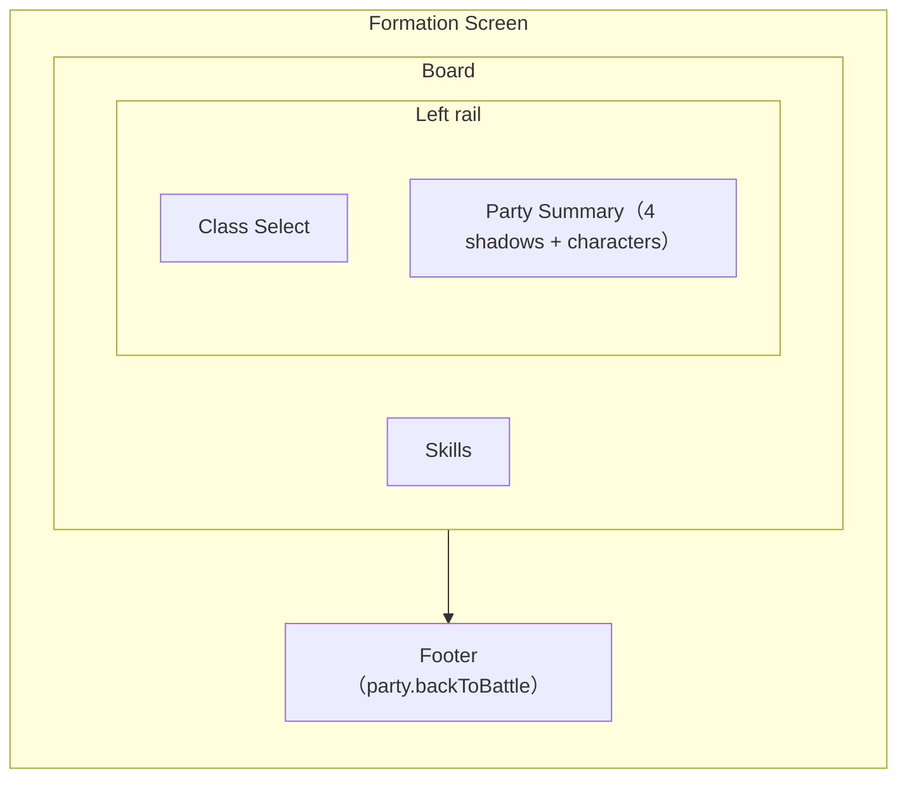

# パーティ編成 UI

実装：`src/game/gameScreen.ts`, `src/game/GameSession.ts`, `src/platform/DomFormationScreenHost.ts`, `src/ui/MetaMenuOverlay.ts`, `src/ui/SkillMenuPanel.ts`, `src/styles/game-shell.css`, `src/styles/skill-menu-panel.css`, `src/styles/meta-menu-overlay.css`, `src/ui/gameTermGlossary.ts`, `src/ui/skillCardDisplay.ts`, `src/ui/skillCardDisplayRules.ts`, `src/ui/skillCardStatusChipExtract.ts`, `src/ui/annotateGameTerms.ts`, `src/ui/GameTermPanel.ts`, `src/styles/game-term-panel.css`.**現行正本:** Class Select（直接選択 + 下部 Class Summary）+ Skills + Party Summary（4 影 + キャラ画像）。**Phase 4d:** 閲覧スキルカード（`formatSkillCardLines`）とインライン用語パネル（§6.4）を継続使用。

本ドキュメントは **メタメニューから開くパーティ編成画面**（`SkillMenuPanel`）の画面設計正本。戦闘フィールド上の隊形・座標は [battle-field.md](battle-field.md)、クラス・ロール・スキル習得は [classes-and-skills.md](classes-and-skills.md)、セーブ・Lv は [progression.md](progression.md) を参照。

**フェーズ:** 画面設計の確定は本書。実装は [phase-roadmap.md](../plans/phase-roadmap.md) の **Phase 4d**。

**現行コードとの関係:** 本書は目標仕様（**v0.4**）。Phase 4d PR1–3 で骨格・ロスター・Picker・閲覧スキルカード・用語パネル（§6.4）を実装済み。

**配信形態:** **Release M1** 体験版 → **Release M2** 初版（itch.io 第一、Steam 後回し）。デスクトップ zip は **Phase 7**（Electron、常駐 UI は廃止）。編成画面は **独立した Formation Screen**（`GameScreen: 'formation'`、`DomFormationScreenHost` / `presentation: "formation-screen"`）として **画面全体** を使う。戦闘中は `GameScreen: 'battle'` の Canvas + HTML HUD。**レイアウトの正本**は §4（構造）および **§4.4 デスクトップレスポンシブ**（1280×720 〜 1920×1080）。Release スコープは [phase-roadmap.md §Release マイルストーン](../plans/phase-roadmap.md#release-マイルストーン) を正とする。

---

## 1. 目的

本作は [design-philosophy.md](../design-philosophy.md) のとおり **編成解法型オートバトル RPG** である。パーティ編成 UI の主目的は次のとおり。

- プレイヤーが **4 人の組み合わせ**（誰を入れるか）を検討・変更できること
- 各クラスの **要約**（`summary.ja`）が **クラス選択（Picker）および詳細** で読めること
- 習得済みスキルの **内容を読んで** 編成判断に使えること（付け替え操作は不要）

操作技術の設定画面ではない。戦闘中のスキル発動順・ターゲット操作もここでは行わない。

---

## 2. 用語（混同禁止）

| 用語                        | 意味                                                                                             | 正本                                                                         |
| --------------------------- | ------------------------------------------------------------------------------------------------ | ---------------------------------------------------------------------------- |
| **選択クラス**              | Formation Screen でプレイヤーが直接選ぶ最大 4 クラス。UI 上はスロット番号・手動配置を持たない   | 本書                                                                         |
| **クラス要約**              | 編成 UI に表示する数文のプレイヤー向け解説（`summary.ja`）                                       | `classes.json`（`ClassEditorStep` で編集）                                   |
| **前衛 / 後衛**（データ）   | クラスマスタの `formationRow`。編成 UI v1 では **テキスト表示しない**（戦闘配置の正本）          | `classes.json`                                                               |
| **UI ロール**（Picker 見出し） | `defender` / `attacker` / `supporter`。Picker の **ブロック見出し** と Class Summary のロール表示で用いる。Party Summary にはロールアイコンを出さない | [classes-and-skills.md](classes-and-skills.md#1-ui-上のロール分類3-大ロール) |
| **戦闘隊形スロット**        | 接敵後の `battleX` 深度・`slotIndex`。編成枠とは別                                               | [battle-field.md](battle-field.md#1-用語)                                    |
| **プレイヤーレベル**        | アカウント共通の 1 本。習得・ステ計算・枠解放の基準（`playerProgress.level`）                    | [progression.md](progression.md)                                             |

**重要:**

- Formation Screen では **スロット番号・FRONT / BACK・前衛 / 後衛を表示しない**。プレイヤーが操作するのは「どの 4 クラスを選ぶか」であり、手動配置 UI ではない。
- 内部保存・戦闘統計の `partySlotIndex` は実装上の配列位置であり、Formation Screen 上の入力概念ではない。
- 戦闘上の前衛 / 後衛は **クラス定義の `formationRow`** に紐づく。プレイヤーが枠ごとに前列 / 後列を指定する UI は **v1 では持たない**。
- Kill / Flow / Survival はスキル設計の正本であり、編成 UI v1 では **専用ラベルとして出さない**（クラス要約 + Picker ロール見出しで足りる）。

---

## 3. 入口（スコープ外・確定済み）

以下は本書の改修対象外とする（現状維持）。

| 項目       | 内容                                                                               |
| ---------- | ---------------------------------------------------------------------------------- |
| 開き方     | 戦闘画面 Party HUD 直上の **編成** ボタン → `GameScreen` を `'formation'` に切替（モーダルではなく画面遷移） |
| 表示形態   | **フルスクリーン Formation Screen**（`meta-menu-overlay--formation-screen`）。backdrop・中央浮きパネル・背景クリック閉じ・右上 × は **用いない** |
| Hub        | Electron 専用メニューウィンドウのみ（`presentation: "window"`）。ブラウザ戦闘起動時は `initialView: "party"` で Hub をスキップ |
| タイトル   | **Formation Screen では `meta-menu-window-bar` を表示しない**（§4）。Hub モーダルのみ `menu.title` |
| 閉じる     | 画面下部の **薄いナビゲーションフッター**（§4.4）内に `party.backToBattle` を配置。**左下**・secondary 扱い。モーダル風の太いフッターパネル・primary ボタンは使わない。**右上 × は用いない** |
| 保存       | クラス差し替え時に即時セーブ（[progression.md](progression.md)）                   |

### 3.1 ウィンドウサイズ（デスクトップ正本）

**配信形態:** Release M2 以降は **Electron デスクトップアプリ** を想定。Formation Screen は **一般的なデスクトップウィンドウ比率** で破綻しないことを正とする。

| 区分 | 解像度 | 用途 |
| ---- | ------ | ---- |
| **設計基準 / 最小保証** | **1280×720** | 今後の CSS・spacing・typography の主たる調整点。これ未満ではレイアウト保証外。720p 相当で主要 UI が読めること |
| **快適基準** | **1600×900** | スキル本文が **スクロールなし** で読めることを目標 |
| **大画面** | **1920×1080** | 余白は gap / セクション padding で吸収。要素を過剰に拡大しない |

**開発時の注意:** 開発用に特殊なアスペクト比・ウィンドウサイズで表示している場合でも、**そのサイズだけに最適化した CSS 調整を正本にしない**。上表の解像度で目視確認する。

| 項目 | 方針 |
| ---- | ---- |
| 対象 | デスクトップ専用（狭幅モバイル・モーダルは想定外） |
| 旧目安 | ~~最小幅 800px~~ / ~~1366×768 設計基準~~ — **1280×720 を設計基準 / 最小保証** に更新（§4.4） |

---

## 4. 画面構成

**一枚の編成盤**として、視線順を **Class Select → Class Summary → Skills → Party Summary** に固定する。クラス選択は左上の常設 Class Select で直接行い、クラス概要はその下に表示する。Skills は右列を下端まで使う主読解領域、Party Summary は左下の確認領域とする。スロット選択や Picker オーバーレイは使わない。**ウィンドウ上部バー（`meta-menu-window-bar`）は Formation Screen では使わない**。

### 4.1 ワイヤー（領域図）



| 領域 | 内容 |
| ---- | ---- |
| **左上 · Class Select** | UI ロール別のクラス札。クリックで最大 4 クラスを直接 toggle する。選択済み・満員時追加不可を明示するが、満員時も hover / focus で概要は読める。下部に `focusedClassId` の Class Summary を表示する |
| **右列 · Skills** | `focusedClassId` の Passive / Active Skills。**スキル本文の主読解領域**として右列を下端まで使う。§6 |
| **左下 · Party Summary** | 4 つの楕円影を横並びにし、選択済みクラスのキャラ画像を影の上に表示する確認領域。カードリスト・表・手動配置 UI にしない |
| **フッター** | ナビゲーション（`party.backToBattle`）。§4.4 |

### 4.2 レイアウト方針（概要）

| 方針 | 内容 |
| ---- | ---- |
| **構造** | Board（左列: Class Select + Party Summary / 右列: Skills）→ Footer |
| **面積配分** | Class Select と Detail を主役にする。Party Summary は左下の確認領域として高さと幅を取りすぎない |
| **Class Select は常時表示** | 中央オーバーレイ Picker は使わない |
| **スクロール** | 1280×720 基準で主要情報が読めることを目標。完全表示が難しい場合のみ Detail 内の限定スクロールを許容 |
| **レスポンシブ** | 百分比だけで伸縮させず、`clamp` / min-max で **デスクトップ一般比率** に合わせる（§4.4） |

### 4.3 視線誘導

1. **クラスを選ぶ**（左上）
2. **クラス概要を読む**（左下）
3. **スキルを読む**（右上）
4. **編成結果を見る**（下段）

### 4.4 デスクトップレスポンシブレイアウト（正本）

Formation Screen の **面積配分・寸法・スクロール方針** の正本。実装は `skill-menu-panel.css` / `meta-menu-overlay.css` を主とする。

#### 4.4.1 縦方向の配分

| 領域 | 目安 | CSS 例 |
| ---- | ---- | ------ |
| **Board 上段** | 左列 Class Select + Class Summary、右列 Skills。右列 Skills は下段まで span する | `minmax(0, 1fr)` |
| **Party Summary** | 左下の 4 影 + キャラ画像。**画面高さの 14〜20%** | `clamp(118px, 17vh, 170px)` |
| **Footer** | ナビゲーション。**44〜52px** | `clamp(44px, 5vh, 52px)` |

Party Summary が Class Select / Detail を圧迫しないこと。Skills は右列の主読解領域として下端まで高さを確保する。

#### 4.4.2 Class Select（左 · 上段）

Formation Screen の主操作領域。プレイヤーはここでクラス札を直接クリックし、`selectedClassIds` を最大 4 件まで toggle する。

| 項目 | 目安 |
| ---- | ---- |
| **幅** | Detail を圧迫しない範囲で一定幅を確保する |
| **クラス札** | 独立した小プレート。表・共有罫線グリッドに見せない |
| **状態** | 未選択 / 選択済み / 4人選択済み時の未選択（追加不可） |
| **追加不可時** | disabled にせず、hover / focus で Detail を更新できる。クリック時は追加せず軽いフィードバックを出す |
| **英語名** | `epithetEn` は補助表示として残す |

#### 4.4.3 Skills（右列）

スキル本文の **主読解領域**。`focusedClassId` を表示対象にし、選択済みクラスとは限らない。Class Summary は Class Select 下部に置き、右領域は Board の上段から下端まで span し、Passive / Active に優先配分する。

| 項目 | 方針 |
| ---- | ---- |
| **Passive / Active** | **別セクション**で表示（§6.3） |
| **解放済み** | スキル **本文を優先**して読ませる。最大 2 列の独立カード |
| **未解放** | **省スペース**（チップ / ロック行）。通常カードと同面積にしない |
| **スクロール（基準）** | **1280×720** — M1 想定の習得スキル数は主要情報を初期表示で読めること。完全表示が難しい場合のみ Detail 内の限定スクロールを許容。画面全体のスクロールは禁止 |
| **スクロール（快適）** | **1600×900 以上** — スキル本文が **スクロールなし** で読めることを目標 |
| **禁止** | Detail 全体を **常時スクロール前提** にしない |

#### 4.4.4 Party Summary（左下）

編成結果の確認領域。入力起点ではなく、選択済みクラスを射程順に並べた結果だけを左下に見せる。

| 項目 | 方針 |
| ---- | ---- |
| **見た目** | 4 つの楕円影を横並び。空き状態は薄い影のみ |
| **キャラ画像** | 選択済みクラスは必ず影の上にキャラ画像を表示する |
| **表示情報** | 日本語名を主、英語名を補助。選択数表示テキストやロールアイコンは出さない |
| **並び順** | `rangePx` 降順。左が長射程、右が短射程。同射程はクラス定義順で安定ソート。並び替え時は横スライドで遷移を見せる |
| **空き枠** | 左側に残す。選択済みキャラは右詰めで表示する |
| **禁止** | Slot 番号、FRONT / BACK、前衛 / 後衛、役割ラベル、隊列変更 UI のような見せ方 |

#### 4.4.5 Footer / ナビゲーション

| 項目 | 目安 |
| ---- | ---- |
| **フッター高さ** | **44〜52px**（過剰な面積を取らない） |
| **`party.backToBattle` ボタン** | 正式な画面遷移ボタンとして見えること。主役にはしない |
| ボタン高さ | **30〜36px** |
| 最小幅 | **96〜128px** |
| 左右 padding | **16〜24px** |
| 通常モード | `selectedClassIds.length < 4` では disabled。4 人選択済みで enabled |
| デバッグモード | 0〜4 人でも enabled。少人数編成はデバッグ用状態として扱う |

**注意:** 問題はボタンが大きすぎたことではなく、**フッター全体が過剰に面積を取っていた** こと。ボタンを極小化しない。

#### 4.4.6 避けること

| 禁止 | 理由 |
| ---- | ---- |
| 開発用の特殊アスペクト比だけに最適化 | Electron 一般ウィンドウで破綻する |
| 横幅が広い前提で Party Summary を拡大 | Class Select / Detail の主従が崩れる |
| 720p 相当でスキル欄が破綻 | 最小保証の読みやすさを満たさない |
| Party Summary が縦を取りすぎ Detail が読めない | 編成判断の主領域が Detail |
| Detail 全体を常時スクロール前提 | 標準サイズでの読みやすさを放棄 |
| 遷移ボタンの極小化 | ナビゲーションとしての視認性 |
| Excel 風の罫線グリッド | §11・§15。独立プレート + gap を維持 |

#### 4.4.7 受け入れ条件（レイアウト）

1. **1280×720 / 1600×900 / 1920×1080** で破綻しにくい（1366×768 は中間確認扱い。設計基準にはしない）
2. 開発用ウィンドウサイズだけに最適化されていない
3. Class Select / Class Detail / Party Summary の **役割に応じた面積配分**
4. 設計基準（1280×720）で **主要スキル情報が読める**
5. 1280×720 で完全表示が難しい場合は **Detail area 内の限定スクロール** に逃がせる

---

## 5. Party Summary（下段 — 編成結果）

### 5.0 プレイヤーレベルとデータ正本

レベルは **クラス個別ではなくプレイヤー共通**。編成画面で参照する表示・計算の正本は **`playerProgress.level`**（[progression.md](progression.md)）。**`party[].progress` は廃止** — 表示・計算に使用しない。

| 表示場所                               | 内容                                                                                             |
| -------------------------------------- | ------------------------------------------------------------------------------------------------ |
| **ウィンドウヘッダー（タイトルバー）** | **Formation Screen では非表示**。`プレイヤー Lv` の専用表示枠は持たない |
| 詳細 · クラスヘッダー                  | **表示しない**                                                                                   |
| 詳細 · ステータス見出し                | **「Lv n」付き見出しは使わない**（例: `ステータス（Lv 12）` は廃止）                             |
| ロスター各カード                       | **表示しない**                                                                                   |
| スキル未解放枠                         | **スキル名** + 解放 **プレイヤー Lv**（例: `迎撃態勢　プレイヤー Lv10 で追加`）               |
| Exp バー                               | **表示しない**（プレイヤー共通 Exp バーは戦闘 HUD — [progression.md](progression.md)「進行 UI」） |

**実装:** Formation Screen では `MetaMenuOverlay` の `meta-menu-window-bar` を非表示。`playerProgress.level` はステ・スキル解放計算の正本（表示はスキル未解放枠の Lv 注記などに限定）。`SkillMenuPanel` は Class Select / Class Detail / Party Summary の独立領域を持つ。

### 5.1 表示枠と並び

- 表示は固定 **4 影**（`PARTY_SLOT_COUNT`）。
- 選択済みクラスは `rangePx` 降順で並べる。**左が長射程、右が短射程**。
- 同射程の場合は `classes.json` のクラス定義順（`classOrder`）で安定ソートする。
- 4 人未満では **空き影を左側に残し、選択済みキャラを右詰め**で表示する。
- クラス追加時は、既存キャラの横スライドに加えて、新規キャラ本体を上から落下させる。楕円影はキャラ本体に追従させず、クラスアイコンとクラス名は下側からフェードインし、キャラ本体が楕円影に重なる頃に表示完了する。
- これは表示規則であり、手動配置ではない。ドラッグ並べ替えは **v1 では不要**。

### 5.2 選択済み表示

各キャラ表示に必要最小限を添える。

| 要素                         | データ源       | 備考                                          |
| ---------------------------- | -------------- | --------------------------------------------- |
| 楕円影                       | —              | 空き状態でも表示する。番号・役割ラベルは付けない |
| body atlas / スプライト      | `classId`      | **必ず表示**。影の上に立つ / 乗るように見せる |
| クラスアイコン               | `classId`      | 補助表示。主役はキャラ画像 |
| `displayName`                | `classes.json` | 日本語名を主ラベル（`data-i18n-role="primary"`） |
| `epithetEn`                  | `classes.json` | 英語名を補助ラベル（`data-i18n-role="secondary"`）。i18n 対応を見据えて残す |
| クラス要約                   | `summary.ja`   | Party Summary では **表示しない** |

Party Summary のキャラをクリックすると `focusedClassId` をそのクラスへ更新する。解除操作は Class Select 側の再クリックのみとする。

#### Party Summary 寸法（目安）

実装値は多少前後してよい。

| 項目           | 目安        |
| -------------- | ----------- |
| 配置           | **4 影横並び**（gap あり。共有罫線なし） |
| 高さ           | 画面高さの 14〜20% 目安。Class Select / Detail を圧迫しない |
| キャラ画像     | 影の上に表示。潰さない |
| クラスアイコン | 24px        |

### 5.3 空き枠

薄い楕円影のみを表示する。`＋`、`クラスを追加`、Slot 番号など、入力起点に見える表示は使わない。

### 5.4 編成内訳（v1 非表示）

前衛 / 後衛・UI ロールの **人数集計行** は v1 では **表示しない**。Class Select と Detail のクラス情報で個別に分かれば足りるため。

Phase 4d 当初案にあった表示例（参考）:

`前衛 2 / 後衛 2　ディフェンダー 1　アタッカー 2　サポーター 1`

**ステージが要求する編成の正解表示や警告ではない**（Phase 6 以降の拡張）。

### 5.5 注記

Party Summary 付近に常時表示の人数注記は置かない。満員時に未選択クラスをクリックした場合など、操作フィードバックが必要なときだけ短いテキストを一時表示してよい。

---

## 6. Skills（右上メイン — focusedClassId）

`focusedClassId` のスキルを表示する。`focusedClassId` は hover / focus / click で更新され、選択済みクラスとは限らない。Class Summary は Class Select 下部に表示する。

**情報の順序（固定）:** 右上は **スキル本文の主領域**。**Passive → Active** のスキル要約カードを表示する。面積・スクロールは §4.4.3。

1. **Passive**（§6.3）— 解放済みは **最大 2 列**、未解放は **コンパクトチップ**
2. **Active**（§6.3）— 解放済みは **最大 2 列**、未解放は **コンパクトチップ**

クラス要約の長文は tooltip で補足可。**スキルが直接行う主要効果はカード内に常時表示**（hover 依存にしない）。状態の定義・持続・スタックなどは State Chip tooltip に分離し、カード本文と重複させない。

### 6.1 クラス情報（サマリー帯）

Class Summary は Class Select 下部に表示する。右列 Skills 領域には置かない。

| 要素                        | 備考                                                          |
| --------------------------- | ------------------------------------------------------------- |
| 見出し                      | `クラス概要` / `Class Summary`                                |
| `displayName` + `epithetEn` + UI ロール | 1 行（`名前 肩書き / ロール`）。アタッカーは下位ロール併記可 |
| `summary.ja`                | **最大 2 行** clamp。全文は tooltip で補足可                  |
| クラスアイコン                | サマリー帯では **表示しない**（面積はスキルへ）               |

**Lv は表示しない**（§5.0）。

### 6.2 ステータス（サマリー帯内チップ）

[progression.md](progression.md) の進行 UI 節に準拠。

- **`playerProgress.level`** で計算した **素ステ**
- **独立した大カラムは持たない**。クラスサマリー帯の下段に **横並びチップ**（例: `HP 300` `ATK 11` …）
- HP / ATK / DEF / REG / SPD / 射程 / 通常攻撃属性を 1 行（折り返し可）で表示
- 射程チップは `memberBasicAttackDisplay` 経由で `rangePx / 10` の単位なし数値 + 近接帯/遠隔帯（例: `12.8（遠隔帯）`）
- 見出し `ステータス` は **使わない**（チップラベルで足りる）

### 6.3 習得スキル（閲覧専用）

**付け替え・セット・装備変更は行わない**（[classes-and-skills.md](classes-and-skills.md#用語スキル習得-vs-装備)）。

#### レイアウト

- **上段:** クラスサマリー帯（§6.1–6.2）— コンパクト 1 ブロック
- **下段:** **パッシブ** セクション → **アクティブ** セクション（各見出し + **独立カード配置**）
- **解放済み:** セクション内に **gap を空けた戦術カード**（最大 **2 列**）。隣接カードの共有罫線・表セル化はしない
- **未解放:** カード群の下に **小さなチップ / ロック行**（`+ Lv{n}: {name}`）。通常カードと同じ面積を取らない
- **スクロール:** **1280×720** 基準で M1 想定の習得スキル数の主要情報を読めること（§4.4.4）。完全表示が難しい場合のみ Detail area **限定スクロール** を許容
- スキル本文は `resolveSkillCardDisplay().headlineLines` をカード内表示。`formatSkillCardLines` のうち状態定義に当たるリスト行は State Chip + State tooltip に分離し、情報欠けなく確認できるようにする（`skillCardStatusChipExtract.ts` が `def` から Chip を抽出し、本文から状態名を除去）

#### スキル要約カード（1 スキルあたり）

| 行 | 内容 |
| -- | ---- |
| 1 | スキル名 + アイコン（名前 **15px** 前後） |
| 2 | `metaLine`（CD・発動条件など。**12px** 前後） |
| 3+ | `headlineLines`（主要効果の短文、**14px** 前後・行間 1.55。スキルが何をするかは hover なしで読めること） |
| 末尾 | State Chip（状態として保持される効果。状態定義は State tooltip で補足） |

説明文の文面生成は [Phase 4b](../plans/phase-4-roadmap.md#4b--スキル説明自動生成日本語--完了2026-06)（`formatSkillText`、M1 8 クラス Lv0 日本語 **完了**）。**編成 UI** は `formatSkillCardLines`。**エディタ**（`SkillEditorStep`）は 1 行の `formatActiveDescription` / `formatPassiveDescription`（[classes-and-skills.md §出力 API](../spec/classes-and-skills.md#出力-api責務分担)）。

#### `formatSkillCardLines` API（Phase 4d PR1-1 確定）

| 項目 | 内容 |
| ---- | ---- |
| モジュール | `src/ui/formatSkillText.ts` |
| シグネチャ | `formatSkillCardLines(def: ActiveSkillDef \| PassiveSkillDef, options: { locale: SkillCardLocale; basicAttackRangePx?: number }): SkillCardLines` |
| `SkillCardLocale` | `'ja'` \| `'en'`（4e。`skillTextLocale` / `skillTextPhrases`） |
| `SkillCardLines` | `{ metaLine: string; effectLines: SkillCardEffectLine[] }` — 各要素は plain `string` または `{ kind: "list"; items: { text; details? }[] }`（焼き尽くす熾火の種火 / 熾火など）。画面表示では `resolveSkillCardDisplay` が headlineLines（Plain Text + Inline Term Label）と State Chip へ分類する |

**行の意味（§6.3 行 2 / 行 3+ に対応）**

| フィールド | Active | Passive |
| ---------- | ------ | ------- |
| `metaLine` | 再使用・持続・硬直・移動停止あり・発動条件を `/` 区切り 1 行（効果本文は含めない） | 発動タイミング要約（`formatPassiveTriggerSummary` 等） |
| `effectLines` | `def.effect[]` を 1 effect 1 行（`formatActiveEffectDetail` compact）。`blockResonanceConsume` は map から除外；consume 専用スキルは特殊 1 行 | `[formatPassiveEffect(...)]` 1 要素（`効果：` プレフィックスなし） |

- 文節 split 禁止 — 改行単位は **effect 配列要素**（Passive は effect 種別 1 行）。リストが必要な passive は `effectLines` に `kind: "list"` ブロックを返す。State Chip 化できる項目は本文から状態名を除外し、状態定義は State tooltip 側で表示する
- プレイヤー向けの距離・範囲・射程差分は内部 `px / 10` の単位なし数値で表示する（例: `50px` → `5`、`+30px` → `+3`）。`px` や `m` はスキル本文へ出さない
- Active の `targetShape` が Multi-Lock / AoE / 周囲 / 地点 / Pierce の場合、効果行は `[形状ラベル] {数値} / {効果}` 形式にする（[classes-and-skills.md §表示フォーマット](classes-and-skills.md#ゲーム用語表表示分類)）。Pierce の射程は `basicAttackRangePx` が渡されているとき **常に** 効果距離の絶対値で `貫通 3` のように表示する（未指定 `range` は持有者射程を用いる）
- 並び順: 特殊ルール → 計算修飾 → 基礎効果 → 追加効果。複数要素は ` / ` 区切り
- 同じ形状枠が連続する場合は、形状を各行へ重複表示せず `[形状] / {対象}に以下の効果を付与/適用` + 続く効果を **1 行に「、」区切り**で畳む（例: `[周囲] 5 / 味方に以下の効果を付与` → `攻撃力+20%、攻撃速度+15%`）
- **別枠タグ行は持たない**。形状・特殊ルールは本文内 Inline Term Label のみ
- 1 行説明の `formatActiveDescription` / `formatPassiveDescription` は **エディタ**互換として維持（編成 UI は上記 `formatSkillCardLines`）

**UI 表現:**

- `disabled` ボタンに見せない
- 未解放枠は **カード群外** の控えめな **チップ / ロック行**（`+ Lv{n}: {name}`、`party.skillLockedPreview`）。通常カードと同じ面積を取らない。`未解放枠` の太字見出し・破線枠・大きな空カードは使わない

### 6.4 用語注釈（スキルカード）

スキルカード内の情報は **Inline Term Label / State Chip / Plain Text** の 3 系統に分離する。**責務分担と重複禁止** の正本は [§スキルカード情報設計](#スキルカード情報設計)。分類ルールと表記統一は [classes-and-skills.md §ゲーム用語表（表示分類）](classes-and-skills.md#ゲーム用語表表示分類) を参照。

| 層 | 内容 | 注釈 UI |
| -- | ---- | ------- |
| `metaLine`（基本情報） | 再使用・持続・硬直・移動停止あり・発動条件 | 原則リンクなし。**例外:** `硬直` のみ用語 tooltip（`SKILL_CARD_META_LINE_TERM_IDS`） |
| 効果行（Plain Text + Inline Term Label） | 主要効果の短文。特殊ルールは本文内ラベル + tooltip | Inline Term Label のみ **用語 tooltip**（`annotateGameTermsWithTooltip` + inline allowlist） |
| State Chip | 戦闘中に保持される状態の短い要約 | **State tooltip**（`resolveStatusChipTooltip` / `statusDefinition`） |

**実装:** `src/ui/skillCardDisplay.ts`, `src/ui/skillCardDisplayRules.ts`, `src/ui/skillCardStatusChipExtract.ts`, `src/ui/GameTermTooltip.ts`, `src/ui/annotateGameTerms.ts`（`annotateGameTermsWithTooltip`）

**クラス要約・用語パネル:** クラス `summary` や戦闘 HUD バッジは従来どおり **クリック用語パネル**（`GameTermPanel`）を維持。

#### スキルカード情報設計

スキルカード上の情報の **責務分担** と **重複禁止** の正本。分類ルール・表記は [classes-and-skills.md §ゲーム用語表（表示分類）](classes-and-skills.md#ゲーム用語表表示分類) を参照。

##### 情報責務

**Plain Text + Inline Term Label（効果行）**

スキル本文は、そのスキルが直接行う効果のみを記載する。基本語は Plain Text、ゲーム固有ルールは Inline Term Label（本文内 tooltip trigger）。

**Inline Term Label tooltip**

特殊ルール・形状・計算修飾の意味を 2〜3 行で説明する。`gameTermGlossary.ts` の `tooltip`。

**State Chip**

戦闘中に保持される状態の概要を示す。本文中ラベルとは別系統。

**State tooltip**

その状態自体の定義のみを説明する（効果・持続・スタック・変化・消滅）。スキル付与条件は含めない。

##### State tooltip

State tooltip は、その状態自体の定義のみを説明する。

**記載する内容**

- 状態の効果
- 持続時間
- スタック
- 上位状態への変化
- 消滅条件（状態固有の場合）

**記載しない内容**

- どのスキルが付与するか
- どの条件で付与されるか
- どのクラスが使用するか
- スキル固有の発動条件

これらは **スキル本文** の責務とする。

##### Inline Term Label tooltip と State tooltip

| 種類 | 対象 | 説明する内容 |
| ---- | ---- | ------------ |
| **Inline Term Label tooltip** | ゲーム固有ルール（Multi-Lock、貫通、防御力無視 等） | ルールの要約（2〜3 行） |
| **State tooltip** | 戦闘中に保持される状態（バリア、種火、DoT 等） | その状態の定義だけ |

スキルカード本文では、State Chip 対象の状態名を **Inline Term Label 化しない**。本文には付与の要約のみ。Plain Text（物理ダメージ、攻撃力 等）はリンク化しない。

**例: 焼き尽くす熾火**

本文:

```
敵に攻撃スキルが1回命中するごとに「種火」を1スタックする
```

種火の State Chip hover:

```
種火

魔法DoT。

・毎秒 ATK ○% の魔法ダメージ
・10秒持続
・最大5スタック

最大スタック時、新たに付与される代わりに「熾火」へ変化する。
```

- 本文中の「種火」に **用語ホバーは付けない**（魔術士専用の固有状態であり、ゲーム全体の用語ではない）
- 付与条件（攻撃スキル命中ごと）は本文の責務。状態ホバーには書かない

##### 固有状態（辞書データ）

`skillCardDisplayRules.ts` の State Chip allowlist に載る **固有状態** は、Inline Term Label として本文中リンク化しない。`gameTermGlossary.ts` では次のみとする。

| フィールド | 固有状態 |
| ---------- | -------- |
| `statusDefinition` | **必須**（状態辞典の正本） |
| `description` | **禁止** |
| `aliases` | **禁止** |
| `tooltip` | **禁止** |

- 用語ホバー・用語パネル・HUD クリック説明の導線は設けない（固有状態名）
- 状態の説明は **State Chip のホバー**（`statusDefinition`）のみ

例: `seedFlame`（種火）／`blazingFlame`（熾火）

##### 重複禁止

同一情報を Inline Term Label・別枠タグ・State Chip へ重複表示しない。各情報は 1 か所のみを正本とする。

| 用語 | 正本 | 禁止 |
| ---- | ---- | ---- |
| Multi-Lock | 本文内 `[マルチロック] N` + Inline tooltip | 別枠タグ行、本文への再配分説明 |
| 種火 / 熾火 | State Chip + State tooltip | 本文への詳細、本文中 Inline Label |
| バリア / 障壁 | State Chip（付与時）+ 本文の付与要約 | Inline Label と State Chip の二重表示 |

#### スキルカード表示分類ルール

[スキルカード情報設計](#スキルカード情報設計) と [ゲーム用語表](classes-and-skills.md#ゲーム用語表表示分類) に従った具体例。`[]` は Inline Term Label の設計メモ表記。

**効果行（Plain Text + Inline Term Label）**

```
[マルチロック] 2 / 攻撃力の90%の魔法ダメージ
[貫通] 13 / 攻撃力の50%の物理ダメージ
[周囲] 5 / 味方の攻撃力+15%
[周囲] 5 / 味方に以下の効果を付与
攻撃力+20%
攻撃速度+15%
[スタン] 1.5秒
```

- Multi-Lock / AoE / 周囲 / 地点 / Pierce は本文内 Inline Term Label。対象数・範囲・射程差分はラベル直後の数値
- メカニクス説明（対象不足時の再配分等）は **Inline tooltip** に書き、本文へ重複させない
- 物理ダメージ / 魔法ダメージ / 攻撃力 等は Plain Text（リンク化しない）

**State Chip**

```
状態:
- バリア: 吸収量 / 持続
- 種火: DoT / 10s / Max 5
- 熾火: 強DoT / 魔法被ダメージ増加 / Max 1
```

戦闘中に保持される状態を Chip 化。本文中に同じ状態名を Inline Label 化しない。

**Inline Term Label tooltip**

```
マルチロック:
対象数まで効果を適用する。
対象が不足している場合、不足分は同じ対象へ再度適用する。
```

#### スキルカード用 tooltip の方針

| 種類 | 項目 | 内容 |
| ---- | ---- | ---- |
| Inline Term Label | 長さ | 2〜3 行。処理順・内部実装は入れない |
| Inline Term Label | 辞書 | `description`（正本）。`tooltip` は短文化が必要なときのみ。ホバーは `resolveGameTermTooltip` |
| State Chip | 内容 | [State tooltip](#state-tooltip) — 状態定義のみ。スキル付与条件は含めない |
| State Chip | 辞書 | `gameTermGlossary.ts` の `statusDefinition` または状態用 `description` |
| 共通 | 見た目 | 濃色背景・強めの枠・用語名見出し（`game-term-tooltip.css`） |
| 共通 | 起動 | ホバー + キーボードフォーカス |

#### 旧インライン用語パネル（スキルカード）

スキルカード本文では **クリック Popover（§6.4 旧）を採用しない**。長い説明は State Chip 詳細へ逃がす。

**戦闘 HUD 状態バッジ**のクリック説明は [combat.md §簡易表示 vs 詳細表示](combat.md#簡易表示-vs-詳細表示)・[battle-field.md §7.1.2](battle-field.md#712-状態バッジクリック用語パネル) を正とする（`GameTermPanel` を `BattleView` で共有）。

---

## 7. Class Select（左上 · 直接選択）

### 7.1 操作

- 未選択クラスをクリックし、`selectedClassIds.length < 4` なら編成に追加する
- 選択済みクラスをクリックすると `selectedClassIds` から解除する
- `selectedClassIds.length === 4` の状態で未選択クラスをクリックしても追加しない。差し替えモードにはせず、軽いフィードバック（例: `編成は4人までです`）を出す
- クラス札 hover / focus / click で `focusedClassId` をそのクラスへ更新し、Class Select 下部の Class Summary と右列 Skills に表示する
- 解除操作は Class Select 側の再クリックのみ。確認モード（verify mode）中も専用の `外す` ボタンは表示しない

**不採用:** スロット選択方式、差し替えモード、中央オーバーレイ Picker、決定/戻るの 2 段確認、専用の `外す` ボタン

### 7.2 リスト内容

解禁済みクラス（`unlockedClassIds`）を `classOrder` 順で表示。未解禁クラスは出さない。選択済みクラスは `--active` でハイライト。同一クラス 2 人編成は `selectedClassIds` の toggle により不可。4 人選択済み時の未選択クラスは追加不可表示にするが、hover / focus で詳細確認は可能にする。

### 7.3 グループ化

**ディフェンダー / アタッカー / サポーター** の 3 ブロック。アタッカー内はファイター / シューター / キャスター小見出し。プレビューペインは持たず、クラス要約は Class Select 下部で読む。

**レイアウト（§4.4.3）:** クラス札は **固定サイズの独立プレート**。余剰横幅は gap / ブロック余白で吸収。表・罫線グリッドに見せない。

### 7.4 コンテキスト維持

Class Select（下部 Class Summary を含む）と Skills は **同一ボード**に並列表示する。Skills は右列を下端まで使い、Party Summary は左下に置き、入力起点にはしない。

---

## 7-old. （廃止）Picker オーバーレイ

旧中央モーダル Picker（`skill-menu-picker-overlay`）は廃止。上記 Class Select を正とする。

---

## 8. ラベル一覧（UI 固定文言）

| 内部値      | 表示（formationRow） | 表示（role）   |
| ----------- | -------------------- | -------------- |
| `front`     | **編成 UI では非表示** | —              |
| `back`      | **編成 UI では非表示** | —              |
| `defender`  | —                    | ディフェンダー |
| `attacker`  | —                    | アタッカー     |
| `supporter` | —                    | サポーター     |
| （アタッカー下位 · Picker のみ） | — | ファイター / シューター / キャスター |

Class Select・Class Detail ではロール表示に **サポーター** を用いる（ヒーラー表記はクラスヘッダー等の別コンテキストで併用可）。

---

## 9. 非要件（v1）

| 項目                                   | 理由                                       |
| -------------------------------------- | ------------------------------------------ |
| 編成内訳（前衛/後衛・ロール人数集計） | §5.4。Detail とクラス情報で足りる |
| 枠ドラッグで戦闘前列 / 後列を変える    | `formationRow` 正本と矛盾                  |
| Party Summary を前列 / 後列の配置盤として見せる | プレイヤー操作の配置概念はない（§2）       |
| スキル装備・セット枠                   | 習得即参加が正本                           |
| Kill / Flow / Survival レイヤー表示    | スキル設計用。UI ロールで代替              |
| ステージ敵構成との連動ヒント           | Phase 6 コンテンツとセットで別検討         |
| 戦闘隊形のプレビュー（battleX 配置図） | battle-field の責務。編成 UI では省略      |
| 同一クラス 2 人編成                    | `getAssignableClassIds` で禁止（現行維持） |
| Picker のタブ / 横長説明カード縦リスト | §7.4 |
| Class Select の rangePx バッジ         | 射程順は Party Summary の表示規則で示す |
| 編成画面の Exp バー                    | §5.0                                       |
| Hub へ戻るボタン                       | §3                                         |
| スキル説明の「もっと見る」・最大行数   | §6.3                                       |
| Active / Passive の 2 列グリッド       | §6.3                                       |

---

## 10. アクセシビリティ・入力

- Class Select: `aria-pressed` で選択状態を示す。満員時の未選択クラスも focus 可能にし、詳細確認を妨げない
- Party Summary: キャラ表示は `aria-label` にクラス名 + `summary.ja`（要約未設定時はクラス名のみ）。**枠番号は含めない**。フォーカス中は `aria-current="true"`
- スキルカード: `role="group"` + 見出しでスキル名。スキル全体の説明を tooltip のみに頼らない（§6.3）
- インライン用語: `aria-expanded` / `aria-controls` で用語ボタンと用語パネルを関連付け。パネルは `role="dialog"` + 見出し `aria-labelledby`
- インライン用語: Enter / Space でパネル開閉。Escape で閉じる（§6.4）
- キーロード: 枠間フォーカス移動は **実装時に最低限**（v1 必須度は低め）

---

## 11. デザイン方針（DOM UI 共通）

編成画面および戦闘中の統計オーバーレイ（[battle-field.md §7](battle-field.md#7-戦闘中統計-ui)）は、Web アプリ風ダッシュボードではなく、**PC 向け RPG の情報パネル**を基調とする。Phase 4d では編成・統計・HUD バッジでこの言語を揃える。戦闘画面全体の次期 HUD レイアウト（1280×720 固定座標、左右 HUD オーバーレイ、敵 HUD）は [battle-field.md §8](battle-field.md#8-戦闘画面-ui1280720-hud) を正本とする。

| 指針 | 内容 |
| ---- | ---- |
| 印象 | **ゲーム内メニュー画面**（`game-ui-chrome.css` のパネル・スロット言語）。Web の角丸カード UI・浮遊 shadow は使わない |
| 情報の載せ方 | 左列 Class Select + 左下 Party Summary + 右列 Detail。**札・プレート・楕円影**を盤上に配置。表・スプレッドシート風の共有罫線は避ける |
| 区切り | `border-radius: 0`。見出し帯 + 面の段差 + **gap**。主要外枠のみ太枠、内側は background / padding / 薄い inset で区切る |
| スクロール | 標準スクロールバーの露出を抑える（`game-ui-scroll-pane`） |
| 装飾 | 角丸・ドロップ shadow・ピル型バッジは避ける。**独立カード同士を罫線で接続しない**（Excel セル化禁止） |
| インタラクション | ホバー・選択は背景と枠線の変化。**選択中のみ**枠を強調 |
| 用語 | 説明文内のゲーム用語は **クリック** で用語パネル（§6.4） |

---

## 12. 現行実装との差分（改修チェックリスト）

| 現行                          | 目標                                          | PR2 |
| ----------------------------- | --------------------------------------------- | --- |
| スロット選択 → クラス選択      | Class Select で直接 4 クラスを toggle         | ✅ |
| Party Setup が左上             | Party Summary を下段へ移し、確認領域にする    | ✅ |
| 詳細が選択スロット依存         | `focusedClassId` の hover / focus / click 詳細 | ✅ |
| Picker / 差し替え導線          | 常設 Class Select。差し替えモードなし         | ✅ |
| スキルが icon + hover tooltip | 縦セクション + 閲覧カード・効果単位改行       | ✅ |
| Active が `disabled` button   | 非インタラクティブなカード                    | ✅ |
| パッシブがアイコン列のみ      | Active と同型の閲覧カード列（ややコンパクト可） | ✅ |
| 縦 1 カラム（タブ上のみ）     | 左列 Class Select / Party Summary + 右列 Detail | ✅ |
| 詳細・カードに Lv 表示        | ヘッダー Lv 表示は廃止（§5.0）                | ✅ |
| `ステータス（Lv n）` 見出し   | `ステータス` のみ                             | ✅ |
| 編成内訳（人数集計行）         | 各カードの epithet で識別できるため v1 非表示 | ✅ |
| 空き枠の見た目                | 薄い楕円影のみ                               | ✅ |
| `party[].progress` 表示       | 廃止。`playerProgress.level` のみ             | ✅ |
| 説明文内用語なし              | 辞書登録語はクリック可能 + 用語パネル（§6.4） | PR3 ✅ |
| スキル icon ホバー tooltip のみ | 閲覧カード + 用語パネル                       | PR2 閲覧カード ✅ / 用語 PR3 ✅ |

---

## 13. 受け入れ条件（Formation Screen）

1. Class Select 側で最大 4 クラスを直接選べる。選択済みクラスの再クリックで解除できる
2. 4 人選択済みの未選択クラスは追加不可。ただし hover / focus で Detail は読める
3. `selectedClassIds` と `focusedClassId` が分離されている
4. 視線順が **Class Select → Class Summary → Skills → Party Summary** になっている
5. Party Summary は左下にあり、4 つの楕円影 + キャラ画像で表示される
6. Party Summary は `rangePx` 降順で、右が短射程・左が長射程。空き枠は左側に残る
7. 通常モードでは 4 人未満で `party.backToBattle` が disabled。デバッグモードでは 0〜4 人で enabled
8. Slot 番号、FRONT / BACK、前衛 / 後衛、隊列変更 UI のような見せ方がない
9. Class Summary は Class Select 下部にあり、右列 Skills は **Passive → Active** で固定される
10. 全習得スキルの主要効果を **ホバーなし・効果単位改行**で読める。状態の定義・持続・スタックは State Chip hover で欠けなく確認できる
11. Class Select が **3 ロールブロック**縦一覧（タブ・サイドバーなし）。アタッカー内は **ファイター / シューター / キャスター** 小見出しで区切る
12. スキル付け替え UI が存在しない
13. **`プレイヤー Lv {n}`** の専用ヘッダー表示は **持たない**（解放 Lv はスキル未解放枠の注記で足りる）
14. ステは `playerProgress.level` 基準の素ステ（[progression.md](progression.md) 一致）
15. Skills の **主要情報**（Passive / Active のスキル要約）は **1280×720 基準** で読める（§4.4.3）
16. **1280×720 / 1600×900 / 1920×1080** で破綻しにくい（§4.4.7）。1366×768 は中間確認扱いで、開発用特殊アスペクト比だけに最適化しない
17. スキル説明内の辞書登録用語が **クリックで用語パネル** を開く（ホバー説明なし）
18. 用語パネル内の別用語もクリックでき、**履歴 + 戻る** で遷移できる
19. 状態系用語（辞書 `statusCategory` + HUD PNG 登録済み）のパネルに **HUD 同等のアイコン** が表示される。PNG 未登録（例: バリア）や `statusCategory` なしの用語ではアイコン枠を出さない

**目視確認:** Phase 4d 完了判定として 1〜14 および §11 デザイン方針を **2026-06 に確認済み**（[phase-4-roadmap.md §4d](../plans/phase-4-roadmap.md#4d--編成-ui--統計-ui--hud完了)）。**§4.4 デスクトップレスポンシブ** は Electron 向けレイアウト再調整時に **1280×720 / 1600×900 / 1920×1080** で再確認する（1366×768 は中間確認扱い）。

---

## 14. 関連ドキュメント

| ドキュメント                                    | 関係                                   |
| ----------------------------------------------- | -------------------------------------- |
| [design-philosophy.md](../design-philosophy.md) | 編成解法・理解度向上                   |
| [battle-field.md](battle-field.md)              | `partySlotIndex`、隊形、`formationRow`、**統計 UI §7**、**戦闘画面 HUD §8** |
| [classes-and-skills.md](classes-and-skills.md)  | UI ロール、スキル習得、**UI 用語辞書** |
| [progression.md](progression.md)                | セーブ、`playerProgress`、進行 UI      |
| [phase-roadmap.md](../plans/phase-roadmap.md)   | Phase 4d 実装タイミング                |
| [phase-4-roadmap.md](../plans/phase-4-roadmap.md) | Phase 4 作業順・[M1 対象クラス](../plans/phase-4-roadmap.md#m1-対象クラス4b--4e-の第一優先)・4d/4b/4e チェックリスト |
| [combat-architecture.md](../combat-architecture.md) §8.8 | SE / BGM 方針（体験版） |

---

## 15. 検討したが採用しなかった案（記録）

設計判断の履歴。再検討時の参照用。

### 編成内訳

| 不採用案 | 理由 |
| -------- | ---- |
| ヘッダー右側へ表示 | ロスターとの対応が分かりにくい |
| 詳細エリア上部へ表示 | 編成全体を最初に把握しづらい |
| ロスター直下の人数集計行（v0.4 案） | 各カードの epithet で識別できるため冗長。v1 非表示 |

### スキルカード

| 不採用案 | 理由 |
| -------- | ---- |
| Active / Passive の 2 列グリッド | 説明量が多いクラスで可読性が下がる |
| 習得数に応じた可変列（3 列以上） | 表セル化しやすく、解放済みカードの読みやすさが下がる |
| Excel 風の罫線グリッド（Class Select / Detail / Skills） | 独立プレート + gap を維持（§4.4.6） |
| 説明文の最大行数制限、「もっと見る」 | 同上 |
| 説明文を 1 段落表示 | 同上 |
| 用語説明を **ホバー tooltip** | クリック Popover + パネル内リンク遷移を採用（§6.4） |
| 用語パネルの **ネスト popover** | 1 パネル + 内容差し替え + 戻るで十分 |

### Class Select

| 不採用案 | 理由 |
| -------- | ---- |
| タブ切替、左サイドバー | 15 クラス規模では 3 ブロック縦一覧の方が一覧性が高い |
| rangePx（近接・遠隔）バッジ | Party Summary の射程順表示で足りる |

### Party Summary

| 不採用案 | 理由 |
| -------- | ---- |
| `＋` / `クラスを追加` プレースホルダー | 入力起点に見える。空きは薄い影だけで足りる |
| Party Summary に枠番号（`Slot 1` 等）を表示 | 並びに戦術的意味があるように見える |
| 2×2 盤面グリッド（上下を前列 / 後列と見なす配置） | 編成スロットと戦闘配置を混同させる |
| 未解放スキルを通常カードと同じグリッド面積で表示 | 解放済みスキル本文の可読性を損なう（§6.3） |
| Party Summary にクラス要約 | 確認領域の情報量が増えすぎる。要約は Detail / Class Select で読む |

### ウィンドウ

| 不採用案 | 理由 |
| -------- | ---- |
| 640px 最小幅 | 情報密度不足 |
| ~~800px 最小幅~~ / ~~1366×768 設計基準~~ | **1280×720** を設計基準 / 最小保証に更新（§3.1） |
| 開発用特殊アスペクト比だけへの最適化 | 一般デスクトップで破綻（§4.4.6） |
| Party Summary を大きく拡大 | Class Select / Detail を優先（§4.4.4） |
| Class Select のクラス札を横幅いっぱいに伸長 | gap / 余白で吸収（§4.4.2） |
| Detail 全体の常時スクロール | 標準サイズではスクロールなし（§4.4.3） |
| 遷移ボタンの極小化 | フッター面積削減が本筋（§4.4.5） |
| Exp バー表示 | 画面責務が戦闘 HUD と重複 |
| Hub へ戻るボタン | 閉じるで足りる |

---

## 16. 音声設定（体験版）

**スコープ:** Phase 4d 外。SE / BGM の設計正本は [combat-architecture.md §8.8](../combat-architecture.md#88-sound初期版体験版)。

初期版・体験版では SE を確認用フィードバックとして導入する。BGM は必須ではない。導入する場合も **SE と BGM を分離** し、それぞれ音量調整・ミュートできるようにする。

| 項目 | 方針 |
| ---- | ---- |
| SE ミュート | 戦闘確認音のみ止める。popup / HUD は維持 |
| BGM ミュート | 環境音・ループのみ止める |
| 設定 UI の配置 | **未確定** — `MetaMenuOverlay` 配下、別 Settings 画面、または Phase 6d 以降の共通設定 UI のいずれか。実装着手時に本節を更新する |
| 永続化 | セーブまたは localStorage。キー名は実装時に `projectIdentity.ts` の prefix に合わせる |

編成画面そのものに音量スライダーを置く必要はない。プレイヤーが編成に集中できるよう、設定は戦闘 HUD 近傍またはメニューから 1 か所で触れる形を想定する。

---

## 17. 未確定・TBD

| 項目                                | メモ                                                       |
| ----------------------------------- | ---------------------------------------------------------- |
| 用語辞書の初版登録語一覧            | `formatSkillText` 頻出語から段階追加（全量一覧は spec に転記しない） |
| Party Summary の影・キャラ表示寸法  | §5.2・§4.4.4 の範囲で CSS 調整可                           |
| 1280×720 時の Detail 限定スクロール閾値 | 習得スキル数・クラス次第。実装時に M1 8 クラスで目視     |
