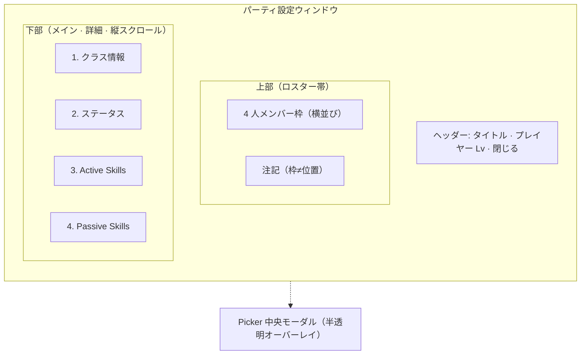

# パーティ編成 UI

実装：`src/ui/MetaMenuOverlay.ts`, `src/ui/SkillMenuPanel.ts`, `src/styles/skill-menu-panel.css`, `src/styles/meta-menu-overlay.css`, `src/ui/gameTermGlossary.ts`, `src/ui/annotateGameTerms.ts`, `src/ui/GameTermPanel.ts`, `src/styles/game-term-panel.css`。**Phase 4d PR1:** 上ロスター（`formationBlockEl`）+ 下詳細（`bodyEl`）の flex 縦積み・詳細のみ scroll・ヘッダー Lv。**PR2:** ロスターカード・注記・Picker オーバーレイ・閲覧スキルカード（`formatSkillCardLines`）。**PR3:** インライン用語パネル（§6.4）。

本ドキュメントは **メタメニューから開くパーティ編成画面**（`SkillMenuPanel`）の画面設計正本。戦闘フィールド上の隊形・座標は [battle-field.md](battle-field.md)、クラス・ロール・スキル習得は [classes-and-skills.md](classes-and-skills.md)、セーブ・Lv は [progression.md](progression.md) を参照。

**フェーズ:** 画面設計の確定は本書。実装は [phase-roadmap.md](../plans/phase-roadmap.md) の **Phase 4d**。

**現行コードとの関係:** 本書は目標仕様（**v0.4**）。Phase 4d PR1–3 で骨格・ロスター・Picker・閲覧スキルカード・用語パネル（§6.4）を実装済み。

**配信形態:** 最終的に **Electron デスクトップアプリ**（Phase 8）を正とする。編成画面は **十分な幅のウィンドウ**（`MetaMenuOverlay` の `presentation: "window"`）で見せる。レイアウトの正本は **上: ロスター / 下: 詳細** の縦積み（§4）。

---

## 1. 目的

本作は [design-philosophy.md](../design-philosophy.md) のとおり **編成解法型オートバトル RPG** である。パーティ編成 UI の主目的は次のとおり。

- プレイヤーが **4 人の組み合わせ**（誰を入れるか）を検討・変更できること
- 各クラスの **戦闘上の立ち位置の目安**（前衛 / 後衛）と **UI ロール** が選ぶ前に分かること
- 習得済みスキルの **内容を読んで** 編成判断に使えること（付け替え操作は不要）

操作技術の設定画面ではない。戦闘中のスキル発動順・ターゲット操作もここでは行わない。

---

## 2. 用語（混同禁止）

| 用語                        | 意味                                                                                             | 正本                                                                         |
| --------------------------- | ------------------------------------------------------------------------------------------------ | ---------------------------------------------------------------------------- |
| **編成枠** / **メンバー枠** | パーティ 4 人のうち「誰を入れるか」を選ぶ UI スロット。`partySlotIndex` 0〜3                     | 本書                                                                         |
| **前衛 / 後衛**（表示）     | クラスマスタの `formationRow`（`front` / `back`）の日本語ラベル                                  | `classes.json`                                                               |
| **UI ロール**               | `defender` / `attacker` / `supporter` の表示分類                                                 | [classes-and-skills.md](classes-and-skills.md#1-ui-上のロール分類3-大ロール) |
| **戦闘隊形スロット**        | 接敵後の `battleX` 深度・`slotIndex`。編成枠とは別                                               | [battle-field.md](battle-field.md#1-用語)                                    |
| **プレイヤーレベル**        | アカウント共通の 1 本。習得・ステ計算・枠解放の基準（`playerProgress.level`）                    | [progression.md](progression.md)                                             |

**重要:**

- 編成枠の **並び順・番号は戦闘上の前列 / 後列を決めない**（[battle-field.md](battle-field.md) の `partySlotIndex` 節）。
- 戦闘上の前衛 / 後衛は **クラス定義の `formationRow`** に紐づく。プレイヤーが枠ごとに前列 / 後列を指定する UI は **v1 では持たない**。
- Kill / Flow / Survival はスキル設計の正本であり、編成 UI v1 では **専用ラベルとして出さない**（UI ロール + 前衛 / 後衛で足りる）。

---

## 3. 入口（スコープ外・確定済み）

以下は本書の改修対象外とする（現状維持）。

| 項目       | 内容                                                                               |
| ---------- | ---------------------------------------------------------------------------------- |
| 開き方     | 戦闘画面メニュー → `MetaMenuOverlay`（ウィンドウ想定）                             |
| Hub        | 「パーティ」で `SkillMenuPanel` を表示。`initialView: "party"` 時は Hub をスキップ |
| タイトル   | ウィンドウ見出し「パーティ設定」                                                   |
| ヘッダー Lv | `プレイヤー Lv {n}`（§5.0）。**Exp バーは表示しない**                              |
| 閉じる     | ウィンドウ × のみ。**Hub へ戻るボタンは追加しない**                                |
| 保存       | クラス差し替え時に即時セーブ（[progression.md](progression.md)）                   |

### 3.1 ウィンドウサイズ

| 項目         | 目安                                      |
| ------------ | ----------------------------------------- |
| 最小幅       | おおよそ **800px**                        |
| 推奨表示幅   | おおよそ **1000〜1200px**                  |
| 対象         | デスクトップ専用（狭幅モーダルは想定外） |

---

## 4. 画面構成

縦方向に **ヘッダー → 上部ロスター（Overview）→ 下部詳細（Detail）** を並べる。4 人の編成枠は **メインコンテンツの上** に常時固定し、その下に選択中メンバーの詳細を広く表示する。クラス選択は **オーバーレイ（Picker）** で行い、上部ロスターは隠さない。

### 4.1 ワイヤー（領域図）

Markdown の箱線 ASCII は **全角文字と半角文字の幅差** でプレビューごとにズレる。本書では **Mermaid** で領域だけ示す（実装のピクセル指定ではない）。

| 領域                         | 内容                                                                                       |
| ---------------------------- | ------------------------------------------------------------------------------------------ |
| **ヘッダー（タイトルバー）** | 「パーティ設定」+ **`プレイヤー Lv {n}`**（§5.0）+ 閉じる。Lv は **ここ 1 か所だけ**       |
| **上部 · ロスター帯**        | メンバー枠 4 つを **横一列**（全幅）。§5.2・§5.3。メインの上に固定                         |
| 上部 · 注記                  | ロスター帯 **直下** に 1 行（§5.5）                                                        |
| **下部 · メイン（詳細）**    | §6 の順序で表示。**全体**が縦スクロール対象（**Lv なし**）                                   |
| Picker                       | **中央モーダル**。半透明オーバーレイ上。ロスター帯は背面に見える                           |

### 4.2 レイアウト方針

| 方針                               | 内容                                                                            |
| ---------------------------------- | ------------------------------------------------------------------------------- |
| **上ロスター / 下詳細**            | ロスター帯は `flex-shrink: 0` で高さ固定。詳細は `flex: 1` + `overflow-y: auto` |
| 陣形グリッドにしない               | 横 4 枠は **メンバー選択バー**。戦闘上の前後列の配置 UI ではない                |
| ピッカーは重ねる                   | 現行の「上部タブごと非表示 → 全画面リスト」は廃止                               |
| ロスターはスクロールに巻き込まない | 詳細だけスクロールし、4 人バー・注記は常に見える                            |

### 4.3 視線誘導

UI は次の順で情報を理解できる構成とする。

1. **現在の 4 人を見る**（ロスター帯）
2. **選択中クラスを理解する**（詳細 · クラス情報・ステータス）
3. **スキルを読む**（Active / Passive）
4. **必要ならクラス変更する**（Picker）

---

## 5. Overview（上部ロスター帯 — パーティ 4 枠）

### 5.0 プレイヤーレベルとデータ正本

レベルは **クラス個別ではなくプレイヤー共通**。編成画面で参照する表示・計算の正本は **`playerProgress.level`**（[progression.md](progression.md)）。**`party[].progress` は廃止** — 表示・計算に使用しない。

| 表示場所                               | 内容                                                                                             |
| -------------------------------------- | ------------------------------------------------------------------------------------------------ |
| **ウィンドウヘッダー（タイトルバー）** | `プレイヤー Lv {n}` を **画面で 1 か所だけ**。タイトル「パーティ設定」の右側（閉じるボタンの左） |
| 詳細 · クラスヘッダー                  | **表示しない**                                                                                   |
| 詳細 · ステータス見出し                | **「Lv n」付き見出しは使わない**（例: `ステータス（Lv 12）` は廃止）                             |
| ロスター各カード                       | **表示しない**                                                                                   |
| スキル未解放枠                         | **プレイヤー Lv** の閾値のみ（例: `プレイヤー Lv10 で追加`）                                    |
| Exp バー                               | **表示しない**（プレイヤー共通 Exp バーは戦闘 HUD — [progression.md](progression.md)「進行 UI」） |

**実装:** `MetaMenuOverlay` の `meta-menu-window-bar` に Lv 表示。`SkillMenuPanel` の `formationBlockEl`（上部ロスター帯）と `bodyEl`（下部詳細）を縦積みにする。

### 5.1 枠数と並び

- 固定 **4 枠**（`PARTY_SLOT_COUNT`）。
- 各枠は `partySlotIndex` と 1:1。**横一列**（`grid-template-columns: repeat(4, 1fr)` 等）。ドラッグ並べ替えは **v1 では不要**（順序は HUD 紐づけ用のみ）。

### 5.2 メンバー枠（入力済み）

各カードに表示する。

| 要素                         | データ源       | 備考                                          |
| ---------------------------- | -------------- | --------------------------------------------- |
| ロールアイコン（左上）       | `role`         | 状態アイコン `def` / `atk` / `hot` を白 tint + 50% 透明で装飾表示。`aria-label` と重複するため装飾のみ |
| クラスアイコン or スプライト | `classId`      | body atlas 優先                               |
| `displayName` + `epithetEn`  | `classes.json` | **2 段表示**（漢字 + 英語肩書き）。ロスターでも必須 |
| 前衛 / 後衛                  | `formationRow` | `front` → 前衛、`back` → 後衛                 |
| UI ロール                    | `role`         | ディフェンダー / アタッカー / サポーター |

選択中枠は視覚的にハイライトする（軽い発光や色変化。§15）。

#### ロスターカード寸法（目安）

実装値は多少前後してよい。

| 項目           | 目安        |
| -------------- | ----------- |
| カード高さ     | 90〜110px   |
| カード最小幅   | 150〜180px  |
| アイコンサイズ | 48〜64px    |

### 5.3 空き枠

プレースホルダー表示:

- **`＋`**
- **`クラスを追加`**

クリックでその `partySlotIndex` を選択し、Picker を開く。

### 5.4 編成内訳（v1 非表示）

前衛 / 後衛・UI ロールの **人数集計行** は v1 では **表示しない**。各ロスターカードと詳細のクラス情報で個別に分かれば足りるため。

Phase 4d 当初案にあった表示例（参考）:

`前衛 2 / 後衛 2　ディフェンダー 1　アタッカー 2　サポーター 1`

**ステージが要求する編成の正解表示や警告ではない**（Phase 6 以降の拡張）。

### 5.5 注記

ロスター帯 **直下** に 1 行（スタイルは控えめ）:

> メンバー枠の並びは戦闘位置に影響しません。前衛 / 後衛はクラスごとに決まります。

---

## 6. Detail（下部メイン — 選択中メンバー）

`selectedIndex` のメンバーを表示。空き枠選択時は「クラスを選んでください」+ Picker 誘導のみ。

**情報の順序（固定）:** 詳細エリア全体を縦スクロール対象とし、次の順で並べる。

1. **クラス情報**（§6.1）
2. **ステータス**（§6.2）
3. **Active Skills**（§6.3）
4. **Passive Skills**（§6.3）

個別スキルカードに高さ制限や「もっと見る」は設けない。長い説明は詳細エリアのスクロールで吸収する。

### 6.1 クラス情報

| 要素                        | 備考                                                          |
| --------------------------- | ------------------------------------------------------------- |
| `displayName` + `epithetEn` | 2 段表示                                                      |
| 前衛 / 後衛 · UI ロール     | Picker の `formatClassDescription` と **同じ文言** を常時表示 |
| クラス変更                  | ボタン 1 つ → Picker オーバーレイ                             |

**Lv は表示しない**（§5.0）。

### 6.2 ステータス

[progression.md](progression.md) の進行 UI 節に準拠。

- **`playerProgress.level`**（`resolveEffectiveLevel`）で計算した **素ステ**（戦闘中バフ / デバフは含めない）
- 見出しは **`ステータス`** のみ
- HP（ラベル `HP`）/ 攻撃力 / 防御力 / 魔法耐性（`REG`）/ 攻撃速度（SPD 5 段階ラベル）
- **射程** — 基本攻撃の実効射程 + 近接帯 / 遠隔帯（数値は px 単位だが UI では `px` 表記しない。`traits.rangePx` または basic effect の `range`）
- **基本攻撃** — 通常攻撃の属性（`物理` / `魔法` / `回復`）。primary effect が `heal` なら回復、それ以外は effect / traits の `damageType`

### 6.3 習得スキル（閲覧専用）

**付け替え・セット・装備変更は行わない**（[classes-and-skills.md](classes-and-skills.md#用語スキル習得-vs-装備)）。

#### レイアウト

- **Active** と **Passive** は **縦方向にセクション分割**する（見出しで区切る）。
- 各セクション内は **縦リスト**（**2 列グリッドにしない**）。
- Active / Passive とも **閲覧専用カード**で統一する。Passive は Active よりややコンパクトでもよいが、**情報密度・デザイン言語は統一**する。

段階解放: Lv0=2 / Lv10=+1 / Lv20=+1（プレイヤーレベル基準。`getUnlockedActiveSlotCount` と同型の passive 側）。

#### スキルカード（1 スキルあたり）

ホバー tooltip に依存しない。**カード内に常時表示**する。

| 行     | 内容                                                                                       |
| ------ | ------------------------------------------------------------------------------------------ |
| 1      | スキル名 + スキルアイコン（あれば）                                                        |
| 2      | 種別補足（Active: CD 表示 / Passive: 発動タイミング要約）                                  |
| 3+     | 説明文（`formatSkillText` 系。**効果単位で改行**。1 段落にまとめない）                     |
| フッタ | 習得に必要だった **プレイヤー Lv**（わかる場合） / 未解放枠は `プレイヤー Lv10 で追加` 等 |

説明文の文面生成は [Phase 4b](../plans/phase-roadmap.md)（`formatSkillText`）。**効果単位改行**は `formatSkillCardLines`（`src/ui/formatSkillText.ts`）でエディタプレビューと編成 UI を揃える。

#### `formatSkillCardLines` API（Phase 4d PR1-1 確定）

| 項目 | 内容 |
| ---- | ---- |
| モジュール | `src/ui/formatSkillText.ts` |
| シグネチャ | `formatSkillCardLines(def: ActiveSkillDef \| PassiveSkillDef, options: { locale: SkillCardLocale }): SkillCardLines` |
| `SkillCardLocale` | v1 は `'ja'` のみ（将来 `en` 拡張可能） |
| `SkillCardLines` | `{ metaLine: string; effectLines: string[] }` |

**行の意味（§6.3 行 2 / 行 3+ に対応）**

| フィールド | Active | Passive |
| ---------- | ------ | ------- |
| `metaLine` | CD・持続・硬直・条件を `/` 区切り 1 行（効果本文は含めない） | 発動タイミング要約（`formatPassiveTriggerSummary` 等） |
| `effectLines` | `def.effect[]` を 1 effect 1 行（`formatActiveEffectDetail` compact）。`blockResonanceConsume` は map から除外；consume 専用スキルは特殊 1 行 | `[formatPassiveEffect(...)]` 1 要素（`効果：` プレフィックスなし） |

- 文節 split 禁止 — 改行単位は **effect 配列要素**（Passive は effect 種別 1 行）
- 1 行説明の `formatActiveDescription` / `formatPassiveDescription` は tooltip・エディタ互換として維持

**UI 表現:**

- `disabled` ボタンに見せない
- 未解放枠はロック表示 + 解放プレイヤー Lv のみ

### 6.4 インライン用語パネル

スキルカード説明文（§6.3 行 3+）内の **ゲーム用語** を、本文は常時表示のまま **クリックで補足** する。スキル全体の説明をホバー tooltip だけに頼る設計（§6.3）とは両立する。

**辞書正本:** [classes-and-skills.md §UI 用語辞書](classes-and-skills.md#ui-用語辞書)（locale キー付き、`ja` のみ v1）。

#### 起動と見た目

| 項目 | 内容 |
| ---- | ---- |
| 起動 | **クリック**（ホバーでは説明を出さない） |
| 本文中の用語 | `<button type="button">` 相当。点線下線などでクリック可能と分かる装飾（§11） |
| ホバー | **「クリックできる」ヒント**（色・下線）のみ。説明テキストは出さない |
| パネル | 用語近傍の **固定 Popover**（1 インスタンス）。ネイティブ `title` 属性は使わない |
| 状態系用語 | 辞書 `statusCategory` があるとき、見出し横に **HUD と同じ状態アイコン** |

#### パネル内容

| 要素 | 内容 |
| ---- | ---- |
| 見出し | 辞書 `title[locale]` |
| 本文 | 辞書 `description[locale]` |
| アイコン | `statusCategory` 指定時のみ |

#### パネル内の用語リンク（ネスト）

パネル本文にも別のゲーム用語が含まれる場合、**同じ辞書・同じリンク化** を適用する。

| 操作 | 動作 |
| ---- | ---- |
| パネル内の用語クリック | パネル内容を **その用語の説明に差し替え**。履歴スタックに push |
| 戻る | 履歴が 2 件以上のとき **← {直前の用語名}** を表示。1 つ pop して差し替え |
| ネスト popover | **採用しない**（位置計算が複雑。1 パネル + 差し替え + 戻る） |

#### 開閉

| 操作 | 動作 |
| ---- | ---- |
| 用語クリック | 他パネルが開いていれば閉じてから開く（**同時 1 件**） |
| 同じ用語を再クリック | トグルで閉じる |
| パネル外クリック | 閉じる |
| `Escape` | 履歴があれば **戻る**（1 件 pop）。空なら **閉じる** |
| 詳細エリアスクロール | **閉じる** + 履歴クリア。`position: fixed` の初回配置のみ（スクロール追従は v1 非対応） |
| パネル本体の overflow スクロール | **閉じない** |

#### 現行実装との関係

現行 `SkillMenuPanel` のスキルアイコン **ホバー tooltip**（`skill-menu-floating-tooltip`）は 4d で §6.3 の閲覧カードへ置き換える。用語パネルは **説明文内の用語** 向けであり、スキル全体を tooltip のみで見せる用途ではない。

#### スコープ外（v1）

| 項目 | 理由 |
| ---- | ---- |
| Canvas HUD バッジのクリック説明 | DOM 用語パネルとは別 UI。必要なら別タスク |
| 英語 UI | 辞書形状のみ locale 対応。v1 表示は `ja` 固定 |
| スキル JSON への用語説明フィールド | 辞書 + `formatSkillText` 方針 |

---

## 7. Picker（クラス選択オーバーレイ）

### 7.1 開き方

- Overview の空き枠 / 入力済み枠クリック
- Detail の「クラスを変更」
- 対象 `partySlotIndex` は選択中インデックスを正とする

### 7.2 閉じ方

- クラス決定（即セーブ）
- 「外す」（`null` メンバー）
- キャンセル（変更なし）

### 7.3 リスト内容

`getAssignableClassIds` の結果を表示。

- 他枠で使用中の `classId` は **選択不可**
- `unlockedClassIds` 外は表示しない

### 7.4 グループ化と配置

| 項目     | 内容                                                                                    |
| -------- | --------------------------------------------------------------------------------------- |
| 構成     | **ディフェンダー / アタッカー / サポーター** の **3 ブロック**（見出し + 縦リスト）     |
| 不採用   | タブ切替、左サイドバー方式                                                              |
| 配置     | **半透明オーバーレイ上の中央モーダル**                                                  |
| 各行     | `displayName` + 前衛/後衛 + UI ロール（`formatClassDescription` 相当）                  |
| rangePx  | v1 では **表示しない**（近接 / 遠隔バッジなし）                                         |

### 7.5 コンテキスト維持

Picker 表示中も **上部ロスター帯は背面に見える**。他 3 人が誰か忘れないこと。

---

## 8. ラベル一覧（UI 固定文言）

| 内部値      | 表示（formationRow） | 表示（role）   |
| ----------- | -------------------- | -------------- |
| `front`     | 前衛                 | —              |
| `back`      | 後衛                 | —              |
| `defender`  | —                    | ディフェンダー |
| `attacker`  | —                    | アタッカー     |
| `supporter` | —                    | サポーター     |

ロスターカード・クラス情報でもロール表示は **サポーター** を用いる（ヒーラー表記はクラスヘッダー等の別コンテキストで併用可）。

---

## 9. 非要件（v1）

| 項目                                   | 理由                                       |
| -------------------------------------- | ------------------------------------------ |
| 編成内訳（前衛/後衛・ロール人数集計） | §5.4。各カードで足りる           |
| 枠ドラッグで戦闘前列 / 後列を変える    | `formationRow` 正本と矛盾                  |
| スキル装備・セット枠                   | 習得即参加が正本                           |
| Kill / Flow / Survival レイヤー表示    | スキル設計用。UI ロールで代替              |
| ステージ敵構成との連動ヒント           | Phase 6 コンテンツとセットで別検討         |
| 戦闘隊形のプレビュー（battleX 配置図） | battle-field の責務。編成 UI では省略      |
| 同一クラス 2 人編成                    | `getAssignableClassIds` で禁止（現行維持） |
| Picker のタブ / 左サイドバー           | §7.4                                       |
| Picker の rangePx バッジ               | §7.4                                       |
| 編成画面の Exp バー                    | §5.0                                       |
| Hub へ戻るボタン                       | §3                                         |
| スキル説明の「もっと見る」・最大行数   | §6.3                                       |
| Active / Passive の 2 列グリッド       | §6.3                                       |

---

## 10. アクセシビリティ・入力

- ロスター各枠: `aria-label` にクラス名 + 前衛/後衛 + ロール
- スキルカード: `role="group"` + 見出しでスキル名。スキル全体の説明を tooltip のみに頼らない（§6.3）
- インライン用語: `aria-expanded` / `aria-controls` で用語ボタンと用語パネルを関連付け。パネルは `role="dialog"` + 見出し `aria-labelledby`
- インライン用語: Enter / Space でパネル開閉。Escape で閉じる（§6.4）
- キーロード: 枠間フォーカス移動は **実装時に最低限**（v1 必須度は低め）

---

## 11. デザイン方針（DOM UI 共通）

編成画面および戦闘中の統計オーバーレイ（[battle-field.md §7](battle-field.md#7-戦闘中統計-ui)）は、Web アプリ風ダッシュボードではなく、**PC 向け RPG の情報パネル**を基調とする。Phase 4d では編成・統計・HUD バッジでこの言語を揃える。

| 指針 | 内容 |
| ---- | ---- |
| 情報の載せ方 | カードを多数並べるより、**縦方向の情報パネル**として整理する |
| 区切り | **余白**と**細いセパレーター**を基本とする |
| 装飾 | 過度な枠線・装飾は用いない。大きな角丸やダッシュボード風レイアウトは避ける |
| インタラクション | ホバー・選択は**軽い発光や色変化**。過度なアニメーションは行わない |
| 用語 | 説明文内のゲーム用語は **クリック** で用語パネル（§6.4）。ホバーで説明全文は出さない |

---

## 12. 現行実装との差分（改修チェックリスト）

| 現行                          | 目標                                          | PR2 |
| ----------------------------- | --------------------------------------------- | --- |
| 見出し「編成枠」              | 「パーティ」等、陣形と誤解されない名称        | —（見出し廃止・ロスター帯のみ） |
| タブのみにクラス名            | ロスターカードに epithet・前衛/後衛・ロール   | ✅ |
| 詳細に前衛/後衛なし           | クラス情報に常時表示                          | ✅ |
| Picker で上部タブ hidden      | 中央モーダル・オーバーレイ                    | ✅ |
| スキルが icon + hover tooltip | 縦セクション + 閲覧カード・効果単位改行       | ✅ |
| Active が `disabled` button   | 非インタラクティブなカード                    | ✅ |
| パッシブがアイコン列のみ      | Active と同型の閲覧カード列（ややコンパクト可） | ✅ |
| 縦 1 カラム（タブ上のみ）     | 上ロスター + 下詳細の縦積み                   | PR1 ✅ |
| 詳細・カードに Lv 表示        | `playerProgress.level` をヘッダーのみ         | ✅ |
| `ステータス（Lv n）` 見出し   | `ステータス` のみ                             | ✅ |
| 編成内訳（人数集計行）         | ロスターカードで個別に分かるため v1 非表示    | ✅ |
| 空き枠の見た目                | `＋` / `クラスを追加`                         | ✅ |
| `party[].progress` 表示       | 廃止。`playerProgress.level` のみ             | ✅ |
| 説明文内用語なし              | 辞書登録語はクリック可能 + 用語パネル（§6.4） | PR3 ✅ |
| スキル icon ホバー tooltip のみ | 閲覧カード + 用語パネル                       | PR2 閲覧カード ✅ / 用語 PR3 ✅ |

---

## 13. 受け入れ条件（Phase 4d 完了）

1. 4 人ロスターで各メンバーの **前衛/後衛**・**UI ロール**・**epithetEn** が分かる
2. クラス選択中も **ロスター帯が視界に残る**（中央モーダル Picker）
3. 詳細の情報順が **クラス → ステ → Active → Passive** で固定される
4. 全習得スキル説明を **ホバーなし・効果単位改行**で読める
5. 「メンバー枠の並びは戦闘位置に影響しない」注記がある
6. Picker が **3 ロールブロック**縦一覧（タブ・サイドバーなし）
7. スキル付け替え UI が存在しない
8. **`プレイヤー Lv {n}`** がヘッダーに 1 か所のみ（Exp バー・詳細 Lv なし）
9. ステは `playerProgress.level` 基準の素ステ（[progression.md](progression.md) 一致）
10. 詳細スクロール時も **ロスター帯が固定**される
11. 最小幅おおよそ 800px で破綻しない
12. スキル説明内の辞書登録用語が **クリックで用語パネル** を開く（ホバー説明なし）
13. 用語パネル内の別用語もクリックでき、**履歴 + 戻る** で遷移できる
14. 状態系用語（辞書 `statusCategory`）のパネルに **HUD 同等のアイコン** が表示される

---

## 14. 関連ドキュメント

| ドキュメント                                    | 関係                                   |
| ----------------------------------------------- | -------------------------------------- |
| [design-philosophy.md](../design-philosophy.md) | 編成解法・理解度向上                   |
| [battle-field.md](battle-field.md)              | `partySlotIndex`、隊形、`formationRow`、**統計 UI §7** |
| [classes-and-skills.md](classes-and-skills.md)  | UI ロール、スキル習得、**UI 用語辞書** |
| [progression.md](progression.md)                | セーブ、`playerProgress`、進行 UI      |
| [phase-roadmap.md](../plans/phase-roadmap.md)   | Phase 4d 実装タイミング                |

---

## 15. 検討したが採用しなかった案（記録）

設計判断の履歴。再検討時の参照用。

### 編成内訳

| 不採用案 | 理由 |
| -------- | ---- |
| ヘッダー右側へ表示 | ロスターとの対応が分かりにくい |
| 詳細エリア上部へ表示 | 編成全体を最初に把握しづらい |
| ロスター直下の人数集計行（v0.4 案） | 各カードで前衛/後衛・ロールが分かるため冗長。v1 非表示 |

### スキルカード

| 不採用案 | 理由 |
| -------- | ---- |
| Active / Passive の 2 列グリッド | 説明量が多いクラスで可読性が下がる |
| 説明文の最大行数制限、「もっと見る」 | 同上 |
| 説明文を 1 段落表示 | 同上 |
| 用語説明を **ホバー tooltip** | クリック Popover + パネル内リンク遷移を採用（§6.4） |
| 用語パネルの **ネスト popover** | 1 パネル + 内容差し替え + 戻るで十分 |

### Picker

| 不採用案 | 理由 |
| -------- | ---- |
| タブ切替、左サイドバー | 15 クラス規模では 3 ブロック縦一覧の方が一覧性が高い |
| rangePx（近接・遠隔）表示 | v1 では情報量が十分 |

### ロスター帯

| 不採用案 | 理由 |
| -------- | ---- |
| 破線プレースホルダー | クリック可能性が分かりにくい |
| epithetEn を詳細のみ表示 | ロスターでのクラス識別性が下がる |

### ウィンドウ

| 不採用案 | 理由 |
| -------- | ---- |
| 640px 最小幅 | 情報密度不足 |
| Exp バー表示 | 画面責務が戦闘 HUD と重複 |
| Hub へ戻るボタン | 閉じるで足りる |

---

## 16. 未確定・TBD

| 項目                                | メモ                                                       |
| ----------------------------------- | ---------------------------------------------------------- |
| 用語辞書の初版登録語一覧            | `formatSkillText` 頻出語から段階追加（全量一覧は spec に転記しない） |
| ロスター帯のピクセル寸法            | §5.2 目安の範囲で CSS 調整可                               |
