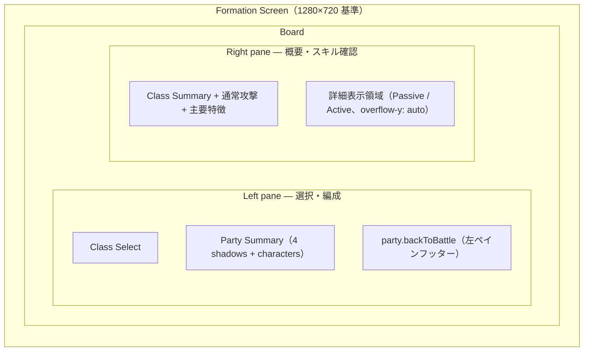

# パーティ編成 UI

実装：`src/game/gameScreen.ts`, `src/game/GameSession.ts`, `src/platform/DomFormationScreenHost.ts`, `src/ui/MetaMenuOverlay.ts`, `src/ui/SkillMenuPanel.ts`, `src/ui/combatModulePrepDisplay.ts`, `src/styles/fonts.css`, `src/styles/game-shell.css`, `src/styles/skill-menu-panel.css`, `src/styles/meta-menu-overlay.css`, `src/styles/operation-prep-panels.css`, `src/ui/gameTermGlossary.ts`, `src/ui/skillCardDisplay.ts`, `src/ui/skillCardDisplayRules.ts`, `src/ui/annotateGameTerms.ts`, `src/ui/GameTermTooltip.ts`, `src/ui/GameTermPanel.ts`, `src/styles/game-term-panel.css`。**現行正本:** 左ペイン（Class Select + Party Summary + 戦闘に戻る）/ 右ペイン（クラス概要 + **戦闘方式（CombatModule）** + 通常攻撃 + スキル、**右ペイン内スクロール可**）。**Phase 4d:** 閲覧スキルカード（`formatSkillCardLines`）とインライン用語パネル（§6.4）を継続使用。**R9.6-A:** 戦闘方式は候補プレート比較 UI（§6.2.1）。**フォント:** [ui-fonts.md](ui-fonts.md)。

本ドキュメントは **メタメニューから開くパーティ編成画面**（`SkillMenuPanel`）の画面設計正本。戦闘フィールド上の隊形・座標は [battle-field.md](battle-field.md)、クラス・ロール・スキル習得は [classes-and-skills.md](classes-and-skills.md)、セーブ・Lv は [progression.md](progression.md) を参照。

**フェーズ:** 画面設計の確定は本書。実装は [phase-roadmap.md](../plans/phase-roadmap.md) の **Phase 4d**。

**現行コードとの関係:** 本書は目標仕様（**v0.5**）。Phase 4d PR1–3 で骨格・ロスター・Picker・閲覧スキルカード・用語パネル（§6.4）を実装済み。v0.5 では左 / 右ペインの情報設計・右ペイン内スクロール・クラス概要の右ペイン移設を正本とする。

**配信形態:** **Release M1** 体験版 → **Release M2** 初版（itch.io 第一、Steam 後回し）。デスクトップ zip は **Phase 7**（Electron、常駐 UI は廃止）。編成画面は **独立した Formation Screen**（`GameScreen: 'formation'`、`DomFormationScreenHost` / `presentation: "formation-screen"`）として **画面全体** を使う。戦闘中は `GameScreen: 'battle'` の Canvas + HTML HUD。**レイアウトの正本**は §4（構造）および **§4.4 デスクトップレスポンシブ**（1280×720 〜 1920×1080）。Release スコープは [phase-roadmap.md §Release マイルストーン](../plans/phase-roadmap.md#release-マイルストーン) を正とする。

---

## 1. 目的

本作は [design-philosophy.md](../design-philosophy.md) のとおり **編成解法型オートバトル RPG** である。パーティ編成 UI の主目的は次のとおり。

- プレイヤーが **4 人の組み合わせ**（誰を入れるか）を検討・変更できること
- 各クラスの **要約**（`summary.ja`）が **Class Select および右ペイン Detail** で読めること
- 習得済みスキルの **内容を読んで** 編成判断に使えること（付け替え操作は不要）

操作技術の設定画面ではない。戦闘中のスキル発動順・ターゲット操作もここでは行わない。

---

## 2. 用語（混同禁止）

| 用語                        | 意味                                                                                             | 正本                                                                         |
| --------------------------- | ------------------------------------------------------------------------------------------------ | ---------------------------------------------------------------------------- |
| **選択クラス**              | Formation Screen でプレイヤーが直接選ぶ最大 4 クラス。UI 上はスロット番号・手動配置を持たない   | 本書                                                                         |
| **クラス要約**              | 編成 UI に表示する数文のプレイヤー向け解説（`summary.ja`）                                       | `classes.json`（`ClassEditorStep` で編集）                                   |
| **前衛 / 後衛**（データ）   | **`role` + `rangePx` から導出**（`formationRow`）。編成 UI v1 では **テキスト表示しない** | `partyFormation.ts` / [classes-and-skills.md](classes-and-skills.md) §配置 |
| **UI ロール**（Picker 見出し） | `defender` / `attacker` / `supporter`。Picker の **ブロック見出し** と右ペイン Class Summary のロール表示で用いる。Party Summary にはロールアイコンを出さない | [classes-and-skills.md](classes-and-skills.md#1-ui-上のロール分類3-大ロール) |
| **戦闘隊形スロット**        | 接敵後の `battleX` 深度・`slotIndex`。編成枠とは別                                               | [battle-field.md](battle-field.md#1-用語)                                    |
| **プレイヤーレベル**        | アカウント共通の 1 本。習得・ステ計算・枠解放の基準（`playerProgress.level`）                    | [progression.md](progression.md)                                             |

**重要:**

- Formation Screen では **スロット番号・FRONT / BACK・前衛 / 後衛を表示しない**。プレイヤーが操作するのは「どの 4 クラスを選ぶか」であり、手動配置 UI ではない。
- 内部保存・戦闘統計の `partySlotIndex` は実装上の配列位置であり、Formation Screen 上の入力概念ではない。
- 戦闘上の前衛 / 後衛は **クラスの `role` + 射程帯から導出**される。プレイヤーが枠ごとに前列 / 後列を指定する UI は **v1 では持たない**。
- Kill / Flow / Survival はスキル設計の正本であり、編成 UI v1 では **専用ラベルとして出さない**（クラス要約 + Picker ロール見出しで足りる）。

---

## 3. 入口（スコープ外・確定済み）

以下は本書の改修対象外とする（現状維持）。

| 項目       | 内容                                                                               |
| ---------- | ---------------------------------------------------------------------------------- |
| 開き方     | 戦闘画面 Party HUD 直上の **編成** ボタン → `GameScreen` を `'formation'` に切替（モーダルではなく画面遷移） |
| 表示形態   | **フルスクリーン Formation Screen**（`meta-menu-overlay--formation-screen`）。backdrop・中央浮きパネル・背景クリック閉じ・右上 × は **用いない** |
| Hub        | Electron 専用メニューウィンドウのみ（`presentation: "window"`）。ブラウザ戦闘起動時は `initialView: "party"` で Hub をスキップ |
| タイトル   | **Formation Screen では `meta-menu-window-bar` を表示しない**（§4）。Hub モーダルのみ `menu.title` |
| 閉じる     | 左ペイン最下部フッターに `party.backToBattle` を配置（§4.4.5）。secondary 扱い。Party Summary ヘッダー内・モーダル風 primary ボタン・右上 × は **用いない** |
| 保存       | クラス差し替え時に即時セーブ（[progression.md](progression.md)）                   |

### 3.1 ウィンドウサイズ（デスクトップ正本）

**配信形態:** Release M2 以降は **Electron デスクトップアプリ** を想定。Formation Screen は **一般的なデスクトップウィンドウ比率** で破綻しないことを正とする。

| 区分 | 解像度 | 用途 |
| ---- | ------ | ---- |
| **設計基準 / 最小保証** | **1280×720** | 今後の CSS・spacing・typography の主たる調整点。これ未満ではレイアウト保証外。720p 相当で主要 UI が読めること |
| **快適基準** | **1600×900** | 右ペイン詳細の可読性・余白を確保。1 画面内に全情報を収めるより読める密度を優先 |
| **大画面** | **1920×1080** | 余白は gap / セクション padding で吸収。要素を過剰に拡大しない |

**スクロール前提:** 1280×720 基準の **ゲーム HUD** として設計する。**画面全体はスクロールさせない**（Web ページ風の縦スクロール禁止）。右ペインの詳細表示領域のみ縦スクロールを許可する（§4.5）。

**開発時の注意:** 開発用に特殊なアスペクト比・ウィンドウサイズで表示している場合でも、**そのサイズだけに最適化した CSS 調整を正本にしない**。上表の解像度で目視確認する。

| 項目 | 方針 |
| ---- | ---- |
| 対象 | デスクトップ専用（狭幅モバイル・モーダルは想定外） |
| 旧目安 | ~~最小幅 800px~~ / ~~1366×768 設計基準~~ — **1280×720 を設計基準 / 最小保証** に更新（§4.4） |

---

## 4. 画面構成

**一枚の編成盤**として、左ペインは **選択と編成**、右ペインは **選択中クラスの説明と確認** に集中させる。主目的は「選ぶ・組む・戻る」。スロット選択や Picker オーバーレイは使わない。**ウィンドウ上部バー（`meta-menu-window-bar`）は Formation Screen では使わない**。

| ペイン | 役割 | 主な内容 |
| ------ | ---- | -------- |
| **左ペイン** | 選択と編成 | Class Select、現在の編成（Party Summary）、戦闘に戻る導線 |
| **右ペイン** | 選択中クラスの説明と確認 | クラス概要、通常攻撃、スキル情報、**右ペイン内スクロール可能な詳細領域** |

**スクロール:** 1280×720 基準のゲーム HUD として設計する。**画面全体はスクロールさせない**。左ペインもスクロールさせない。右ペインの詳細表示領域のみ縦スクロールを許可する（§4.5）。

### 4.1 ワイヤー（領域図）



| 領域 | 内容 |
| ---- | ---- |
| **左ペイン · Class Select** | UI ロール別のクラス札。クリックで最大 4 クラスを直接 toggle する。選択済み・満員時追加不可を明示するが、満員時も hover / focus で右ペイン詳細は読める。**クラス概要は左ペインに置かない** |
| **左ペイン · Party Summary** | 4 つの楕円影を横並びにし、選択済みクラスのキャラ画像を影の上に表示する確認領域。見出しのみ（§4.4.4）。カードリスト・表・手動配置 UI にしない |
| **左ペイン · フッター操作** | 編成確認後に押す `party.backToBattle`（§4.4.5）。左ペイン最下部 |
| **右ペイン · Detail** | `focusedClassId` のクラス概要・通常攻撃・スキル。**詳細表示領域のみ** 縦スクロール可（§4.5）。表示順は §4.6 |

### 4.2 レイアウト方針（概要）

| 方針 | 内容 |
| ---- | ---- |
| **構造** | Board（左列: Class Select + Party Summary + フッター操作 / 右列: Detail）。画面全体を占有する独立フッター行は持たない |
| **左ペイン** | Class Select + Party Summary + **左ペインフッター**（戦闘に戻る）に **絞る**。クラス概要・スキル詳細は右ペインへ |
| **右ペイン** | 選択中クラスの概要とスキル確認。1 画面への無理な圧縮より **右ペイン内スクロール** で吸収 |
| **Class Select は常時表示** | 中央オーバーレイ Picker は使わない |
| **スクロール** | 画面全体・左ペインは **禁止**。右ペイン詳細領域のみ許可（§4.5） |
| **レスポンシブ** | 百分比だけで伸縮させず、`clamp` / min-max で **デスクトップ一般比率** に合わせる（§4.4） |
| **タブ / モーダル** | v0.5 では **採用しない**（§15） |

### 4.3 視線誘導

1. **クラスを選ぶ**（左ペイン · Class Select）
2. **編成結果を確認する**（左ペイン · Party Summary）
3. **選択中クラスの概要・スキルを読む**（右ペイン）
4. **戦闘に戻る**（左ペイン最下部フッター · §4.4.5）

### 4.4 デスクトップレスポンシブレイアウト（正本）

Formation Screen の **面積配分・寸法・スクロール方針** の正本。実装は `skill-menu-panel.css` / `meta-menu-overlay.css` を主とする。

#### 4.4.1 縦方向の配分

| 領域 | 目安 | CSS 例 |
| ---- | ---- | ------ |
| **Board** | 左列 Class Select + Party Summary、右列 Detail（上端から下端まで span） | `minmax(0, 1fr)` |
| **Party Summary** | 左下の 4 影 + キャラ + クラス名。**内容に応じた最小高**（ステージ風の縦伸び禁止） | 見出し下 **18px** / キャラ→カード **6px** / カード→フッター **12px** 前後 |
| **左ペインフッター** | `party.backToBattle` のみ。**控えめな操作帯**（§4.4.5） | 高さ **32px 前後** + padding |

Party Summary は **確認欄** としてコンパクトに保ち、Class Select が左ペインの主領域となる。右ペイン Detail は Board 高さを確保し、**詳細表示領域** 内でスクロールする。

#### 4.4.2 Class Select（左ペイン · 上段）

Formation Screen の主操作領域。プレイヤーはここでクラス札を直接クリックし、`selectedClassIds` を最大 4 件まで toggle する。

| 項目 | 目安 |
| ---- | ---- |
| **幅** | Detail を圧迫しない範囲で一定幅を確保する |
| **クラス札** | 独立した小プレート。表・共有罫線グリッドに見せない |
| **ロール内構成** | 各 UI ロールは **3 クラス固定**。`基礎 / 拡張 / 変則` の 3 枠を **横並び固定** で扱う |
| **3 枠ラベル** | UI 上に「基礎 / 拡張 / 変則」ラベルを出すかは **未確定**。表示順はこの構造に従う |
| **状態** | 未選択 / 選択済み / 4人選択済み時の未選択（追加不可） |
| **追加不可時** | disabled にせず、hover / focus で右ペイン Detail を更新できる。クリック時は追加せず軽いフィードバックを出す |
| **英語名** | `epithetEn` は補助表示として残す |
| **禁止** | 左ペイン内への Class Summary 固定表示（v0.4 以前の配置。v0.5 では右ペイン上部へ移す） |

#### 4.4.3 Detail（右ペイン）

選択中クラスの **概要・通常攻撃・スキル** の主読解領域。`focusedClassId` を表示対象にし、選択済みクラスとは限らない。Class Summary は **右ペイン上部** に置く。

| 項目 | 方針 |
| ---- | ---- |
| **表示順** | §4.6 に従う |
| **Passive / Active** | **別セクション**で表示（§6.3） |
| **解放済み** | スキル **本文を優先**して読ませる。最大 2 列の独立カード |
| **未解放** | **省スペース**（チップ / ロック行）。通常カードと同面積にしない |
| **スクロール** | 右ペイン内の **詳細表示領域のみ** `overflow-y: auto` 相当（§4.5）。画面全体・左ペインのスクロールは禁止 |
| **可読性** | 文字サイズ・行間・カード余白を **無理に詰めない**（§6.5） |
| **余白** | 概要帯・スクロール領域とも `--skill-menu-detail-pad-x: 16px` / `--skill-menu-detail-pad-y: 12px`（低画面時 12px / 8px）。左右対称 |

#### 4.4.4 Party Summary（左ペイン · 下段）

編成結果の確認領域。入力起点ではなく、選択済みクラスを射程順に並べた結果だけを左下に見せる。

| 項目 | 方針 |
| ---- | ---- |
| **見た目** | 4 つの楕円影を横並び。空き状態は薄い影のみ。**上寄せ・最小高**（§4.4.1） |
| **キャラ画像** | 選択済みクラスは必ず影の上にキャラ画像を表示する |
| **表示情報** | 日本語名を主、英語名を補助。選択数表示テキストやロールアイコンは出さない |
| **並び順** | `rangePx` 降順。左が長射程、右が短射程。同射程はクラス定義順で安定ソート。並び替え時は横スライドで遷移を見せる |
| **空き枠** | 左側に残す。選択済みキャラは右詰めで表示する |
| **見出し** | `party.zonePartySummary` のみ。**操作ボタンは置かない**（編成結果の操作に見えないようにする） |
| **禁止** | Slot 番号、FRONT / BACK、前衛 / 後衛、役割ラベル、隊列変更 UI のような見せ方。**`party.backToBattle` をヘッダー内に置く** |

#### 4.4.5 左ペインフッター操作（戦闘に戻る）

編成を確認した **後** に押す画面遷移導線。Party Summary ヘッダー内には置かない（編成結果の操作に見えてしまうため）。

| 項目 | 目安 |
| ---- | ---- |
| **配置** | **左ペイン最下部**（Class Select / Party Summary の下）。`skill-menu-left-rail-footer` |
| **`party.backToBattle`** | 編成確認後の **画面遷移** 導線。主操作ではない |
| ボタン高さ | **32px 前後** |
| 最小幅 | **104px 前後** |
| font-size | **12px 前後** |
| 左右 padding | **14px 前後** |
| 通常モード | `selectedClassIds.length < 4` では disabled。4 人選択済みで enabled |
| デバッグモード | 0〜4 人でも enabled。少人数編成はデバッグ用状態として扱う |
| **禁止** | 画面全体を占有する大きなボタン行、Web フォーム風 primary、Party Summary ヘッダー内配置 |

**将来:** 画面左上の戻る導線は検討してよいが、初回実装では **左ペイン下部を優先** する（編成確認後に戦闘へ戻る文脈）。

#### 4.4.6 避けること

| 禁止 | 理由 |
| ---- | ---- |
| 画面全体の縦スクロール | ゲーム HUD として Web ページ化する |
| 左ペインのスクロール | 選択・編成操作の視認性を損なう |
| 開発用の特殊アスペクト比だけに最適化 | Electron 一般ウィンドウで破綻する |
| 横幅が広い前提で Party Summary を拡大 | Class Select / Detail の主従が崩れる |
| 720p 相当で右ペイン詳細が破綻 | 最小保証の読みやすさを満たさない |
| Party Summary が縦を取りすぎ Detail が読めない | 編成判断の主領域が右ペイン Detail |
| 小さいフォント・詰めた line-height で 1 画面収め | 可読性を優先し右ペイン内スクロールで吸収（§6.5） |
| 左ペインへの Class Summary 固定 | 選択・編成と競合して縦幅を圧迫する（§4.4.2） |
| Excel 風の罫線グリッド | [ui-visual-rules.md](ui-visual-rules.md)・§15。独立プレート + gap を維持 |

#### 4.4.7 受け入れ条件（レイアウト）

1. **1280×720 / 1600×900 / 1920×1080** で破綻しにくい（1366×768 は中間確認扱い。設計基準にはしない）
2. 開発用ウィンドウサイズだけに最適化されていない
3. 左ペイン（Class Select / Party Summary）と右ペイン Detail の **役割に応じた面積配分**
4. 設計基準（1280×720）で **使用可能スキルの効果がスキルカードから読める**
5. 右ペイン詳細表示領域で **限定スクロール** が機能する（§4.5）
6. **画面全体・左ペインはスクロールしない**

### 4.5 右ペイン内スクロール方針（正本）

右ペインの **詳細表示領域のみ** 縦スクロールを許可する。

| 項目 | 方針 |
| ---- | ---- |
| 画面全体 | **スクロール禁止** |
| 左ペイン | **スクロール禁止** |
| 右ペイン詳細領域 | `overflow-y: auto` 相当で **スクロール可能** |
| スクロールバー | 標準スクロールバーは原則 **表示しない**（`game-ui-scroll-pane`） |
| 続きの示唆 | 下端フェード、内容の見切れ、またはゲーム風インジケータで「下に続きがある」ことを示す |
| 入力 | **マウスホイール** でスクロールできること |
| タイポグラフィ | スクロールにより文字サイズ・行間・カード余白を **無理に詰めない**（§6.5） |

**意図:** 概要とスキルを 1 画面へ圧縮せず、読める密度を優先する。

### 4.6 右ペイン表示順（基本）

右ペイン内の表示順は以下を基本とする。重要な編成判断情報は上部に置き、スキルカード詳細は下に流してよい。

1. **クラス名 / 英名 / ロール分類 / 編成状態**（選択済みかどうか）
2. **短いクラス概要**（`summary.ja`）
3. **役割タグ / 特徴**（`featureTags.ja`。任意）— §6.1
4. **通常攻撃**（§6.2）
5. **パッシブスキル**
6. **アクティブスキル**

---

## 5. Party Summary（下段 — 編成結果）

### 5.0 プレイヤーレベルとデータ正本

レベルは **クラス個別ではなくプレイヤー共通**。編成画面で参照する表示・計算の正本は **`playerProgress.level`**（[progression.md](progression.md)）。**`party[].progress` は廃止** — 表示・計算に使用しない。

| 表示場所                               | 内容                                                                                             |
| -------------------------------------- | ------------------------------------------------------------------------------------------------ |
| **ウィンドウヘッダー（タイトルバー）** | **Formation Screen では非表示**。`プレイヤー Lv` の専用表示枠は持たない |
| 詳細 · クラスヘッダー                  | **表示しない**                                                                                   |
| 詳細 · ステータス見出し                | **「Lv n」付き見出しは使わない**（例: `ステータス（Lv 12）` は廃止）                             |
| ロスター各カード                       | **表示しない**                                                                                   |
| スキル未解放枠                         | **スキル名** + 解放 **プレイヤー Lv**（例: `真言加護　プレイヤー Lv10 で追加`）               |
| Exp バー                               | **表示しない**（プレイヤー共通 Exp バーは戦闘 HUD — [progression.md](progression.md)「進行 UI」） |

**実装:** Formation Screen では `MetaMenuOverlay` の `meta-menu-window-bar` を非表示。`playerProgress.level` はステ・スキル解放計算の正本（表示はスキル未解放枠の Lv 注記などに限定）。`SkillMenuPanel` は左ペイン（Class Select / Party Summary）と右ペイン Detail の独立領域を持つ。

### 5.1 表示枠と並び

- 表示は固定 **4 影**（`PARTY_SLOT_COUNT`）。
- 選択済みクラスは `rangePx` 降順で並べる。**左が長射程、右が短射程**。
- 同射程の場合は `classes.json` のクラス定義順（`classOrder`）で安定ソートする。
- 4 人未満では **空き影を左側に残し、選択済みキャラを右詰め**で表示する。
- クラス追加時は、既存キャラの横スライドに加えて、新規キャラ本体を上から落下させる。楕円影はキャラ本体に追従させず、クラスアイコンとクラス名は下側からフェードインし、キャラ本体が楕円影に重なる頃に表示完了する。
- これは表示規則であり、手動配置ではない。ドラッグ並べ替えは **v1 では不要**。

### 5.2 選択済み表示

各キャラ表示に必要最小限を添える。

| 要素                         | データ源       | 備考                                          |
| ---------------------------- | -------------- | --------------------------------------------- |
| 楕円影                       | —              | 空き状態でも表示する。番号・役割ラベルは付けない |
| body atlas / スプライト      | `classId`      | **必ず表示**。影の上に立つ / 乗るように見せる |
| クラスアイコン               | `classId`      | 補助表示。主役はキャラ画像 |
| `displayName`                | `classes.json` | 日本語名を主ラベル（`data-i18n-role="primary"`） |
| `epithetEn`                  | `classes.json` | 英語名を補助ラベル（`data-i18n-role="secondary"`）。i18n 対応を見据えて残す |
| クラス要約                   | `summary.ja`   | Party Summary では **表示しない** |

Party Summary のキャラをクリックすると `focusedClassId` をそのクラスへ更新する。解除操作は Class Select 側の再クリックのみとする。

#### Party Summary 寸法（目安）

実装値は多少前後してよい。

| 項目           | 目安        |
| -------------- | ----------- |
| 配置           | **4 影横並び**（gap あり。共有罫線なし） |
| 高さ           | 画面高さの 14〜20% 目安。Class Select / Detail を圧迫しない |
| キャラ画像     | 影の上に表示。潰さない |
| クラスアイコン | 24px        |

### 5.3 空き枠

薄い楕円影のみを表示する。`＋`、`クラスを追加`、Slot 番号など、入力起点に見える表示は使わない。

### 5.4 編成内訳（v1 非表示）

前衛 / 後衛・UI ロールの **人数集計行** は v1 では **表示しない**。Class Select と右ペイン Detail のクラス情報で個別に分かれば足りるため。

Phase 4d 当初案にあった表示例（参考）:

`前衛 2 / 後衛 2　ディフェンダー 1　アタッカー 2　サポーター 1`

**ステージが要求する編成の正解表示や警告ではない**（Phase 6 以降の拡張）。

### 5.5 注記

Party Summary 付近に常時表示の人数注記は置かない。満員時に未選択クラスをクリックした場合など、操作フィードバックが必要なときだけ短いテキストを一時表示してよい。

---

## 6. Detail（右ペイン — focusedClassId）

`focusedClassId` のクラス概要・通常攻撃・スキルを表示する。`focusedClassId` は hover / focus / click で更新され、選択済みクラスとは限らない。**Class Summary は右ペイン上部** に置く（左ペインには置かない）。表示順は §4.6。

**情報の順序（固定）:** 右ペイン上部に編成判断に必要な概要を置き、**Passive → Active** のスキル要約カードを詳細表示領域へ流す。面積・スクロールは §4.5・§4.4.3。

1. クラス名 / 英名 / ロール / 編成状態（§6.1）
2. 短いクラス概要・特徴タグ・通常攻撃（§6.1–6.2）
3. **Passive**（§6.3）— 解放済みは **最大 2 列**、未解放は **コンパクトチップ**
4. **Active**（§6.3）— 解放済みは **最大 2 列**、未解放は **コンパクトチップ**

クラス要約の長文は **そのまま改行表示**する（`summary.ja` の `\n`）。**スキルが直接行う主要効果はカード内に常時表示**（hover 依存にしない）。状態の定義・持続・スタックなどは **文中リンクのクリック tooltip**（`description` 全文）で確認する。

### 6.1 クラス情報（右ペイン上部）

Class Summary は **右ペイン上部** に表示する。左ペイン Class Select 下部には置かない。表示順の 1〜3 に相当する。

| 要素                        | 備考                                                          |
| --------------------------- | ------------------------------------------------------------- |
| 見出し                      | `クラス概要` / `Class Summary`                                |
| `displayName` + `epithetEn` + UI ロール + 編成状態 | 1 行（`名前 肩書き / ロール`）。選択済みかどうかを明示。アタッカーは下位ロール併記可 |
| `summary.ja`                | 短いクラス概要。JSON の `\n` を改行表示（`white-space: pre-line`）。tooltip は使わない |
| `featureTags.ja`            | **任意**。戦闘傾向を短いタグで示す（例: `低HP狙い / 回避 / 出血 / 背後移動`）。**スキル名の再掲はしない** |
| ステータス・通常攻撃          | §6.2。概要帯内の縦並びステータス列 |
| クラスアイコン                | サマリー帯では **表示しない**（面積はスキルへ）               |

**Lv は表示しない**（§5.0）。

**配置変更の理由（v0.5）:** クラス概要は「選択中クラスの詳細情報」でありスキル情報と同じ文脈にある。左ペインに置くと Class Select・Party Summary・戻る導線と競合して縦幅を圧迫する。右ペイン内スクロールにより概要とスキルを無理に圧縮せず配置できる。

### 6.2 ステータス・通常攻撃（概要帯内）

[progression.md](progression.md) の進行 UI 節に準拠。表示順の 3〜4 に相当する。

- **`playerProgress.level`** で計算した **素ステ**
- **独立した大カラムは持たない**。クラスサマリー帯の下段に **横並びチップ**（例: `HP 300` `ATK 11` …）
- HP / ATK / DEF / RES / SPD / 射程 / 通常攻撃属性を 1 行（折り返し可）で表示
- 射程チップは `memberBasicAttackDisplay` 経由で `rangePx / 10` の単位なし数値 + 近接帯/遠隔帯（例: `12.8（遠隔帯）`）
- 見出し `ステータス` は **使わない**（チップラベルで足りる）
- **通常攻撃** は概要帯内または直下に独立ブロックとして表示（§4.6 項目 4）

### 6.2.1 戦闘方式（CombatModule · R9.6-A）

**位置づけ:** R9.6 の CombatModule UI は **Player 完了用の試作**（暫定 `<select>` の後継）。製品版の最終ビジュアル仕上げではない。

`combatModuleIds` を持つ兵科をフォーカスし、かつ編成に含まれているとき、右ペイン詳細領域の **習得スキルより上** に「戦闘方式」セクションを出す。

| 項目 | 方針 |
| ---- | ---- |
| 候補 | 対象兵科の `combatModuleIds` のみ。legacy active は混ぜない |
| 表示 | 各候補プレートに **表示名**・**攻撃間隔**・**効果要約**・**選択中 / 選択可能**。効果要約は攻撃手段・範囲・効果本文を **1 段落**にまとめる。**デフォルト敵対ターゲットは表記しない**。兵科の固定優先ターゲット（`targetRuleOverride`）があるときは「遠隔攻撃の敵に攻撃力の〜」「最も防御力が高い敵に攻撃力の〜」のように **効果本文へ織り込む**。`description` の再掲・リスト表示・「効果」接頭は出さない。**再使用は攻撃間隔と重複するため載せない** |
| 操作 | プレートクリックで party slot 単位の module を切替（`setPartySlotCombatModule`） |
| 非表示 | `combatModuleIds` なし（legacy 兵科）、未編成フォーカス、wiring 未接続時 |
| 内部 ID | 主表示に使わない（`displayName` が無い場合のみフォールバック） |

Wave 間準備画面（`WavePrepScreenHost`）でも同一の CombatModule プレートを使う。作戦内パッシブ取得 UI は **別セクション**（`operation-passive-prep`）。正本フローは [operation-loop.md](operation-loop.md)、実装詳細は [phase-roadmap.md §R9.6](../plans/phase-roadmap.md#r96--作戦準備-player-ui)。

### 6.3 習得スキル（閲覧専用）

**付け替え・セット・装備変更は行わない**（[classes-and-skills.md](classes-and-skills.md#用語スキル習得-vs-装備)）。

#### レイアウト

- **上段（スクロール外または sticky 可）:** クラスサマリー帯（§6.1–6.2）
- **詳細表示領域（スクロール可）:** **パッシブ** セクション → **アクティブ** セクション（各見出し + **独立カード配置**）
- **解放済み:** セクション内に **gap を空けた戦術カード**（最大 **2 列**）。隣接カードの共有罫線・表セル化はしない
- **未解放:** カード群の下に **小さなチップ / ロック行**（`+ Lv{n}: {name}`）。通常カードと同じ面積を取らない
- **スクロール:** 右ペイン **詳細表示領域のみ**（§4.5）。1 画面内への全スキル強制収容は前提としない
- スキル本文は `resolveSkillCardDisplay().headlineLines` をカード内表示。`formatSkillCardLines` の **状態定義リスト行**（種火＝`emberIgnition`、薬効＝`herbalPotency` 等）は効果行から省略し、**付与条件行 + 文中リンク tooltip**（`description` 全文）で確認する

#### 体験版（Release M1）のスキル表示方針

体験版（M1）では使用可能スキルが **パッシブ 2 枠 + アクティブ 2 枠** に限られる。スキル一覧は右ペイン下部のスキルカードで確認する。

| 項目 | 方針 |
| ---- | ---- |
| 概要内の「主要スキル」 | **設けない**。スキル名・効果要約の再掲を避ける |
| 概要内の戦闘傾向 | **任意**。`featureTags.ja` を **「特徴」** 見出しで短いタグ表示（例: `低HP狙い / 回避 / 出血 / 背後移動`）。クラスの役割・挙動を示し、スキル名は使わない |
| Lv10 / Lv20 スキル | スキルカード領域では **非表示を優先**（`playerProgress.level < 10`） |
| スキル詳細 | 右ペイン下部の Passive / Active カードが正本。倍率・秒数・条件はカード側 |

**例（アサシン · 概要の特徴タグ）:**

```
特徴
低HP狙い / 回避 / 出血 / 背後移動
```

#### スキル要約カード（1 スキルあたり）

| 行 | 内容 |
| -- | ---- |
| 1 | スキル名 + アイコン（名前 **14px** 前後 / line-height 1.3 前後） |
| 2 | `metaLine`（CD・発動条件など。**12px** 前後 / line-height 1.35 前後） |
| 3+ | `headlineLines`（主要効果の短文、**13〜14px** 前後 / line-height 1.45 前後。スキルが何をするかは hover なしで読めること。状態名は文中リンク） |

説明文の文面生成は [Phase 4b](../plans/phase-4-roadmap.md#4b--スキル説明自動生成日本語--完了2026-06)（`formatSkillText`、M1 8 クラス Lv0 日本語 **完了**）。**編成 UI** は `formatSkillCardLines`。**エディタ**（`SkillEditorStep`）は 1 行の `formatActiveDescription` / `formatPassiveDescription`（[classes-and-skills.md §出力 API](../spec/classes-and-skills.md#出力-api責務分担)）。

#### `formatSkillCardLines` API（Phase 4d PR1-1 確定）

| 項目 | 内容 |
| ---- | ---- |
| モジュール | `src/ui/formatSkillText.ts` |
| シグネチャ | `formatSkillCardLines(def: ActiveSkillDef \| PassiveSkillDef, options: { locale: SkillCardLocale; basicAttackRangePx?: number }): SkillCardLines` |
| `SkillCardLocale` | `'ja'` \| `'en'`（4e。`skillTextLocale` / `skillTextPhrases`） |
| `SkillCardLines` | `{ metaLine: string; effectLines: SkillCardEffectLine[] }` — 各要素は plain `string` または `{ kind: "list"; items: { text; details? }[] }`（薬効スタック段階など、状態定義が必要な list）。画面表示では `resolveSkillCardDisplay` が `headlineLines`（Plain Text + 文中リンク）へ flatten する |

**行の意味（§6.3 行 2 / 行 3+ に対応）**

| フィールド | Active | Passive |
| ---------- | ------ | ------- |
| `metaLine` | 再使用・持続・硬直・移動停止あり・発動条件を `/` 区切り 1 行（効果本文は含めない） | 発動タイミング要約（`formatPassiveTriggerSummary` 等） |
| `effectLines` | `def.effect[]` を 1 effect 1 行（`formatActiveEffectDetail` compact） | `[formatPassiveEffect(...)]` 1 要素（`効果：` プレフィックスなし） |

- 文節 split 禁止 — 改行単位は **effect 配列要素**（Passive は effect 種別 1 行）。リストが必要な passive は `effectLines` に `kind: "list"` ブロックを返し、各 `item.text` を効果行として表示する
- プレイヤー向けの距離・範囲・射程差分は内部 `px / 10` の単位なし数値で表示する（例: `50px` → `5`、`+30px` → `+3`）。`px` や `m` はスキル本文へ出さない
- Active の `targetShape` が Multi-Lock / AoE / 周囲 / 地点 / Pierce の場合、効果行は `[形状ラベル] {数値} / {効果}` 形式にする（[classes-and-skills.md §表示フォーマット](classes-and-skills.md#ゲーム用語表表示分類)）。Pierce の射程は `basicAttackRangePx` が渡されているとき **常に** 効果距離の絶対値で `貫通 3` のように表示する（未指定 `range` は持有者射程を用いる）
- 並び順: 特殊ルール → 計算修飾 → 基礎効果 → 追加効果。複数要素は ` / ` 区切り
- 同じ形状枠が連続する場合は、形状を各行へ重複表示せず `[形状] / {対象}に以下の効果を付与/適用` + 続く効果を **1 行に「、」区切り**で畳む（例: `[周囲] 5 / 味方に以下の効果を付与` → `攻撃力+20%、攻撃速度+15%`）
- **別枠タグ行は持たない**。形状・特殊ルールは本文内 Inline Term Label のみ
- 1 行説明の `formatActiveDescription` / `formatPassiveDescription` は **エディタ**互換として維持（編成 UI は上記 `formatSkillCardLines`）

**UI 表現:**

- `disabled` ボタンに見せない
- 未解放枠は **カード群外** の控えめな **チップ / ロック行**（`+ Lv{n}: {name}`、`party.skillLockedPreview`）。通常カードと同じ面積を取らない。`未解放枠` の太字見出し・破線枠・大きな空カードは使わない

### 6.4 用語注釈（スキルカード）

スキルカード内の情報は **文中リンク / Plain Text** の 2 系統。**責務分担** の正本は [§スキルカード情報設計](#スキルカード情報設計)。分類ルールと表記統一は [classes-and-skills.md §ゲーム用語表（表示分類）](classes-and-skills.md#ゲーム用語表表示分類) を参照。

| 層 | 内容 | 注釈 UI |
| -- | ---- | ------- |
| `metaLine`（基本情報） | 再使用・持続・硬直・移動停止あり・発動条件 | 原則リンクなし。**例外:** `硬直` のみ文中リンク（`SKILL_CARD_META_LINE_TERM_IDS`） |
| 効果行（Plain Text + 文中リンク） | 主要効果の短文。辞書 `aliases` 登録語は白 1.5px 下線 + グラデ背景リンク | 文中リンクは **クリック** で用語 tooltip（`annotateGameTerms` + `GameTermTooltip.openFromTerm`） |

**実装:** `src/ui/skillCardDisplay.ts`, `src/ui/skillCardDisplayRules.ts`, `src/ui/GameTermTooltip.ts`, `src/ui/annotateGameTerms.ts`

**クラス要約:** `summary.ja` は **常時表示**（`\n` 改行）。hover tooltip・用語パネルは使わない。戦闘 HUD バッジ等は従来どおり **クリック用語パネル**（`GameTermPanel`）を維持。

#### スキルカード情報設計

スキルカード上の情報の **責務分担** と **重複禁止** の正本。分類ルール・表記は [classes-and-skills.md §ゲーム用語表（表示分類）](classes-and-skills.md#ゲーム用語表表示分類) を参照。

##### 情報責務

**Plain Text + 文中リンク（効果行）**

スキル本文は、そのスキルが直接行う効果のみを記載する。基本語は Plain Text、辞書 `aliases` に登録した用語は **白 1.5px 下線 + 下→上 白（透明度 50%→100%）グラデ背景の文中リンク**（クリックで tooltip）。

**文中リンク tooltip**

`gameTermGlossary.ts` の `tooltip` / `description` から `resolveGameTermTooltip` が生成（ルール用語は `description` 先頭 2 行、`statusCategory` 付き状態は全文）。tooltip 本文内の **他用語** のみリンク化し、**今開いている用語** はリンクにしない。

**戦闘 HUD 状態バッジ**（State tooltip）は編成 UI スキルカードとは別系統。[combat.md §簡易表示 vs 詳細表示](combat.md#簡易表示-vs-詳細表示) を参照。

**例: 猛火の術（`emberIgnition`）**

本文（効果行）:

```
CombatModule のダメージ Hit ごとに「種火」を1スタックする。規定スタックで発火ダメージへ変換して全消費する
```

状態定義リスト行はカード本文に出さない。詳細は「種火」クリック tooltip へ。

「種火」クリック tooltip（`description` 全文）:

```
魔術師の CombatModule Hit で付くスタック状態（R12l）。

・時間では消えない
・規定スタックで発火ダメージへ変換して全消費
・対象死亡 / Wave 終了 / 発火で消える
```

- 本文中の「種火」は **文中リンク**（`aliases` 登録・`emberIgnition`）。状態定義はクリック tooltip 側
- 付与条件（CombatModule Hit ごと）は本文の責務。tooltip には書かない

##### 状態辞典（辞書データ）

`statusCategory` 付き状態は、スキルカードでは **文中リンク tooltip** で `description` 全文を表示。`aliases` を追加してリンク化する。

##### 重複禁止

同一情報を Inline Term Label・別枠タグ・State Chip へ重複表示しない。各情報は 1 か所のみを正本とする。

| 用語 | 正本 | 禁止 |
| ---- | ---- | ---- |
| Multi-Lock | 本文内 `[マルチロック] N` + Inline tooltip | 別枠タグ行、本文への再配分説明 |
| 種火（`emberIgnition`） | 効果行テキスト + 文中リンク tooltip（`description`） | 別枠 Chip 行 |
| バリア / 障壁 | 効果行テキスト + 文中リンク tooltip | 別枠 Chip 行 |

#### スキルカード表示分類ルール

[スキルカード情報設計](#スキルカード情報設計) と [ゲーム用語表](classes-and-skills.md#ゲーム用語表表示分類) に従った具体例。`[]` は Inline Term Label の設計メモ表記。

**効果行（Plain Text + Inline Term Label）**

```
[マルチロック] 2 / 攻撃力の90%の魔法ダメージ
[貫通] 13 / 攻撃力の50%の物理ダメージ
[周囲] 5 / 味方の攻撃力+15%
[周囲] 5 / 味方に以下の効果を付与
攻撃力+20%
攻撃速度+15%
[スタン] 1.5秒
```

- Multi-Lock / AoE / 周囲 / 地点 / Pierce は本文内 Inline Term Label。対象数・範囲・射程差分はラベル直後の数値
- メカニクス説明（対象不足時の再配分等）は **Inline tooltip** に書き、本文へ重複させない
- 物理ダメージ / 魔法ダメージ / 攻撃力 等は Plain Text（リンク化しない）

**State Chip（廃止 — スキルカード）**

スキルカード末尾の State Chip 行は **採用しない**。状態定義は文中リンク tooltip へ統合。

**文中リンク tooltip**

```
マルチロック:
対象数まで効果を適用する。
対象が不足している場合、不足分は同じ対象へ再度適用する。
```

#### スキルカード用 tooltip の方針

| 種類 | 項目 | 内容 |
| ---- | ---- | ---- |
| 文中リンク | 辞書 | `description`（ルール用語は 2 行要約 / 状態は全文）/ `tooltip`（短文化） |
| 文中リンク | 装飾 | 白 1.5px 実線アンダーライン + 下→上 白（透明度 50%→100%）グラデーション背景（`game-term-link`） |
| 文中リンク | 起動 | **クリック**（同一リンク再クリックで閉じる）。tooltip 内の他用語リンクで遷移可 |
| 共通 | 見た目 | 濃色背景・強めの枠・用語名見出し（`game-term-tooltip.css`） |

#### 旧インライン用語パネル（スキルカード）

スキルカード本文では **クリック Popover（§6.4 旧）を採用しない**。長い状態定義は **文中リンク tooltip**（`description` 全文）へ統合する。

**戦闘 HUD 状態バッジ**のクリック説明は [combat.md §簡易表示 vs 詳細表示](combat.md#簡易表示-vs-詳細表示)・[battle-field.md §7.1.2](battle-field.md#712-状態バッジクリック用語パネル) を正とする（`GameTermPanel` を `BattleView` で共有）。

### 6.5 可読性方針（右ペイン）

右ペイン内スクロールを許可するため、スキルカードや概要文は **無理に圧縮しない**。

| 要素 | 目安 |
| ---- | ---- |
| スキル本文 | **13px〜14px** / line-height **1.45** 前後 |
| メタ行 | **12px** / line-height **1.35** 前後 |
| スキル名 | **14px** 前後 / line-height **1.3** 前後 |
| セクション見出し | 本文より **明確に強く** する |
| カード間余白 | **最低限確保**する |

**注意:**

- **1 画面に全情報を収めること** より **読める密度** を優先する
- 説明文・スキル本文は可読性を優先し、装飾フォントを使いすぎない（[ui-fonts.md](ui-fonts.md)）

---

## 7. Class Select（左ペイン · 直接選択）

左ペインは **Class Select + Party Summary + 左ペインフッター（戦闘に戻る）** に絞る。クラス概要は右ペインで読む（§6.1）。

### 7.1 操作

- 未選択クラスをクリックし、`selectedClassIds.length < 4` なら編成に追加する
- 選択済みクラスを **フォーカス済みの状態で再クリック** すると `selectedClassIds` から解除する。未フォーカスの選択済みクラスをクリックしたときは `focusedClassId` の更新のみ（編成は維持）
- `selectedClassIds.length === 4` の状態で未選択クラスをクリックしても追加しない。差し替えモードにはせず、軽いフィードバック（例: `編成は4人までです`）を出す
- クラス札 hover / focus / click で `focusedClassId` をそのクラスへ更新し、**右ペイン Detail** に表示する
- 解除操作は Class Select 側の再クリックのみ。確認モード（verify mode）中も専用の `外す` ボタンは表示しない

**不採用:** スロット選択方式、差し替えモード、中央オーバーレイ Picker、決定/戻るの 2 段確認、専用の `外す` ボタン

### 7.2 リスト内容

`GameData.classRegistry` に存在する全クラスを `classOrder` 順で表示する。`classOrder` 未列挙の有効クラスも末尾へ残す。`unlockedClassIds` や `combatModuleIds` の有無を一覧の表示条件にはしない。選択済みクラスも除外せず `--active` でハイライトする。同一クラス 2 人編成は `selectedClassIds` の toggle により不可。4 人選択済み時の未選択クラスは追加不可表示にするが、hover / focus で右ペイン詳細確認は可能にする。

### 7.3 グループ化

**ディフェンダー / アタッカー / サポーター** の 3 ブロック。アタッカー内はファイター / シューター / キャスター小見出し。

各 UI ロール内は **3 クラス固定**。`基礎 / 拡張 / 変則` の 3 枠を **横並び固定** で扱う。UI 上に「基礎 / 拡張 / 変則」ラベルを出すかは **未確定**（§17）。表示順はこの構造に従う。

**レイアウト（§4.4.2）:** クラス札は **固定サイズの独立プレート**。余剰横幅は gap / ブロック余白で吸収。表・罫線グリッドに見せない。

### 7.4 コンテキスト維持

Class Select と右ペイン Detail は **同一ボード**に並列表示する。左ペインは選択・編成に集中し、Party Summary は左下に置き、入力起点にはしない。Class Summary は **左ペインに置かない**。

---

## 7-old. （廃止）Picker オーバーレイ

旧中央モーダル Picker（`skill-menu-picker-overlay`）は廃止。上記 Class Select を正とする。

---

## 8. ラベル一覧（UI 固定文言）

| 内部値      | 表示（formationRow） | 表示（role）   |
| ----------- | -------------------- | -------------- |
| `front`     | **編成 UI では非表示** | —              |
| `back`      | **編成 UI では非表示** | —              |
| `defender`  | —                    | ディフェンダー |
| `attacker`  | —                    | アタッカー     |
| `supporter` | —                    | サポーター     |
| （アタッカー下位 · Picker のみ） | — | ファイター / シューター / キャスター |

Class Select・Class Detail ではロール表示に **サポーター** を用いる（ヒーラー表記はクラスヘッダー等の別コンテキストで併用可）。

---

## 9. 非要件（v1）

| 項目                                   | 理由                                       |
| -------------------------------------- | ------------------------------------------ |
| 編成内訳（前衛/後衛・ロール人数集計） | §5.4。右ペイン Detail とクラス情報で足りる |
| 枠ドラッグで戦闘前列 / 後列を変える    | `formationRow` 正本と矛盾                  |
| Party Summary を前列 / 後列の配置盤として見せる | プレイヤー操作の配置概念はない（§2）       |
| スキル装備・セット枠                   | 習得即参加が正本                           |
| Kill / Flow / Survival レイヤー表示    | スキル設計用。UI ロールで代替              |
| ステージ敵構成との連動ヒント           | Phase 6 コンテンツとセットで別検討         |
| 戦闘隊形のプレビュー（battleX 配置図） | battle-field の責務。編成 UI では省略      |
| 同一クラス 2 人編成                    | `getAssignableClassIds` で禁止（現行維持） |
| Picker のタブ / 横長説明カード縦リスト | §7.4 |
| Class Select の rangePx バッジ         | 射程順は Party Summary の表示規則で示す |
| 編成画面の Exp バー                    | §5.0                                       |
| Hub へ戻るボタン                       | §3                                         |
| スキル説明の「もっと見る」・最大行数   | §6.3                                       |
| Active / Passive の 2 列グリッド       | §6.3                                       |
| 右ペインのタブ化（概要 / パッシブ / アクティブ、概要 / スキル） | §15。v0.5 では見送り |
| スキル詳細モーダル                     | §15。v0.5 では見送り |
| 下層ページ化（編成比較の別画面遷移）   | §15。v0.5 では見送り |

---

## 10. アクセシビリティ・入力

- Class Select: `aria-pressed` で選択状態を示す。満員時の未選択クラスも focus 可能にし、詳細確認を妨げない
- Party Summary: キャラ表示は `aria-label` にクラス名 + `summary.ja`（要約未設定時はクラス名のみ）。**枠番号は含めない**。フォーカス中は `aria-current="true"`
- スキルカード: `role="group"` + 見出しでスキル名。スキル全体の説明を tooltip のみに頼らない（§6.3）
- インライン用語: `aria-expanded` / `aria-controls` で用語ボタンと用語パネルを関連付け。パネルは `role="dialog"` + 見出し `aria-labelledby`
- インライン用語: Enter / Space でパネル開閉。Escape で閉じる（§6.4）
- キーロード: 枠間フォーカス移動は **実装時に最低限**（v1 必須度は低め）

---

## 11. デザイン方針（DOM UI 共通）

**全 UI 共通の禁止・推奨** は [ui-visual-rules.md](ui-visual-rules.md) を正本とする（Web アプリ風禁止、HUD プレート・スロット推奨、ツールチップ方針など）。

編成画面および戦闘中の統計オーバーレイ（[battle-field.md §7](battle-field.md#7-戦闘中統計-ui)）は、**PC 向け RPG の情報パネル**を基調とする。戦闘画面全体の HUD レイアウト（1280×720 固定座標、左右 HUD オーバーレイ、敵 HUD）は [battle-field.md §8](battle-field.md#8-戦闘画面-ui1280720-hud) を正本とする。

| 指針 | 内容 |
| ---- | ---- |
| 情報の載せ方 | 左ペイン（Class Select + Party Summary + フッター操作）+ 右ペイン Detail。**札・プレート・楕円影**を盤上に配置 |
| スクロール | **画面全体・左ペインは禁止**。右ペイン詳細表示領域のみスクロール可。標準スクロールバーの露出を抑える（`game-ui-scroll-pane`、§4.5） |
| 用語 | 説明文内のゲーム用語は **クリック** で用語パネル（§6.4） |

---

## 12. 現行実装との差分（改修チェックリスト）

| 現行                          | 目標                                          | PR2 |
| ----------------------------- | --------------------------------------------- | --- |
| スロット選択 → クラス選択      | Class Select で直接 4 クラスを toggle         | ✅ |
| Party Setup が左上             | Party Summary を下段へ移し、確認領域にする    | ✅ |
| 詳細が選択スロット依存         | `focusedClassId` の hover / focus / click 詳細 | ✅ |
| Picker / 差し替え導線          | 常設 Class Select。差し替えモードなし         | ✅ |
| スキルが icon + hover tooltip | 縦セクション + 閲覧カード・効果単位改行       | ✅ |
| Active が `disabled` button   | 非インタラクティブなカード                    | ✅ |
| パッシブがアイコン列のみ      | Active と同型の閲覧カード列（ややコンパクト可） | ✅ |
| 縦 1 カラム（タブ上のみ）     | 左列 Class Select / Party Summary + 右列 Detail | ✅ |
| 詳細・カードに Lv 表示        | ヘッダー Lv 表示は廃止（§5.0）                | ✅ |
| `ステータス（Lv n）` 見出し   | `ステータス` のみ                             | ✅ |
| 編成内訳（人数集計行）         | 各カードの epithet で識別できるため v1 非表示 | ✅ |
| 空き枠の見た目                | 薄い楕円影のみ                               | ✅ |
| `party[].progress` 表示       | 廃止。`playerProgress.level` のみ             | ✅ |
| 説明文内用語なし              | 辞書登録語はクリック可能 + 用語パネル（§6.4） | PR3 ✅ |
| スキル icon ホバー tooltip のみ | 閲覧カード + 用語パネル                       | PR2 閲覧カード ✅ / 用語 PR3 ✅ |
| Class Summary が左ペイン Class Select 下部 | **右ペイン上部** へ移す（§6.1） | — |
| 画面全体 / 左ペインスクロール | **禁止**。右ペイン詳細領域のみスクロール（§4.5） | — |
| 体験版で概要に「主要スキル」 | **設けない**。特徴タグ（任意）+ 下部スキルカード（§6.3） | — |
| 右ペインタブ化 / スキル詳細モーダル | v0.5 では **見送り**（§15） | — |

---

## 13. 受け入れ条件（Formation Screen）

1. Class Select 側で最大 4 クラスを直接選べる。選択済みクラスの再クリックで解除できる
2. 4 人選択済みの未選択クラスは追加不可。ただし hover / focus で右ペイン Detail は読める
3. `selectedClassIds` と `focusedClassId` が分離されている
4. 左ペインは **Class Select → Party Summary**、右ペインは **Class Summary → スキル** の視線順になっている
5. Party Summary は左下にあり、4 つの楕円影 + キャラ画像で表示される
6. Party Summary は `rangePx` 降順で、右が短射程・左が長射程。空き枠は左側に残る
7. 通常モードでは 4 人未満で `party.backToBattle` が disabled。デバッグモードでは 0〜4 人で enabled
8. Slot 番号、FRONT / BACK、前衛 / 後衛、隊列変更 UI のような見せ方がない
9. **Class Summary は右ペイン上部** にあり、左ペイン Class Select 下部には **置かない**
10. 右ペイン Detail は **Passive → Active** で固定され、表示順は §4.6 に従う
11. 全習得スキルの主要効果を **ホバーなし・効果単位改行**で読める。状態の定義・持続・スタックは **文中リンク tooltip** で欠けなく確認できる
12. Class Select が **3 ロールブロック**縦一覧（タブ・サイドバーなし）。各ロール内は **基礎 / 拡張 / 変則** の横並び 3 枠。アタッカー内は **ファイター / シューター / キャスター** 小見出しで区切る
13. スキル付け替え UI が存在しない
14. **`プレイヤー Lv {n}`** の専用ヘッダー表示は **持たない**（解放 Lv はスキル未解放枠の注記で足りる）
15. ステは `playerProgress.level` 基準の素ステ（[progression.md](progression.md) 一致）
16. **画面全体・左ペインはスクロールしない**。右ペイン詳細表示領域のみスクロール可（§4.5）
17. 体験版（M1）では概要に **「主要スキル」欄を設けない**。使用可能スキルは下部スキルカードで確認し、概要では **特徴タグ**（任意）のみで戦闘傾向を示す（§6.3）
18. スキルカードの typography は §6.5 の可読性目安を満たし、無理な圧縮をしない
19. **1280×720 / 1600×900 / 1920×1080** で破綻しにくい（§4.4.7）。1366×768 は中間確認扱いで、開発用特殊アスペクト比だけに最適化しない
20. スキル説明内の辞書登録用語が **クリックで用語パネル** を開く（ホバー説明なし）
21. 用語パネル内の別用語もクリックでき、**履歴 + 戻る** で遷移できる
22. 状態系用語（辞書 `statusCategory` + HUD PNG 登録済み）のパネルに **HUD 同等のアイコン** が表示される。PNG 未登録（例: バリア）や `statusCategory` なしの用語ではアイコン枠を出さない
23. 右ペインのタブ化・スキル詳細モーダル・下層ページ化は **v0.5 では採用しない**（§15）
24. `party.backToBattle` は **左ペイン最下部フッター** の控えめな補助導線であり、Party Summary ヘッダー内・画面全体を占有する大きなボタン行では **ない**（§4.4.5）

**目視確認:** Phase 4d 完了判定として旧 v0.4 条件 1〜14 および §11 デザイン方針を **2026-06 に確認済み**（[phase-4-roadmap.md §4d](../plans/phase-4-roadmap.md#4d--編成-ui--統計-ui--hud完了)）。**v0.5**（左 / 右ペイン再編・右ペイン内スクロール・Class Summary 移設）は **§4.4.7 / §13** を **1280×720 / 1600×900 / 1920×1080** で再確認する（1366×768 は中間確認扱い）。

---

## 14. 関連ドキュメント

| ドキュメント                                    | 関係                                   |
| ----------------------------------------------- | -------------------------------------- |
| [design-philosophy.md](../design-philosophy.md) | 編成解法・理解度向上                   |
| [battle-field.md](battle-field.md)              | `partySlotIndex`、隊形、`formationRow`、**統計 UI §7**、**戦闘画面 HUD §8** |
| [classes-and-skills.md](classes-and-skills.md)  | UI ロール、スキル習得、**UI 用語辞書** |
| [progression.md](progression.md)                | セーブ、`playerProgress`、進行 UI      |
| [phase-roadmap.md](../plans/phase-roadmap.md)   | Phase 4d 実装タイミング                |
| [phase-4-roadmap.md](../plans/phase-4-roadmap.md) | Phase 4 作業順・[M1 対象クラス](../plans/phase-4-roadmap.md#m1-対象クラス4b--4e-の第一優先)・4d/4b/4e チェックリスト |
| [combat-architecture.md](../combat-architecture.md) §8.8 | SE / BGM 方針（体験版） |

---

## 15. 検討したが採用しなかった案（記録）

設計判断の履歴。再検討時の参照用。

### 右ペイン Detail

| 不採用案 | 理由 |
| -------- | ---- |
| 右ペイン「概要 / パッシブ / アクティブ」タブ化 | 体験版では Lv0 スキルのみのため、パッシブ単独・アクティブ単独タブに空白が大きく出る |
| 「概要 / スキル」の 2 タブ化 | 悪くないが、まずは既存構造を活かした右ペイン内スクロールの方が改修量が少ない |
| スキル詳細モーダル化 | 情報整理としては有効だが、現段階では改修量が増える。右ペイン内スクロールで不足した場合に再検討 |
| 下層ページ化 | 編成比較のテンポが落ちやすい |
| Class Summary を左ペイン Class Select 下部に固定（v0.4） | 選択・編成と競合して縦幅を圧迫。概要はスキルと同じ文脈で右ペイン上部へ（§6.1） |
| パッシブ / アクティブ全スキルを 1 画面内に強制収容 | 可読性を優先し右ペイン内スクロールで吸収（§4.5） |
| 小さいフォント・詰めた line-height で 1 画面収め | 同上（§6.5） |

### 編成内訳

| 不採用案 | 理由 |
| -------- | ---- |
| ヘッダー右側へ表示 | ロスターとの対応が分かりにくい |
| 詳細エリア上部へ表示 | 編成全体を最初に把握しづらい |
| ロスター直下の人数集計行（v0.4 案） | 各カードの epithet で識別できるため冗長。v1 非表示 |

### スキルカード

| 不採用案 | 理由 |
| -------- | ---- |
| Active / Passive の 2 列グリッド | 説明量が多いクラスで可読性が下がる |
| 習得数に応じた可変列（3 列以上） | 表セル化しやすく、解放済みカードの読みやすさが下がる |
| Excel 風の罫線グリッド（Class Select / Detail / Skills） | 独立プレート + gap を維持（§4.4.6） |
| 説明文の最大行数制限、「もっと見る」 | 同上 |
| 説明文を 1 段落表示 | 同上 |
| 用語説明を **ホバー tooltip**（文中リンク） | 文中リンクはクリック tooltip + tooltip 内リンク遷移（§6.4） |
| 用語パネルの **ネスト popover** | 1 パネル + 内容差し替え + 戻るで十分 |

### Class Select

| 不採用案 | 理由 |
| -------- | ---- |
| タブ切替、左サイドバー | 15 クラス規模では 3 ブロック縦一覧の方が一覧性が高い |
| rangePx（近接・遠隔）バッジ | Party Summary の射程順表示で足りる |

### Party Summary

| 不採用案 | 理由 |
| -------- | ---- |
| `＋` / `クラスを追加` プレースホルダー | 入力起点に見える。空きは薄い影だけで足りる |
| Party Summary に枠番号（`Slot 1` 等）を表示 | 並びに戦術的意味があるように見える |
| 2×2 盤面グリッド（上下を前列 / 後列と見なす配置） | 編成スロットと戦闘配置を混同させる |
| 未解放スキルを通常カードと同じグリッド面積で表示 | 解放済みスキル本文の可読性を損なう（§6.3） |
| Party Summary にクラス要約 | 確認領域の情報量が増えすぎる。要約は右ペイン Detail で読む（§6.1） |

### ウィンドウ

| 不採用案 | 理由 |
| -------- | ---- |
| 640px 最小幅 | 情報密度不足 |
| ~~800px 最小幅~~ / ~~1366×768 設計基準~~ | **1280×720** を設計基準 / 最小保証に更新（§3.1） |
| 開発用特殊アスペクト比だけへの最適化 | 一般デスクトップで破綻（§4.4.6） |
| Party Summary を大きく拡大 | Class Select / Detail を優先（§4.4.4） |
| Class Select のクラス札を横幅いっぱいに伸長 | gap / 余白で吸収（§4.4.2） |
| ~~Detail 全体の常時スクロール~~（v0.4） | v0.5 では右ペイン **詳細表示領域のみ** スクロール可（§4.5）。画面全体・左ペインは禁止 |
| ~~1600×900 でスクロールなし必須~~（v0.4） | v0.5 では可読性優先。右ペイン内スクロールで吸収 |
| Party Summary ヘッダー内の `party.backToBattle` | 編成結果の操作に見える。左ペインフッターへ（§4.4.5） |
| 画面全体を占有する大きなフッター行 | 左ペイン最下部の控えめ操作帯で足りる（§4.4.5） |
| Exp バー表示 | 画面責務が戦闘 HUD と重複 |
| Hub へ戻るボタン | 閉じるで足りる |

---

## 16. 音声設定（体験版）

**スコープ:** Phase 4d 外。SE / BGM の設計正本は [combat-architecture.md §8.8](../combat-architecture.md#88-sound初期版体験版)。

初期版・体験版では SE を確認用フィードバックとして導入する。BGM は必須ではない。導入する場合も **SE と BGM を分離** し、それぞれ音量調整・ミュートできるようにする。

| 項目 | 方針 |
| ---- | ---- |
| SE ミュート | 戦闘確認音のみ止める。popup / HUD は維持 |
| BGM ミュート | 環境音・ループのみ止める |
| 設定 UI の配置 | **未確定** — `MetaMenuOverlay` 配下、別 Settings 画面、または Phase 6d 以降の共通設定 UI のいずれか。実装着手時に本節を更新する |
| 永続化 | セーブまたは localStorage。キー名は実装時に `projectIdentity.ts` の prefix に合わせる |

編成画面そのものに音量スライダーを置く必要はない。プレイヤーが編成に集中できるよう、設定は戦闘 HUD 近傍またはメニューから 1 か所で触れる形を想定する。

---

## 17. 未確定・TBD

| 項目                                | メモ                                                       |
| ----------------------------------- | ---------------------------------------------------------- |
| 用語辞書の初版登録語一覧            | `formatSkillText` 頻出語から段階追加（全量一覧は spec に転記しない） |
| Party Summary の影・キャラ表示寸法  | §5.2・§4.4.4 の範囲で CSS 調整可                           |
| Class Select の「基礎 / 拡張 / 変則」ラベル表示 | 3 枠横並び構造は確定。ラベル文言の UI 出し分けは未確定 |
| 右ペイン詳細領域のスクロールインジケータ | 下端フェード / 見切れ / ゲーム風インジケータの具体表現は実装時に決定 |
| 右ペイン概要帯の sticky 有無        | スクロール時にクラス名・概要を固定するかは実装時に調整可   |
