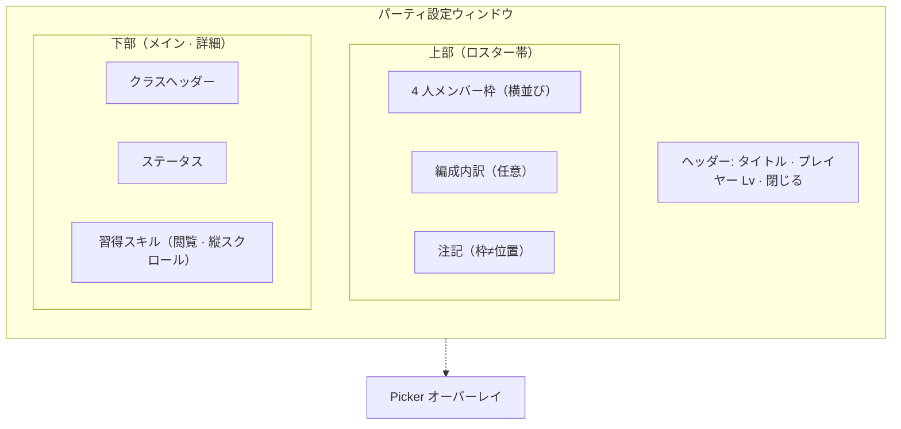

# パーティ編成 UI

実装：`src/ui/MetaMenuOverlay.ts`, `src/ui/SkillMenuPanel.ts`, `src/styles/skill-menu-panel.css`, `src/styles/meta-menu-overlay.css`

本ドキュメントは **メタメニューから開くパーティ編成画面**（`SkillMenuPanel`）の画面設計正本。戦闘フィールド上の隊形・座標は [battle-field.md](battle-field.md)、クラス・ロール・スキル習得は [classes-and-skills.md](classes-and-skills.md)、セーブ・Lv は [progression.md](progression.md) を参照。

**フェーズ:** 画面設計の確定は本書。実装は [phase-roadmap.md](../plans/phase-roadmap.md) の **Phase 4d**。

**現行コードとの関係:** 本書は目標仕様（たたき台 v0.3）。`SkillMenuPanel` は Phase 3 頃の最小 UI のまま。実装が追いつくまで差分は許容する。

**配信形態:** 最終的に **Electron デスクトップアプリ**（Phase 8）を正とする。編成画面はブラウザ狭幅モーダルではなく **十分な幅のウィンドウ**（`MetaMenuOverlay` の `presentation: "window"`）で見せる。レイアウトの正本は **上: ロスター / 下: 詳細** の縦積み（§4）。

---

## 1. 目的

本作は [design-philosophy.md](../design-philosophy.md) のとおり **編成解法型オートバトル RPG** である。パーティ編成 UI の主目的は次のとおり。

- プレイヤーが **4 人の組み合わせ**（誰を入れるか）を検討・変更できること
- 各クラスの **戦闘上の立ち位置の目安**（前衛 / 後衛）と **UI ロール** が選ぶ前に分かること
- 習得済みスキルの **内容を読んで** 編成判断に使えること（付け替え操作は不要）

操作技術の設定画面ではない。戦闘中のスキル発動順・ターゲット操作もここでは行わない。

---

## 2. 用語（混同禁止）

| 用語                        | 意味                                                                                             | 正本                                                                         |
| --------------------------- | ------------------------------------------------------------------------------------------------ | ---------------------------------------------------------------------------- |
| **編成枠** / **メンバー枠** | パーティ 4 人のうち「誰を入れるか」を選ぶ UI スロット。`partySlotIndex` 0〜3                     | 本書                                                                         |
| **前衛 / 後衛**（表示）     | クラスマスタの `formationRow`（`front` / `back`）の日本語ラベル                                  | `classes.json`                                                               |
| **UI ロール**               | `defender` / `attacker` / `supporter` の表示分類                                                 | [classes-and-skills.md](classes-and-skills.md#1-ui-上のロール分類3-大ロール) |
| **戦闘隊形スロット**        | 接敵後の `battleX` 深度・`slotIndex`。編成枠とは別                                               | [battle-field.md](battle-field.md#1-用語)                                    |
| **プレイヤーレベル**        | アカウント共通の 1 本。習得・ステ計算・枠解放の基準（Phase 11 の `playerProgress.level` と同義） | [progression.md](progression.md)                                             |

**重要:**

- 編成枠の **並び順・番号は戦闘上の前列 / 後列を決めない**（[battle-field.md](battle-field.md) の `partySlotIndex` 節）。
- 戦闘上の前衛 / 後衛は **クラス定義の `formationRow`** に紐づく。プレイヤーが枠ごとに前列 / 後列を指定する UI は **v1 では持たない**。
- Kill / Flow / Survival はスキル設計の正本であり、編成 UI v1 では **専用ラベルとして出さない**（UI ロール + 前衛 / 後衛で足りる）。

---

## 3. 入口（スコープ外・確定済み）

以下は本書の改修対象外とする（現状維持）。

| 項目     | 内容                                                                               |
| -------- | ---------------------------------------------------------------------------------- |
| 開き方   | 戦闘画面メニュー → `MetaMenuOverlay`（モーダル or ウィンドウ）                     |
| Hub      | 「パーティ」で `SkillMenuPanel` を表示。`initialView: "party"` 時は Hub をスキップ |
| タイトル | ウィンドウ見出し「パーティ設定」                                                   |
| 閉じる   | ウィンドウ × / モーダル時はバックドロップ                                          |
| 保存     | クラス差し替え時に即時セーブ（[progression.md](progression.md)）                   |

---

## 4. 画面構成（目標）

縦方向に **ヘッダー → 上部ロスター（Overview）→ 下部詳細（Detail）** を並べる（デスクトップ幅前提）。4 人の編成枠は **メインコンテンツの上** に常時固定し、その下に選択中メンバーの詳細を広く表示する。クラス選択は **オーバーレイ（Picker）** で行い、上部ロスターは隠さない。

### 4.1 ワイヤー（領域図）

Markdown の箱線 ASCII は **全角文字と半角文字の幅差** でプレビューごとにズレる。本書では **Mermaid** で領域だけ示す（実装のピクセル指定ではない）。

| 領域                         | 内容                                                                                       |
| ---------------------------- | ------------------------------------------------------------------------------------------ |
| **ヘッダー（タイトルバー）** | 「パーティ設定」+ **`プレイヤー Lv {n}`**（§5.0）+ 閉じる。Lv は **ここ 1 か所だけ**       |
| **上部 · ロスター帯**        | メンバー枠 4 つを **横一列**（全幅）。名前・前衛/後衛・UI ロール。メインの上に固定         |
| 上部 · 編成内訳              | 任意。4 人を数えた集計 1 行（§5.4）                                                        |
| **下部 · メイン（詳細）**    | 選択中クラスのヘッダー・ステ・スキルカード（**Lv なし**）。残り高さを使い **縦スクロール** |
| Picker                       | 半透明の上にパネル。ロール別クラス一覧。ロスター帯は背面に見える                           |

**最小幅の目安（実装 TBD）:** おおよそ 640px 以上を想定。デスクトップ専用。

**上部ロスターをメインの上に置く理由:**

- パーティ編成 UI では **4 人バーが画面上部** にある構成が一般的で、誰が編成に入っているかが常に一目で分かる
- 下部メインに **スキル説明の横幅とスクロール領域** を確保できる（2 カラム左ロスターより読みやすい）
- 陣形グリッド（左＝後方）と誤解されにくい（上段は「メンバー選択バー」として読める）

### 4.2 レイアウト方針

| 方針                               | 内容                                                                            |
| ---------------------------------- | ------------------------------------------------------------------------------- |
| **上ロスター / 下詳細**            | ロスター帯は `flex-shrink: 0` で高さ固定。詳細は `flex: 1` + `overflow-y: auto` |
| 陣形グリッドにしない               | 横 4 枠は **メンバー選択バー**。戦闘上の前後列の配置 UI ではない                |
| ピッカーは重ねる                   | 現行の「上部タブごと非表示 → 全画面リスト」は廃止方向                           |
| ロスターはスクロールに巻き込まない | 詳細だけスクロールし、4 人バーは常に見える                                      |

---

## 5. Overview（上部ロスター帯 — パーティ 4 枠）

### 5.0 プレイヤーレベル

レベルは **クラス個別ではなくプレイヤー共通**（[progression.md](progression.md) の `playerProgress.level` / Phase 11 B 案）。全クラスの習得・ステ計算・枠解放はこの 1 本に従う。

| 表示場所                               | 内容                                                                                             |
| -------------------------------------- | ------------------------------------------------------------------------------------------------ |
| **ウィンドウヘッダー（タイトルバー）** | `プレイヤー Lv {n}` を **画面で 1 か所だけ**。タイトル「パーティ設定」の右側（閉じるボタンの左） |
| 詳細 · クラスヘッダー                  | **表示しない**                                                                                   |
| 詳細 · ステータス見出し                | **「Lv n」付き見出しは使わない**（例: `ステータス（Lv 12）` は廃止）                             |
| ロスター各カード                       | **表示しない**（メンバーごとの Lv は存在しない前提）                                             |
| スキル未解放枠                         | **プレイヤー Lv** の閾値のみ（例: `プレイヤー Lv10 で枠 +1`）                                    |

ヘッダーに Lv、その直下に 4 人バー、という縦の優先順位で **アカウント状態 → 編成 → 個別詳細** と読めるようにする。

戦闘 HUD の Exp バーとの対応は [progression.md](progression.md) 進行 UI 節に委譲。編成画面では Lv 数字の重複表示を避ける。

**実装:** `MetaMenuOverlay` の `meta-menu-window-bar` に Lv 表示。`SkillMenuPanel` の `formationBlockEl`（上部ロスター帯）と `bodyEl`（下部詳細）を縦積みにする。

### 5.1 枠数と並び

- 固定 **4 枠**（`PARTY_SLOT_COUNT`）。
- 各枠は `partySlotIndex` と 1:1。**横一列**（`grid-template-columns: repeat(4, 1fr)` 等）。ドラッグ並べ替えは **v1 では不要**（順序は HUD 紐づけ用のみ）。

### 5.2 メンバー枠（入力済み）

各カードに最低限表示する。

| 要素                         | データ源       | 備考                                                               |
| ---------------------------- | -------------- | ------------------------------------------------------------------ |
| クラスアイコン or スプライト | `classId`      | 現行タブと同様。body atlas 優先                                    |
| `displayName`                | `classes.json` | 日本語名                                                           |
| `epithetEn`                  | `classes.json` | Phase 3c / 4d で 2 段表示（漢字 + 英語肩書き）。未接続時は名前のみ |
| 前衛 / 後衛                  | `formationRow` | `front` → 前衛、`back` → 後衛                                      |
| UI ロール                    | `role`         | ディフェンダー / アタッカー / ヒーラー（サポーター）               |

Lv は §5.0 のとおりロスターカードには出さない。

選択中枠は視覚的にハイライトする。

### 5.3 空き枠

- ラベル例:「メンバーを選ぶ」「空き」
- タップでその `partySlotIndex` を選択し、Picker を開く（または Detail の「クラスを変更」と同じ）

### 5.4 編成内訳（任意）

**編成内訳**とは、ロスター 4 人を集計した **1 行のテキスト**である。個別カードを開かなくても「今の編成の偏り」が分かる補助表示。

表示例:

`前衛 2 / 後衛 2 · ディフェンダー 1 · アタッカー 2 · ヒーラー 1`

| 集計              | 出所                        |
| ----------------- | --------------------------- |
| 前衛 / 後衛の人数 | 各メンバーの `formationRow` |
| UI ロール別人数   | 各メンバーの `role`         |

用途の例: 後衛だけ 4 人、ディフェンダー 0 人など、選び直しのきっかけにする。**ステージが要求する編成の正解表示や警告ではない**（それは Phase 6 以降）。

v1 では **任意**（なくても受け入れ条件は満たせる）。

### 5.5 注記

Overview 付近に 1 行（スタイルは控えめ）:

> メンバー枠の並びは戦闘位置に影響しません。前衛 / 後衛はクラスごとに決まります。

---

## 6. Detail（下部メイン — 選択中メンバー）

`selectedIndex` のメンバーを表示。空き枠選択時は「クラスを選んでください」+ Picker 誘導のみ。

### 6.1 クラスヘッダー

| 要素                        | 備考                                                          |
| --------------------------- | ------------------------------------------------------------- |
| `displayName` + `epithetEn` | 2 段表示（3c 方針と整合）                                     |
| 前衛 / 後衛 · UI ロール     | Picker の `formatClassDescription` と **同じ文言** を常時表示 |
| クラス変更                  | ボタン 1 つ → Picker オーバーレイ                             |

**Lv は表示しない**（§5.0）。現行のクラス行横 `Lv n` も廃止方向。

現行の「クラス設定」見出し + アイコンのみの行は、ヘッダー統合方向で置き換える。

### 6.2 ステータス

[progression.md](progression.md) の進行 UI 節に準拠。

- **プレイヤーレベル**（`resolveEffectiveLevel`）で計算した **素ステ**（戦闘中バフ / デバフは含めない）
- 見出しは `ステータス` のみ（Lv 数値は §5.0 の 1 か所表示に集約）
- HP（ラベル `HP`）/ 攻撃力 / 防御力 / 魔法耐性（`REG`）/ 攻撃速度（SPD 5 段階ラベル）

### 6.3 習得スキル（閲覧専用）

**付け替え・セット・装備変更は行わない**（[classes-and-skills.md](classes-and-skills.md#用語スキル習得-vs-装備)）。

#### 区分

| 区分       | 出所                | 最大表示                    |
| ---------- | ------------------- | --------------------------- |
| アクティブ | `learnedActiveIds`  | 習得数 + 未解放枠（最大 4） |
| パッシブ   | `learnedPassiveIds` | 習得数 + 未解放枠（最大 4） |

段階解放: Lv0=2 / Lv10=+1 / Lv20=+1（`getUnlockedActiveSlotCount` と同型の passive 側）。

#### スキルカード（1 スキルあたり）

ホバー tooltip のみに依存しない。**カード内に常時表示**する。

| 行     | 内容                                                                                       |
| ------ | ------------------------------------------------------------------------------------------ |
| 1      | スキル名 + スキルアイコン（あれば）                                                        |
| 2      | 種別補足（Active: CD 表示 / Passive: 発動タイミング要約）                                  |
| 3+     | 説明文（`formatSkillText` 系。複数行可）                                                   |
| フッタ | 習得に必要だった **プレイヤー Lv**（わかる場合） / 未解放枠は `プレイヤー Lv10 で枠 +1` 等 |

説明文の文面生成は [Phase 4b](../plans/phase-roadmap.md)（`formatSkillText`）。表示レイアウトは本書（4d）。

**UI 表現:**

- `disabled` ボタンに見せない（操作不能なのに押せるように見える現行は廃止方向）
- 未解放枠はロック表示 + 解放 Lv のみ。アイコン枠を空で並べる現行方式は維持可

#### 説明テキスト API（実装メモ）

- 既存: `formatActiveDescription` / `formatPassiveDescription`（1 文字列）
- 4d で追加検討: `formatSkillCardLines(skill)` — エディタプレビューと編成 UI で共有し、改行位置を揃える

---

## 7. Picker（クラス選択オーバーレイ）

### 7.1 開き方

- Overview の空き枠 / 入力済み枠タップ
- Detail の「クラスを変更」
- 対象 `partySlotIndex` は選択中インデックスを正とする

### 7.2 閉じ方

- クラス決定（即セーブ）
- 「外す」（`null` メンバー）
- キャンセル（変更なし）

### 7.3 リスト内容

`getAssignableClassIds` の結果を表示。

- 他枠で使用中の `classId` は **選択不可**（現行と同じ）
- `unlockedClassIds` 外は表示しない

### 7.4 グループ化

`classOrder` のフラットリストだけでは 15 クラス時に探索コストが高い。

| 方式     | 内容                                                                          |
| -------- | ----------------------------------------------------------------------------- |
| **推奨** | UI ロール別の見出し（ディフェンダー / アタッカー / ヒーラー）3 ブロック       |
| 各行     | `displayName` + 前衛/後衛 + UI ロール（現行 `formatClassDescription`）        |
| 任意     | 近接 / 遠隔は `traits.rangePx` 帯のバッジ（100 未満 / 以上）。v1 必須ではない |

### 7.5 コンテキスト維持

Picker 表示中も **上部ロスター帯は背面に見える**（半透明オーバーレイ上にパネル）。他 3 人が誰か忘れないこと。

---

## 8. ラベル一覧（UI 固定文言）

| 内部値      | 表示（formationRow） | 表示（role）   |
| ----------- | -------------------- | -------------- |
| `front`     | 前衛                 | —              |
| `back`      | 後衛                 | —              |
| `defender`  | —                    | ディフェンダー |
| `attacker`  | —                    | アタッカー     |
| `supporter` | —                    | ヒーラー       |

`middle` は `classes.json` に存在しない前提。将来追加時はラベル表を更新する。

---

## 9. 非要件（v1）

| 項目                                   | 理由                                       |
| -------------------------------------- | ------------------------------------------ |
| 枠ドラッグで戦闘前列 / 後列を変える    | `formationRow` 正本と矛盾                  |
| スキル装備・セット枠                   | 習得即参加が正本                           |
| Kill / Flow / Survival レイヤー表示    | スキル設計用。UI ロールで代替              |
| ステージ敵構成との連動ヒント           | Phase 6 コンテンツとセットで別検討         |
| 戦闘隊形のプレビュー（battleX 配置図） | battle-field の責務。編成 UI では省略      |
| 同一クラス 2 人編成                    | `getAssignableClassIds` で禁止（現行維持） |

---

## 10. アクセシビリティ・入力

- ロスター各枠: `aria-label` にクラス名 + 前衛/後衛 + ロール
- スキルカード: 操作不要のため `role="group"` + 見出しでスキル名。tooltip のみに頼らない
- キーボード: 枠間フォーカス移動は **実装時に最低限**（v1 必須度は低めだが、ボタン偽装の削減は優先）

---

## 11. 現行実装との差分（改修チェックリスト）

| 現行                          | 目標                                          |
| ----------------------------- | --------------------------------------------- |
| 見出し「編成枠」              | 「パーティ」等、陣形と誤解されない名称        |
| タブのみにクラス名            | Overview カードに前衛/後衛・ロール            |
| 詳細に前衛/後衛なし           | ヘッダーに常時表示                            |
| Picker で上部タブ hidden      | オーバーレイ化                                |
| スキルが icon + hover tooltip | スキルカード常時展開                          |
| Active が `disabled` button   | 非インタラクティブなカード                    |
| パッシブがアイコン列のみ      | Active と同様のカード列（コンパクト可）       |
| 縦 1 カラム（タブ上のみ）     | 上ロスター + 下詳細の縦積み                   |
| 詳細・カードに Lv 表示        | プレイヤー Lv はウィンドウヘッダー 1 か所のみ |
| `ステータス（Lv n）` 見出し   | `ステータス` のみ                             |
| 編成内訳行なし                | 任意で 1 行追加                               |

---

## 12. 受け入れ条件（Phase 4d 完了）

1. 4 人ロスターを開かずに、各メンバーの **前衛/後衛** と **UI ロール** が一覧で分かる
2. クラス選択中も **他メンバーが視界に残る**（オーバーレイ Picker）
3. 選択中メンバーの **全習得スキル説明** を、ホバーなしで読める
4. 「メンバー枠の並びは戦闘位置に影響しない」が UI 上誤解されにくい（注記 or ラベル）
5. 15 クラスを **UI ロール別** に選べる
6. スキル付け替え UI が **存在しない**
7. [progression.md](progression.md) のステ表示ルール（素ステ・SPD ラベル）と一致
8. **プレイヤーレベル**がウィンドウヘッダーに 1 か所だけ表示され、詳細・ロスターに重複しない
9. **上部ロスター**と**下部詳細**が同時に見え、詳細スクロール時も 4 人バーが固定される
10. 本書と実装の用語が一致（`partySlotIndex` ≠ 戦闘位置）

---

## 13. 関連ドキュメント

| ドキュメント                                    | 関係                                   |
| ----------------------------------------------- | -------------------------------------- |
| [design-philosophy.md](../design-philosophy.md) | 編成解法・理解度向上                   |
| [battle-field.md](battle-field.md)              | `partySlotIndex`、隊形、`formationRow` |
| [classes-and-skills.md](classes-and-skills.md)  | UI ロール、スキル習得、用語            |
| [progression.md](progression.md)                | セーブ、Lv、進行 UI                    |
| [phase-roadmap.md](../plans/phase-roadmap.md)   | Phase 4d 実装タイミング                |

---

## 14. 未確定・TBD

| 項目                                                       | メモ                                                                                  |
| ---------------------------------------------------------- | ------------------------------------------------------------------------------------- |
| ロスター帯の高さ・カード最小幅                             | 実装時に CSS で決定                                                                   |
| 詳細エリアの最大高さ                                       | ウィンドウ高さ − ヘッダー − ロスター帯。`overflow-y: auto`                            |
| 編成内訳行の有無                                           | 任意。§5.4                                                                            |
| `formatSkillCardLines` の行分割規則                        | 4b と共同で 4d 着手時に確定                                                           |
| Hub からの戻る導線                                         | `initialView: "hub"` 時のみ Phase 4d で検討                                           |
| 現行 `party[].progress.level` と `playerProgress` の併存期 | 表示は **常にプレイヤーレベル正本**。移行は [progression.md](progression.md) Phase 11 |
