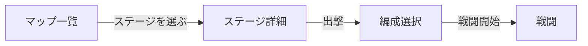

# ステージ選択 UI

実装予定：`GameSession` 画面状態 `map` 配下（Phase **6d**）。敵データは `data/enemies.json`、ステージは `data/stages.json` / `data/stages-demo.json`（体験版）。

本ドキュメントは **マップ選択 → ステージ詳細 → 出撃** の画面設計正本。クリア履歴のデータ形状・更新ルールは [progression.md §Stage Records](progression.md#stage-records)。編成画面は [party-formation-ui.md](party-formation-ui.md)。敵の設計意図は [enemy-design-concept.md](../enemy-design-concept.md)。

**フェーズ:** Phase **6d**（**Release M1 必須**）— マップ一覧 + ステージ詳細 + Level Sync + **リザルトのベスト 2 枠記録**（低レベル / 最速）。

---

## 1. 導線

- マップ一覧でステージ行を選ぶと **詳細パネル**（または詳細画面）を開く。**一覧タップだけでは戦闘開始しない**。
- 詳細で内容を確認し **出撃** → 編成 → 戦闘（[phase-roadmap.md §6d](../plans/phase-roadmap.md#6d--画面構成導線release-m1)）。

---

## 2. マップ一覧

| 項目 | 内容 |
| ---- | ---- |
| ステージ名 | `StageDef.displayName` |
| 進行 | 未クリア / クリア済み / ロック（前ステージ未クリア等。ルールは [progression.md](progression.md)） |
| **☆** | 当該ステージに **適正クリア** の履歴が 1 件以上あるとき表示（[§5](#5-適正クリアマーク)） |
| サマリー（任意） | 低レベル枠の Lv・最短枠のタイム（未クリア枠は非表示） |

一覧行のソートは **ステージ JSON 配列順**（進行チェーン順）を正とする。クリア履歴のソートとは別。

---

## 3. ステージ詳細（選択時）

ステージを選んだとき、**出撃前** に次を表示する。

| ブロック | 内容 | データ正本 |
| -------- | ---- | ---------- |
| **想定レベル** | `StageDef.recommendedLevel`（ラベル例: 「想定 Lv {n}」） | ステージ JSON（6b / 8b で投入。未設定ステージは UI で「—」） |
| **敵編成** | 全 Wave の敵テンプレート一覧（Wave 区切り・同一テンプレの人数） | `StageDef.waves[]` |
| **敵情報** | 各テンプレの `displayName`、UI ロール / 前後衛など編成判断に足る概要 | `enemies.json` + [enemy-design-concept.md](../enemy-design-concept.md)。**ステータス数値の一覧転記はしない** |
| **レベルシンク** | チェックボックス（[§4](#4-レベルシンクチェックボックス)） | 当該出撃のみ有効 |
| **クリア履歴** | ベスト **2 枠**（低レベル / 最速。[progression.md §Stage Records](progression.md#stage-records)） | セーブ `stageRecords` |
| **出撃** | 確定ボタン → 編成画面へ | — |

### 3.1 敵編成・敵情報の粒度

- **編成:** Wave ごとに `templateId` × 出現数。配置座標（`spawnX`）は v1 では省略可。
- **情報:** テンプレ ID ごとに 1 行。ボス / 雑魚の区別がデータ上あればラベル表示。
- スキル説明文・effect 全文は出さない（編成画面・用語パネルと役割分担）。

---

## 4. レベルシンクチェックボックス

| 項目 | ルール |
| ---- | ------ |
| ラベル | 「レベルシンク」（i18n: Level Sync） |
| 意味 | ON のとき当該出撃のみ `effectiveLevel = min(playerProgress.level, stage.recommendedLevel)`（[progression.md](progression.md)） |
| 既定 | **OFF** |
| 永続 | チェック状態は **セーブ必須ではない**。マップに戻るまでのセッション内で最後の選択を保持してよい |
| 無効化 | `recommendedLevel` 未設定、またはプレイヤー Lv ≤ 想定 Lv のときは OFF 固定（または非表示）— 実装時にどちらかを選び spec を 1 行追記 |

出撃確定時に `GameSession` / 戦闘オプションへ **当該 sortie の levelSync フラグ** を渡す。

---

## 5. 適正クリアマーク（☆）

**適正クリア:** 記録 **`clearLevel`（実効 Lv）≤ `stage.recommendedLevel`**。`clearLevel` は [progression.md §記録するレベル](progression.md#記録するレベルclearlevel) — Level Sync 適用後の「その出撃で実際にクリアした Lv」。

| 表示箇所 | 条件 |
| -------- | ---- |
| 履歴行 | 当該 `StageClearEntry.atRecommendedLevel === true` |
| マップ一覧の ☆ | 当該ステージの履歴に適正クリアが 1 件以上 |

例: アカウント Lv 35・想定 Lv 20・Level Sync ON → `clearLevel = 20` → **☆ あり**。

---

## 6. リザルト（Victory）

敗北リザルトは Exp なし・履歴追加なし。勝利時:

| 項目 | 内容 |
| ---- | ---- |
| 今回の結果 | **クリア Lv（実効）**、クリアタイム、編成 4 クラス、Level Sync 使用有無、☆ |
| **ベスト記録** | **2 枠**（「最低 Lv」「最速」。同一 run なら 1 行）。各枠は [progression.md §2 枠の更新ルール](progression.md#2-枠の更新ルールvictory-時) で上書き判定 |
| 操作 | 「続ける」→ マップ一覧 |

履歴の件数上限・Victory 時の append ルールは progression 正本。

---

## 7. スコープ外（v1）

- ワールドマップノードのグラフィック演出
- 敵の HP / ATK 数値表（データ転記 UI）
- Instant Lv20（**Phase 12b**）
- 全ステージ横断の Records ソート画面（6d は **ステージ詳細 / リザルト内** の履歴のみ。横断ビューは **12c** で拡張可）

---

## 8. 実装タッチポイント（予定）

- `GameSession` — 画面状態 `map`、sortie オプション（`levelSync`）
- 新規 DOM — マップ一覧・ステージ詳細・リザルト履歴
- `data/stages*.json` — `recommendedLevel` フィールド（validate 追加）
- `SaveManager` / victory ハンドラ — `stageRecords` 更新（[progression.md](progression.md)）
