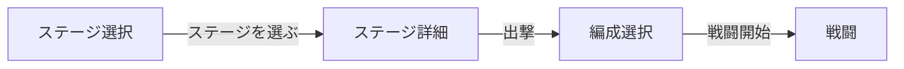

# ステージ選択 UI

**R12k 確定（2026-07-18）:** 固定 Stage 選択は **クエスト / チュートリアル / 検証 / 物語 / 作者指定課題 / デバッグ** の入口とする。メイン攻略は別入口（下記 §0）。正式 UI レイアウトや実装は R12k では決めない。詳細正本は [operation-loop.md §21](operation-loop.md#21-メイン反復構造r12k)。

実装：`GameSession` 画面状態 **`map`**（**内部名**。ユーザー向け表示・画面タイトルは「**ステージ選択**」）配下（Phase **6d** / **7d**）。敵データは `data/enemies.json`、ステージは `data/stages.json` / `data/stages-demo.json`（体験版）。

本ドキュメントは **ステージ選択 → ステージ詳細 → 出撃** の画面設計正本（固定 Stage 側）。クリア履歴のデータ形状・更新ルールは [progression.md §Stage Records](progression.md#stage-records)（legacy 記録枠を含む）。編成画面は [party-formation-ui.md](party-formation-ui.md)。敵の設計意図は [enemy-design-concept.md](../enemy-design-concept.md)。作戦内進行（リソース・パッシブ）は [operation-loop.md](operation-loop.md)。

**現行方針（R3 以降）:** ステージに **想定レベル / ランクは置かない**。敵の強さは兵科基礎ステ + `enemyGroups` scale。味方の強化は Wave 勝利後の **作戦内リソース → パッシブ取得**。`recommendedLevel`・Level Sync・クリア Lv ☆ は **legacy**（下記各節）。

**体験版の前提:** 各ステージは **最初から選択可能**（順不同で何度でも再挑戦）。**ステージ順クリアで進行制御しない**。

---

## 0. メイン攻略入口（R12k 責務境界）

固定 Stage 一覧をメインループとはしない。メイン攻略は次の別入口を持つ（レイアウト・見た目・実装は未確定）。

```text
新しい作戦を生成（seed）
  → 全 3 Wave 概要を開示
  → 初期準備
```

| 項目 | 内容 |
| ---- | ---- |
| 生成 | seed から作者設計の問題系列を 1 つ選ぶ（[operation-loop.md §21.1](operation-loop.md#211-採用方式)） |
| 開示 | 開始前の全 Wave 情報（同書 §21.5）。推奨編成・正解説明は出さない |
| 固定 Stage との関係 | 生成元・入力責務は分離。解決済み Wave 形状と戦闘基盤は共有可 |
| 本書の残り節 | 当面は固定クエスト等の Stage 選択 UI 正本。メイン攻略の正式画面設計は後続 |

---

## 1. 導線



- ステージ選択でステージ行を選ぶと **詳細パネル**（または詳細画面）を開く。**一覧タップだけでは戦闘開始しない**。
- 詳細で内容を確認し **出撃** → 編成 → 戦闘（[phase-roadmap.md §6d](../plans/phase-roadmap.md#6d--画面構成導線release-m1)）。

---

## 2. ステージ選択

| 項目 | 内容 |
| ---- | ---- |
| **画面タイトル** | 「ステージ選択」（`h1`）。一本道マップ UI ではない |
| **初回ガイド**（verify OFF 体験版のみ） | タイトル直下に汎用 1 行（挑戦 stage を選んで出撃・順不同再挑戦）。`formationHintJa` とは別。既読フラグ・save 永続化なし |
| ステージ名 | `StageDef.displayName` |
| クリア状態 | クリア済み stage は一覧行に **「クリア済み」** HUD ラベル（`clearedStageIds`）。**ロック UI なし** — 全 stage 最初から選択可 |
| **☆** | **legacy** — 適正クリア（想定 Lv 基準）の履歴があるとき表示（[§5](#5-legacy適正クリアマーク)）。新仕様 Stage では非表示想定 |
| サマリー（任意） | **legacy** — 低レベル枠の Lv・最短枠のタイム（未クリア枠は非表示） |

一覧行のソートは **ステージ JSON 配列順**（**表示順**。解放順・進行順ではない）を正とする。クリア履歴のソートとは別。

---

## 3. ステージ詳細（選択時）

ステージを選んだとき、**出撃前** に次を表示する。

| ブロック | 内容 | データ正本 |
| -------- | ---- | ---------- |
| **敵編成** | 全 Wave の敵一覧（Wave 区切り）。`waves[].enemyGroups` / stage 直下 `enemyGroups` / legacy `templateId` | `StageDef` + [stageEnemyCompositionPreview](../../src/ui/stageEnemyCompositionPreview.ts) |
| **編成ヒント**（任意） | `formationHintJa` があるときのみ 1 行表示 | `StageDef.formationHintJa` |
| **敵情報** | 各テンプレ / 兵科の `displayName`、UI ロール / 前後衛など編成判断に足る概要 | `enemies.json` / class + [enemy-design-concept.md](../enemy-design-concept.md)。**ステータス数値の一覧転記はしない** |
| **出撃** | 確定ボタン → 編成画面へ | — |
| **想定レベル**（legacy） | `StageDef.recommendedLevel` が **あるときのみ** 表示。新 Stage ではフィールドなし・行非表示 | 旧 Level Sync / ☆ 用。敵ステには使わない |
| **レベルシンク**（legacy） | [§4](#4-legacyレベルシンクチェックボックス) | 新導線では非表示想定 |
| **クリア履歴**（legacy） | ベスト **2 枠**（低レベル / 最速。[progression.md §Stage Records](progression.md#stage-records)） | セーブ `stageRecords` |

### 3.1 敵編成・敵情報の粒度

- **編成（新仕様）:** Wave ごとの `enemyGroups`（`classId` × `count`、任意 scale）。複数 Wave があるとき詳細は `Wave N:` 接頭辞付き。stage 直下 `enemyGroups` のみの舞台は 1 編成として扱う（Wave 接頭辞なし）。
- **強さ:** **Lv / ランク表示はしない**。scale は内部データ（必要なら作者向け debug のみ）。
- **編成（legacy）:** Wave ごとに `templateId` × 出現数。配置座標（`spawnX`）は v1 では省略可。
- **情報:** クラス / テンプレ ID ごとに 1 行。ボス / 雑魚の区別がデータ上あればラベル表示。
- スキル説明文・effect 全文は出さない（編成画面・用語パネルと役割分担）。
- **出撃前に全 Wave を見せる**（R10）: Wave 間準備で次 Wave へ判断できるようにするため、ステージ詳細は未開始の全 Wave 編成を要約する。Wave 間準備画面での追加プレビューは必須としない。

---

## 4. Legacy — レベルシンクチェックボックス

> 新作戦ループ正本から外す。恒久 Lv と想定 Lv がある旧進行向け。

| 項目 | ルール |
| ---- | ------ |
| ラベル | 「レベルシンク」（i18n: Level Sync） |
| 意味 | ON のとき当該出撃のみ `effectiveLevel = min(playerProgress.level, stage.recommendedLevel)`（[progression.md](progression.md)） |
| 既定 | **OFF** |
| 永続 | チェック状態は **セーブ必須ではない** |
| 無効化 | `recommendedLevel` 未設定、またはプレイヤー Lv ≤ 想定 Lv のときは OFF 固定（または非表示） |

---

## 5. Legacy — 適正クリアマーク

**適正クリア:** 記録 **`clearLevel`（実効 Lv）≤ `stage.recommendedLevel`**。新仕様 Stage（`recommendedLevel` なし）では ☆ を出さない。

| 表示箇所 | 条件 |
| -------- | ---- |
| 履歴行 | 当該 `StageClearEntry.atRecommendedLevel === true` |
| ステージ選択一覧の ☆ | 当該ステージの履歴に適正クリアが 1 件以上 |

---

## 6. リザルト（Victory）

敗北リザルトは Exp なし・履歴追加なし。勝利時:

| 項目 | 内容 |
| ---- | ---- |
| 今回の結果 | クリアタイム、編成 4 クラス。**クリア Lv / Level Sync / ☆ は legacy**（表示する場合は旧 Stage のみ） |
| **ベスト記録**（legacy） | **2 枠**（「最低 Lv」「最速」。同一 run なら 1 行） |
| 操作 | 「続ける」→ ステージ選択 |

作戦内の強化結果（取得パッシブ等）の恒久記録は [operation-loop.md](operation-loop.md) / [progression.md §作戦外進行](progression.md) の後続設計。

---

## 7. スコープ外（v1）

- ワールドマップノードのグラフィック演出（地理マップ UI）
- 敵の HP / ATK 数値表（データ転記 UI）
- Instant Lv20（**Phase 12b**・legacy）
- 全ステージ横断の Records ソート画面
- 新 Stage への `recommendedLevel` / ランク再導入

---

## 8. 実装タッチポイント

- `GameSession` — 画面状態 **`stageSelect`**、sortie
- 新規 DOM — ステージ選択一覧・ステージ詳細・リザルト履歴（ホスト要素 `.game-shell__stage-select` / `stageSelectHost`）
- `data/stages*.json` — 新 Stage は `waves[].enemyGroups` + scale。`recommendedLevel` は legacy 任意
- `SaveManager` / victory ハンドラ — `stageRecords`（legacy）更新（[progression.md](progression.md)）
